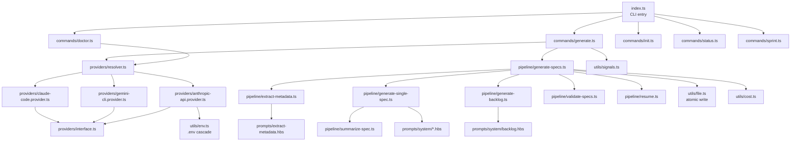
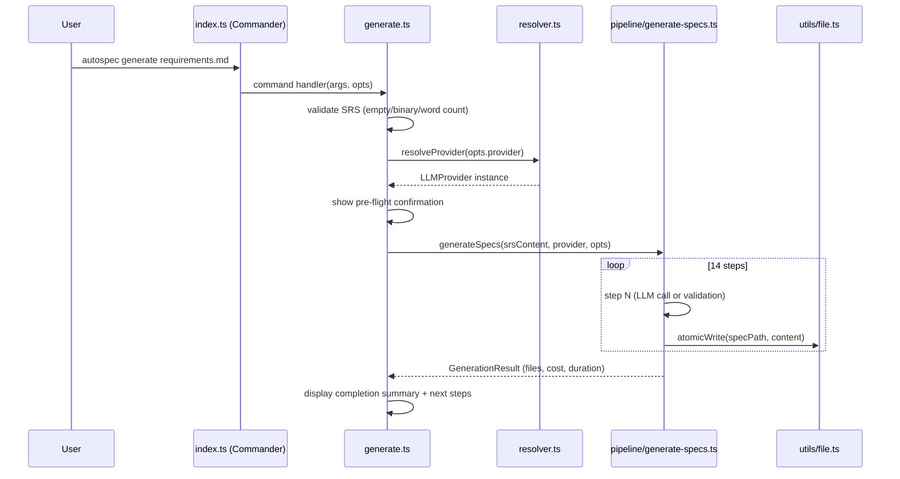

# CLI Architecture Overview

AutoSpec's CLI ("one SRS in, ten expert specs out") accepts an existing requirements document and produces 10 role-decomposed specification files plus a sprint-ready backlog in a single invocation. This document describes the command hierarchy, source file structure, module dependencies, and design constraints.

For the LLM provider details, see [LLM Provider Architecture](02_providers.md). For the full 14-step pipeline, see [Generate Command Pipeline](03_generate_pipeline.md).

---

## Purpose

```
autospec generate requirements.md
```

One command. The CLI:
1. Auto-detects which LLM provider is available (Claude Code CLI → Gemini CLI → Anthropic API)
2. Runs a 14-step chained pipeline: extract metadata, generate 10 role specs, generate backlog, validate, write metadata
3. Writes atomic spec files to `specs/` with YAML frontmatter for resume and cross-referencing
4. Displays streaming progress, cost, and actionable next steps on completion

No competitor accepts an existing SRS document and produces role-decomposed specs in a single headless run. See [Competitive Analysis](../research/01_competitive_analysis.md) for context.

---

## Command Hierarchy

Commands are organized into three tiers by their primary interaction with LLMs.

### Tier 1: Generate (LLM-backed)

| Command | Description |
|---------|-------------|
| `autospec generate <file>` | Primary command: positional SRS path, runs full 14-step pipeline |
| `autospec generate <file> --spec 02_backend_lead` | Regenerate a single spec only |
| `autospec generate --interview` | Guided 10-question interview → intermediate SRS → pipeline |
| `autospec generate -` | Read SRS from stdin (auto-implies `--yes`) |
| `autospec spec <name>` | Generate a feature spec (LLM-backed, existing command) |

### Tier 2: Manage (scaffold and coordinate, no LLM)

| Command | Description |
|---------|-------------|
| `autospec init` | Scaffold project from SDD templates (no LLM) |
| `autospec init --from-specs` | Scaffold project from already-generated specs |
| `autospec sprint <N>` | Generate sprint execution prompt |

### Tier 3: Inspect (diagnostic and informational)

| Command | Description |
|---------|-------------|
| `autospec doctor` | System readiness check: Node version, LLM providers, disk space |
| `autospec status [sprint]` | Sprint progress from backlog |
| `autospec version` | CLI version |

---

## The `generate` Command Flags

| Flag | Default | Description |
|------|---------|-------------|
| `<file>` (positional) | Required | Path to SRS/PRD. Use `-` for stdin. |
| `--srs <file>` | — | Alias for positional arg (shown in `--help`) |
| `--interview` | `false` | Run 10-question interview instead of reading a file |
| `--provider <name>` | Auto-detect | Force: `claude-code`, `gemini-cli`, `anthropic-api` |
| `--model <name>` | Provider default | Model override: `opus`, `sonnet`, `haiku`, `gemini-pro` |
| `--spec <name>` | All 10 + backlog | Generate only one spec (e.g., `02_backend_lead`) |
| `--output <dir>` | `./specs/` | Output directory |
| `--max-budget <usd>` | No cap | Cost cap in USD (opt-in, best-effort) |
| `--force` | `false` | Skip resume check; overwrite all existing specs |
| `--fallback` | `false` | Try next provider on failure (opt-in) |
| `--yes` / `-y` | `false` | Skip confirmation prompt (auto-set for stdin) |
| `--dry-run` | `false` | Show plan without LLM calls |
| `--quiet` / `-q` | `false` | Minimal output for CI; also triggered by `CI=true` env |
| `--verbose` | `false` | Show prompts and raw LLM output |

---

## Source File Structure

```
cli/src/
├── index.ts                          # CLI entry point, commander setup
├── commands/
│   ├── init.ts                       # Scaffold project (template-based, no LLM)
│   ├── generate.ts                   # NEW: LLM-backed spec generation
│   ├── doctor.ts                     # NEW: system readiness diagnostics
│   ├── status.ts                     # Sprint status from backlog
│   ├── sprint.ts                     # Sprint execution prompt generation
│   ├── spec.ts                       # Feature spec generation
│   └── dashboard.ts                  # TUI dashboard
├── providers/
│   ├── interface.ts                  # LLMProvider + GenerateOptions + ProviderError types
│   ├── resolver.ts                   # Auto-detection + priority chain + --provider override
│   ├── claude-code.provider.ts       # Subprocess via stdin, NDJSON parsing
│   ├── gemini-cli.provider.ts        # Subprocess via stdin
│   └── anthropic-api.provider.ts    # @anthropic-ai/sdk (dynamic import)
├── pipeline/
│   ├── generate-specs.ts             # Orchestrates all 14 steps
│   ├── extract-metadata.ts           # Step 1: project metadata JSON from SRS
│   ├── generate-single-spec.ts       # Steps 2-11: one spec at a time with summaries
│   ├── generate-backlog.ts           # Step 12: backlog from all 10 spec summaries
│   ├── validate-specs.ts             # Step 13: section-presence + line count validation
│   ├── summarize-spec.ts             # Deterministic summary extraction (no LLM)
│   └── resume.ts                     # SHA-256 hash-based resume logic
├── prompts/
│   ├── system/
│   │   ├── 01_product_manager.hbs    # Handlebars template per role
│   │   ├── 02_backend_lead.hbs
│   │   ├── 03_frontend_lead.hbs
│   │   ├── 04_db_architect.hbs
│   │   ├── 05_qa_lead.hbs
│   │   ├── 06_devops_lead.hbs
│   │   ├── 07_marketing_lead.hbs
│   │   ├── 08_finance_lead.hbs
│   │   ├── 09_business_lead.hbs
│   │   ├── 10_ui_designer.hbs
│   │   └── backlog.hbs
│   ├── extract-metadata.hbs          # Metadata extraction prompt template
│   └── interview-questions.ts        # 10 fixed interview questions
├── generators/                       # Existing generators (unchanged)
├── parsers/                          # Existing parsers (unchanged)
└── utils/
    ├── config.ts                     # Existing config utilities
    ├── file.ts                       # Existing + atomic write helper
    ├── env.ts                        # NEW: .env cascade reader (5 levels)
    ├── cost.ts                       # NEW: token counting + cost range estimation
    └── signals.ts                    # NEW: SIGINT/SIGTERM handlers
```

---

## Module Dependency Diagram



---

## Entry Point Flow



---

## Design Constraints

**ESM build via tsup.** The CLI is bundled as an ESM module using `tsup`. Dependencies `execa@9`, `chalk@5`, and `ora@8` are ESM-only. Dependencies `handlebars` and `fs-extra` are CJS-only. Before Sprint 28 implementation begins, ESM/CJS build compatibility must be verified:

```bash
cd cli && npm install execa@9 @anthropic-ai/sdk zod dotenv && npm run build
```

Fallback plan: pin `execa` to v8 (last CJS-compatible version). This is Sprint 28's first task — a blocker.

**Node >=18 requirement.** Uses `fetch` API (native in Node 18+), `crypto.subtle` for SHA-256, and `fs/promises`. No Node 16 support.

**Single `generate()` interface.** All providers implement the `LLMProvider` interface with only `generate()` returning `AsyncIterable<string>`. No optional methods, no `generateJSON()`. The pipeline layer handles JSON parsing and validation. See [LLM Provider Architecture](02_providers.md) for the full interface.

**Deterministic file naming.** The CLI always writes to `specs/01_product_manager.md`, `specs/02_backend_lead.md`, etc. File names are never determined by the LLM — only content is generated. This is the GSD principle: "deterministic scaffolding belongs in code, not in prompts."

**No binary state.** All persistent state is in YAML frontmatter of spec files and in `specs/.meta.json` (purely informational). There is no database, no lock file required for normal operation, and no proprietary binary format. All files are human-readable, editable, and version-controllable.

---

## Related Docs

- [LLM Provider Architecture](02_providers.md) — `LLMProvider` interface, detection, retry logic
- [Generate Command Pipeline](03_generate_pipeline.md) — 14-step pipeline detail
- [Error Handling and Recovery](04_error_handling.md) — failure modes, exit codes
- [CLI Version Roadmap](05_roadmap.md) — what ships in each version
- [Provider Architecture Decisions](../research/02_provider_architecture.md) — why 3 providers, why Copilot is deferred
- [Design Decisions Log](../research/03_design_decisions.md) — all 27 architectural decisions
