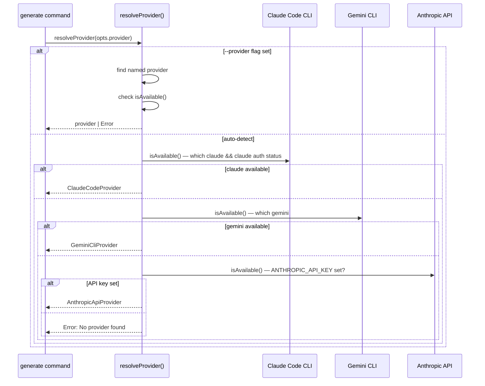

# LLM Provider Architecture

AutoSpec's provider layer abstracts LLM access behind a single interface implemented by three providers in v0.2.0. This document covers the TypeScript interface, detection logic, per-provider implementation details, API key discovery, fallback chain, and retry logic.

For the reasoning behind these choices, see [Provider Architecture Decisions](../research/02_provider_architecture.md).

---

## TypeScript Interfaces

All providers implement a single interface. No optional methods.

```typescript
interface LLMProvider {
  readonly name: string;           // 'claude-code' | 'gemini-cli' | 'anthropic-api'
  readonly requiresApiKey: boolean;
  readonly timeoutMs: number;

  /** Check if this provider is available on the current system */
  isAvailable(): Promise<boolean>;

  /** Generate text from a prompt, streaming chunks via async iterator */
  generate(prompt: string, options: GenerateOptions): AsyncIterable<string>;

  /** Parse provider-specific errors into user-friendly messages */
  parseError(error: unknown): ProviderError;
}

interface GenerateOptions {
  systemPrompt?: string;
  model?: string;
  maxBudgetUsd?: number;
  temperature?: number;
  maxTokens?: number;
}

interface ProviderError {
  type: 'auth' | 'rate_limit' | 'network' | 'model_not_found' | 'budget_exceeded' | 'timeout' | 'unknown';
  message: string;        // User-facing message with actionable fix
  retryable: boolean;
  rawError?: string;
}
```

**Design note:** No `generateJSON()` method. The pipeline's metadata extraction step (Step 1) appends "respond in valid JSON" to the prompt and parses JSON from the text response using `parseMetadataFromText()`. Providers that support native JSON mode (Claude Code `--json-schema`, Anthropic API tool-use) can use it internally as an optimization within their `generate()` implementation. The pipeline does not know or care. (Decision #10 — Architect 1)

---

## Detection Priority Table

| Priority | Provider | Detection Method | Mechanism | Timeout | Auth |
|----------|----------|-----------------|-----------|---------|------|
| 1 | Claude Code CLI | `which claude` exits 0 AND `claude auth status` exits 0 | Subprocess via stdin (`execa`) | 600s (10 minutes) | Existing CLI auth — zero-config |
| 2 | Gemini CLI | `which gemini` exits 0 | Subprocess via stdin (`execa`) | 120s | Existing CLI auth — zero-config |
| 3 | Anthropic API | `ANTHROPIC_API_KEY` environment variable set | `@anthropic-ai/sdk` (dynamic import) | 60s | API key required (5-level cascade) |

Zero-config providers (Claude Code CLI, Gemini CLI) always rank above SDK providers (Anthropic API) because leveraging existing auth is the core UX value proposition. A user who has Claude Code authenticated gets AutoSpec working in 30 seconds with no additional setup.

---

## `resolveProvider()` Function

```typescript
async function resolveProvider(override?: string): Promise<LLMProvider> {
  if (override) {
    const provider = PROVIDERS.find(p => p.name === override);
    if (!provider) throw new Error(`Unknown provider: ${override}. Available: ${PROVIDERS.map(p => p.name).join(', ')}`);
    if (!(await provider.isAvailable())) {
      throw new Error(`Provider ${override} is not available. Run: autospec doctor`);
    }
    return provider;
  }

  for (const provider of PROVIDERS) {
    if (await provider.isAvailable()) return provider;
  }

  throw new Error(
    'No LLM provider found.\n\n' +
    'Install one of:\n' +
    '  Claude Code:    npm i -g @anthropic-ai/claude-code && claude auth login\n' +
    '  Gemini CLI:     npm i -g @google/gemini-cli && gemini auth login\n' +
    '  Anthropic API:  export ANTHROPIC_API_KEY=sk-ant-...\n\n' +
    'Check status: autospec doctor\n'
  );
}
```

`PROVIDERS` is an ordered array `[claudeCodeProvider, geminiCliProvider, anthropicApiProvider]`. The resolver iterates in priority order and returns the first available provider.

---

## Provider Resolution Flow



---

## Claude Code CLI Provider

**File:** `cli/src/providers/claude-code.provider.ts`

### Subprocess Robustness

**1. Prompt delivery via stdin.** Large SRS documents easily exceed OS argument limits (~128KB). All prompts are piped via stdin using `execa`:

```typescript
const proc = execa('claude', [...args], {
  input: prompt,
  timeout: this.timeoutMs,  // 600s (10 minutes)
});
```

**2. System prompts via temp file with cleanup.** The system prompt is written to a temp file (to avoid arg-length limits and escape issues), referenced with `--system-prompt-file`, and cleaned up in a `finally` block:

```typescript
const tmpDir = await mkdtemp(path.join(os.tmpdir(), 'autospec-'));
try {
  const sysPromptFile = path.join(tmpDir, 'system.md');
  await writeFile(sysPromptFile, opts.systemPrompt);
  args.push('--system-prompt-file', sysPromptFile);
  // ... run subprocess
} finally {
  await rm(tmpDir, { recursive: true, force: true });
}
```

**3. NDJSON stream parsing with skip-on-error.** Claude Code CLI with `--output-format stream-json` produces NDJSON (one JSON object per line). Malformed lines are skipped rather than halting the stream:

```typescript
for await (const line of readline(proc.stdout!)) {
  try {
    const event = JSON.parse(line);
    // The actual implementation handles both event.message?.content and event.content.
    // Content can be a string or an array of content blocks (e.g. [{type:'text',text:'...'}]).
    if (event.type === 'assistant') {
      const content = event.message?.content ?? event.content;
      if (content) {
        const text = Array.isArray(content)
          ? content.filter((b: any) => b.type === 'text').map((b: any) => b.text).join('')
          : content;
        if (text) yield text;
      }
    }
  } catch {
    if (opts.verbose) console.warn(`[stream] unparseable: ${line.slice(0, 80)}`);
  }
}
```

**4. Stderr capture and actionable error parsing.**

```typescript
if (error.stderr?.includes('rate limit')) {
  return { type: 'rate_limit', message: 'Rate limit reached. Wait 60s or use --provider anthropic-api.', retryable: true };
}
if (error.stderr?.includes('auth') || error.stderr?.includes('login')) {
  return { type: 'auth', message: 'Auth expired. Run: claude auth login', retryable: false };
}
```

---

## Gemini CLI Provider

**File:** `cli/src/providers/gemini-cli.provider.ts`

Shares 90% of implementation with Claude Code CLI provider. Key differences:

- Detection: `which gemini` (no auth check — Gemini CLI does not expose a separate auth status command)
- Subprocess args differ (`gemini` vs `claude`, `--model` flag syntax)
- Output format: plain text output via `--print` flag (not `--output-format json`)
- System prompt: passed inline via `--system` flag (not a temp file, unlike Claude Code)
- `isAvailable()` does not check auth state — first failed generation reveals auth problems

The shared subprocess robustness patterns (stdin delivery, temp files, error parsing) apply identically.

---

## Anthropic API Provider

**File:** `cli/src/providers/anthropic-api.provider.ts`

Uses `@anthropic-ai/sdk` as a **regular dependency** (not a peer dependency), loaded via dynamic `import()` only when this provider is selected. This eliminates the "works on my machine" problem with optional peer deps — the SDK is always installed with AutoSpec but never imported until needed:

```typescript
// Only loaded when Anthropic API provider is selected
const { Anthropic } = await import('@anthropic-ai/sdk');
const client = new Anthropic({ apiKey: resolvedApiKey });
```

Bundle size impact: ~200KB. The dynamic import happens once at provider initialization; subsequent `generate()` calls reuse the same client instance.

---

## API Key Discovery Cascade

When the Anthropic API provider is selected, the API key is resolved through 4 levels (highest priority first):

| Level | Source | Example |
|-------|--------|---------|
| 1 | `ANTHROPIC_API_KEY` environment variable | `export ANTHROPIC_API_KEY=sk-ant-...` |
| 2 | `.env` in current working directory | Project-level key |
| 3 | `.env` in git root directory | Monorepo root key |
| 4 | `~/.autospec/.env` in home directory | User-level persistent key |

> **Note:** A `--api-key <key>` CLI flag is planned but not yet implemented in v0.2.0.

This cascade (sourced from aider's pattern, Researcher C Lesson 3) matches developer expectations: covers the shell session pattern, the project `.env` pattern, and the persistent home config pattern. The cascade is implemented in `cli/src/utils/env.ts`.

---

## Fallback Chain (Opt-In)

**Default behavior:** If the selected provider fails (for any reason), halt with a clear error message. No silent fallback.

**With `--fallback` flag:** Try the next available provider in priority order. Display a visible warning — never silently incur charges on a different provider:

```
  ! Claude Code CLI failed: rate limit exceeded
  ! Falling back to Anthropic API (uses ANTHROPIC_API_KEY)
  ! To disable: remove --fallback flag
```

Opt-in rationale: silent fallback from zero-cost Gemini CLI to paid Anthropic API could incur unexpected charges. Users must explicitly consent. (Decision #19 — Researcher A)

> **v0.2.0 note:** The `--fallback` flag is accepted by the CLI in v0.2.0 but the full cross-provider fallback chain is deferred to v0.2.1. In v0.2.0, passing `--fallback` has no effect beyond being parsed without error.

---

## Retry Logic

| Error Type | Retries | Backoff | Notes |
|-----------|---------|---------|-------|
| Transient (429, 500, 503, timeout) | 2 | Exponential: 2s, 6s | Most common; caused by provider load |
| Auth (401, 403, auth stderr) | 0 | None — halt with re-auth instructions | Non-recoverable without user action |
| Permanent (invalid model, billing stopped) | 0 | None — halt with clear message | Non-recoverable automatically |
| Empty response (<50 lines) | 2 | Same prompt | Prompt with "respond in valid JSON" augmentation on retry |
| Missing YAML frontmatter | 1 | Augmented prompt | Explicit frontmatter instruction added |
| Missing required sections | 1 | Augmented prompt | Explicit section list added |
| Network error | 1 | 2s delay | One retry for transient DNS/connection failures |

**Total retry cap:** 5 retries across all specs per run. If 5 retries are exhausted, halt and show resume instructions. This prevents an infinite retry loop on a systematically failing provider.

---

## `autospec doctor` Output

```
  autospec doctor

  Environment:
    Node.js         v20.11.0    ok (>=18.0.0)
    npm             v10.2.0     ok

  LLM Providers:
    ✓ Claude Code      authenticated
    ✓ Anthropic API    ANTHROPIC_API_KEY set (sk-ant-...xxxx)
    ✗ Gemini CLI       not installed or not authenticated

  Ready to generate specs. Run: autospec generate <file>
```

When no provider is available:

```
  LLM Providers:
    ✗ Claude Code      not installed or not authenticated
    ✗ Gemini CLI       not installed or not authenticated
    ✗ Anthropic API    ANTHROPIC_API_KEY not set

  No LLM provider available. Install one:
    npm i -g @anthropic-ai/claude-code && claude auth login
    npm i -g @google/gemini-cli && gemini auth login
    export ANTHROPIC_API_KEY=sk-ant-...
```

---

## Future Providers (v0.2.1+)

| Version | Provider | Notes |
|---------|----------|-------|
| v0.2.1 | OpenAI API | Standard `OPENAI_API_KEY` env var; `openai` npm package |
| v0.2.1 | Ollama | Local instance on `localhost:11434`; halved line count thresholds; model size warning for models <7B |
| v0.3.0 | GitHub Copilot SDK | `@github/copilot-sdk` subprocess (ACP protocol); deferred until SDK stable and protocol documented |
| v0.3.0 | Per-role model routing | Different model per spec role (e.g., Opus for PM, Sonnet for DevOps) |

---

## Related Docs

- [CLI Architecture Overview](01_architecture.md) — command structure and module layout
- [Generate Command Pipeline](03_generate_pipeline.md) — how providers are called per step
- [Error Handling and Recovery](04_error_handling.md) — failure modes, exit codes
- [Provider Architecture Decisions](../research/02_provider_architecture.md) — why these providers, why Copilot is deferred
- [Design Decisions Log](../research/03_design_decisions.md) — decisions #1, #9, #10, #19, #21
