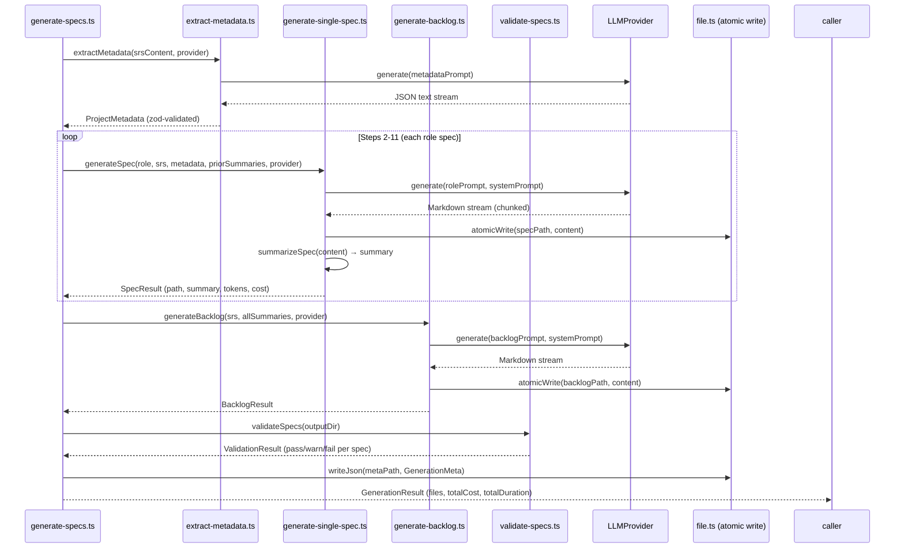

# Generate Command — 14-Step Pipeline

The `autospec generate` command runs a chained sequential pipeline: one LLM call per spec file, each receiving the SRS plus a role-specific system prompt plus summaries of previously generated specs. All 14 steps run sequentially in v0.2.0; `--parallel` is deferred to v0.2.1.

---

## Pipeline Overview

```
SRS Document
    │
    ▼
[1]  Extract project metadata
     (JSON: name, type, stack, domain — validated with zod)
    │
    ▼
[2]  Generate 01_product_manager.md
    │
    ▼
[3]  Generate 02_backend_lead.md
    │     (receives summary of step 2)
    ▼
[4]  Generate 03_frontend_lead.md
    │     (receives summaries of steps 2-3)
    ▼
[5]  Generate 04_db_architect.md
    │
    ▼
[6]  Generate 05_qa_lead.md
    │
    ▼
[7]  Generate 06_devops_lead.md
    │
    ▼
[8]  Generate 07_marketing_lead.md
    │
    ▼
[9]  Generate 08_finance_lead.md
    │
    ▼
[10] Generate 09_business_lead.md
    │
    ▼
[11] Generate 10_ui_designer.md
    │     (receives summaries of all prior specs)
    ▼
[12] Generate backlog.md
    │     (receives ALL 10 spec summaries)
    ▼
[13] Validate (local, no LLM)
    │     All 11 files exist, YAML frontmatter valid,
    │     per-role line counts met, required sections present,
    │     cross-references resolve
    ▼
[14] Write specs/.meta.json
     (purely informational — deleting it breaks nothing)
```

---

## Pipeline Sequence Diagram



---

## Cost and Time Estimates

Estimates are shown as ranges because token counts vary 2-3x based on SRS complexity and LLM verbosity. These assume ~5K input tokens + ~4K output tokens per spec.

| Model | Per-Spec Range | Full Run (11 calls) | Est. Time |
|-------|---------------|---------------------|-----------|
| Claude Sonnet 4 (`claude-sonnet-4-20250514`) | $0.02–$0.07 | $0.20–$0.80 | 100–120s |
| Claude Opus 4 | $0.20–$0.60 | $2.00–$6.00 | 100–150s |
| Claude Haiku | $0.002–$0.008 | $0.02–$0.08 | 60–80s |
| Gemini Pro | $0.02–$0.06 | $0.20–$0.60 | 80–120s |

These ranges are shown in the pre-generation confirmation prompt. After the first spec completes, real timing data is used to project ETA for the remaining specs.

---

## Atomic File Writes

Every spec write uses write-then-rename to prevent corruption on Ctrl+C, OOM, or power loss:

```typescript
const tmpPath = specPath + '.autospec-tmp';
await writeFile(tmpPath, content);
await rename(tmpPath, specPath);  // atomic on same filesystem
```

On startup, the pipeline cleans any orphaned `.autospec-tmp` files in the output directory. This prevents the resume mechanism from skipping a corrupt file that has matching frontmatter but truncated content. (Decision #2 — Architect 1 Must-Fix)

---

## Signal Handling

SIGINT (Ctrl+C) and SIGTERM handlers are registered when the pipeline starts:

```typescript
let activeChild: ExecaChildProcess | null = null;

for (const sig of ['SIGINT', 'SIGTERM'] as const) {
  process.on(sig, async () => {
    console.log('\n\n  Generation interrupted.');
    if (activeChild) {
      activeChild.kill('SIGTERM');
    }
    await cleanupTempFiles();
    console.log(`  Resume from where you left off:\n    autospec generate ${srsPath}\n`);
    process.exit(1);
  });
}
```

On interrupt: kill the running child subprocess (prevents orphaned Claude Code / Gemini CLI processes), clean temp directories, print resume instructions, exit with code 1. (Decision #3 — Architect 1 Must-Fix)

---

## Resume Mechanism

Resume is the **default behavior**. `--force` disables it.

**Algorithm:**

1. Compute `sha256` hash of the SRS file content
2. For each expected spec file in the output directory:
   - If the file does not exist → add to generation queue
   - If the file exists: parse YAML frontmatter
     - If `source_hash` matches current SRS hash → **skip** (up to date)
     - If `source_hash` differs or frontmatter is missing → **add to generation queue**
3. Display queue status with cost savings estimate

**Why hash-based rather than file-existence-based:** File existence alone cannot detect SRS changes. A user who edits `requirements.md` after partial generation would get stale specs regenerated from the old SRS. The `source_hash` field in frontmatter ensures each spec tracks which version of the SRS it was generated from.

**Resume celebration message:**
```
  Resuming previous run (4/11 specs already up-to-date)
  Skipping 4 specs, generating 7. Est. cost: $0.12–$0.45 (saved ~$0.08–$0.35)
```

**YAML frontmatter on each generated spec:**
```yaml
---
role: backend_lead
spec_version: 1.0
generated_by: autospec v0.2.0
model: claude-sonnet-4-20250514
provider: claude-code
source_srs: requirements.md
source_hash: sha256:abc123...
generated_at: 2026-03-21T14:30:00Z
---
```

The `specs/.meta.json` file is purely informational. Resume reads frontmatter from spec files, not from the JSON. Deleting `specs/.meta.json` does not affect resume behavior.

---

## `summarizeSpec()` Algorithm

After each spec is generated, a deterministic summary is extracted for cross-spec coherence. Later specs receive summaries of all previously generated specs as part of their system prompt — this enables the backend lead spec to reference personas defined in the product manager spec, for example.

**Implementation (no LLM involved):**

```typescript
function summarizeSpec(specContent: string): string {
  const sections: string[] = [];

  // 1. All section headers (structural overview)
  const headers = specContent.match(/^#{1,3} .+$/gm) ?? [];
  sections.push('## Sections\n' + headers.join('\n'));

  // 2. First sentence after each header (content preview)
  const firstSentences = extractFirstSentences(specContent);
  if (firstSentences.length > 0) {
    sections.push('## Key Points\n' + firstSentences.join('\n'));
  }

  // 3. Tables (first 2, capped at 10 rows each, for data-heavy specs)
  const tables = extractMarkdownTables(specContent);
  if (tables.length > 0) {
    const cappedTables = tables.slice(0, 2).map(t => capTableRows(t, 10));
    sections.push('## Key Tables\n' + cappedTables.join('\n\n'));
  }

  // Total summary capped at 2000 chars
  const summary = sections.join('\n\n');
  return summary.length > 2000 ? summary.slice(0, 2000) + '\n…(truncated)' : summary;
}
```

Headers + first sentences + tables (first 2, ≤10 rows each, ≤2000 chars total) covers 80% of cross-spec coherence needs. Entity-extraction regexes were rejected as too fragile for real-world spec content (misses personas in tables, non-standard phrasing, non-English names). Entity extraction is deferred to v0.3.0. (Decision #11 — Architect 1)

---

## System Prompt Architecture

Each spec role has a Handlebars template in `cli/src/prompts/system/`. All templates use XML-tagged sections (a pattern from GSD's research — Researcher A Lesson 4 — that improves instruction reliability by exploiting Claude's training on structural XML boundaries):

```xml
<role>
You are the Backend Lead for the project described below.
You are writing spec 02_backend_lead.md.
</role>

<output_format>
Generate a Markdown document.
Start with YAML frontmatter: role, spec_version, generated_by, model, provider,
source_srs, source_hash, generated_at.
Include these sections: [list from methodology].
</output_format>

<constraints>
- Be specific to THIS project, not generic.
- Reference personas from 01_product_manager.md by name.
- Every API endpoint must include auth requirements.
- Cross-reference other spec files by filename where relevant.
</constraints>

<project_metadata>
{{projectMetadataJSON}}
</project_metadata>

<prior_spec_summaries>
{{summariesOfSpecsGeneratedSoFar}}
</prior_spec_summaries>

<input_document>
{{fullSRSContent}}
</input_document>
```

Handlebars templating enables the `autospec instructions` command planned for v0.3.0 (which exposes rendered prompts for skill file generation) and makes prompt debugging straightforward.

---

## Per-Role Validation Thresholds (Step 13)

Step 13 is local validation — no LLM calls. Primary check is required sections present; secondary check is minimum line count.

| Role | File | Min Lines | Required Sections (sample) |
|------|------|-----------|--------------------------|
| Product Manager | 01_product_manager.md | 200 | Problem Statement, Target Users, User Stories, Acceptance Criteria |
| Backend Lead | 02_backend_lead.md | 300 | API Endpoints, Data Models, Auth Requirements, Integration Points |
| Frontend Lead | 03_frontend_lead.md | 250 | Component Architecture, Routing, State Management, UI Patterns |
| DB Architect | 04_db_architect.md | 250 | Schema Design, Indexes, Migrations, Performance Considerations |
| QA Lead | 05_qa_lead.md | 250 | Test Strategy, Test Cases, Coverage Requirements, Edge Cases |
| DevOps Lead | 06_devops_lead.md | 200 | Infrastructure, CI/CD, Environments, Monitoring |
| Marketing Lead | 07_marketing_lead.md | 150 | Positioning, Messaging, Launch Plan |
| Finance Lead | 08_finance_lead.md | 150 | Cost Model, Revenue Model, Financial Projections |
| Business Lead | 09_business_lead.md | 150 | Business Objectives, KPIs, Stakeholder Map |
| UI Designer | 10_ui_designer.md | 200 | Design System, Wireframes, Interaction Patterns |
| Backlog | backlog.md | 100 | Sprint 0, Sprint 1, Backlog Items (Markdown table) |

Additional validation checks:
- YAML frontmatter parses (zod schema with all required fields)
- `source_hash` field is present and matches SRS hash
- Cross-references resolve (filenames referenced in spec bodies exist)
- Backlog has a valid Markdown table with sprint columns

---

## `specs/.meta.json` Schema

Written in Step 14. Purely informational — deleting it does not affect resume or any CLI operation. Stored inside `specs/` to keep the project root clean (not `autospec-meta.json` in root, which conflicts with `.autospecrc.json`).

```json
{
  "version": "0.2.0",
  "generatedAt": "2026-03-21T14:30:00Z",
  "provider": "claude-code",
  "model": "claude-sonnet-4-20250514",
  "sourceSrs": "requirements.md",
  "sourceHash": "sha256:abc123...",
  "specs": {
    "01_product_manager": {
      "status": "complete",
      "tokens": 5200,
      "costUsd": 0.04,
      "durationMs": 4200
    },
    "02_backend_lead": {
      "status": "complete",
      "tokens": 6100,
      "costUsd": 0.05,
      "durationMs": 5800
    }
  },
  "totalCostUsd": 0.41,
  "totalDurationMs": 112000
}
```

---

## Pre-Generation Confirmation and Completion Summary

**Pre-flight confirmation:**
```
  autospec generate — Pre-flight Summary

  SRS:       requirements.md (2,847 words)
  Provider:  Claude Code CLI — Claude Sonnet 4 (claude-sonnet-4-20250514)
  Specs:     10 + backlog (11 total)
  Est. cost: $0.20–$0.80 (Sonnet) | $2.00–$6.00 (Opus)
  Est. time: ~100–120 seconds

  Proceed? [Y/n]
```

Model name shows full identifier (`claude-sonnet-4-20250514`), not just `sonnet`, so users know exactly what they are running. (Decision #24 — Architect 2)

**Completion summary:**
```
  autospec generate — Complete!

  Generated 11 files in specs/
    01_product_manager.md     412 lines
    02_backend_lead.md        387 lines
    03_frontend_lead.md       341 lines
    04_db_architect.md        298 lines
    05_qa_lead.md             267 lines
    06_devops_lead.md         224 lines
    07_marketing_lead.md      178 lines
    08_finance_lead.md        163 lines
    09_business_lead.md       155 lines
    10_ui_designer.md         231 lines
    backlog.md                156 lines

  Cost: $0.00 (deferred to v0.3.0) | Time: 1m 47s | Provider: Claude Code CLI (Claude Sonnet 4)

  Next steps:
    1. Review specs:    ls specs/
    2. Check backlog:   autospec status
    3. Start Sprint 0:  autospec sprint 0
```

(Decision #16 — Architect 2 Must-Fix)

---

## Related Docs

- [CLI Architecture Overview](01_architecture.md) — source file structure and module deps
- [LLM Provider Architecture](02_providers.md) — how providers are called, retry logic
- [Error Handling and Recovery](04_error_handling.md) — failure modes per pipeline step
- [Design Decisions Log](../research/03_design_decisions.md) — decisions #2, #3, #7, #8, #11, #12, #16, #21, #24, #25
