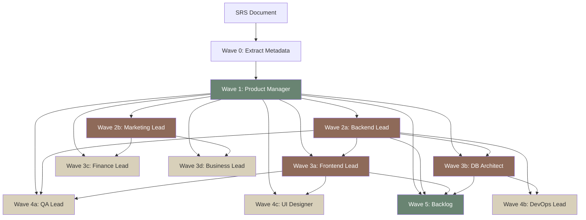

# Wave-Based Parallel Generation

## Problem Statement

The `autospec generate` pipeline runs 11 LLM calls **strictly sequentially** — each spec waits for all prior specs to complete before starting. With the Claude Code provider (subprocess-based), each call takes 2-8 minutes, producing total wall-clock times of 30-60 minutes for a full generation run.

**Root cause:** Every spec receives ALL prior spec summaries in its system prompt, creating a false dependency chain where spec N must wait for specs 1 through N-1, even when it only *needs* summaries from 1-2 of them.

**Impact:** Claude Code provider hits timeout limits (900s) on later specs due to accumulated context. Users must resume multiple times to complete a full run. The Anthropic API provider (~10s/spec) isn't affected as badly, but still spends unnecessary time in serial.

## Solution: Dependency Graph + Wave Scheduler

### Dependency Graph

Each spec only needs summaries from specs it **actually cross-references**. Analysis of the Handlebars templates and spec output patterns:

| Spec | Actually Needs Summaries From | Rationale |
|------|-------------------------------|-----------|
| 01 PM | *(none)* | First spec — only needs SRS + metadata |
| 02 Backend | 01 PM | User stories, features, personas → API design |
| 03 Frontend | 01 PM, 02 Backend | User flows → pages; API endpoints → service layer |
| 04 DB | 01 PM, 02 Backend | Features → tables; data models → schema |
| 05 QA | 01 PM, 02 Backend, 03 Frontend | Acceptance criteria + API + UI → test plan |
| 06 DevOps | 02 Backend, 04 DB | Architecture → infra; schema → DB provisioning |
| 07 Marketing | 01 PM | Target users, value prop → positioning |
| 08 Finance | 01 PM, 07 Marketing | Features → pricing; positioning → revenue model |
| 09 Business | 01 PM, 07 Marketing | Vision → strategy; market → competition |
| 10 UI | 01 PM, 03 Frontend | User flows → screens; components → design system |
| Backlog | 01 PM, 02 Backend, 03 Frontend, 04 DB | Needs technical scope for sprint sizing |

### Wave Schedule

Specs with satisfied dependencies can run **in parallel**:

```
Wave 0: [metadata extraction]                               — 1 LLM call
Wave 1: [01_PM]                                              — 1 LLM call
Wave 2: [02_Backend, 07_Marketing]                           — 2 parallel
Wave 3: [03_Frontend, 04_DB, 08_Finance, 09_Business]        — 4 parallel
Wave 4: [05_QA, 06_DevOps, 10_UI]                            — 3 parallel
Wave 5: [Backlog]                                            — 1 LLM call
```

**6 sequential waves** instead of **12 sequential steps**. With parallelism within waves:

| Wave | Specs | Sequential Time | Parallel Time | Speedup |
|------|-------|----------------|---------------|---------|
| 0 | metadata | 30s | 30s | 1x |
| 1 | PM | 180s | 180s | 1x |
| 2 | Backend + Marketing | 360s | 180s | 2x |
| 3 | Frontend + DB + Finance + Business | 720s | 180s | 4x |
| 4 | QA + DevOps + UI | 540s | 180s | 3x |
| 5 | Backlog | 180s | 180s | 1x |
| **Total** | | **~33min** | **~15min** | **~2.2x** |

### Selective Summaries

Each spec receives **only the summaries it needs**, not all prior summaries. Benefits:

1. **Smaller system prompts** — less context for the LLM to process
2. **Faster generation** — fewer tokens in, faster inference
3. **Better quality** — LLM focuses on relevant cross-references, not noise
4. **Timeout mitigation** — later specs (QA, DevOps, UI) no longer accumulate 9 summaries

### Context Size Comparison

With 2KB cap per summary:

| Spec | Sequential (all prior) | Selective | Savings |
|------|----------------------|-----------|---------|
| 05 QA | 8KB (4 summaries) | 6KB (3 summaries) | 25% |
| 06 DevOps | 10KB (5 summaries) | 4KB (2 summaries) | 60% |
| 10 UI | 18KB (9 summaries) | 4KB (2 summaries) | 78% |
| Backlog | 20KB (10 summaries) | 8KB (4 summaries) | 60% |

## Architecture

### New Module: `pipeline/wave-scheduler.ts`

```typescript
interface SpecDependency {
  specId: string;
  dependsOn: string[];  // spec IDs whose summaries are needed
}

interface Wave {
  index: number;
  specs: SpecDependency[];
}

// Static dependency graph — derived from template analysis
const DEPENDENCY_GRAPH: Record<string, string[]> = {
  '01_product_manager': [],
  '02_backend_lead':    ['01_product_manager'],
  '03_frontend_lead':   ['01_product_manager', '02_backend_lead'],
  '04_db_architect':    ['01_product_manager', '02_backend_lead'],
  '05_qa_lead':         ['01_product_manager', '02_backend_lead', '03_frontend_lead'],
  '06_devops_lead':     ['02_backend_lead', '04_db_architect'],
  '07_marketing_lead':  ['01_product_manager'],
  '08_finance_lead':    ['01_product_manager', '07_marketing_lead'],
  '09_business_lead':   ['01_product_manager', '07_marketing_lead'],
  '10_ui_designer':     ['01_product_manager', '03_frontend_lead'],
  'backlog':            ['01_product_manager', '02_backend_lead', '03_frontend_lead', '04_db_architect'],
};

function computeWaves(graph: Record<string, string[]>): Wave[];
```

### Parallel Execution Within Waves

```typescript
async function executeWave(
  wave: Wave,
  summaries: Record<string, string>,
  metadata: ProjectMetadata,
  srsContent: string,
  provider: LLMProvider,
  options: GenerateOptions,
): Promise<Record<string, SpecResult>> {
  // Launch all specs in this wave concurrently
  const promises = wave.specs.map(spec => {
    // Filter summaries to only those this spec needs
    const selectedSummaries = filterSummaries(summaries, spec.dependsOn);
    return generateOneSpec(spec, selectedSummaries, metadata, srsContent, provider, options);
  });

  const results = await Promise.allSettled(promises);
  // Process results, extract summaries for next wave
  // ...
}
```

### Provider Concurrency Considerations

| Provider | Max Parallel | Rationale |
|----------|-------------|-----------|
| Claude Code | 3 | Each subprocess spawns a full agent — memory/CPU pressure |
| Anthropic API | 5 | Direct HTTP, rate limits are the constraint |
| Gemini CLI | 3 | Subprocess-based, similar to Claude Code |

Configurable via `--concurrency <N>` flag (default: auto-detect from provider).

### Error Handling in Parallel Waves

When one spec in a wave fails:

1. **Let other specs in the same wave finish** — don't abort siblings
2. **Mark failed spec for retry** — use existing retry logic per-spec
3. **If a spec fails all retries, skip dependent waves** — specs in later waves that depend on the failed spec are skipped with a warning
4. **Remaining independent specs still run** — if Backend fails but Marketing doesn't depend on it, Marketing still runs
5. **Resume picks up from the failed spec** — existing hash-based resume works

### CLI Flag Changes

```bash
# New flag: --parallel (default: true for v0.3.0)
autospec generate requirements.md --parallel        # Wave-based parallel (default)
autospec generate requirements.md --no-parallel     # Force sequential (legacy)
autospec generate requirements.md --concurrency 5   # Max parallel specs per wave

# Existing flags unchanged
autospec generate requirements.md --force            # Regenerate all
autospec generate requirements.md --spec qa_lead     # Single spec (always sequential)
```

### Progress Display

Sequential mode shows specs one at a time. Parallel mode needs a different UX:

```
  [1/6] Extracting project metadata...                    ✓ 12s
  [2/6] Wave 1: Product Manager...                        ✓ 178s
  [3/6] Wave 2: Backend Lead, Marketing Lead...
        ├─ Backend Lead                                   ✓ 165s
        └─ Marketing Lead                                 ✓ 98s     ✓ 165s
  [4/6] Wave 3: Frontend, DB, Finance, Business...
        ├─ Frontend Lead                                  ✓ 171s
        ├─ DB Architect                                   ✓ 145s
        ├─ Finance Lead                                   ✓ 112s
        └─ Business Lead                                  ✓ 108s    ✓ 171s
  [5/6] Wave 4: QA Lead, DevOps Lead, UI Designer...
        ├─ QA Lead                                        ✓ 189s
        ├─ DevOps Lead                                    ✓ 201s
        └─ UI Designer                                    ✓ 234s    ✓ 234s
  [6/6] Wave 5: Sprint Planner...                         ✓ 156s
```

### Backward Compatibility

- `--no-parallel` restores exact v0.2.0 sequential behavior
- `--spec <name>` always runs single-spec (no wave scheduling)
- Output files, frontmatter, .meta.json format unchanged
- Resume (hash-based skip) works identically
- Summaries content unchanged (same `summarizeSpec()` algorithm)

## Data Flow Diagram



## QA Test Plan

### Unit Tests

1. **`wave-scheduler.test.ts`** — Dependency graph → wave computation
   - All 11 specs assigned to correct waves
   - Circular dependency detection (should throw)
   - Single spec mode bypasses wave scheduler
   - `--no-parallel` returns 11 waves of 1 spec each

2. **`selective-summaries.test.ts`** — Summary filtering
   - Backend gets only PM summary
   - QA gets PM + Backend + Frontend summaries
   - Unknown spec ID in dependency graph throws
   - Empty dependency list returns empty summaries string

3. **`parallel-execution.test.ts`** — Wave execution
   - All specs in a wave start concurrently (mock provider, check timing)
   - Failed spec doesn't abort siblings
   - Concurrency limit respected (3 max → only 3 at a time)
   - Results collected correctly from all parallel specs

### Integration Tests

4. **`generate-parallel.test.ts`** — Full pipeline with mock provider
   - `--parallel` produces same 11 files as `--no-parallel`
   - Frontmatter identical between modes
   - Resume works across parallel runs (skip already-generated)
   - `--force` regenerates all in parallel
   - `.meta.json` includes wave timing info

### E2E Tests

5. **E2E with Claude Code provider** — Real LLM calls
   - Full generation with `--parallel` completes all 11 specs
   - Wall-clock time < sequential time
   - All specs pass validation (line counts, frontmatter, required sections)
   - Quality spot-check: cross-references between specs are coherent

## Migration Path

- v0.2.1: Add `--parallel` flag (opt-in), default to sequential
- v0.3.0: Make `--parallel` the default, `--no-parallel` for legacy
- Wave scheduler is internal — no public API change

## Open Questions

1. **Should Backlog see ALL summaries?** Currently it gets PM + Backend + Frontend + DB. Sprint planning might benefit from knowing QA test strategy and DevOps infra. Trade-off: more context = slower + risk of timeout vs. better sprint sizing.

2. **Concurrency auto-detection** — Should we probe the provider for rate limits (429 response) and auto-reduce concurrency? Or just use static defaults?

3. **Progress display library** — `ora` spinners are single-line. Multi-line wave progress needs something like `listr2` or custom terminal manipulation. Worth the dependency?
