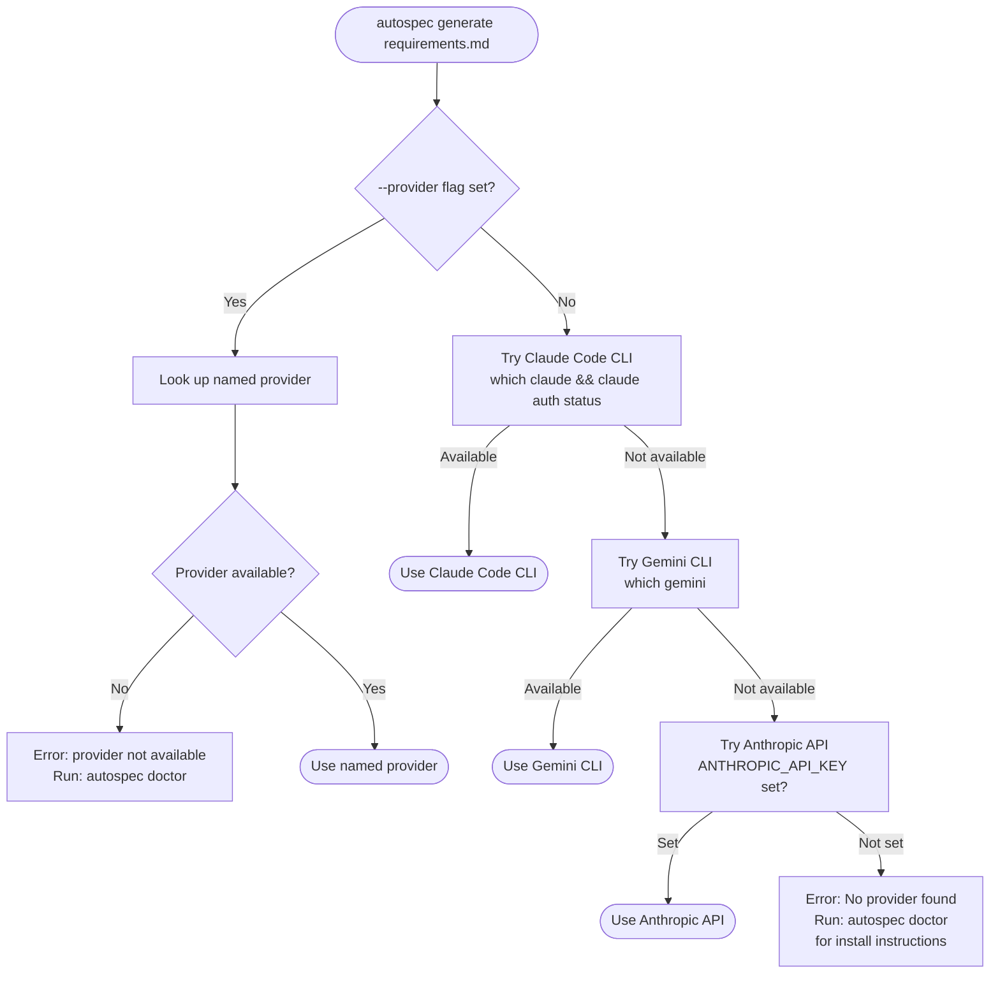

# Provider Architecture Decisions

This document captures the reasoning behind the LLM provider architecture selected for AutoSpec v0.2.0. Decisions were made after three rounds of researcher review and two senior architect reviews. See [CLI Provider Architecture](../cli/02_providers.md) for the technical implementation spec.

---

## Why 3 Providers for MVP

The final proposal v3.0 ships v0.2.0 with exactly 3 providers:

1. **Claude Code CLI** (subprocess via stdin) — priority 1
2. **Gemini CLI** (subprocess via stdin) — priority 2
3. **Anthropic API** (`@anthropic-ai/sdk`, dynamic import) — priority 3

**Architect 1 rationale (Must-Fix #1):** Five providers is three too many for a first release. Each provider is ~200-300 lines of implementation plus edge-case testing. The v1 proposal included OpenAI API and Ollama; these were cut.

- Claude Code CLI and Gemini CLI share 90% of their subprocess logic. That's one testable, shippable implementation with minor per-provider differences.
- Anthropic API is one SDK call — manageable in a single sprint.
- Ollama has unique timeout and quality concerns (small models produce short, vague specs that may fail validation thresholds). Needs separate quality guardrails that would consume a full sprint on their own.
- OpenAI is straightforward but adds no strategic value over Anthropic API for the MVP — both are direct API providers with API key requirements.

This discipline (defer everything that doesn't serve the core value proposition) mirrors how GSD v1's success was built: ship one runtime well, not six runtimes poorly.

---

## Why GitHub Copilot SDK Is Deferred to v0.3.0

All three researchers (A, B, C) and both architects independently reached the same conclusion: do not ship Copilot SDK in v0.2.0.

**Technical reasons identified:**

1. **Technical Preview status.** The SDK is not yet recommended for production use.

2. **Undocumented ACP protocol.** The NDJSON JSON-RPC 2.0 message format (`copilot --acp --stdio`) is not formally published. It is reverse-engineered from SDK source code and GitHub issue threads. Researcher B documented that the prior `--headless --stdio` flags were removed without deprecation notice in a Copilot CLI auto-update (the CLI silently delegates to downloaded binaries under `~/.copilot/pkg/universal/`). The replacement `--acp --stdio` was only discovered by reading SDK source after the fact.

3. **NDJSON fragility.** The streaming protocol (NDJSON over stdio) requires careful line-by-line parsing with skip-on-error guards. One malformed line halts the stream if not handled. This adds parsing complexity that the subprocess providers (Claude Code CLI, Gemini CLI) also face, but those providers have more stable, documented output formats.

4. **Installation dependency.** Not just `npm install` — the user must separately install the Copilot CLI (`gh extension install github/gh-copilot` or standalone installer). This adds a dependency that AutoSpec cannot control or verify easily.

**Strategic reason:** AutoSpec's zero-config story is "if you have Claude Code or Gemini CLI authenticated, it just works." Claude Code and Gemini CLI users are the target early adopters. Copilot users are an important segment but can be served by the Anthropic API fallback (via BYOK Copilot → Anthropic key).

---

## Subprocess vs. SDK Tradeoffs

| Aspect | Subprocess (Claude Code CLI, Gemini CLI) | SDK (Anthropic API) |
|--------|------------------------------------------|---------------------|
| Auth | Zero-config — reuses existing CLI auth (subscription, OAuth) | Requires `ANTHROPIC_API_KEY` env var or `.env` file |
| Installation dep | User must have CLI tool installed | No dep — `@anthropic-ai/sdk` bundled with AutoSpec |
| Prompt delivery | Via stdin (piped, handles large SRS docs safely) | Via SDK method call |
| Output format | NDJSON stream (parse each line) or plain text | Streaming SDK response (well-documented) |
| Timeout control | Per-provider `timeoutMs` passed to `execa` | SDK timeout option |
| Error signals | stderr text parsing (auth, rate limit, etc.) | Typed SDK errors (HTTP status codes) |
| Update path | CLI tool updates independently of AutoSpec | SDK version controlled by AutoSpec's `package.json` |
| Cost visibility | Via `claude auth status` / provider logs | Via SDK response usage metadata |

**Key finding from Researcher C:** Claude Code CLI supports `--json-schema` flag for validated structured output, `--system-prompt-file` for large system prompts, `--max-budget-usd` for cost control, and `--output-format stream-json` for NDJSON streaming. This makes it a full-featured subprocess interface, not just a text pipe.

---

## Detection Priority Order and Rationale

```
Priority 1: Claude Code CLI
  Detection: `which claude` exits 0 AND `claude auth status` exits 0
  Rationale: Largest user base among AutoSpec's early adopters (developers
             in the Claude Code ecosystem). Subprocess via stdin. Zero-config
             for any user with a Claude subscription.

Priority 2: Gemini CLI
  Detection: `which gemini` exits 0
  Rationale: Second-largest zero-config user base. Subprocess via stdin.
             Shares 90% of implementation with Claude Code CLI provider.

Priority 3: Anthropic API
  Detection: ANTHROPIC_API_KEY environment variable set (non-empty)
  Rationale: Fallback for users without any CLI tool. API key discovery
             uses 5-level cascade (see docs/cli/02_providers.md).
```

`--provider <name>` overrides auto-detection. `autospec doctor` shows which providers are currently detected and why.

---

## Auth Strategy Per Provider

### Claude Code CLI (zero-config)

No auth configuration required by AutoSpec. The CLI subprocess (`claude --print`) uses whatever authentication is already stored in `~/.claude/` — whether that is a Claude subscription via `claude auth login` or Console API billing via `claude auth login --console`. AutoSpec inherits auth without reading credentials directly. The subprocess exits non-zero with an auth error in stderr if auth has expired.

### Gemini CLI (zero-config)

No auth configuration required by AutoSpec. Same pattern: the `gemini` subprocess uses Google account credentials stored by `gemini auth login`. AutoSpec inherits auth.

### Anthropic API (API key required)

API key discovery cascade (5 levels, highest priority first):

1. `--api-key <key>` CLI flag
2. `ANTHROPIC_API_KEY` environment variable
3. `.env` file in current working directory
4. `.env` file in git root directory
5. `~/.autospec/.env` in home directory

This cascade matches the pattern from aider (Researcher C, Lesson 3) which proved to be the most developer-friendly approach: covers the `export KEY=...` session pattern, the project-level `.env` pattern, and the persistent home config pattern.

---

## Provider Detection Flow



---

## Future Provider Additions

| Version | Providers Added | Notes |
|---------|----------------|-------|
| v0.2.1 | OpenAI API | Standard API key pattern; lower strategic priority than Anthropic |
| v0.2.1 | Ollama | Local inference; needs quality guardrails (halved line count thresholds, model size warnings) |
| v0.3.0 | GitHub Copilot SDK | After SDK reaches stable release and ACP protocol is documented |
| v0.3.0 | Per-role model routing | Different model per spec role (e.g., Opus for PM spec, Sonnet for DevOps) |

---

## Related Docs

- [CLI Architecture Overview](../cli/01_architecture.md) — command structure and module layout
- [LLM Provider Architecture](../cli/02_providers.md) — TypeScript interfaces, implementation details, retry logic
- [Generate Command Pipeline](../cli/03_generate_pipeline.md) — how providers are invoked per pipeline step
- [Competitive Analysis](01_competitive_analysis.md) — how competitors handle LLM auth
