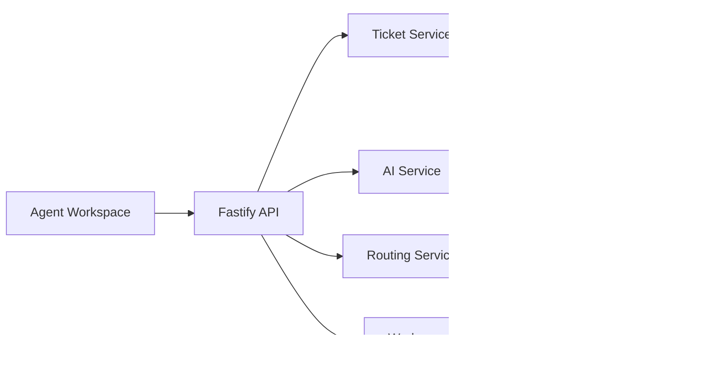
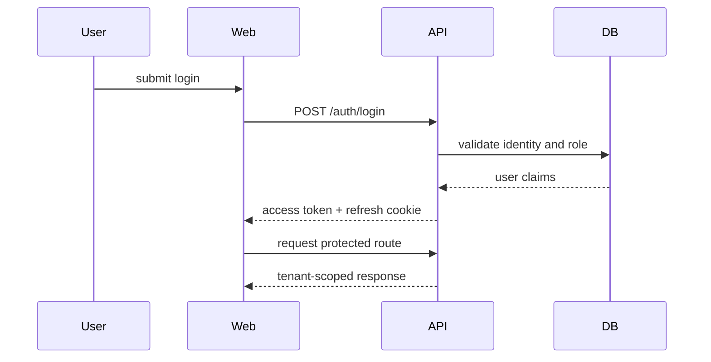

# Diagram Definitions

## System Architecture Mermaid

```mermaid
flowchart LR
  Web[Agent Workspace] --> API[Fastify API]
  API --> TicketSvc[Ticket Service]
  API --> AISvc[AI Service]
  API --> RoutingSvc[Routing Service]
  TicketSvc --> PG[(PostgreSQL)]
  AISvc --> Redis[(Redis)]
  AISvc --> KB[Approved Knowledge]
  API --> Queue[Workers]
  Queue --> Integrations[CRM/Billing/Incident]
```

## Auth Sequence Mermaid

```mermaid
sequenceDiagram
  participant U as User
  participant W as Web
  participant A as API
  participant D as DB
  U->>W: submit login
  W->>A: POST /auth/login
  A->>D: validate identity and role
  D-->>A: user claims
  A-->>W: access token + refresh cookie
  W->>A: request protected route
  A-->>W: tenant-scoped response
```
