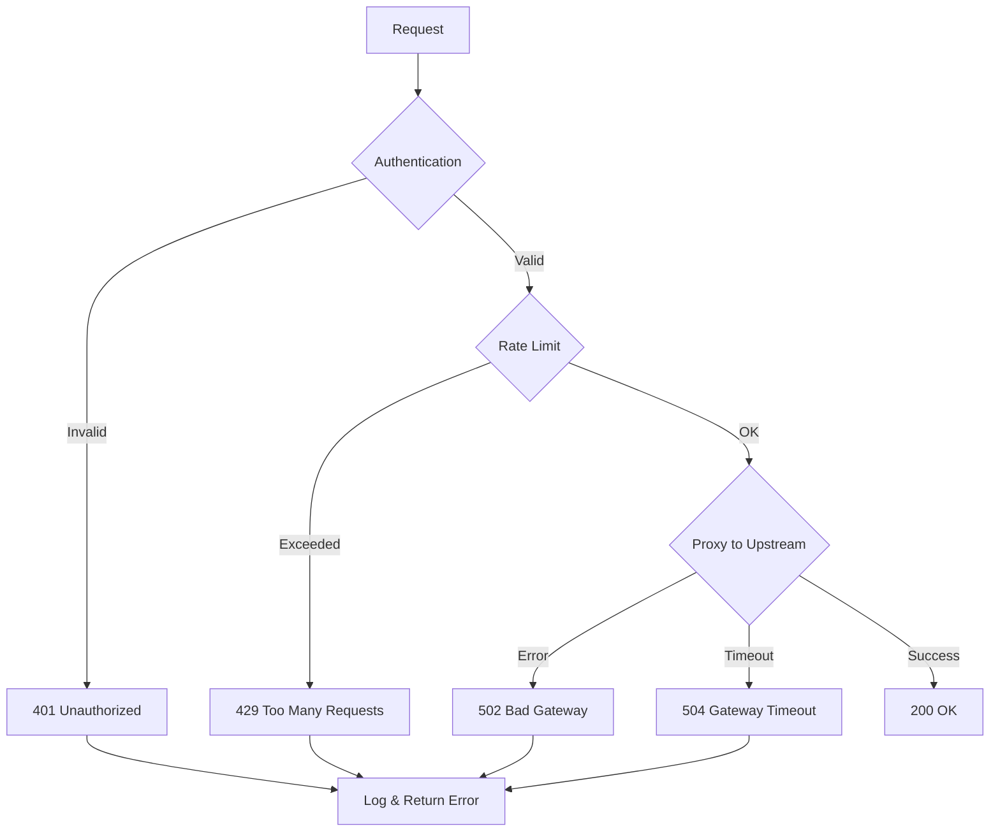
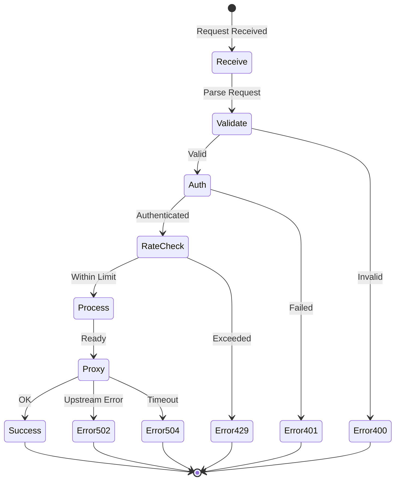

# DataHub Error Codes

## Overview

Comprehensive reference for all error codes returned by the DataHub API Gateway.

---

## Error Response Format

All errors follow a consistent JSON structure:

```json
{
  "error": {
    "code": "RATE_LIMIT_EXCEEDED",
    "message": "Rate limit exceeded for this API key",
    "details": {
      "limit": 1000,
      "remaining": 0,
      "resetAt": "2024-01-20T10:01:00Z"
    },
    "requestId": "req_abc123xyz789"
  }
}
```

---

## Error Flow



---

## HTTP Status Codes

### 4xx Client Errors

| Status | Code | Description |
|--------|------|-------------|
| 400 | `BAD_REQUEST` | Invalid request format |
| 401 | `UNAUTHORIZED` | Authentication failed |
| 403 | `FORBIDDEN` | Access denied |
| 404 | `NOT_FOUND` | Resource not found |
| 409 | `CONFLICT` | Resource conflict |
| 422 | `VALIDATION_ERROR` | Validation failed |
| 429 | `RATE_LIMIT_EXCEEDED` | Rate limit exceeded |

### 5xx Server Errors

| Status | Code | Description |
|--------|------|-------------|
| 500 | `INTERNAL_ERROR` | Internal server error |
| 502 | `BAD_GATEWAY` | Upstream service error |
| 503 | `SERVICE_UNAVAILABLE` | Service temporarily unavailable |
| 504 | `GATEWAY_TIMEOUT` | Upstream timeout |

---

## Authentication Errors

### INVALID_API_KEY

```json
{
  "error": {
    "code": "INVALID_API_KEY",
    "message": "The provided API key is invalid or malformed",
    "details": {
      "hint": "API keys should start with 'dh_' prefix"
    },
    "requestId": "req_abc123"
  }
}
```

**Status:** 401 Unauthorized

**Resolution:** Verify the API key format and ensure it starts with `dh_`.

### API_KEY_REVOKED

```json
{
  "error": {
    "code": "API_KEY_REVOKED",
    "message": "This API key has been revoked",
    "details": {
      "revokedAt": "2024-01-15T10:00:00Z"
    },
    "requestId": "req_abc123"
  }
}
```

**Status:** 401 Unauthorized

**Resolution:** Generate a new API key from the admin dashboard.

### IP_NOT_ALLOWED

```json
{
  "error": {
    "code": "IP_NOT_ALLOWED",
    "message": "Request from this IP address is not allowed",
    "details": {
      "clientIP": "198.51.100.50",
      "allowedRanges": ["203.0.113.0/24"]
    },
    "requestId": "req_abc123"
  }
}
```

**Status:** 403 Forbidden

**Resolution:** Add the client IP to the API key's allowlist.

### ORIGIN_NOT_ALLOWED

```json
{
  "error": {
    "code": "ORIGIN_NOT_ALLOWED",
    "message": "Request from this origin is not allowed",
    "details": {
      "origin": "https://unauthorized.com",
      "allowedOrigins": ["https://app.example.com"]
    },
    "requestId": "req_abc123"
  }
}
```

**Status:** 403 Forbidden

**Resolution:** Add the origin to the API key's allowed origins.

---

## Rate Limiting Errors

### RATE_LIMIT_EXCEEDED

```json
{
  "error": {
    "code": "RATE_LIMIT_EXCEEDED",
    "message": "Rate limit exceeded for this API key",
    "details": {
      "limit": 1000,
      "remaining": 0,
      "window": "1m",
      "resetAt": "2024-01-20T10:01:00Z",
      "retryAfter": 45
    },
    "requestId": "req_abc123"
  }
}
```

**Status:** 429 Too Many Requests

**Headers:**
```
Retry-After: 45
X-Rate-Limit-Remaining: 0
X-Rate-Limit-Reset: 1705750860
```

**Resolution:** Wait until the rate limit resets or upgrade your plan.

### BURST_LIMIT_EXCEEDED

```json
{
  "error": {
    "code": "BURST_LIMIT_EXCEEDED",
    "message": "Burst rate limit exceeded",
    "details": {
      "burstLimit": 50,
      "retryAfter": 5
    },
    "requestId": "req_abc123"
  }
}
```

**Status:** 429 Too Many Requests

**Resolution:** Implement request throttling on the client side.

---

## Gateway Errors

### UPSTREAM_TIMEOUT

```json
{
  "error": {
    "code": "UPSTREAM_TIMEOUT",
    "message": "Upstream service did not respond in time",
    "details": {
      "service": "user-service",
      "timeout": 30000,
      "elapsed": 30001
    },
    "requestId": "req_abc123"
  }
}
```

**Status:** 504 Gateway Timeout

**Resolution:** Check upstream service health or increase timeout.

### UPSTREAM_ERROR

```json
{
  "error": {
    "code": "UPSTREAM_ERROR",
    "message": "Upstream service returned an error",
    "details": {
      "service": "payment-service",
      "status": 500,
      "message": "Internal server error"
    },
    "requestId": "req_abc123"
  }
}
```

**Status:** 502 Bad Gateway

### CIRCUIT_OPEN

```json
{
  "error": {
    "code": "CIRCUIT_OPEN",
    "message": "Circuit breaker is open for this service",
    "details": {
      "service": "inventory-service",
      "state": "open",
      "failures": 5,
      "resetAt": "2024-01-20T10:05:00Z"
    },
    "requestId": "req_abc123"
  }
}
```

**Status:** 503 Service Unavailable

**Resolution:** Wait for the circuit breaker to reset.

---

## Error Handling Flow



---

## Validation Errors

### VALIDATION_ERROR

```json
{
  "error": {
    "code": "VALIDATION_ERROR",
    "message": "Request validation failed",
    "details": {
      "fields": [
        {
          "field": "rateLimit",
          "message": "Must be a positive integer",
          "value": -100
        },
        {
          "field": "name",
          "message": "Name is required",
          "value": null
        }
      ]
    },
    "requestId": "req_abc123"
  }
}
```

**Status:** 422 Unprocessable Entity

---

## Error Code Reference Table

| Code | HTTP Status | Retryable | Description |
|------|-------------|-----------|-------------|
| `INVALID_API_KEY` | 401 | No | Invalid API key |
| `API_KEY_REVOKED` | 401 | No | Key has been revoked |
| `IP_NOT_ALLOWED` | 403 | No | IP not in allowlist |
| `ORIGIN_NOT_ALLOWED` | 403 | No | Origin not allowed |
| `RATE_LIMIT_EXCEEDED` | 429 | Yes | Rate limit hit |
| `BURST_LIMIT_EXCEEDED` | 429 | Yes | Burst limit hit |
| `UPSTREAM_TIMEOUT` | 504 | Yes | Service timeout |
| `UPSTREAM_ERROR` | 502 | Maybe | Upstream failure |
| `CIRCUIT_OPEN` | 503 | Yes | Circuit breaker open |
| `INTERNAL_ERROR` | 500 | Yes | Internal error |

---

## Related Documents

- [API Reference](./reference.md)
- [Authentication](./authentication.md)
- [Rate Limiting](./rate-limiting.md)
