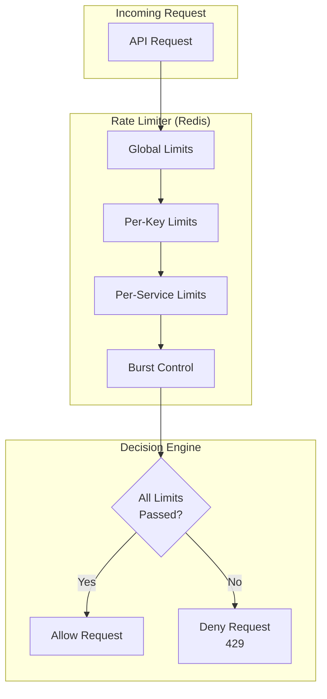
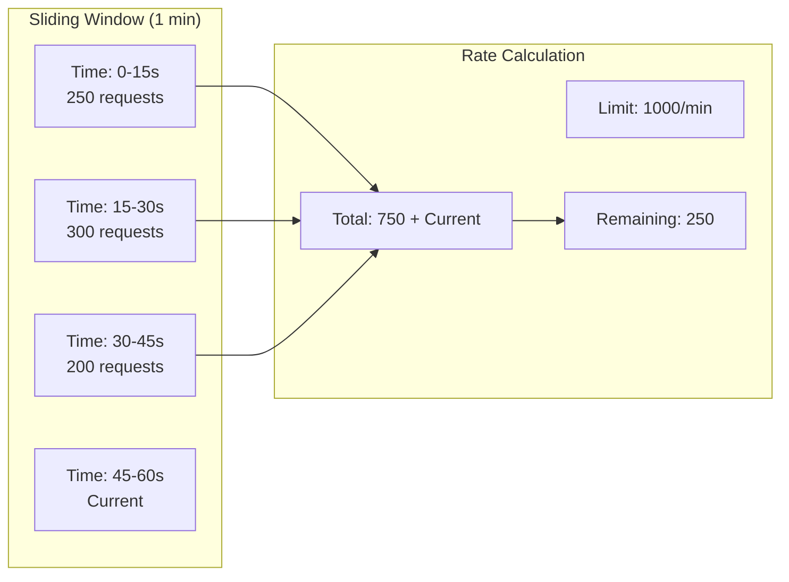
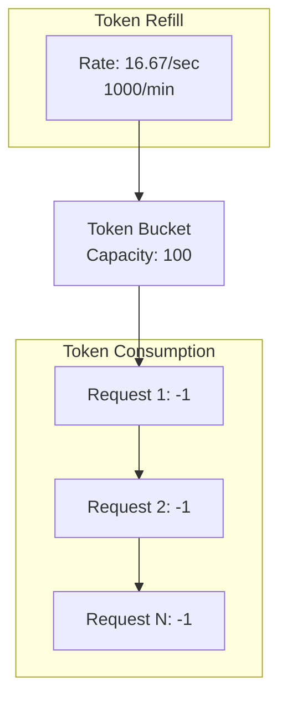
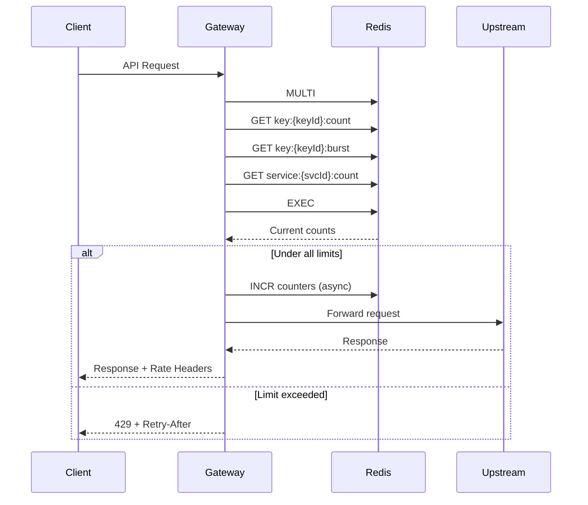

# DataHub Rate Limiting

## Overview

DataHub API Gateway implements multi-tier rate limiting to protect upstream services and ensure fair usage across all API consumers.

---

## Rate Limiting Architecture



---

## Rate Limit Tiers

### Global Rate Limits

Platform-wide limits that apply to all traffic.

| Metric | Limit | Window |
|--------|-------|--------|
| Total Requests | 1,000,000 | 1 minute |
| Concurrent Connections | 10,000 | - |
| Request Size | 10 MB | per request |

### Per-Key Rate Limits

Configurable limits for each API key.

| Plan | Requests/Minute | Burst | Concurrent |
|------|-----------------|-------|------------|
| Free | 100 | 20 | 10 |
| Starter | 1,000 | 100 | 50 |
| Professional | 10,000 | 500 | 200 |
| Enterprise | Custom | Custom | Custom |

### Per-Service Rate Limits

Protect individual upstream services.

| Service | Limit | Window |
|---------|-------|--------|
| User Service | 5,000 | 1 minute |
| Payment Service | 1,000 | 1 minute |
| Analytics Service | 10,000 | 1 minute |

---

## Rate Limit Algorithm

DataHub uses a sliding window algorithm with token bucket for burst handling.



### Token Bucket for Burst



---

## Response Headers

Every response includes rate limit information:

```http
HTTP/1.1 200 OK
X-Rate-Limit-Limit: 1000
X-Rate-Limit-Remaining: 842
X-Rate-Limit-Reset: 1705750860
X-Rate-Limit-Window: 60
```

| Header | Description |
|--------|-------------|
| `X-Rate-Limit-Limit` | Maximum requests allowed |
| `X-Rate-Limit-Remaining` | Requests remaining in window |
| `X-Rate-Limit-Reset` | Unix timestamp when limit resets |
| `X-Rate-Limit-Window` | Window duration in seconds |

### Rate Limit Exceeded Response

```http
HTTP/1.1 429 Too Many Requests
Retry-After: 45
X-Rate-Limit-Limit: 1000
X-Rate-Limit-Remaining: 0
X-Rate-Limit-Reset: 1705750860
Content-Type: application/json

{
  "error": {
    "code": "RATE_LIMIT_EXCEEDED",
    "message": "Rate limit exceeded for this API key",
    "details": {
      "limit": 1000,
      "remaining": 0,
      "resetAt": "2024-01-20T10:01:00Z",
      "retryAfter": 45
    }
  }
}
```

---

## Rate Limit Configuration

### API Key Configuration

```json
{
  "id": "key_abc123",
  "name": "Production API",
  "rateLimit": {
    "requestsPerMinute": 5000,
    "burstLimit": 200,
    "concurrentLimit": 100
  },
  "serviceLimits": {
    "user-service": 2000,
    "payment-service": 500
  }
}
```

### Service Configuration

```json
{
  "id": "svc_users",
  "name": "User Service",
  "rateLimit": {
    "globalLimit": 50000,
    "perKeyDefault": 1000,
    "burstMultiplier": 1.5
  }
}
```

---

## Rate Limit Processing



---

## Handling Rate Limits

### Client-Side Best Practices

```javascript
// Exponential backoff with jitter
async function makeRequest(url, options, retries = 3) {
  for (let i = 0; i < retries; i++) {
    const response = await fetch(url, options);

    if (response.status === 429) {
      const retryAfter = response.headers.get('Retry-After') || 60;
      const jitter = Math.random() * 1000;
      await sleep((retryAfter * 1000) + jitter);
      continue;
    }

    return response;
  }
  throw new Error('Max retries exceeded');
}
```

### Checking Remaining Quota

```bash
# Check rate limit status
curl -I https://gateway.datahub.io/api/proxy/health \
  -H "X-API-Key: dh_prod_sk_live_xxx"

# Response headers show current limits
# X-Rate-Limit-Remaining: 842
```

---

## Rate Limit Monitoring

### Metrics Available

```mermaid
flowchart LR
    subgraph Metrics["Rate Limit Metrics"]
        HITS[datahub_rate_limit_hits_total]
        EXCEEDED[datahub_rate_limit_exceeded_total]
        REMAINING[datahub_rate_limit_remaining]
        UTILIZATION[datahub_rate_limit_utilization]
    end

    subgraph Export["Prometheus Export"]
        PROM[/metrics endpoint]
    end

    Metrics --> PROM
```

### Prometheus Queries

```promql
# Rate limit exceeded rate
rate(datahub_rate_limit_exceeded_total[5m])

# Rate limit utilization by key
datahub_rate_limit_remaining / datahub_rate_limit_limit

# Top keys hitting limits
topk(10, rate(datahub_rate_limit_exceeded_total[1h])) by (key_id)
```

---

## Rate Limit Exemptions

Certain operations are exempt from rate limiting:

| Endpoint | Reason |
|----------|--------|
| `/health` | Health checks |
| `/metrics` | Monitoring |
| `OPTIONS *` | CORS preflight |

---

## Related Documents

- [API Reference](./reference.md)
- [Authentication](./authentication.md)
- [Error Codes](./error-codes.md)
