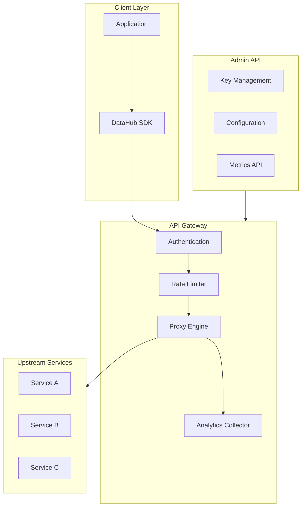
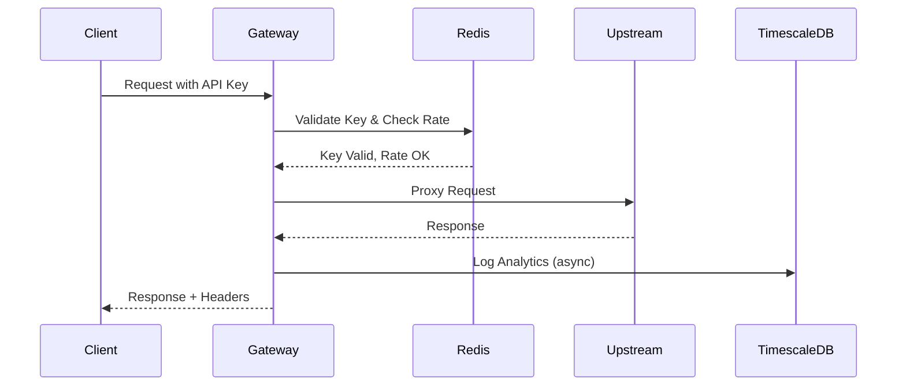

# DataHub API Reference

## Overview

Complete API reference for the DataHub API Gateway platform. All endpoints are RESTful and return JSON responses.

---

## Base URLs

| Environment | Base URL |
|-------------|----------|
| Production | `https://gateway.datahub.io` |
| Staging | `https://staging-gateway.datahub.io` |
| Development | `http://localhost:3001` |

---

## API Architecture



---

## Gateway API Endpoints

### Health Check

```
GET /health
```

Returns gateway health status.

**Response:**
```json
{
  "status": "healthy",
  "version": "2.1.0",
  "uptime": 86400,
  "checks": {
    "database": "healthy",
    "redis": "healthy",
    "timescale": "healthy"
  }
}
```

---

### Proxy Requests

```
ANY /api/proxy/{path}
```

Proxies requests to configured upstream services.

**Headers:**
| Header | Required | Description |
|--------|----------|-------------|
| `X-API-Key` | Yes | API key for authentication |
| `X-Request-ID` | No | Custom request identifier |
| `X-Target-Service` | No | Override target service |

**Response Headers:**
| Header | Description |
|--------|-------------|
| `X-Request-ID` | Request tracking ID |
| `X-Rate-Limit-Remaining` | Remaining requests |
| `X-Rate-Limit-Reset` | Reset timestamp |
| `X-Response-Time` | Processing time (ms) |

---

## Admin API Endpoints

### API Key Management

#### List API Keys

```
GET /api/keys
```

**Query Parameters:**
| Parameter | Type | Default | Description |
|-----------|------|---------|-------------|
| `page` | integer | 1 | Page number |
| `limit` | integer | 20 | Items per page |
| `status` | string | all | Filter by status |
| `search` | string | - | Search by name |

**Response:**
```json
{
  "data": [
    {
      "id": "key_abc123",
      "name": "Production API",
      "prefix": "dh_prod_",
      "status": "active",
      "rateLimit": 1000,
      "createdAt": "2024-01-15T10:00:00Z",
      "lastUsedAt": "2024-01-20T15:30:00Z"
    }
  ],
  "pagination": {
    "page": 1,
    "limit": 20,
    "total": 45,
    "pages": 3
  }
}
```

#### Create API Key

```
POST /api/keys
```

**Request Body:**
```json
{
  "name": "Production API Key",
  "rateLimit": 1000,
  "allowedOrigins": ["https://app.example.com"],
  "allowedIPs": ["203.0.113.0/24"],
  "metadata": {
    "team": "backend",
    "project": "user-service"
  }
}
```

**Response:**
```json
{
  "id": "key_xyz789",
  "name": "Production API Key",
  "key": "dh_prod_sk_live_abc123xyz789",
  "prefix": "dh_prod_sk_live_",
  "status": "active",
  "rateLimit": 1000,
  "createdAt": "2024-01-20T10:00:00Z"
}
```

#### Get API Key

```
GET /api/keys/{keyId}
```

**Response:**
```json
{
  "id": "key_xyz789",
  "name": "Production API Key",
  "prefix": "dh_prod_sk_live_",
  "status": "active",
  "rateLimit": 1000,
  "allowedOrigins": ["https://app.example.com"],
  "allowedIPs": ["203.0.113.0/24"],
  "usage": {
    "today": 1523,
    "thisWeek": 8934,
    "thisMonth": 45230
  },
  "createdAt": "2024-01-20T10:00:00Z",
  "lastUsedAt": "2024-01-20T15:45:00Z"
}
```

#### Update API Key

```
PATCH /api/keys/{keyId}
```

**Request Body:**
```json
{
  "name": "Updated Key Name",
  "rateLimit": 2000,
  "status": "active"
}
```

#### Delete API Key

```
DELETE /api/keys/{keyId}
```

**Response:** `204 No Content`

---

### Service Configuration

#### List Services

```
GET /api/services
```

**Response:**
```json
{
  "data": [
    {
      "id": "svc_user",
      "name": "User Service",
      "upstreamUrl": "https://users.internal.datahub.io",
      "healthEndpoint": "/health",
      "timeout": 30000,
      "retries": 3,
      "status": "healthy"
    }
  ]
}
```

#### Configure Service

```
POST /api/services
```

**Request Body:**
```json
{
  "name": "Payment Service",
  "upstreamUrl": "https://payments.internal.datahub.io",
  "healthEndpoint": "/health",
  "timeout": 60000,
  "retries": 3,
  "circuitBreaker": {
    "enabled": true,
    "threshold": 5,
    "timeout": 30000
  }
}
```

---

### Analytics Endpoints

#### Request Analytics

```
GET /api/analytics/requests
```

**Query Parameters:**
| Parameter | Type | Description |
|-----------|------|-------------|
| `from` | ISO8601 | Start date |
| `to` | ISO8601 | End date |
| `interval` | string | Aggregation interval |
| `keyId` | string | Filter by API key |

**Response:**
```json
{
  "data": [
    {
      "timestamp": "2024-01-20T10:00:00Z",
      "requests": 15234,
      "errors": 23,
      "p50Latency": 45,
      "p95Latency": 120,
      "p99Latency": 250
    }
  ],
  "summary": {
    "totalRequests": 1523400,
    "errorRate": 0.0015,
    "avgLatency": 52
  }
}
```

---

## Request/Response Flow



---

## Related Documents

- [Authentication](./authentication.md)
- [Error Codes](./error-codes.md)
- [Rate Limiting](./rate-limiting.md)
- [cURL Examples](./curl-examples.md)
