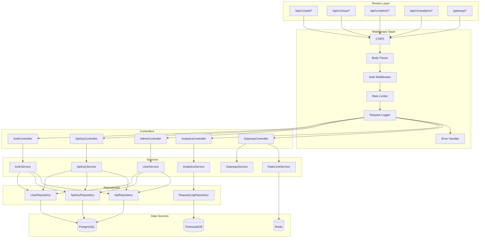
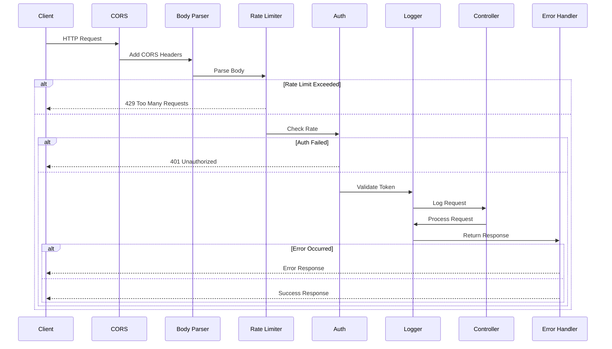
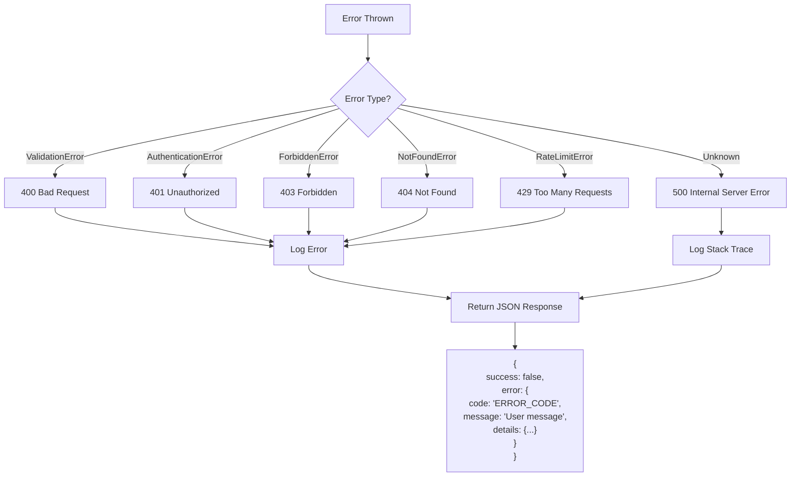

# DataHub API Gateway - Backend Architecture

## Overview

The DataHub backend follows a layered architecture pattern that promotes separation of concerns, testability, and maintainability. This document details the internal structure of the Node.js/Express application.

---

## Layered Architecture

### ASCII Layer Diagram

```
┌─────────────────────────────────────────────────────────────────────────────┐
│                              HTTP Request                                    │
└─────────────────────────────────────────────────────────────────────────────┘
                                      │
                                      ▼
┌─────────────────────────────────────────────────────────────────────────────┐
│                             ROUTES LAYER                                     │
│                                                                              │
│  ┌──────────────┐  ┌──────────────┐  ┌──────────────┐  ┌──────────────┐    │
│  │  /api/auth   │  │  /api/keys   │  │  /api/admin  │  │  /gateway/*  │    │
│  └──────────────┘  └──────────────┘  └──────────────┘  └──────────────┘    │
│                                                                              │
│  Responsibility: URL mapping, request validation, response formatting        │
└─────────────────────────────────────────────────────────────────────────────┘
                                      │
                                      ▼
┌─────────────────────────────────────────────────────────────────────────────┐
│                           MIDDLEWARE LAYER                                   │
│                                                                              │
│  ┌────────────┐ ┌────────────┐ ┌────────────┐ ┌────────────┐ ┌───────────┐ │
│  │   Auth     │ │ Rate Limit │ │  Logging   │ │  Metrics   │ │  Error    │ │
│  │ Middleware │ │ Middleware │ │ Middleware │ │ Middleware │ │  Handler  │ │
│  └────────────┘ └────────────┘ └────────────┘ └────────────┘ └───────────┘ │
│                                                                              │
│  Responsibility: Cross-cutting concerns, request/response interception       │
└─────────────────────────────────────────────────────────────────────────────┘
                                      │
                                      ▼
┌─────────────────────────────────────────────────────────────────────────────┐
│                          CONTROLLERS LAYER                                   │
│                                                                              │
│  ┌──────────────┐  ┌──────────────┐  ┌──────────────┐  ┌──────────────┐    │
│  │    Auth      │  │   API Key    │  │   Gateway    │  │   Admin      │    │
│  │  Controller  │  │  Controller  │  │  Controller  │  │  Controller  │    │
│  └──────────────┘  └──────────────┘  └──────────────┘  └──────────────┘    │
│                                                                              │
│  Responsibility: Request handling, input extraction, response building       │
└─────────────────────────────────────────────────────────────────────────────┘
                                      │
                                      ▼
┌─────────────────────────────────────────────────────────────────────────────┐
│                           SERVICES LAYER                                     │
│                                                                              │
│  ┌──────────────┐  ┌──────────────┐  ┌──────────────┐  ┌──────────────┐    │
│  │    Auth      │  │   API Key    │  │   Gateway    │  │  Analytics   │    │
│  │   Service    │  │   Service    │  │   Service    │  │   Service    │    │
│  └──────────────┘  └──────────────┘  └──────────────┘  └──────────────┘    │
│                                                                              │
│  Responsibility: Business logic, orchestration, domain rules                 │
└─────────────────────────────────────────────────────────────────────────────┘
                                      │
                                      ▼
┌─────────────────────────────────────────────────────────────────────────────┐
│                         REPOSITORIES LAYER                                   │
│                                                                              │
│  ┌──────────────┐  ┌──────────────┐  ┌──────────────┐  ┌──────────────┐    │
│  │    User      │  │   API Key    │  │    API       │  │  Request     │    │
│  │ Repository   │  │ Repository   │  │ Repository   │  │ Log Repo     │    │
│  └──────────────┘  └──────────────┘  └──────────────┘  └──────────────┘    │
│                                                                              │
│  Responsibility: Data access, query building, ORM interaction                │
└─────────────────────────────────────────────────────────────────────────────┘
                                      │
                                      ▼
┌─────────────────────────────────────────────────────────────────────────────┐
│                           DATA SOURCES                                       │
│                                                                              │
│         ┌──────────────┐    ┌──────────────┐    ┌──────────────┐           │
│         │  PostgreSQL  │    │    Redis     │    │ TimescaleDB  │           │
│         └──────────────┘    └──────────────┘    └──────────────┘           │
│                                                                              │
└─────────────────────────────────────────────────────────────────────────────┘
```

### Mermaid Layer Flow



---

## Directory Structure

```
src/
├── config/
│   ├── index.ts              # Configuration aggregator
│   ├── database.ts           # Database configuration
│   ├── redis.ts              # Redis configuration
│   └── app.ts                # Application settings
│
├── routes/
│   ├── index.ts              # Route aggregator
│   ├── auth.routes.ts        # Authentication routes
│   ├── keys.routes.ts        # API key routes
│   ├── admin.routes.ts       # Admin routes
│   ├── analytics.routes.ts   # Analytics routes
│   └── gateway.routes.ts     # Gateway proxy routes
│
├── middleware/
│   ├── auth.middleware.ts    # JWT/API key validation
│   ├── rateLimiter.middleware.ts
│   ├── logger.middleware.ts
│   ├── metrics.middleware.ts
│   ├── validation.middleware.ts
│   └── errorHandler.middleware.ts
│
├── controllers/
│   ├── auth.controller.ts
│   ├── apiKey.controller.ts
│   ├── admin.controller.ts
│   ├── analytics.controller.ts
│   └── gateway.controller.ts
│
├── services/
│   ├── auth.service.ts
│   ├── apiKey.service.ts
│   ├── user.service.ts
│   ├── gateway.service.ts
│   ├── rateLimit.service.ts
│   └── analytics.service.ts
│
├── repositories/
│   ├── user.repository.ts
│   ├── apiKey.repository.ts
│   ├── api.repository.ts
│   └── requestLog.repository.ts
│
├── models/
│   ├── user.model.ts
│   ├── apiKey.model.ts
│   ├── api.model.ts
│   └── requestLog.model.ts
│
├── types/
│   ├── express.d.ts          # Express type extensions
│   ├── api.types.ts
│   └── common.types.ts
│
├── utils/
│   ├── crypto.ts             # Hashing utilities
│   ├── jwt.ts                # JWT utilities
│   ├── logger.ts             # Winston logger
│   └── errors.ts             # Custom error classes
│
├── validators/
│   ├── auth.validator.ts
│   ├── apiKey.validator.ts
│   └── common.validator.ts
│
└── app.ts                    # Application entry point
```

---

## Layer Responsibilities

### 1. Routes Layer

Routes define URL patterns and map them to controllers.

```typescript
// src/routes/auth.routes.ts
import { Router } from 'express';
import { AuthController } from '../controllers/auth.controller';
import { validateBody } from '../middleware/validation.middleware';
import { loginSchema, registerSchema } from '../validators/auth.validator';

const router = Router();
const authController = new AuthController();

router.post('/register', validateBody(registerSchema), authController.register);
router.post('/login', validateBody(loginSchema), authController.login);
router.post('/refresh', authController.refreshToken);
router.post('/logout', authController.logout);

export default router;
```

### 2. Middleware Layer

Middleware handles cross-cutting concerns.

```
Request Flow Through Middleware
───────────────────────────────

  Request
     │
     ▼
┌─────────────┐
│    CORS     │ ──► Sets CORS headers
└─────────────┘
     │
     ▼
┌─────────────┐
│ Body Parser │ ──► Parses JSON/form data
└─────────────┘
     │
     ▼
┌─────────────┐
│ Rate Limit  │ ──► Checks request rate ──► 429 if exceeded
└─────────────┘
     │
     ▼
┌─────────────┐
│    Auth     │ ──► Validates JWT/API key ──► 401 if invalid
└─────────────┘
     │
     ▼
┌─────────────┐
│   Logger    │ ──► Logs request details
└─────────────┘
     │
     ▼
  Controller
     │
     ▼
┌─────────────┐
│   Error     │ ──► Catches and formats errors
│   Handler   │
└─────────────┘
     │
     ▼
  Response
```

### 3. Controllers Layer

Controllers handle HTTP request/response logic.

```typescript
// src/controllers/apiKey.controller.ts
import { Request, Response, NextFunction } from 'express';
import { ApiKeyService } from '../services/apiKey.service';
import { ApiResponse } from '../types/api.types';

export class ApiKeyController {
  private apiKeyService: ApiKeyService;

  constructor() {
    this.apiKeyService = new ApiKeyService();
  }

  createKey = async (req: Request, res: Response, next: NextFunction) => {
    try {
      const userId = req.user!.id;
      const { name, permissions, expiresAt } = req.body;

      const apiKey = await this.apiKeyService.createKey({
        userId,
        name,
        permissions,
        expiresAt
      });

      const response: ApiResponse = {
        success: true,
        data: apiKey,
        message: 'API key created successfully'
      };

      res.status(201).json(response);
    } catch (error) {
      next(error);
    }
  };
}
```

### 4. Services Layer

Services contain business logic and domain rules.

```typescript
// src/services/apiKey.service.ts
import { ApiKeyRepository } from '../repositories/apiKey.repository';
import { generateApiKey, hashApiKey } from '../utils/crypto';
import { CreateApiKeyDTO, ApiKey } from '../types/api.types';

export class ApiKeyService {
  private apiKeyRepository: ApiKeyRepository;

  constructor() {
    this.apiKeyRepository = new ApiKeyRepository();
  }

  async createKey(dto: CreateApiKeyDTO): Promise<ApiKey & { rawKey: string }> {
    // Generate unique key
    const rawKey = generateApiKey();
    const keyHash = await hashApiKey(rawKey);

    // Business rule: max 10 keys per user
    const existingKeys = await this.apiKeyRepository.countByUserId(dto.userId);
    if (existingKeys >= 10) {
      throw new BusinessError('Maximum API key limit reached');
    }

    // Create key in database
    const apiKey = await this.apiKeyRepository.create({
      userId: dto.userId,
      keyHash,
      name: dto.name,
      permissions: dto.permissions,
      expiresAt: dto.expiresAt
    });

    // Return with raw key (only shown once)
    return { ...apiKey, rawKey };
  }
}
```

### 5. Repositories Layer

Repositories handle data access.

```typescript
// src/repositories/apiKey.repository.ts
import { Pool } from 'pg';
import { getPool } from '../config/database';
import { ApiKey, CreateApiKeyData } from '../types/api.types';

export class ApiKeyRepository {
  private pool: Pool;

  constructor() {
    this.pool = getPool();
  }

  async create(data: CreateApiKeyData): Promise<ApiKey> {
    const query = `
      INSERT INTO api_keys (user_id, key_hash, name, permissions, expires_at)
      VALUES ($1, $2, $3, $4, $5)
      RETURNING id, user_id, name, permissions, expires_at, created_at
    `;

    const result = await this.pool.query(query, [
      data.userId,
      data.keyHash,
      data.name,
      JSON.stringify(data.permissions),
      data.expiresAt
    ]);

    return result.rows[0];
  }

  async findByHash(keyHash: string): Promise<ApiKey | null> {
    const query = `
      SELECT * FROM api_keys
      WHERE key_hash = $1 AND revoked_at IS NULL
    `;
    const result = await this.pool.query(query, [keyHash]);
    return result.rows[0] || null;
  }
}
```

---

## Middleware Pipeline

### Mermaid Middleware Flow



---

## Dependency Injection Pattern

```
┌─────────────────────────────────────────────────────────────────┐
│                    Dependency Container                          │
├─────────────────────────────────────────────────────────────────┤
│                                                                  │
│  ┌────────────┐    ┌────────────┐    ┌────────────┐            │
│  │   Logger   │    │   Config   │    │  Database  │            │
│  │  (shared)  │    │  (shared)  │    │   Pool     │            │
│  └────────────┘    └────────────┘    └────────────┘            │
│         │                │                  │                   │
│         └────────────────┼──────────────────┘                   │
│                          │                                      │
│                          ▼                                      │
│  ┌──────────────────────────────────────────────────────────┐  │
│  │                    Repositories                           │  │
│  │  UserRepo │ ApiKeyRepo │ ApiRepo │ RequestLogRepo        │  │
│  └──────────────────────────────────────────────────────────┘  │
│                          │                                      │
│                          ▼                                      │
│  ┌──────────────────────────────────────────────────────────┐  │
│  │                      Services                             │  │
│  │  AuthService │ ApiKeyService │ GatewayService            │  │
│  └──────────────────────────────────────────────────────────┘  │
│                          │                                      │
│                          ▼                                      │
│  ┌──────────────────────────────────────────────────────────┐  │
│  │                     Controllers                           │  │
│  │  AuthController │ ApiKeyController │ GatewayController   │  │
│  └──────────────────────────────────────────────────────────┘  │
│                                                                  │
└─────────────────────────────────────────────────────────────────┘
```

---

## Error Handling Architecture

### Custom Error Classes

```typescript
// src/utils/errors.ts
export class AppError extends Error {
  constructor(
    public statusCode: number,
    public code: string,
    message: string,
    public details?: Record<string, any>
  ) {
    super(message);
    this.name = 'AppError';
  }
}

export class ValidationError extends AppError {
  constructor(message: string, details?: Record<string, any>) {
    super(400, 'VALIDATION_ERROR', message, details);
  }
}

export class AuthenticationError extends AppError {
  constructor(message: string = 'Authentication failed') {
    super(401, 'AUTHENTICATION_ERROR', message);
  }
}

export class RateLimitError extends AppError {
  constructor(retryAfter: number) {
    super(429, 'RATE_LIMIT_EXCEEDED', 'Too many requests', { retryAfter });
  }
}
```

### Error Handler Middleware



---

## Request Validation

### Validation Flow

```
┌─────────────────────────────────────────────────────────────┐
│                     Request Validation                       │
└─────────────────────────────────────────────────────────────┘
                              │
                              ▼
                    ┌─────────────────┐
                    │  Parse Request  │
                    │  (body, query,  │
                    │   params)       │
                    └────────┬────────┘
                             │
                             ▼
                    ┌─────────────────┐
                    │  Zod Schema     │
                    │  Validation     │
                    └────────┬────────┘
                             │
              ┌──────────────┼──────────────┐
              │              │              │
              ▼              ▼              ▼
        ┌──────────┐  ┌──────────┐  ┌──────────┐
        │  Valid   │  │ Invalid  │  │ Missing  │
        │          │  │  Format  │  │  Fields  │
        └────┬─────┘  └────┬─────┘  └────┬─────┘
             │             │             │
             │             └──────┬──────┘
             │                    │
             ▼                    ▼
      ┌────────────┐       ┌────────────┐
      │  Continue  │       │  Return    │
      │  to        │       │  400 Error │
      │ Controller │       │  + Details │
      └────────────┘       └────────────┘
```

---

## Related Documentation

- [System Overview](./overview.md) - High-level architecture
- [Database Design](./database.md) - Data layer details
- [Security](./security.md) - Authentication implementation
- [API Reference](../api/reference.md) - Endpoint documentation
