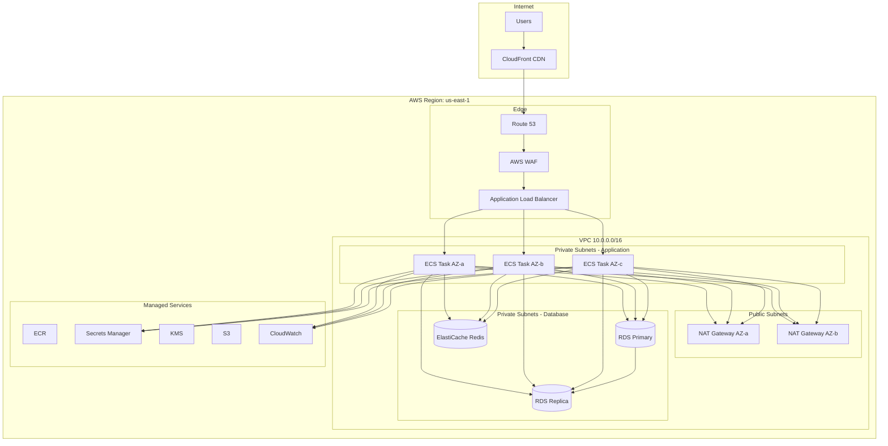
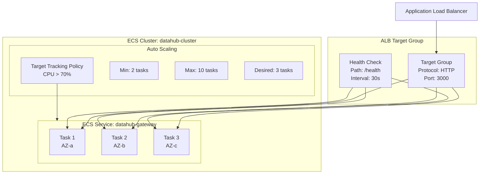
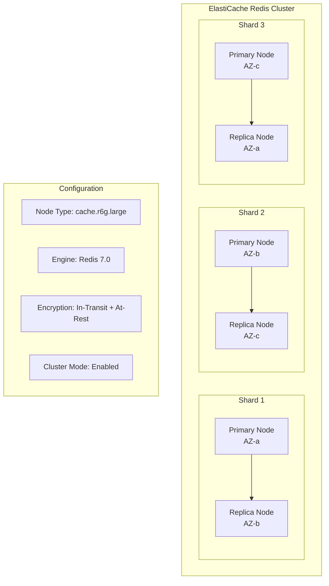
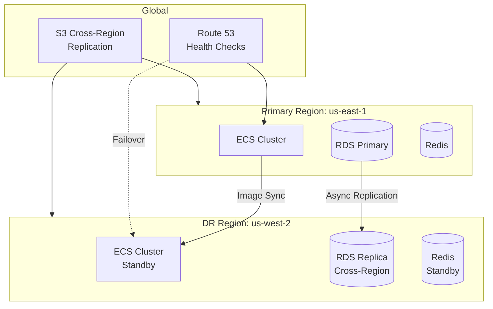

# DataHub API Gateway - Cloud Architecture (AWS)

## Overview

DataHub is deployed on AWS using a combination of managed services and containerized workloads. This document details the cloud infrastructure architecture, deployment topology, and operational considerations.

---

## AWS Architecture Overview

### ASCII Cloud Architecture

```
┌─────────────────────────────────────────────────────────────────────────────────────────┐
│                                    AWS Cloud                                             │
│  ┌───────────────────────────────────────────────────────────────────────────────────┐  │
│  │                              Region: us-east-1                                     │  │
│  │                                                                                    │  │
│  │  ┌────────────────────────────────────────────────────────────────────────────┐   │  │
│  │  │                           VPC (10.0.0.0/16)                                 │   │  │
│  │  │                                                                             │   │  │
│  │  │  ┌─────────────────────────────────────────────────────────────────────┐   │   │  │
│  │  │  │                    Public Subnets                                    │   │   │  │
│  │  │  │   ┌───────────────┐  ┌───────────────┐  ┌───────────────┐           │   │   │  │
│  │  │  │   │ AZ-a          │  │ AZ-b          │  │ AZ-c          │           │   │   │  │
│  │  │  │   │ 10.0.1.0/24   │  │ 10.0.2.0/24   │  │ 10.0.3.0/24   │           │   │   │  │
│  │  │  │   │               │  │               │  │               │           │   │   │  │
│  │  │  │   │ ┌───────────┐ │  │ ┌───────────┐ │  │ ┌───────────┐ │           │   │   │  │
│  │  │  │   │ │    NAT    │ │  │ │    NAT    │ │  │ │    NAT    │ │           │   │   │  │
│  │  │  │   │ │  Gateway  │ │  │ │  Gateway  │ │  │ │  Gateway  │ │           │   │   │  │
│  │  │  │   │ └───────────┘ │  │ └───────────┘ │  │ └───────────┘ │           │   │   │  │
│  │  │  │   └───────────────┘  └───────────────┘  └───────────────┘           │   │   │  │
│  │  │  └─────────────────────────────────────────────────────────────────────┘   │   │  │
│  │  │                                    │                                        │   │  │
│  │  │                        ┌───────────┴───────────┐                           │   │  │
│  │  │                        │                       │                           │   │  │
│  │  │                        ▼                       ▼                           │   │  │
│  │  │  ┌───────────────────────────────────────────────────────────────────────┐ │   │  │
│  │  │  │               Application Load Balancer (ALB)                         │ │   │  │
│  │  │  │                                                                        │ │   │  │
│  │  │  │  • HTTPS Listener (443)       • Health Checks                         │ │   │  │
│  │  │  │  • ACM Certificate            • Target Groups                         │ │   │  │
│  │  │  │  • WAF Integration            • Access Logs → S3                      │ │   │  │
│  │  │  └───────────────────────────────────────────────────────────────────────┘ │   │  │
│  │  │                                    │                                        │   │  │
│  │  │  ┌─────────────────────────────────────────────────────────────────────┐   │   │  │
│  │  │  │                    Private Subnets (Application)                     │   │   │  │
│  │  │  │   ┌───────────────┐  ┌───────────────┐  ┌───────────────┐           │   │   │  │
│  │  │  │   │ AZ-a          │  │ AZ-b          │  │ AZ-c          │           │   │   │  │
│  │  │  │   │ 10.0.11.0/24  │  │ 10.0.12.0/24  │  │ 10.0.13.0/24  │           │   │   │  │
│  │  │  │   │               │  │               │  │               │           │   │   │  │
│  │  │  │   │ ┌───────────┐ │  │ ┌───────────┐ │  │ ┌───────────┐ │           │   │   │  │
│  │  │  │   │ │  ECS Task │ │  │ │  ECS Task │ │  │ │  ECS Task │ │           │   │   │  │
│  │  │  │   │ │  Gateway  │ │  │ │  Gateway  │ │  │ │  Gateway  │ │           │   │   │  │
│  │  │  │   │ └───────────┘ │  │ └───────────┘ │  │ └───────────┘ │           │   │   │  │
│  │  │  │   └───────────────┘  └───────────────┘  └───────────────┘           │   │   │  │
│  │  │  └─────────────────────────────────────────────────────────────────────┘   │   │  │
│  │  │                                    │                                        │   │  │
│  │  │  ┌─────────────────────────────────────────────────────────────────────┐   │   │  │
│  │  │  │                    Private Subnets (Database)                        │   │   │  │
│  │  │  │   ┌───────────────┐  ┌───────────────┐  ┌───────────────┐           │   │   │  │
│  │  │  │   │ AZ-a          │  │ AZ-b          │  │ AZ-c          │           │   │   │  │
│  │  │  │   │ 10.0.21.0/24  │  │ 10.0.22.0/24  │  │ 10.0.23.0/24  │           │   │   │  │
│  │  │  │   │               │  │               │  │               │           │   │   │  │
│  │  │  │   │ ┌───────────┐ │  │ ┌───────────┐ │  │ ┌───────────┐ │           │   │   │  │
│  │  │  │   │ │RDS Primary│ │  │ │RDS Replica│ │  │ │Elasticache│ │           │   │   │  │
│  │  │  │   │ │PostgreSQL │ │  │ │PostgreSQL │ │  │ │  Redis    │ │           │   │   │  │
│  │  │  │   │ └───────────┘ │  │ └───────────┘ │  │ └───────────┘ │           │   │   │  │
│  │  │  │   └───────────────┘  └───────────────┘  └───────────────┘           │   │   │  │
│  │  │  └─────────────────────────────────────────────────────────────────────┘   │   │  │
│  │  │                                                                             │   │  │
│  │  └────────────────────────────────────────────────────────────────────────────┘   │  │
│  │                                                                                    │  │
│  └───────────────────────────────────────────────────────────────────────────────────┘  │
│                                                                                          │
│  ┌─────────────────────────────────────────────────────────────────────────────────┐   │
│  │                              Managed Services                                     │   │
│  │                                                                                   │   │
│  │  ┌──────────┐ ┌──────────┐ ┌──────────┐ ┌──────────┐ ┌──────────┐ ┌──────────┐ │   │
│  │  │   ECR    │ │ Secrets  │ │   KMS    │ │   S3     │ │CloudWatch│ │  Route53 │ │   │
│  │  │          │ │ Manager  │ │          │ │          │ │          │ │          │ │   │
│  │  └──────────┘ └──────────┘ └──────────┘ └──────────┘ └──────────┘ └──────────┘ │   │
│  │                                                                                   │   │
│  └─────────────────────────────────────────────────────────────────────────────────┘   │
│                                                                                          │
└─────────────────────────────────────────────────────────────────────────────────────────┘
```

### Mermaid Cloud Architecture



---

## AWS Services Used

| Service | Purpose | Configuration |
|---------|---------|---------------|
| Route 53 | DNS management | Hosted zone for domain |
| CloudFront | CDN (optional) | Edge caching for static responses |
| WAF | Web Application Firewall | SQL injection, XSS protection |
| ALB | Load balancing | HTTPS termination, health checks |
| ECS Fargate | Container orchestration | Serverless containers |
| ECR | Container registry | Docker image storage |
| RDS PostgreSQL | Primary database | Multi-AZ, 15.x |
| ElastiCache | Redis caching | Cluster mode enabled |
| S3 | Object storage | Logs, backups |
| Secrets Manager | Secret storage | DB credentials, API keys |
| KMS | Key management | Encryption keys |
| CloudWatch | Monitoring & logging | Metrics, logs, alarms |
| IAM | Identity management | Service roles, policies |

---

## ECS Fargate Configuration

### Task Definition

```
┌─────────────────────────────────────────────────────────────────────────────┐
│                         ECS Task Definition                                  │
└─────────────────────────────────────────────────────────────────────────────┘

    ┌─────────────────────────────────────────────────────────────────────────┐
    │  Task: datahub-gateway                                                   │
    │  ─────────────────────────────────────────────────────────────────────  │
    │                                                                          │
    │  CPU: 512 (0.5 vCPU)                                                    │
    │  Memory: 1024 MB                                                        │
    │  Network Mode: awsvpc                                                   │
    │  Task Role: datahub-task-role                                           │
    │  Execution Role: datahub-execution-role                                 │
    │                                                                          │
    │  ┌───────────────────────────────────────────────────────────────────┐  │
    │  │  Container: gateway                                                │  │
    │  │  ─────────────────────────────────────────────────────────────────│  │
    │  │                                                                    │  │
    │  │  Image: xxxx.dkr.ecr.us-east-1.amazonaws.com/datahub:latest      │  │
    │  │  Port Mappings: 3000 (HTTP)                                       │  │
    │  │  Health Check: /health                                            │  │
    │  │  Log Driver: awslogs                                              │  │
    │  │                                                                    │  │
    │  │  Environment Variables (from Secrets Manager):                    │  │
    │  │  • DATABASE_URL                                                   │  │
    │  │  • REDIS_URL                                                      │  │
    │  │  • JWT_SECRET                                                     │  │
    │  │                                                                    │  │
    │  │  Resource Limits:                                                 │  │
    │  │  • CPU: 512 units                                                 │  │
    │  │  • Memory: 1024 MB (hard limit)                                   │  │
    │  │  • Memory Reservation: 512 MB (soft limit)                        │  │
    │  │                                                                    │  │
    │  └───────────────────────────────────────────────────────────────────┘  │
    │                                                                          │
    └─────────────────────────────────────────────────────────────────────────┘
```

### Mermaid ECS Service Architecture



---

## RDS Configuration

### Database Topology

```
┌─────────────────────────────────────────────────────────────────────────────┐
│                         RDS Multi-AZ Configuration                           │
└─────────────────────────────────────────────────────────────────────────────┘

    ┌─────────────────────────────┐       ┌─────────────────────────────┐
    │         AZ-a                │       │         AZ-b                │
    │                             │       │                             │
    │  ┌───────────────────────┐  │       │  ┌───────────────────────┐  │
    │  │   RDS Primary         │  │       │  │   RDS Standby         │  │
    │  │                       │  │       │  │   (Synchronous)       │  │
    │  │   db.r6g.large        │──┼───────┼─►│   db.r6g.large        │  │
    │  │   2 vCPU, 16 GB       │  │ Sync  │  │   2 vCPU, 16 GB       │  │
    │  │                       │  │ Repl  │  │                       │  │
    │  │   ┌─────────────────┐ │  │       │  │   ┌─────────────────┐ │  │
    │  │   │ datahub_prod    │ │  │       │  │   │ datahub_prod    │ │  │
    │  │   └─────────────────┘ │  │       │  │   └─────────────────┘ │  │
    │  └───────────────────────┘  │       │  └───────────────────────┘  │
    │                             │       │                             │
    └─────────────────────────────┘       └─────────────────────────────┘
                 │
                 │ Async Replication
                 ▼
    ┌─────────────────────────────┐
    │         AZ-c                │
    │                             │
    │  ┌───────────────────────┐  │
    │  │   RDS Read Replica    │  │
    │  │                       │  │
    │  │   db.r6g.large        │  │
    │  │   2 vCPU, 16 GB       │  │
    │  │                       │  │
    │  │   • Read-only queries │  │
    │  │   • Analytics         │  │
    │  │   • Reporting         │  │
    │  │                       │  │
    │  └───────────────────────┘  │
    │                             │
    └─────────────────────────────┘

    Configuration:
    ─────────────
    • Engine: PostgreSQL 15.x
    • Storage: 100 GB gp3 (provisioned IOPS)
    • Encryption: AES-256 (KMS)
    • Backup: 7 days retention
    • Maintenance: Sunday 03:00-04:00 UTC
```

---

## ElastiCache Redis Configuration



---

## CI/CD Pipeline

### GitHub Actions Workflow

```
┌─────────────────────────────────────────────────────────────────────────────┐
│                         CI/CD Pipeline Flow                                  │
└─────────────────────────────────────────────────────────────────────────────┘

    ┌─────────────┐     ┌─────────────┐     ┌─────────────┐     ┌─────────────┐
    │   Commit    │────►│    Build    │────►│    Test     │────►│   Deploy    │
    │             │     │             │     │             │     │             │
    │  • Push     │     │  • npm ci   │     │  • Unit     │     │  • ECR Push │
    │  • PR       │     │  • TypeScript│    │  • Integ    │     │  • ECS      │
    │             │     │  • Docker   │     │  • E2E      │     │  • Verify   │
    └─────────────┘     └─────────────┘     └─────────────┘     └─────────────┘

    Environments:
    ═════════════

    ┌───────────────────────────────────────────────────────────────────────┐
    │  Branch: feature/*   ────────────►  Build + Test                      │
    │  Branch: develop     ────────────►  Build + Test + Deploy Staging    │
    │  Branch: main        ────────────►  Build + Test + Deploy Production │
    └───────────────────────────────────────────────────────────────────────┘
```

### Mermaid CI/CD Pipeline

```mermaid
flowchart LR
    subgraph Trigger
        P[Push/PR]
    end

    subgraph Build["Build Stage"]
        B1[Install Dependencies]
        B2[TypeScript Compile]
        B3[Build Docker Image]
        B4[Security Scan]
    end

    subgraph Test["Test Stage"]
        T1[Unit Tests]
        T2[Integration Tests]
        T3[E2E Tests]
        T4[Coverage Report]
    end

    subgraph Deploy["Deploy Stage"]
        D1[Push to ECR]
        D2[Update Task Definition]
        D3[ECS Rolling Update]
        D4[Health Check]
        D5[Smoke Tests]
    end

    subgraph Notify
        N1[Slack Notification]
        N2[GitHub Status]
    end

    P --> B1 --> B2 --> B3 --> B4
    B4 --> T1 --> T2 --> T3 --> T4
    T4 --> D1 --> D2 --> D3 --> D4 --> D5
    D5 --> N1 & N2
```



---

## Monitoring and Observability

### CloudWatch Dashboard

```
┌─────────────────────────────────────────────────────────────────────────────┐
│                     DataHub CloudWatch Dashboard                             │
├─────────────────────────────────────────────────────────────────────────────┤
│                                                                              │
│  ┌────────────────────────┐  ┌────────────────────────┐                    │
│  │   Request Rate         │  │   Error Rate           │                    │
│  │   ▄▄▄▄▆▆▆▇▇█████▇▆▄   │  │   ▁▁▁▁▂▁▁▁▁▁▁▁▁▁▁▁▁   │                    │
│  │   3,500 req/min        │  │   0.02%                │                    │
│  └────────────────────────┘  └────────────────────────┘                    │
│                                                                              │
│  ┌────────────────────────┐  ┌────────────────────────┐                    │
│  │   P99 Latency          │  │   CPU Utilization      │                    │
│  │   ▂▂▂▂▃▃▂▂▂▃▃▃▂▂▂▂▂   │  │   ▄▄▅▅▆▆▆▅▅▄▄▅▅▆▅▄▄   │                    │
│  │   45ms                 │  │   52%                  │                    │
│  └────────────────────────┘  └────────────────────────┘                    │
│                                                                              │
│  ┌────────────────────────┐  ┌────────────────────────┐                    │
│  │   Active Connections   │  │   Rate Limit Hits      │                    │
│  │   ▅▅▆▆▇▇█████▇▇▆▅▄▄   │  │   ▁▁▁▂▃▂▂▁▁▁▁▁▂▁▁▁▁   │                    │
│  │   1,234                │  │   23/min               │                    │
│  └────────────────────────┘  └────────────────────────┘                    │
│                                                                              │
│  ┌────────────────────────────────────────────────────────────────────────┐ │
│  │   Recent Alarms                                                         │ │
│  │   ───────────────────────────────────────────────────────────────────  │ │
│  │   ● OK     CPU Utilization < 70%                    2024-01-29 12:00   │ │
│  │   ● OK     Error Rate < 1%                          2024-01-29 12:00   │ │
│  │   ● OK     P99 Latency < 100ms                      2024-01-29 12:00   │ │
│  │   ○ ALARM  Connection Pool Exhausted (resolved)     2024-01-28 15:30   │ │
│  └────────────────────────────────────────────────────────────────────────┘ │
│                                                                              │
└─────────────────────────────────────────────────────────────────────────────┘
```

### Alarm Configuration

| Alarm | Metric | Threshold | Action |
|-------|--------|-----------|--------|
| High CPU | CPUUtilization | > 80% for 5 min | Scale out, notify |
| High Memory | MemoryUtilization | > 85% for 5 min | Scale out, notify |
| High Error Rate | 5xx errors | > 1% for 2 min | Page on-call |
| High Latency | P99 latency | > 500ms for 5 min | Notify team |
| Low Health | HealthyHostCount | < 2 | Page on-call |
| DB Connections | DBConnections | > 80% | Notify team |

---

## Cost Optimization

### Monthly Cost Estimate

```
┌─────────────────────────────────────────────────────────────────────────────┐
│                     Estimated Monthly Costs                                  │
├─────────────────────────────────────────────────────────────────────────────┤
│                                                                              │
│  Service                          Estimate        Notes                      │
│  ────────────────────────────────────────────────────────────────────────   │
│  ECS Fargate (3 tasks avg)        $150           0.5 vCPU, 1GB each         │
│  ALB                              $25            + data processing          │
│  RDS PostgreSQL (Multi-AZ)        $250           db.r6g.large               │
│  RDS Read Replica                 $125           db.r6g.large               │
│  ElastiCache Redis                $150           cache.r6g.large cluster    │
│  NAT Gateways (2)                 $70            + data processing          │
│  CloudWatch                       $30            Logs, metrics, alarms      │
│  Secrets Manager                  $5             ~10 secrets                │
│  S3 (logs, backups)               $10            ~100 GB                    │
│  Data Transfer                    $50            ~500 GB/month              │
│  ────────────────────────────────────────────────────────────────────────   │
│  TOTAL                            ~$865/month                               │
│                                                                              │
│  Note: Estimates based on moderate traffic (~1M requests/day)               │
│  Reserved instances can reduce costs by 30-40%                              │
│                                                                              │
└─────────────────────────────────────────────────────────────────────────────┘
```

---

## Disaster Recovery

### DR Strategy



| Metric | Target | Current |
|--------|--------|---------|
| RPO (Recovery Point Objective) | < 5 minutes | Async replication |
| RTO (Recovery Time Objective) | < 30 minutes | Automated failover |
| Backup Retention | 30 days | Daily snapshots |

---

## Related Documentation

- [System Overview](./overview.md) - Architecture overview
- [CI/CD Pipeline](../workflows/ci-cd-pipeline.md) - Deployment workflow
- [Production Environment](../environments/production.md) - Production config
- [Deployment Workflow](../workflows/deployment.md) - Deployment process
