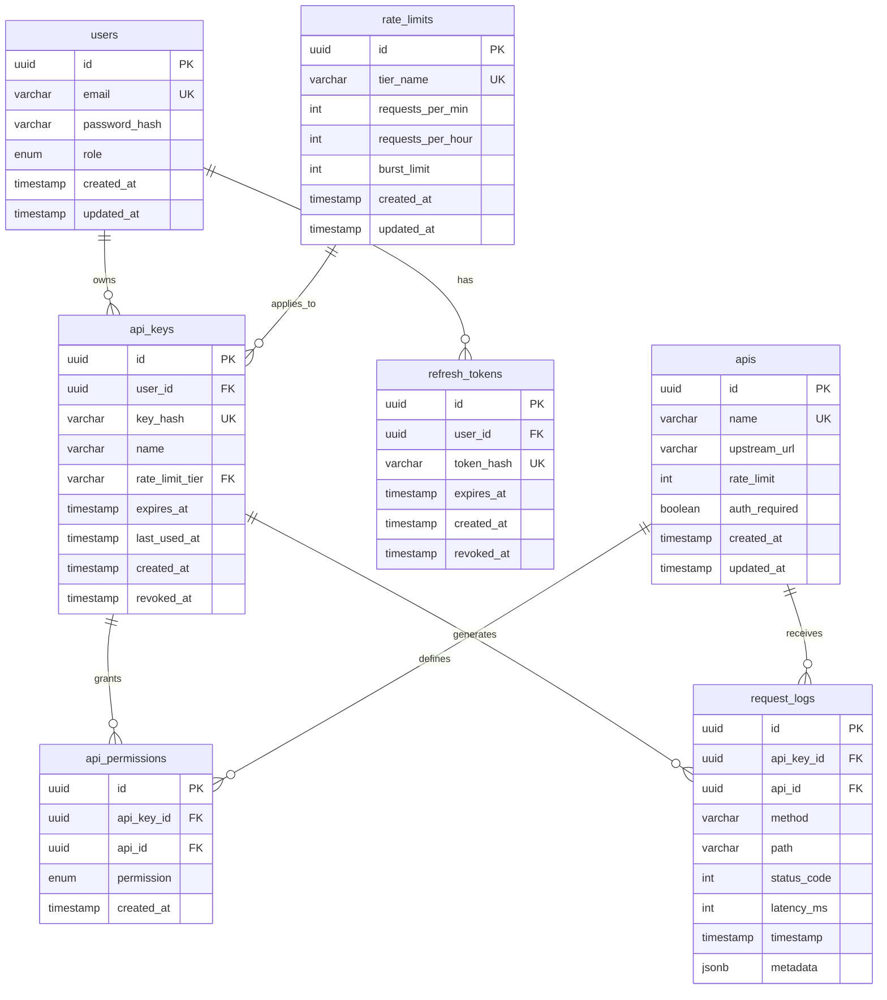
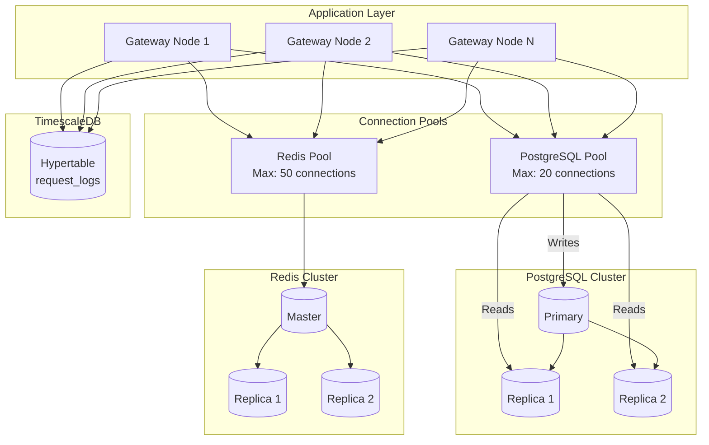
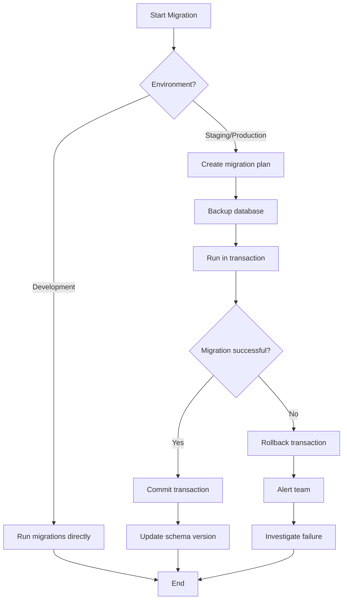

# DataHub API Gateway - Database Architecture

## Overview

DataHub uses PostgreSQL 15 as its primary database, Redis 7 for caching and rate limiting, and TimescaleDB for time-series analytics data. This document details the database schema, relationships, and data access patterns.

---

## Entity Relationship Diagram

### ASCII ERD

```
┌─────────────────────────────────────────────────────────────────────────────────┐
│                            DataHub Database Schema                               │
└─────────────────────────────────────────────────────────────────────────────────┘

    ┌──────────────────────┐           ┌──────────────────────┐
    │        users         │           │         apis         │
    ├──────────────────────┤           ├──────────────────────┤
    │ PK id (UUID)         │           │ PK id (UUID)         │
    │    email (VARCHAR)   │           │    name (VARCHAR)    │
    │    password_hash     │           │    upstream_url      │
    │    role (ENUM)       │           │    rate_limit (INT)  │
    │    created_at        │           │    auth_required     │
    │    updated_at        │           │    created_at        │
    └──────────┬───────────┘           │    updated_at        │
               │                       └──────────┬───────────┘
               │ 1                                │ 1
               │                                  │
               │                                  │
               │ N                                │ N
    ┌──────────▼───────────┐           ┌─────────▼────────────┐
    │      api_keys        │           │   api_permissions    │
    ├──────────────────────┤           ├──────────────────────┤
    │ PK id (UUID)         │           │ PK id (UUID)         │
    │ FK user_id           │◄──────────┤ FK api_key_id        │
    │    key_hash          │           │ FK api_id            │
    │    name (VARCHAR)    │           │    permission (ENUM) │
    │    rate_limit_tier   │           │    created_at        │
    │    expires_at        │           └──────────────────────┘
    │    last_used_at      │
    │    created_at        │
    │    revoked_at        │
    └──────────┬───────────┘
               │ 1
               │
               │ N
    ┌──────────▼───────────┐
    │    request_logs      │
    ├──────────────────────┤
    │ PK id (UUID)         │
    │ FK api_key_id        │
    │ FK api_id            │
    │    method (VARCHAR)  │
    │    path (VARCHAR)    │
    │    status_code (INT) │
    │    latency_ms (INT)  │
    │    timestamp         │
    │    metadata (JSONB)  │
    └──────────────────────┘
    (TimescaleDB Hypertable)


    ┌──────────────────────┐
    │    rate_limits       │
    ├──────────────────────┤
    │ PK id (UUID)         │
    │    tier_name         │
    │    requests_per_min  │
    │    requests_per_hour │
    │    burst_limit       │
    │    created_at        │
    │    updated_at        │
    └──────────────────────┘


    ┌──────────────────────┐
    │   refresh_tokens     │
    ├──────────────────────┤
    │ PK id (UUID)         │
    │ FK user_id           │
    │    token_hash        │
    │    expires_at        │
    │    created_at        │
    │    revoked_at        │
    └──────────────────────┘
```

### Mermaid ERD



---

## Table Definitions

### Users Table

```sql
CREATE TABLE users (
    id UUID PRIMARY KEY DEFAULT gen_random_uuid(),
    email VARCHAR(255) NOT NULL UNIQUE,
    password_hash VARCHAR(255) NOT NULL,
    role VARCHAR(20) NOT NULL DEFAULT 'developer'
        CHECK (role IN ('admin', 'developer', 'viewer')),
    created_at TIMESTAMP WITH TIME ZONE DEFAULT CURRENT_TIMESTAMP,
    updated_at TIMESTAMP WITH TIME ZONE DEFAULT CURRENT_TIMESTAMP
);

CREATE INDEX idx_users_email ON users(email);
CREATE INDEX idx_users_role ON users(role);

-- Trigger for updated_at
CREATE TRIGGER update_users_updated_at
    BEFORE UPDATE ON users
    FOR EACH ROW
    EXECUTE FUNCTION update_updated_at_column();
```

### API Keys Table

```sql
CREATE TABLE api_keys (
    id UUID PRIMARY KEY DEFAULT gen_random_uuid(),
    user_id UUID NOT NULL REFERENCES users(id) ON DELETE CASCADE,
    key_hash VARCHAR(255) NOT NULL UNIQUE,
    name VARCHAR(100) NOT NULL,
    rate_limit_tier VARCHAR(50) DEFAULT 'standard'
        REFERENCES rate_limits(tier_name),
    expires_at TIMESTAMP WITH TIME ZONE,
    last_used_at TIMESTAMP WITH TIME ZONE,
    created_at TIMESTAMP WITH TIME ZONE DEFAULT CURRENT_TIMESTAMP,
    revoked_at TIMESTAMP WITH TIME ZONE,

    CONSTRAINT valid_expiry CHECK (expires_at IS NULL OR expires_at > created_at)
);

CREATE INDEX idx_api_keys_user_id ON api_keys(user_id);
CREATE INDEX idx_api_keys_key_hash ON api_keys(key_hash);
CREATE INDEX idx_api_keys_active ON api_keys(id)
    WHERE revoked_at IS NULL AND (expires_at IS NULL OR expires_at > CURRENT_TIMESTAMP);
```

### APIs Table

```sql
CREATE TABLE apis (
    id UUID PRIMARY KEY DEFAULT gen_random_uuid(),
    name VARCHAR(100) NOT NULL UNIQUE,
    upstream_url VARCHAR(500) NOT NULL,
    rate_limit INTEGER NOT NULL DEFAULT 1000,
    auth_required BOOLEAN NOT NULL DEFAULT true,
    created_at TIMESTAMP WITH TIME ZONE DEFAULT CURRENT_TIMESTAMP,
    updated_at TIMESTAMP WITH TIME ZONE DEFAULT CURRENT_TIMESTAMP
);

CREATE INDEX idx_apis_name ON apis(name);
```

### API Permissions Table

```sql
CREATE TABLE api_permissions (
    id UUID PRIMARY KEY DEFAULT gen_random_uuid(),
    api_key_id UUID NOT NULL REFERENCES api_keys(id) ON DELETE CASCADE,
    api_id UUID NOT NULL REFERENCES apis(id) ON DELETE CASCADE,
    permission VARCHAR(20) NOT NULL
        CHECK (permission IN ('read', 'write', 'admin')),
    created_at TIMESTAMP WITH TIME ZONE DEFAULT CURRENT_TIMESTAMP,

    UNIQUE(api_key_id, api_id)
);

CREATE INDEX idx_api_permissions_key ON api_permissions(api_key_id);
CREATE INDEX idx_api_permissions_api ON api_permissions(api_id);
```

### Request Logs Table (TimescaleDB)

```sql
-- Enable TimescaleDB extension
CREATE EXTENSION IF NOT EXISTS timescaledb;

CREATE TABLE request_logs (
    id UUID DEFAULT gen_random_uuid(),
    api_key_id UUID REFERENCES api_keys(id),
    api_id UUID REFERENCES apis(id),
    method VARCHAR(10) NOT NULL,
    path VARCHAR(500) NOT NULL,
    status_code INTEGER NOT NULL,
    latency_ms INTEGER NOT NULL,
    timestamp TIMESTAMP WITH TIME ZONE NOT NULL DEFAULT CURRENT_TIMESTAMP,
    metadata JSONB,

    PRIMARY KEY (id, timestamp)
);

-- Convert to hypertable for time-series optimization
SELECT create_hypertable('request_logs', 'timestamp');

-- Create indexes for common queries
CREATE INDEX idx_request_logs_api_key ON request_logs(api_key_id, timestamp DESC);
CREATE INDEX idx_request_logs_api ON request_logs(api_id, timestamp DESC);
CREATE INDEX idx_request_logs_status ON request_logs(status_code, timestamp DESC);

-- Retention policy: keep 90 days of data
SELECT add_retention_policy('request_logs', INTERVAL '90 days');

-- Compression policy for older data
SELECT add_compression_policy('request_logs', INTERVAL '7 days');
```

### Rate Limits Table

```sql
CREATE TABLE rate_limits (
    id UUID PRIMARY KEY DEFAULT gen_random_uuid(),
    tier_name VARCHAR(50) NOT NULL UNIQUE,
    requests_per_min INTEGER NOT NULL,
    requests_per_hour INTEGER NOT NULL,
    burst_limit INTEGER NOT NULL,
    created_at TIMESTAMP WITH TIME ZONE DEFAULT CURRENT_TIMESTAMP,
    updated_at TIMESTAMP WITH TIME ZONE DEFAULT CURRENT_TIMESTAMP
);

-- Default rate limit tiers
INSERT INTO rate_limits (tier_name, requests_per_min, requests_per_hour, burst_limit) VALUES
    ('free', 60, 1000, 10),
    ('standard', 300, 10000, 50),
    ('premium', 1000, 50000, 100),
    ('enterprise', 5000, 200000, 500);
```

### Refresh Tokens Table

```sql
CREATE TABLE refresh_tokens (
    id UUID PRIMARY KEY DEFAULT gen_random_uuid(),
    user_id UUID NOT NULL REFERENCES users(id) ON DELETE CASCADE,
    token_hash VARCHAR(255) NOT NULL UNIQUE,
    expires_at TIMESTAMP WITH TIME ZONE NOT NULL,
    created_at TIMESTAMP WITH TIME ZONE DEFAULT CURRENT_TIMESTAMP,
    revoked_at TIMESTAMP WITH TIME ZONE
);

CREATE INDEX idx_refresh_tokens_user ON refresh_tokens(user_id);
CREATE INDEX idx_refresh_tokens_hash ON refresh_tokens(token_hash);
CREATE INDEX idx_refresh_tokens_active ON refresh_tokens(id)
    WHERE revoked_at IS NULL AND expires_at > CURRENT_TIMESTAMP;
```

---

## Database Architecture Diagram

### ASCII Storage Architecture

```
┌─────────────────────────────────────────────────────────────────────────────┐
│                          Database Architecture                               │
└─────────────────────────────────────────────────────────────────────────────┘

┌─────────────────────────────────────────────────────────────────────────────┐
│                              Application Layer                               │
│                                                                              │
│    ┌──────────────┐    ┌──────────────┐    ┌──────────────┐                │
│    │   Gateway    │    │   Gateway    │    │   Gateway    │                │
│    │   Node 1     │    │   Node 2     │    │   Node N     │                │
│    └──────┬───────┘    └──────┬───────┘    └──────┬───────┘                │
│           │                   │                   │                         │
└───────────┼───────────────────┼───────────────────┼─────────────────────────┘
            │                   │                   │
            └───────────────────┼───────────────────┘
                                │
                    ┌───────────┴───────────┐
                    │                       │
                    ▼                       ▼
┌───────────────────────────┐   ┌───────────────────────────┐
│      Connection Pool      │   │        Redis Pool         │
│      (pg-pool: 20)        │   │       (ioredis)           │
└───────────┬───────────────┘   └───────────┬───────────────┘
            │                               │
            ▼                               ▼
┌───────────────────────────┐   ┌───────────────────────────┐
│        PostgreSQL         │   │          Redis            │
│                           │   │                           │
│  ┌─────────────────────┐  │   │  ┌─────────────────────┐  │
│  │      Primary        │  │   │  │      Master         │  │
│  │                     │  │   │  │                     │  │
│  │  • users            │  │   │  │  • session:*        │  │
│  │  • api_keys         │  │   │  │  • ratelimit:*      │  │
│  │  • apis             │  │   │  │  • apikey:*         │  │
│  │  • api_permissions  │  │   │  │  • token:*          │  │
│  │  • rate_limits      │  │   │  │                     │  │
│  │  • refresh_tokens   │  │   │  └─────────────────────┘  │
│  └──────────┬──────────┘  │   │             │             │
│             │             │   │      ┌──────┴──────┐      │
│      ┌──────┴──────┐      │   │      ▼            ▼      │
│      ▼            ▼      │   │  ┌────────┐  ┌────────┐  │
│  ┌────────┐  ┌────────┐  │   │  │Replica1│  │Replica2│  │
│  │Replica1│  │Replica2│  │   │  └────────┘  └────────┘  │
│  └────────┘  └────────┘  │   │                           │
│                           │   └───────────────────────────┘
└───────────────────────────┘

┌───────────────────────────┐
│       TimescaleDB         │
│                           │
│  ┌─────────────────────┐  │
│  │    request_logs     │  │
│  │   (Hypertable)      │  │
│  │                     │  │
│  │  Partitioned by:    │  │
│  │  • timestamp        │  │
│  │                     │  │
│  │  Chunk interval:    │  │
│  │  • 1 day            │  │
│  │                     │  │
│  │  Retention:         │  │
│  │  • 90 days          │  │
│  └─────────────────────┘  │
│                           │
└───────────────────────────┘
```

### Mermaid Database Flow



---

## Redis Data Structures

### Key Patterns

| Key Pattern | Data Type | TTL | Purpose |
|-------------|-----------|-----|---------|
| `session:{userId}` | Hash | 24h | User session data |
| `ratelimit:{keyId}:{window}` | String | 1-60min | Rate limit counter |
| `apikey:{keyHash}` | Hash | 15min | Cached API key data |
| `token:blacklist:{tokenId}` | String | 24h | Revoked JWT tokens |
| `user:{userId}` | Hash | 30min | Cached user data |

### Rate Limiting in Redis

```
┌─────────────────────────────────────────────────────────────┐
│              Redis Rate Limiting - Sliding Window            │
└─────────────────────────────────────────────────────────────┘

Key: ratelimit:{api_key_id}:{minute_bucket}

Example for API Key "abc123" at 10:45:30:
┌─────────────────────────────────────────────────────────────┐
│  ratelimit:abc123:202501291045 = 45 (requests in minute)    │
│  TTL: 120 seconds                                           │
└─────────────────────────────────────────────────────────────┘

Sliding Window Algorithm:
┌───────────────────────────────────────────────────────────────────────┐
│                                                                        │
│  Current Time: 10:45:30                                               │
│  Window: 60 seconds                                                   │
│                                                                        │
│  ├────────────────────────────────────────────────────────────────┤   │
│  │                        Sliding Window                          │   │
│  │  ◄──────────────────── 60 seconds ────────────────────────►   │   │
│  │                                                                 │   │
│  │  10:44:00        10:44:30        10:45:00        10:45:30     │   │
│  │     │               │               │               │          │   │
│  │     ▼               ▼               ▼               ▼          │   │
│  │  ┌──────┐       ┌──────┐       ┌──────┐       ┌──────┐        │   │
│  │  │ 50%  │       │ 100% │       │ 100% │       │ 50%  │        │   │
│  │  │weight│       │weight│       │weight│       │weight│        │   │
│  │  └──────┘       └──────┘       └──────┘       └──────┘        │   │
│  │                                                                 │   │
│  └─────────────────────────────────────────────────────────────────┘   │
│                                                                        │
│  Formula: (prev_count * overlap_ratio) + current_count                │
│  Result:  (45 * 0.5) + 30 = 52.5 requests in window                  │
│                                                                        │
└───────────────────────────────────────────────────────────────────────┘
```

---

## Query Patterns

### Common Queries

```sql
-- Get active API key by hash (with caching)
SELECT ak.*, u.email as user_email, u.role as user_role
FROM api_keys ak
JOIN users u ON ak.user_id = u.id
WHERE ak.key_hash = $1
  AND ak.revoked_at IS NULL
  AND (ak.expires_at IS NULL OR ak.expires_at > CURRENT_TIMESTAMP);

-- Get API key permissions
SELECT ap.permission, a.name as api_name, a.upstream_url
FROM api_permissions ap
JOIN apis a ON ap.api_id = a.id
WHERE ap.api_key_id = $1;

-- Analytics: Requests per hour (last 24h)
SELECT
    time_bucket('1 hour', timestamp) AS hour,
    COUNT(*) as request_count,
    AVG(latency_ms) as avg_latency,
    COUNT(*) FILTER (WHERE status_code >= 500) as error_count
FROM request_logs
WHERE timestamp > NOW() - INTERVAL '24 hours'
  AND api_key_id = $1
GROUP BY hour
ORDER BY hour DESC;

-- Top APIs by traffic
SELECT
    a.name,
    COUNT(*) as total_requests,
    AVG(rl.latency_ms) as avg_latency,
    ROUND(COUNT(*) FILTER (WHERE rl.status_code >= 400)::numeric / COUNT(*) * 100, 2) as error_rate
FROM request_logs rl
JOIN apis a ON rl.api_id = a.id
WHERE rl.timestamp > NOW() - INTERVAL '7 days'
GROUP BY a.id, a.name
ORDER BY total_requests DESC
LIMIT 10;
```

---

## Migration Strategy

### Mermaid Migration Flow



---

## Backup and Recovery

```
┌─────────────────────────────────────────────────────────────┐
│                    Backup Strategy                           │
└─────────────────────────────────────────────────────────────┘

┌─────────────────────────────────────────────────────────────┐
│  Full Backup (Weekly)                                        │
│  ─────────────────────                                       │
│  • pg_dump with compression                                  │
│  • Stored in S3 with versioning                             │
│  • Retention: 4 weeks                                        │
└─────────────────────────────────────────────────────────────┘
                              │
                              ▼
┌─────────────────────────────────────────────────────────────┐
│  Incremental Backup (Daily)                                  │
│  ─────────────────────────                                   │
│  • WAL archiving to S3                                       │
│  • Point-in-time recovery enabled                           │
│  • Retention: 7 days                                         │
└─────────────────────────────────────────────────────────────┘
                              │
                              ▼
┌─────────────────────────────────────────────────────────────┐
│  Continuous Replication                                      │
│  ───────────────────────                                     │
│  • Streaming replication to replicas                        │
│  • Automatic failover with pg_auto_failover                 │
│  • RPO: ~0 seconds, RTO: < 30 seconds                       │
└─────────────────────────────────────────────────────────────┘
```

---

## Related Documentation

- [System Overview](./overview.md) - High-level architecture
- [Backend Architecture](./backend.md) - Application layer details
- [Data Flow](../flows/data-flow.md) - How data moves through the system
- [Test Data](../testing/test-data.md) - Test data and fixtures
