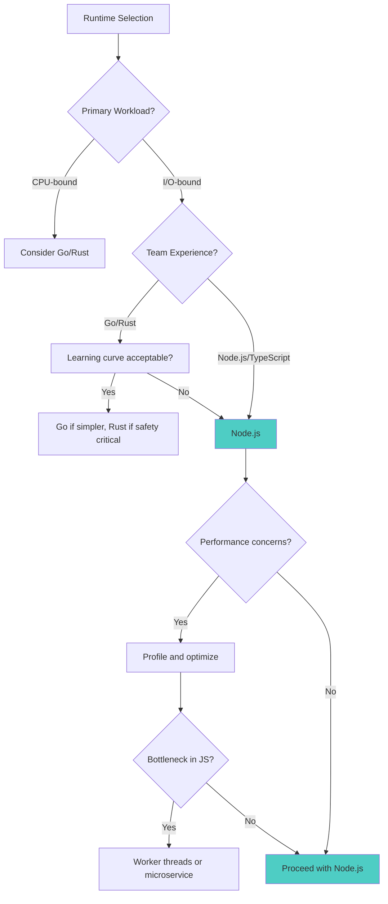
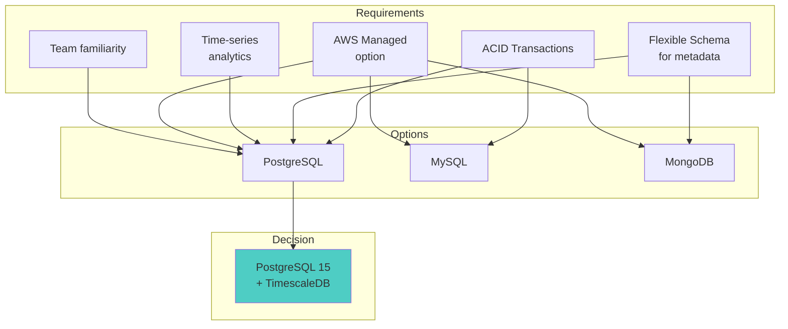
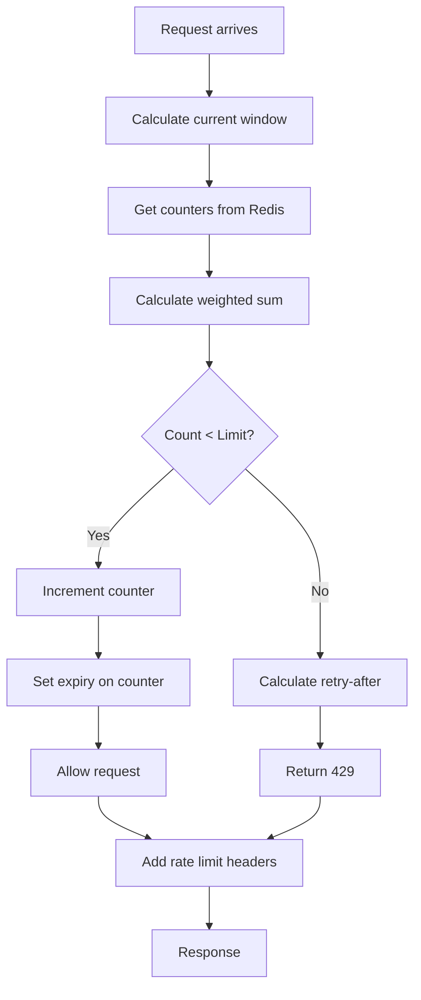
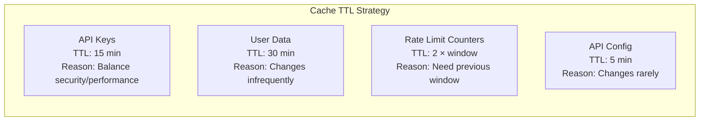

# DataHub API Gateway - Technical Deep Dive

## Overview

This document explores the technical decisions, trade-offs, and implementation details behind DataHub API Gateway. It serves as a reference for understanding why certain architectural choices were made.

---

## Key Technical Decisions

### Decision Matrix

```
┌─────────────────────────────────────────────────────────────────────────────┐
│                      Technical Decision Summary                              │
└─────────────────────────────────────────────────────────────────────────────┘

    ┌────────────────────┬─────────────────────┬─────────────────────────────┐
    │     Decision       │      Chosen         │         Rationale           │
    ├────────────────────┼─────────────────────┼─────────────────────────────┤
    │ Runtime            │ Node.js 20 LTS      │ Async I/O, ecosystem, team  │
    │ Language           │ TypeScript 5.x      │ Type safety, maintainability│
    │ Framework          │ Express.js          │ Maturity, middleware support│
    │ Primary DB         │ PostgreSQL 15       │ ACID, JSON support, scale   │
    │ Cache              │ Redis 7             │ Performance, data structures│
    │ Analytics DB       │ TimescaleDB         │ Time-series optimization    │
    │ Container          │ Docker              │ Industry standard, portable │
    │ Orchestration      │ ECS Fargate         │ Serverless, AWS integration │
    │ Auth               │ JWT + API Keys      │ Flexibility, standards      │
    │ Rate Limiting      │ Sliding Window      │ Accuracy, fairness          │
    └────────────────────┴─────────────────────┴─────────────────────────────┘
```

---

## Runtime: Node.js 20 LTS

### Why Node.js?

```
┌─────────────────────────────────────────────────────────────────────────────┐
│                      Node.js Decision Analysis                               │
└─────────────────────────────────────────────────────────────────────────────┘

    Alternatives Considered:
    ════════════════════════

    ┌───────────────┐   ┌───────────────┐   ┌───────────────┐
    │    Go         │   │    Rust       │   │   Node.js     │
    │               │   │               │   │   (Chosen)    │
    ├───────────────┤   ├───────────────┤   ├───────────────┤
    │ + Performance │   │ + Performance │   │ + Async I/O   │
    │ + Concurrency │   │ + Safety      │   │ + Ecosystem   │
    │ + Single bin  │   │ + Low memory  │   │ + Team skill  │
    │               │   │               │   │ + Rapid dev   │
    │ - Verbose     │   │ - Learning    │   │               │
    │ - Smaller     │   │   curve       │   │ - CPU-bound   │
    │   ecosystem   │   │ - Slower dev  │   │   tasks       │
    └───────────────┘   └───────────────┘   └───────────────┘

    Final Decision: Node.js 20 LTS
    ═══════════════════════════════

    Primary Factors:
    ────────────────
    1. Team Expertise: Existing Node.js/TypeScript knowledge
    2. Development Speed: Faster iteration for MVP
    3. I/O Pattern: API gateway is I/O-bound, not CPU-bound
    4. Ecosystem: Rich middleware ecosystem for API concerns
    5. Hiring: Larger talent pool for Node.js developers

    Mitigations for Weaknesses:
    ───────────────────────────
    • CPU-bound tasks: Offload to worker threads or separate service
    • Single-threaded: Use cluster mode or container scaling
    • Memory: Monitor and tune, use streaming for large payloads
```

### Mermaid Decision Tree



---

## Framework: Express.js vs Fastify

### Performance Comparison

```
┌─────────────────────────────────────────────────────────────────────────────┐
│                    Framework Benchmark Comparison                            │
└─────────────────────────────────────────────────────────────────────────────┘

    Requests/second (Hello World benchmark):

    Fastify    ████████████████████████████████████████ 40,000 req/s
    Express    ██████████████████████████ 26,000 req/s
    Koa        ████████████████████████████ 28,000 req/s

    Memory Usage (idle):

    Fastify    ████████ 45 MB
    Express    ██████████ 52 MB
    Koa        ████████ 48 MB

    Decision: Express.js
    ═════════════════════

    Reasoning:
    ──────────
    1. Maturity: 10+ years of production use
    2. Middleware Ecosystem: Largest selection of middleware
    3. Team Familiarity: Most developers know Express
    4. Documentation: Extensive documentation and tutorials
    5. Performance: Adequate for our scale (10K req/s target)

    Trade-off Accepted:
    ───────────────────
    • ~35% lower raw throughput than Fastify
    • Mitigation: Horizontal scaling handles load increase
    • Future Option: Migrate to Fastify if needed (similar API)
```

---

## Database: PostgreSQL 15

### Why PostgreSQL Over Alternatives?

```
┌─────────────────────────────────────────────────────────────────────────────┐
│                      Database Selection Analysis                             │
└─────────────────────────────────────────────────────────────────────────────┘

    Alternatives Evaluated:
    ═══════════════════════

    ┌─────────────────┬─────────────────┬─────────────────┬─────────────────┐
    │    Criteria     │   PostgreSQL    │     MySQL       │    MongoDB      │
    ├─────────────────┼─────────────────┼─────────────────┼─────────────────┤
    │ ACID Compliance │       ✓         │       ✓         │   Partial       │
    │ JSON Support    │    Excellent    │     Good        │    Native       │
    │ Full-text Search│       ✓         │       ✓         │       ✓         │
    │ Partitioning    │       ✓         │       ✓         │   Sharding      │
    │ Extensions      │   TimescaleDB   │     Limited     │      N/A        │
    │ AWS Managed     │      RDS        │      RDS        │   DocumentDB    │
    │ Team Experience │      High       │     Medium      │     Medium      │
    └─────────────────┴─────────────────┴─────────────────┴─────────────────┘

    PostgreSQL Advantages for DataHub:
    ═══════════════════════════════════

    1. JSONB for Metadata
       ──────────────────
       request_logs.metadata uses JSONB for flexible schema:
       • Index on specific JSON paths
       • Query JSON fields with SQL
       • Schema evolution without migrations

    2. TimescaleDB Extension
       ─────────────────────
       Enables time-series analytics without separate database:
       • Automatic partitioning by time
       • Continuous aggregates
       • Compression for old data
       • Retention policies

    3. Advanced Indexing
       ─────────────────
       • Partial indexes for active records
       • GIN indexes for array/JSON columns
       • BRIN indexes for time-series data
```

### Mermaid Database Decision



---

## Rate Limiting: Algorithm Deep Dive

### Sliding Window vs Alternatives

```
┌─────────────────────────────────────────────────────────────────────────────┐
│                    Rate Limiting Algorithm Comparison                        │
└─────────────────────────────────────────────────────────────────────────────┘

    1. Fixed Window
       ═════════════

       Window: |─────────────────────────|─────────────────────────|
       Time:   0                        60                       120

       Problem: Burst at window boundary
       ┌──────────────────────────────────────────────────────────┐
       │                                                          │
       │  Request Pattern:            │  100 requests │ 100 requests │
       │                              ▼               ▼              │
       │  Window 1   ─────────────────█               │              │
       │  Window 2                    │               █─────────────  │
       │                              │               │              │
       │  Result: 200 requests in 2 seconds (at boundary)           │
       │                                                          │
       └──────────────────────────────────────────────────────────┘


    2. Sliding Window Log
       ═══════════════════

       Stores: Timestamp of every request

       ┌──────────────────────────────────────────────────────────┐
       │  Redis Key: ratelimit:user123:log                        │
       │  Type: Sorted Set                                        │
       │  Data: [ts1, ts2, ts3, ts4, ...]                        │
       │                                                          │
       │  Operation: ZRANGEBYSCORE, ZCARD, ZADD                   │
       │                                                          │
       │  Problem: Memory grows with request volume              │
       │           O(N) storage per user                         │
       └──────────────────────────────────────────────────────────┘


    3. Sliding Window Counter (Chosen)
       ═════════════════════════════════

       Combines fixed window efficiency with sliding window accuracy

       ┌──────────────────────────────────────────────────────────┐
       │                                                          │
       │  Time: 10:45:30 (30 seconds into current minute)        │
       │                                                          │
       │  Previous window (10:44): 45 requests                   │
       │  Current window (10:45):  30 requests                   │
       │                                                          │
       │  Sliding count = (45 × 0.5) + 30 = 52.5 requests        │
       │                   └─────┬─────┘                          │
       │                 Weight: 50% (30s remaining of prev)     │
       │                                                          │
       │  Storage: O(2) per user (just two counters)             │
       │  Accuracy: ~0.003% error rate                           │
       │                                                          │
       └──────────────────────────────────────────────────────────┘
```

### Implementation Details

```typescript
// Sliding Window Counter Implementation

async function checkRateLimit(
  keyId: string,
  limit: number,
  windowMs: number = 60000
): Promise<{ allowed: boolean; remaining: number; resetAt: number }> {
  const now = Date.now();
  const currentWindow = Math.floor(now / windowMs);
  const previousWindow = currentWindow - 1;
  const windowPosition = (now % windowMs) / windowMs;

  const keys = {
    current: `ratelimit:${keyId}:${currentWindow}`,
    previous: `ratelimit:${keyId}:${previousWindow}`
  };

  // Atomic operation using Lua script
  const luaScript = `
    local current = tonumber(redis.call('GET', KEYS[1])) or 0
    local previous = tonumber(redis.call('GET', KEYS[2])) or 0
    local weight = tonumber(ARGV[1])
    local limit = tonumber(ARGV[2])
    local windowMs = tonumber(ARGV[3])

    local count = math.floor(previous * weight) + current

    if count >= limit then
      return {0, limit - count, 0}
    end

    redis.call('INCR', KEYS[1])
    redis.call('PEXPIRE', KEYS[1], windowMs * 2)

    return {1, limit - count - 1, 1}
  `;

  const result = await redis.eval(
    luaScript,
    2,
    keys.current,
    keys.previous,
    1 - windowPosition,
    limit,
    windowMs
  );

  return {
    allowed: result[0] === 1,
    remaining: Math.max(0, result[1]),
    resetAt: (currentWindow + 1) * windowMs
  };
}
```

### Mermaid Rate Limit Flow



---

## Authentication: JWT vs Sessions

### Comparison

```
┌─────────────────────────────────────────────────────────────────────────────┐
│                    Authentication Strategy Comparison                        │
└─────────────────────────────────────────────────────────────────────────────┘

    ┌─────────────────────┬──────────────────────┬──────────────────────┐
    │     Criteria        │        JWT           │      Sessions        │
    ├─────────────────────┼──────────────────────┼──────────────────────┤
    │ Stateless           │          ✓           │          ✗          │
    │ Scalability         │       Excellent      │   Requires sticky    │
    │                     │                      │   sessions or store  │
    │ Revocation          │       Difficult      │        Easy          │
    │ Payload size        │       Larger         │       Smaller        │
    │ Server storage      │        None          │      Required        │
    │ Cross-domain        │       Natural        │   Requires config    │
    └─────────────────────┴──────────────────────┴──────────────────────┘

    Hybrid Approach (Chosen):
    ═════════════════════════

    ┌─────────────────────────────────────────────────────────────┐
    │                                                             │
    │  User Authentication: JWT                                   │
    │  ─────────────────────────                                  │
    │  • Short-lived access tokens (15 min)                      │
    │  • Long-lived refresh tokens (7 days, stored in DB)        │
    │  • Token blacklist in Redis for immediate revocation       │
    │                                                             │
    │  Service Authentication: API Keys                          │
    │  ────────────────────────────────                          │
    │  • SHA-256 hashed, stored in DB                            │
    │  • Cached in Redis for fast lookup                         │
    │  • Simpler for programmatic access                         │
    │                                                             │
    └─────────────────────────────────────────────────────────────┘
```

---

## Caching Strategy: Cache-Aside Pattern

### Pattern Implementation

```
┌─────────────────────────────────────────────────────────────────────────────┐
│                        Cache-Aside Pattern Flow                              │
└─────────────────────────────────────────────────────────────────────────────┘

    Read Path:
    ══════════

    ┌─────────┐      1. Check Cache       ┌─────────┐
    │         │ ─────────────────────────► │  Redis  │
    │   App   │                           │  Cache  │
    │         │ ◄───────────────────────── │         │
    └────┬────┘      2a. Cache Hit         └─────────┘
         │               (return)
         │
         │ 2b. Cache Miss
         │
         ▼
    ┌─────────┐      3. Query DB          ┌─────────┐
    │   App   │ ─────────────────────────► │ Postgres│
    │         │                           │         │
    │         │ ◄───────────────────────── │         │
    └────┬────┘      4. Return data       └─────────┘
         │
         │ 5. Populate cache
         │
         ▼
    ┌─────────┐
    │  Redis  │
    │  Cache  │
    └─────────┘


    Write Path (Cache Invalidation):
    ══════════════════════════════════

    ┌─────────┐      1. Write to DB       ┌─────────┐
    │         │ ─────────────────────────► │ Postgres│
    │   App   │                           │         │
    │         │ ◄───────────────────────── │         │
    └────┬────┘      2. Confirm           └─────────┘
         │
         │ 3. Invalidate cache
         │
         ▼
    ┌─────────┐
    │  Redis  │
    │  DEL    │
    └─────────┘
```

### Cache Timing Strategy



---

## Error Handling Philosophy

### Error Categories

```
┌─────────────────────────────────────────────────────────────────────────────┐
│                        Error Handling Strategy                               │
└─────────────────────────────────────────────────────────────────────────────┘

    Error Categories:
    ═════════════════

    1. Operational Errors (Expected)
       ─────────────────────────────
       • Validation failures
       • Authentication errors
       • Rate limit exceeded
       • Resource not found

       Response: Structured error with helpful message
       Logging: Info level, no stack trace
       Recovery: Return error to client


    2. Programmer Errors (Bugs)
       ────────────────────────
       • TypeError, ReferenceError
       • Assertion failures
       • Invalid state

       Response: Generic 500 error
       Logging: Error level with stack trace
       Recovery: Log, alert, possibly restart


    3. System Errors (Infrastructure)
       ──────────────────────────────
       • Database connection failed
       • Redis timeout
       • Out of memory

       Response: 503 Service Unavailable
       Logging: Error level with context
       Recovery: Circuit breaker, retry with backoff
```

### Error Response Format

```typescript
// Consistent error response structure
interface ErrorResponse {
  success: false;
  error: {
    code: string;           // Machine-readable: 'RATE_LIMIT_EXCEEDED'
    message: string;        // Human-readable: 'Too many requests'
    details?: {             // Optional additional context
      retryAfter?: number;
      limit?: number;
      field?: string;
    };
    requestId: string;      // For support/debugging
  };
}

// Example responses:

// 400 Validation Error
{
  "success": false,
  "error": {
    "code": "VALIDATION_ERROR",
    "message": "Invalid request body",
    "details": {
      "field": "email",
      "reason": "Must be a valid email address"
    },
    "requestId": "req_abc123"
  }
}

// 429 Rate Limited
{
  "success": false,
  "error": {
    "code": "RATE_LIMIT_EXCEEDED",
    "message": "Too many requests. Please retry after 30 seconds.",
    "details": {
      "retryAfter": 30,
      "limit": 1000,
      "remaining": 0
    },
    "requestId": "req_def456"
  }
}
```

---

## Trade-offs Summary

| Decision | Trade-off Accepted | Mitigation |
|----------|-------------------|------------|
| Node.js | Lower raw performance vs Go | Horizontal scaling |
| Express | Slower than Fastify | Adequate for scale |
| PostgreSQL | Not horizontally scalable | Read replicas, caching |
| JWT | Hard to revoke | Short TTL, blacklist |
| Sliding Window | Slightly more complex | Pre-built library |
| Redis | Single point of failure | Cluster mode |
| AWS ECS | Vendor lock-in | Standard containers |

---

## Related Documentation

- [System Overview](./overview.md) - High-level architecture
- [Backend Architecture](./backend.md) - Implementation details
- [Database Design](./database.md) - Schema and queries
- [Security Architecture](./security.md) - Security decisions
