# DataHub API Gateway - Diagram Collection

## Overview

This document consolidates all Mermaid diagrams used throughout the DataHub documentation. These diagrams are rendered by the AutoSpec Viewer for visual presentation.

---

## System Architecture Diagrams

### High-Level System Architecture

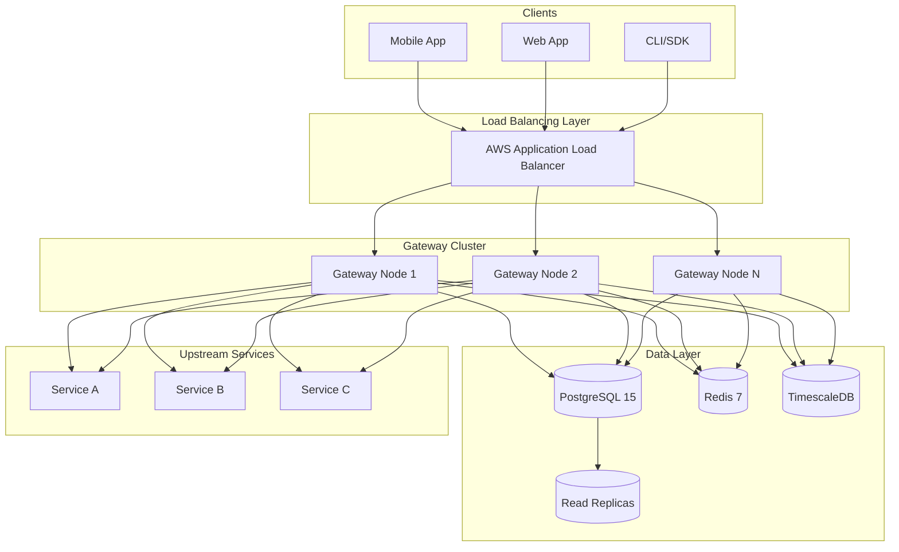

### Cache Strategy Flowchart

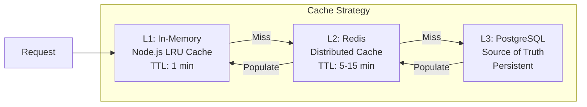

### Scaling Architecture

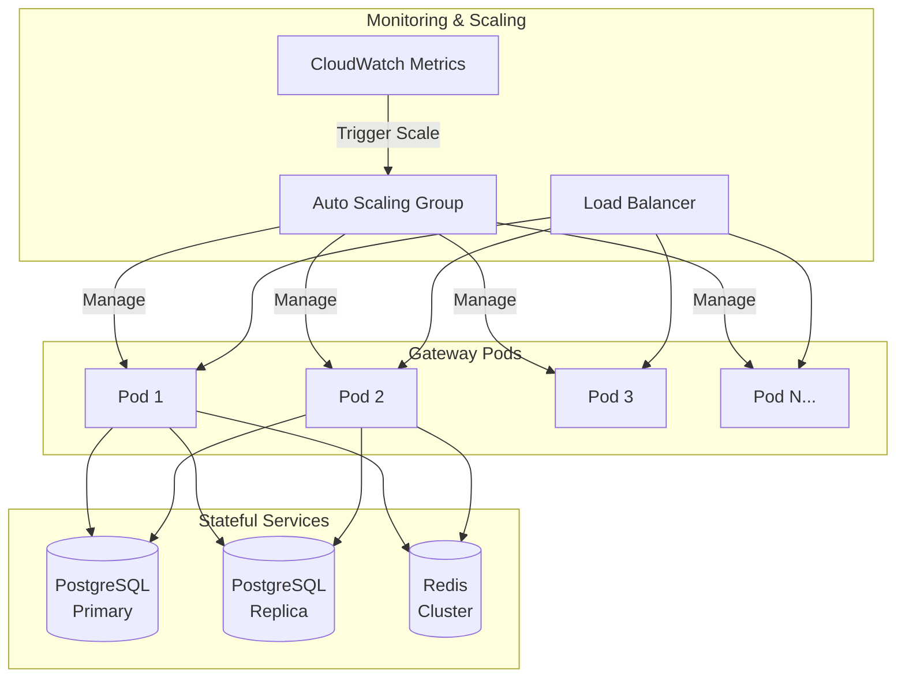

---

## Backend Architecture Diagrams

### Layer Flow Diagram

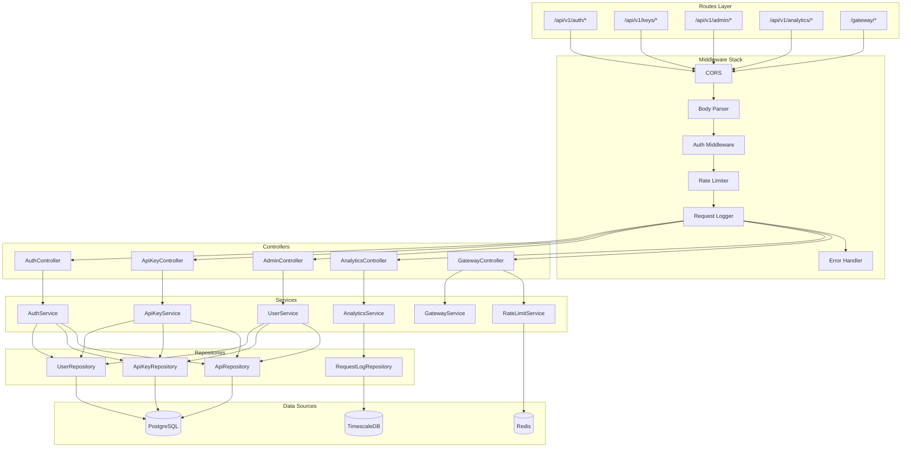

### Middleware Pipeline Sequence

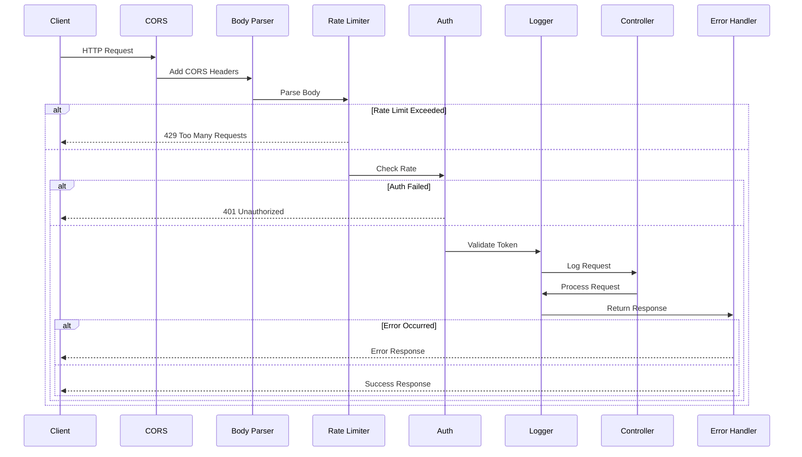

### Error Handler Flow

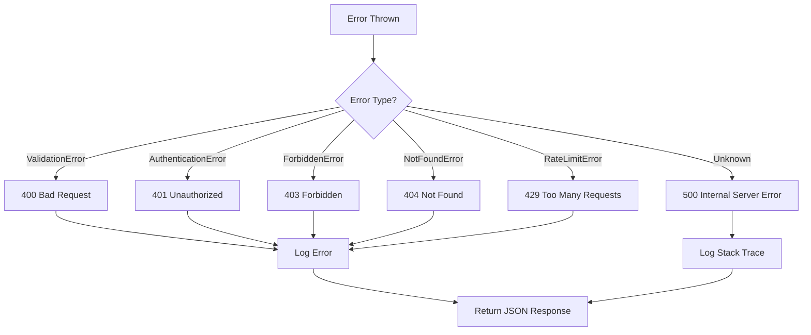

---

## Database Diagrams

### Entity Relationship Diagram

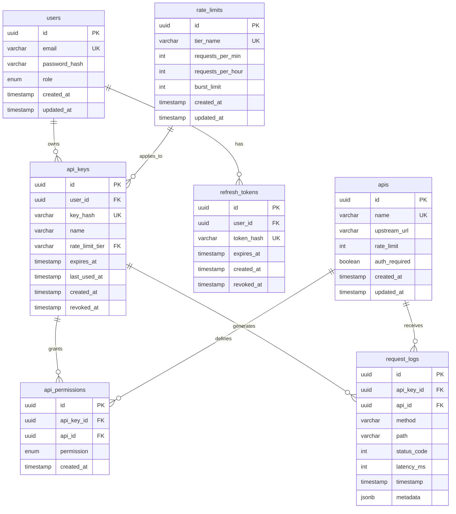

### Database Flow Diagram

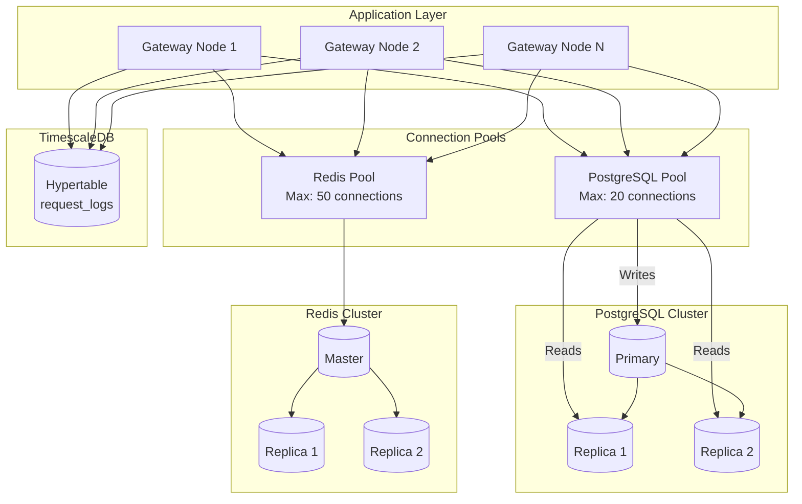

### Migration Flow

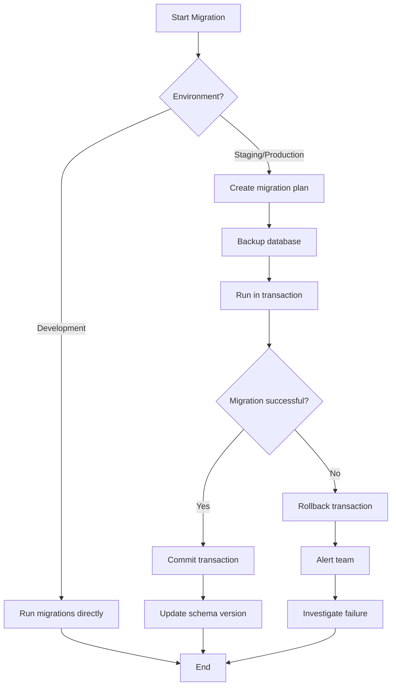

---

## Security Diagrams

### JWT Authentication Sequence

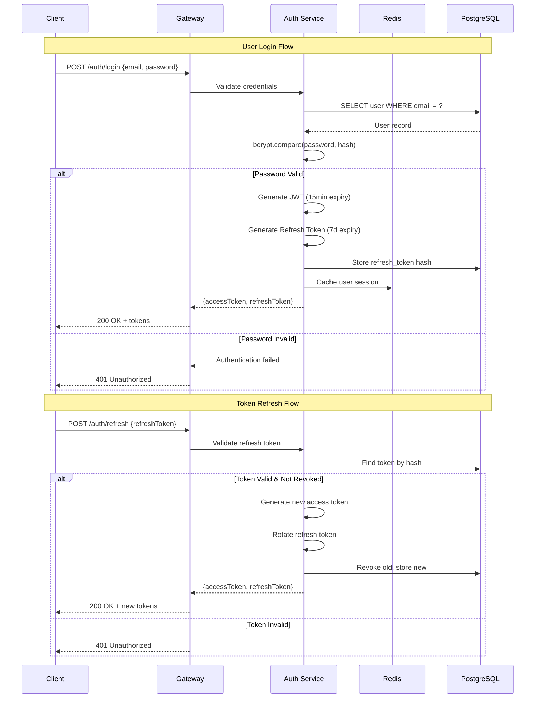

### API Key Validation Flow

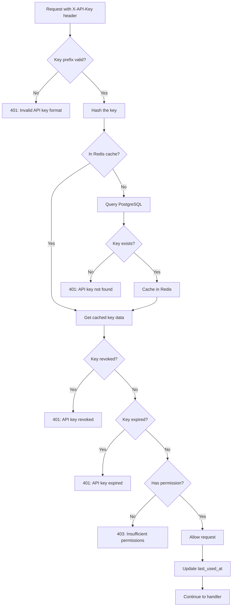

### Token Lifecycle State Machine

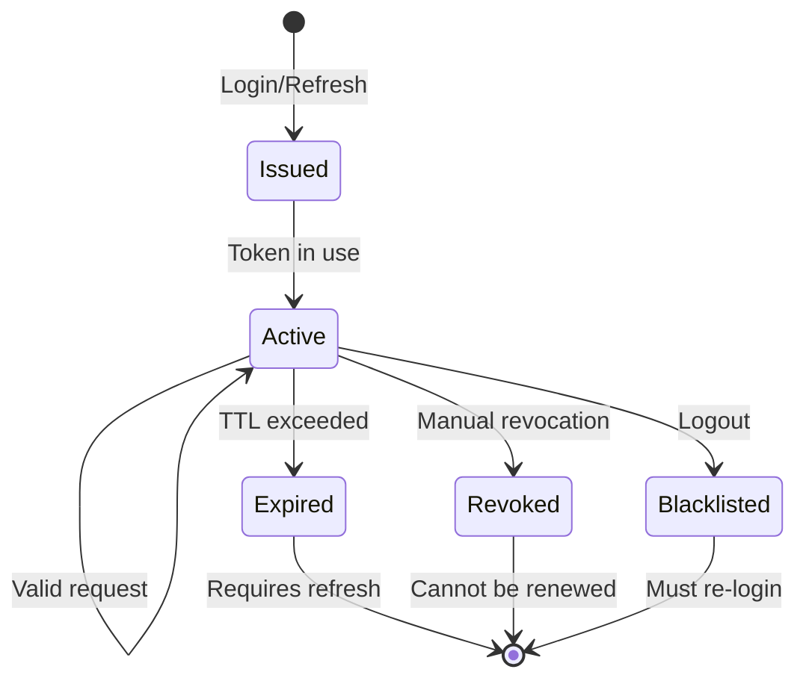

### RBAC Permission Graph

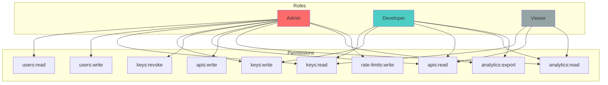

### Rate Limit Sequence

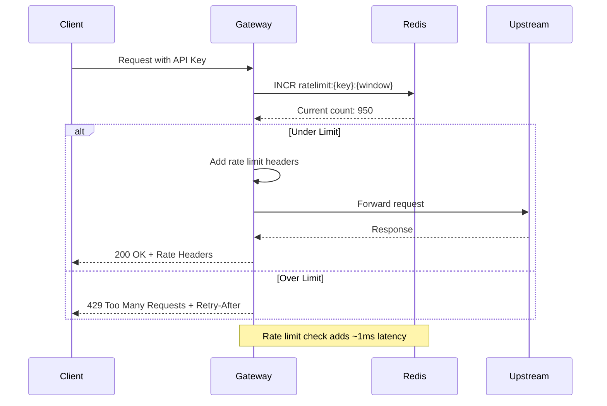

### Audit Event Flow

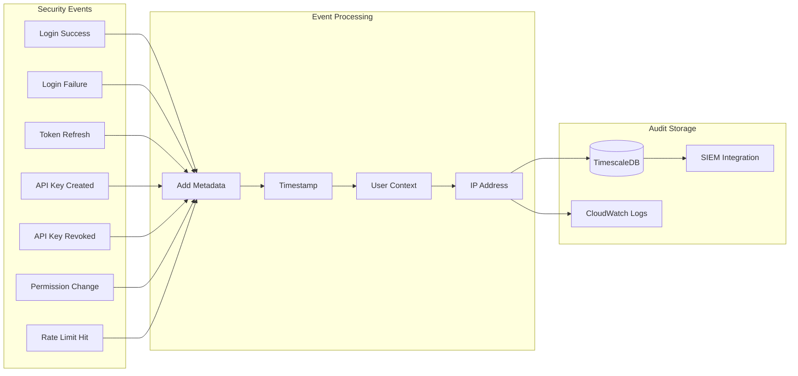

---

## Cloud Architecture Diagrams

### AWS Cloud Architecture

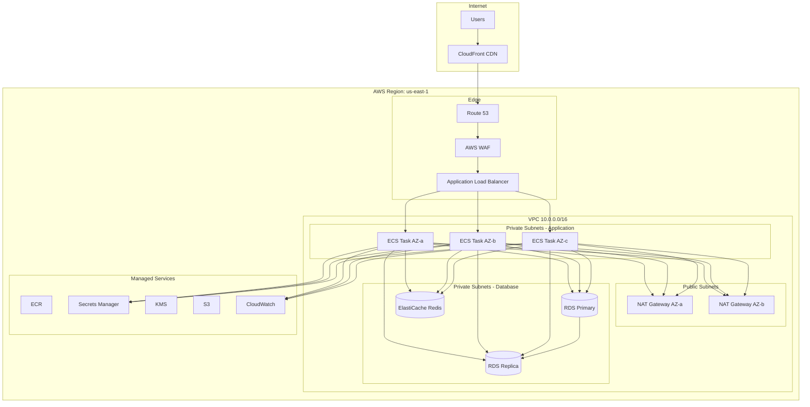

### ECS Service Architecture

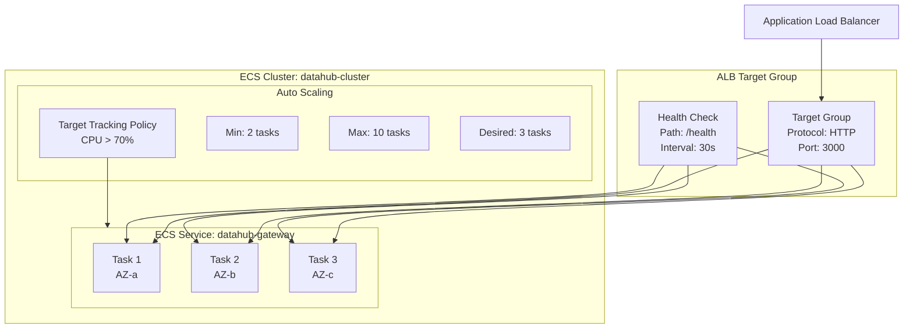

### Redis Cluster Topology

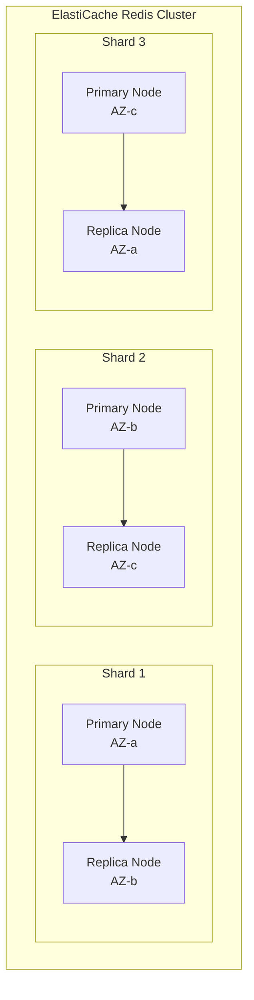

### CI/CD Pipeline

```mermaid
flowchart LR
    subgraph Trigger
        P[Push/PR]
    end

    subgraph Build["Build Stage"]
        B1[Install Dependencies]
        B2[TypeScript Compile]
        B3[Build Docker Image]
        B4[Security Scan]
    end

    subgraph Test["Test Stage"]
        T1[Unit Tests]
        T2[Integration Tests]
        T3[E2E Tests]
        T4[Coverage Report]
    end

    subgraph Deploy["Deploy Stage"]
        D1[Push to ECR]
        D2[Update Task Definition]
        D3[ECS Rolling Update]
        D4[Health Check]
        D5[Smoke Tests]
    end

    subgraph Notify
        N1[Slack Notification]
        N2[GitHub Status]
    end

    P --> B1 --> B2 --> B3 --> B4
    B4 --> T1 --> T2 --> T3 --> T4
    T4 --> D1 --> D2 --> D3 --> D4 --> D5
    D5 --> N1 & N2
```

### Disaster Recovery

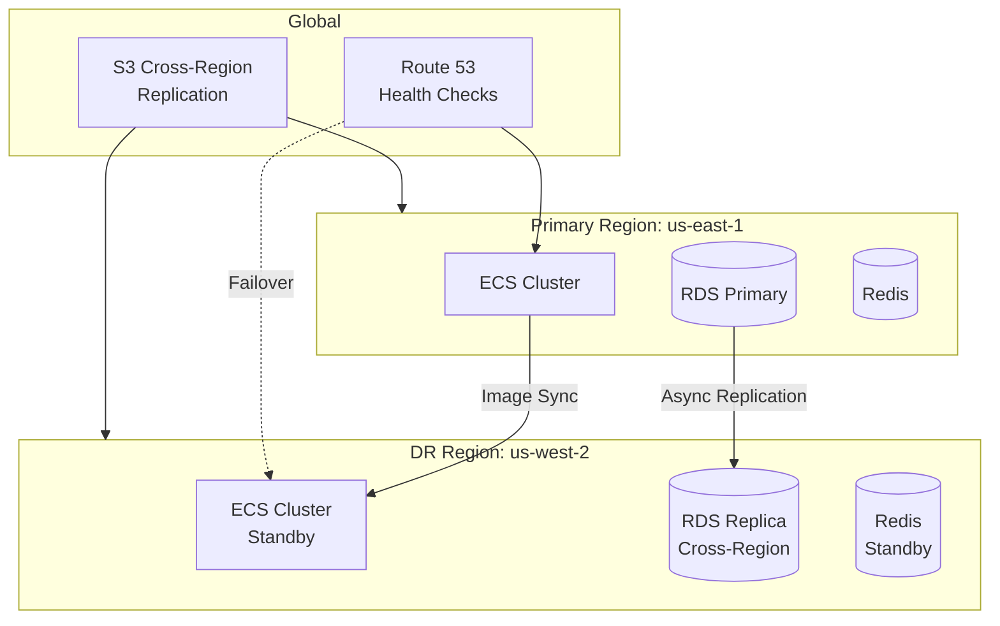

---

## Flow Diagrams

### Request Lifecycle

```mermaid
stateDiagram-v2
    [*] --> Received: Request arrives
    Received --> Authenticated: Auth check passed
    Received --> Rejected: Auth failed

    Authenticated --> RateLimited: Rate limit check
    RateLimited --> Processing: Under limit
    RateLimited --> Throttled: Over limit

    Processing --> Proxied: Gateway request
    Processing --> Completed: Direct response

    Proxied --> Completed: Upstream response
    Proxied --> Failed: Upstream error

    Completed --> Logged: Request logged
    Failed --> Logged: Error logged
    Rejected --> Logged: Auth failure logged
    Throttled --> Logged: Rate limit logged

    Logged --> [*]
```

### SDK Auth Flow

```mermaid
sequenceDiagram
    participant App as Application
    participant SDK as DataHub SDK
    participant API as DataHub API

    App->>SDK: new DataHubClient({ apiKey })
    SDK->>SDK: Store API key

    App->>SDK: client.auth.login(email, password)
    SDK->>API: POST /api/v1/auth/login
    API-->>SDK: { accessToken, refreshToken }
    SDK->>SDK: Store tokens

    App->>SDK: client.apiKeys.list()
    SDK->>SDK: Attach Bearer token
    SDK->>API: GET /api/v1/keys
    API-->>SDK: { data: [...] }
    SDK-->>App: List of API keys

    Note over SDK,API: Token expires after 15 min

    App->>SDK: client.apiKeys.create({...})
    SDK->>API: POST /api/v1/keys (expired token)
    API-->>SDK: 401 Unauthorized
    SDK->>API: POST /api/v1/auth/refresh
    API-->>SDK: { accessToken, refreshToken }
    SDK->>API: POST /api/v1/keys (new token)
    API-->>SDK: { data: newKey }
    SDK-->>App: New API key
```

### SDK Retry Logic

```mermaid
flowchart TD
    A[Make Request] --> B{Response?}
    B -->|Success| C[Return Data]
    B -->|429 Rate Limited| D[Get Retry-After]
    D --> E[Call onRateLimited]
    E --> F{Retry Count < Max?}
    F -->|Yes| G[Wait with Backoff]
    G --> A
    F -->|No| H[Throw RateLimitError]
    B -->|Other Error| I{Retryable?}
    I -->|Yes| F
    I -->|No| J[Throw Error]
```

---

## Usage in AutoSpec Viewer

All diagrams in this collection use Mermaid syntax and are compatible with:

- AutoSpec Viewer (recommended)
- GitHub Markdown preview
- VS Code Mermaid extension
- Mermaid Live Editor

To render these diagrams, ensure your viewer supports Mermaid.js v10+.
