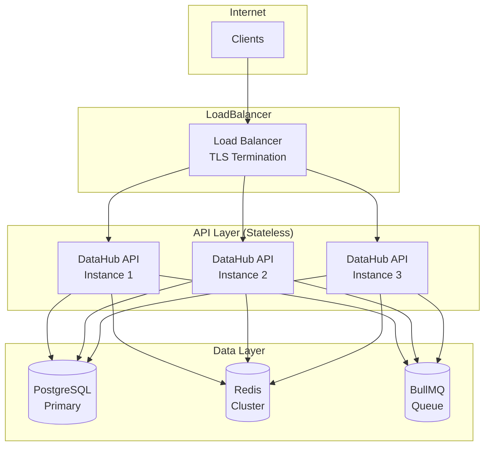
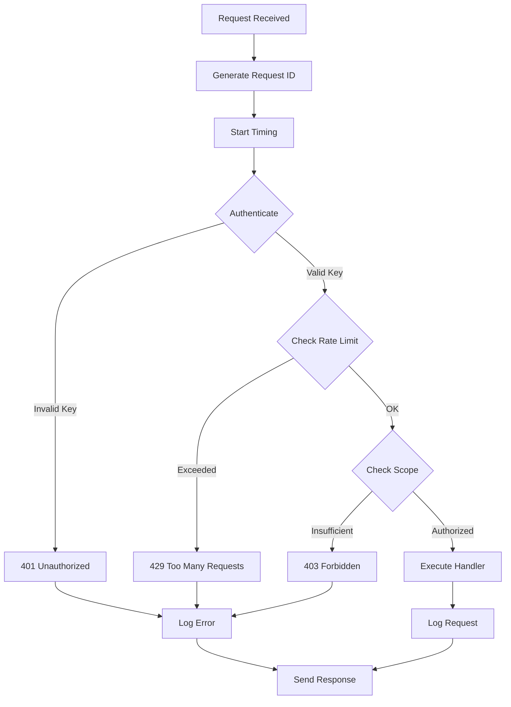
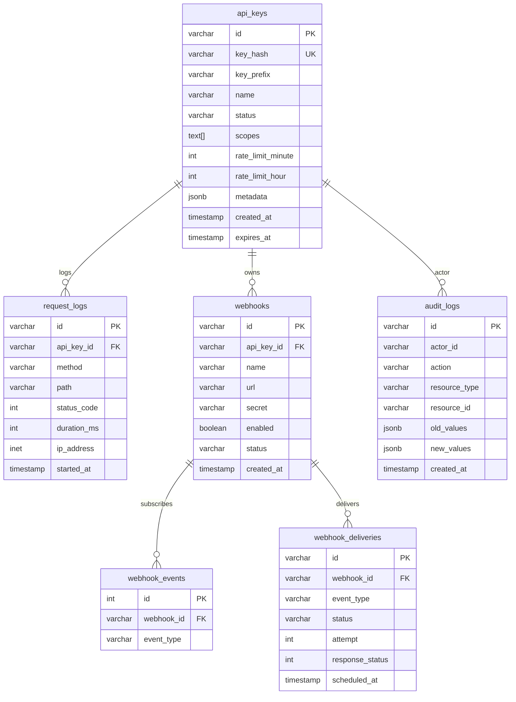
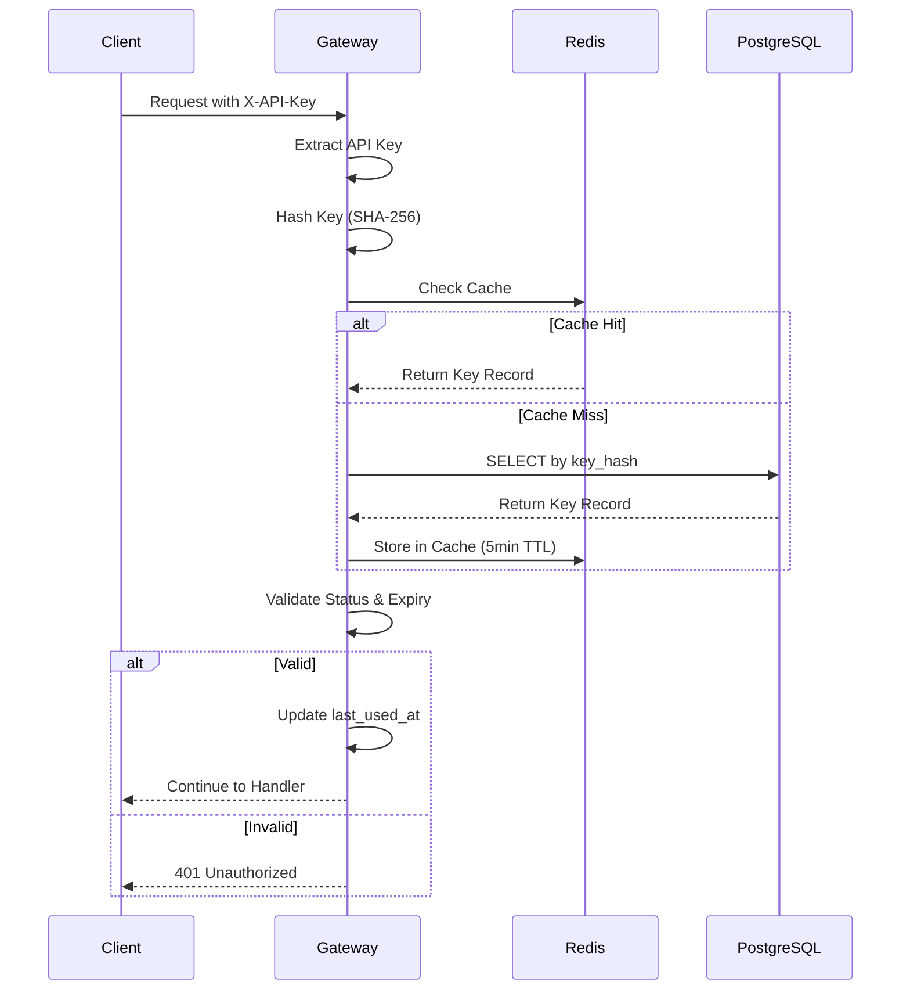
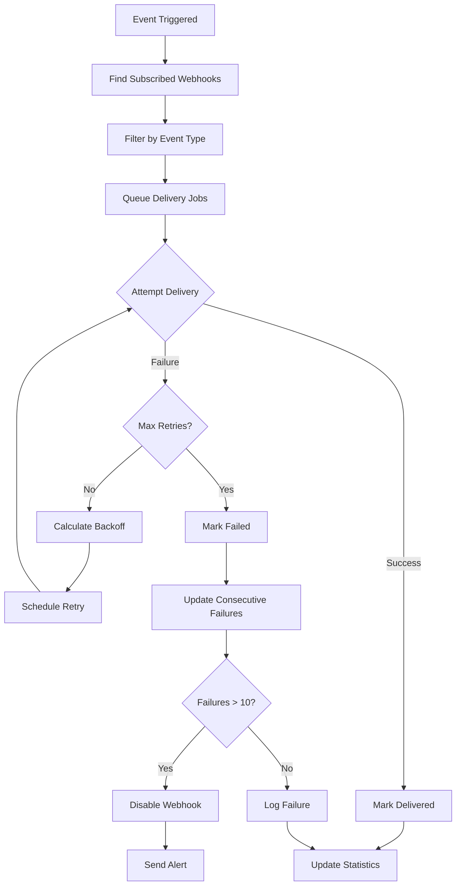
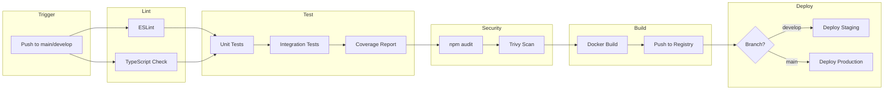
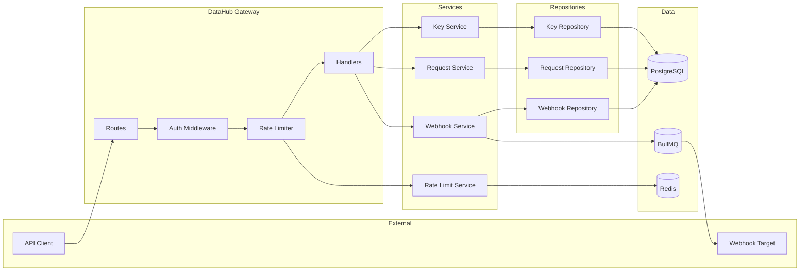

# DataHub API Gateway - Architecture Diagrams

## Overview

This document contains visual diagrams for the DataHub API Gateway architecture. Diagrams are provided in both ASCII art and Mermaid format for different rendering contexts.

---

## System Architecture Diagram

### ASCII Version

```
                            Internet
                               |
                               |
                    +----------v----------+
                    |    Load Balancer    |
                    |   (TLS Termination) |
                    +----------+----------+
                               |
          +--------------------+--------------------+
          |                    |                    |
    +-----v-----+        +-----v-----+        +-----v-----+
    |  DataHub  |        |  DataHub  |        |  DataHub  |
    |    API    |        |    API    |        |    API    |
    | Instance 1|        | Instance 2|        | Instance 3|
    +-----+-----+        +-----+-----+        +-----+-----+
          |                    |                    |
          +--------------------+--------------------+
                               |
          +--------------------+--------------------+
          |                    |                    |
    +-----v-----+        +-----v-----+        +-----v-----+
    |           |        |           |        |           |
    |PostgreSQL |        |   Redis   |        |  BullMQ   |
    |  Primary  |        |  Cluster  |        |   Queue   |
    |           |        |           |        |           |
    +-----------+        +-----------+        +-----------+
```

### Mermaid Version



---

## Request Processing Pipeline

### ASCII Version

```
Request Received
       |
       v
+------+------+
| Request ID  |  Generate unique ID
+------+------+
       |
       v
+------+------+
|   Timing    |  Start performance timer
+------+------+
       |
       v
+------+------+
|    Auth     |---> Invalid --> 401 Unauthorized
+------+------+
       |
       v
+------+------+
| Rate Limit  |---> Exceeded --> 429 Too Many Requests
+------+------+
       |
       v
+------+------+
| Authorize   |---> Forbidden --> 403 Forbidden
+------+------+
       |
       v
+------+------+
|   Handler   |  Execute business logic
+------+------+
       |
       v
+------+------+
|  Logging    |  Persist request log
+------+------+
       |
       v
Response Sent
```

### Mermaid Version



---

## Database Schema Diagram

### Mermaid ERD



---

## Authentication Flow

### Mermaid Sequence Diagram



---

## Rate Limiting Flow

### ASCII Version

```
Request with API Key
         |
         v
+--------+--------+
| Identify Key ID |
+--------+--------+
         |
         v
+--------+--------+
|  Check Minute   |---> Exceeded --> Return 429
|    Counter      |                  with Retry-After
+--------+--------+
         |
         v
+--------+--------+
|   Check Hour    |---> Exceeded --> Return 429
|    Counter      |
+--------+--------+
         |
         v
+--------+--------+
|   Check Day     |---> Exceeded --> Return 429
|    Counter      |
+--------+--------+
         |
         v
   All Checks Pass
         |
         v
+--------+--------+
| Increment All   |
| Counters        |
+--------+--------+
         |
         v
   Add Rate Limit
   Headers to Response
```

---

## Webhook Delivery Flow

### Mermaid Version



---

## CI/CD Pipeline

### Mermaid Version



---

## Component Interaction Diagram

### Mermaid Version



---

## Deployment Architecture (Kubernetes)

### ASCII Version

```
+----------------------------------------------------------+
|                    Kubernetes Cluster                      |
|                                                            |
|  +------------+  +------------+  +------------+            |
|  | Namespace: |  | Namespace: |  | Namespace: |            |
|  |  datahub   |  |  datahub-  |  |  monitoring|            |
|  |            |  |  staging   |  |            |            |
|  +------------+  +------------+  +------------+            |
|                                                            |
|  Within datahub namespace:                                 |
|  +------------------------+  +------------------------+   |
|  | Deployment: datahub-api|  | Service: datahub-api   |   |
|  | Replicas: 3            |  | Type: ClusterIP        |   |
|  | Image: datahub:latest  |  | Port: 80 -> 3000       |   |
|  +------------------------+  +------------------------+   |
|                                                            |
|  +------------------------+  +------------------------+   |
|  | HPA: datahub-api       |  | PDB: datahub-api       |   |
|  | Min: 3, Max: 20        |  | minAvailable: 2        |   |
|  | CPU Target: 70%        |  |                        |   |
|  +------------------------+  +------------------------+   |
|                                                            |
|  +------------------------+                               |
|  | Ingress: datahub-api   |                               |
|  | Host: api.datahub.com  |                               |
|  | TLS: letsencrypt       |                               |
|  +------------------------+                               |
|                                                            |
+----------------------------------------------------------+
```

---

## Usage Notes

### Rendering Mermaid Diagrams

These diagrams can be rendered in:

1. **GitHub** - Native Mermaid support in markdown
2. **VS Code** - Mermaid Preview extension
3. **Online** - [mermaid.live](https://mermaid.live)
4. **Documentation** - Docusaurus, GitBook, etc.

### Exporting Diagrams

Use mermaid-cli for PNG/SVG export:

```bash
npm install -g @mermaid-js/mermaid-cli
mmdc -i diagrams.md -o diagram.png
```

---

## Related Documentation

- [Architecture Overview](./overview.md) - High-level system design
- [Backend Architecture](./backend.md) - Component details
- [Database Architecture](./database.md) - Schema design

---

_This document contains visual representations of the DataHub API Gateway architecture._
