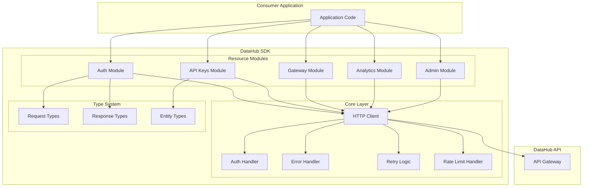
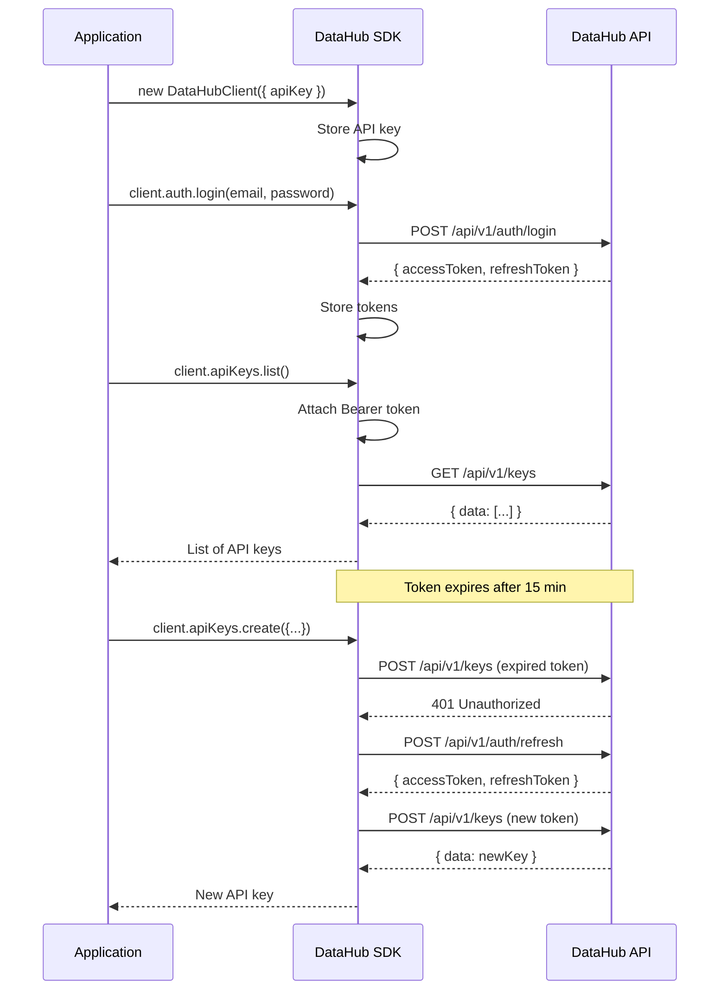
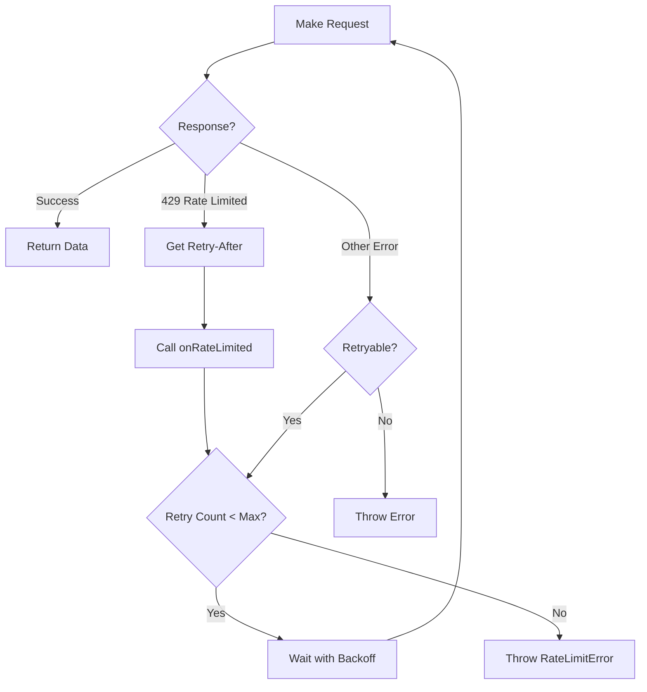

# DataHub API Gateway - API Client SDK Patterns

## Overview

While DataHub is primarily a backend API service, this document covers the patterns and best practices for building client SDKs and API consumers. This serves as a guide for developers integrating with the DataHub API Gateway.

---

## SDK Architecture

### ASCII SDK Structure

```
┌─────────────────────────────────────────────────────────────────────────────┐
│                          DataHub Client SDK                                  │
├─────────────────────────────────────────────────────────────────────────────┤
│                                                                              │
│  ┌────────────────────────────────────────────────────────────────────────┐ │
│  │                         SDK Core Layer                                  │ │
│  │  ┌──────────────┐  ┌──────────────┐  ┌──────────────┐                 │ │
│  │  │   HTTP       │  │    Auth      │  │   Error      │                 │ │
│  │  │   Client     │  │   Handler    │  │   Handler    │                 │ │
│  │  └──────────────┘  └──────────────┘  └──────────────┘                 │ │
│  └────────────────────────────────────────────────────────────────────────┘ │
│                                    │                                         │
│                                    ▼                                         │
│  ┌────────────────────────────────────────────────────────────────────────┐ │
│  │                        Resource Modules                                 │ │
│  │  ┌──────────────┐  ┌──────────────┐  ┌──────────────┐                 │ │
│  │  │    Auth      │  │   API Keys   │  │  Analytics   │                 │ │
│  │  │   Module     │  │    Module    │  │   Module     │                 │ │
│  │  └──────────────┘  └──────────────┘  └──────────────┘                 │ │
│  │  ┌──────────────┐  ┌──────────────┐                                   │ │
│  │  │   Gateway    │  │    Admin     │                                   │ │
│  │  │   Module     │  │   Module     │                                   │ │
│  │  └──────────────┘  └──────────────┘                                   │ │
│  └────────────────────────────────────────────────────────────────────────┘ │
│                                    │                                         │
│                                    ▼                                         │
│  ┌────────────────────────────────────────────────────────────────────────┐ │
│  │                         Type Definitions                                │ │
│  │  ┌──────────────┐  ┌──────────────┐  ┌──────────────┐                 │ │
│  │  │   Request    │  │   Response   │  │   Entity     │                 │ │
│  │  │   Types      │  │   Types      │  │   Types      │                 │ │
│  │  └──────────────┘  └──────────────┘  └──────────────┘                 │ │
│  └────────────────────────────────────────────────────────────────────────┘ │
│                                                                              │
└─────────────────────────────────────────────────────────────────────────────┘
```

### Mermaid SDK Architecture



---

## SDK Implementation Patterns

### TypeScript/JavaScript SDK

```typescript
// datahub-sdk/src/index.ts

import { HttpClient } from './core/http-client';
import { AuthModule } from './modules/auth';
import { ApiKeysModule } from './modules/api-keys';
import { AnalyticsModule } from './modules/analytics';
import { GatewayModule } from './modules/gateway';

export interface DataHubConfig {
  baseUrl: string;
  apiKey?: string;
  timeout?: number;
  retries?: number;
  onRateLimited?: (retryAfter: number) => void;
}

export class DataHubClient {
  private httpClient: HttpClient;

  public auth: AuthModule;
  public apiKeys: ApiKeysModule;
  public analytics: AnalyticsModule;
  public gateway: GatewayModule;

  constructor(config: DataHubConfig) {
    this.httpClient = new HttpClient({
      baseUrl: config.baseUrl,
      timeout: config.timeout ?? 30000,
      retries: config.retries ?? 3,
      onRateLimited: config.onRateLimited
    });

    if (config.apiKey) {
      this.httpClient.setApiKey(config.apiKey);
    }

    // Initialize modules
    this.auth = new AuthModule(this.httpClient);
    this.apiKeys = new ApiKeysModule(this.httpClient);
    this.analytics = new AnalyticsModule(this.httpClient);
    this.gateway = new GatewayModule(this.httpClient);
  }

  setAccessToken(token: string): void {
    this.httpClient.setAccessToken(token);
  }

  setApiKey(apiKey: string): void {
    this.httpClient.setApiKey(apiKey);
  }
}

// Usage example
const client = new DataHubClient({
  baseUrl: 'https://api.datahub.example.com',
  apiKey: 'dh_live_xxxxxxxxxxxx'
});
```

### HTTP Client Core

```typescript
// datahub-sdk/src/core/http-client.ts

import axios, { AxiosInstance, AxiosError } from 'axios';
import { DataHubError, RateLimitError, AuthError } from './errors';

export class HttpClient {
  private client: AxiosInstance;
  private apiKey?: string;
  private accessToken?: string;

  constructor(config: HttpClientConfig) {
    this.client = axios.create({
      baseURL: config.baseUrl,
      timeout: config.timeout,
      headers: {
        'Content-Type': 'application/json',
        'User-Agent': 'DataHub-SDK/1.0.0'
      }
    });

    this.setupInterceptors(config);
  }

  private setupInterceptors(config: HttpClientConfig): void {
    // Request interceptor - add auth headers
    this.client.interceptors.request.use((request) => {
      if (this.accessToken) {
        request.headers.Authorization = `Bearer ${this.accessToken}`;
      } else if (this.apiKey) {
        request.headers['X-API-Key'] = this.apiKey;
      }
      return request;
    });

    // Response interceptor - handle errors
    this.client.interceptors.response.use(
      (response) => response,
      async (error: AxiosError) => {
        if (error.response?.status === 429) {
          const retryAfter = parseInt(
            error.response.headers['retry-after'] || '60'
          );
          config.onRateLimited?.(retryAfter);
          throw new RateLimitError(retryAfter);
        }

        if (error.response?.status === 401) {
          throw new AuthError('Authentication failed');
        }

        throw new DataHubError(
          error.response?.status || 500,
          error.response?.data?.error?.code || 'UNKNOWN_ERROR',
          error.response?.data?.error?.message || error.message
        );
      }
    );
  }

  async get<T>(path: string, params?: object): Promise<T> {
    const response = await this.client.get(path, { params });
    return response.data;
  }

  async post<T>(path: string, data?: object): Promise<T> {
    const response = await this.client.post(path, data);
    return response.data;
  }

  async put<T>(path: string, data?: object): Promise<T> {
    const response = await this.client.put(path, data);
    return response.data;
  }

  async delete<T>(path: string): Promise<T> {
    const response = await this.client.delete(path);
    return response.data;
  }
}
```

---

## Resource Module Pattern

### API Keys Module Example

```typescript
// datahub-sdk/src/modules/api-keys.ts

import { HttpClient } from '../core/http-client';
import { ApiKey, CreateKeyRequest, ListKeysResponse } from '../types';

export class ApiKeysModule {
  constructor(private http: HttpClient) {}

  /**
   * List all API keys for the authenticated user
   */
  async list(options?: { page?: number; limit?: number }): Promise<ListKeysResponse> {
    return this.http.get<ListKeysResponse>('/api/v1/keys', options);
  }

  /**
   * Create a new API key
   */
  async create(request: CreateKeyRequest): Promise<ApiKey & { rawKey: string }> {
    return this.http.post<ApiKey & { rawKey: string }>('/api/v1/keys', request);
  }

  /**
   * Get a specific API key by ID
   */
  async get(keyId: string): Promise<ApiKey> {
    return this.http.get<ApiKey>(`/api/v1/keys/${keyId}`);
  }

  /**
   * Revoke an API key
   */
  async revoke(keyId: string, reason?: string): Promise<void> {
    await this.http.delete(`/api/v1/keys/${keyId}`);
  }

  /**
   * Rotate an API key (revoke old, create new)
   */
  async rotate(keyId: string): Promise<ApiKey & { rawKey: string }> {
    return this.http.post<ApiKey & { rawKey: string }>(
      `/api/v1/keys/${keyId}/rotate`
    );
  }
}
```

---

## SDK Usage Patterns

### Authentication Flow

```
┌─────────────────────────────────────────────────────────────┐
│                    SDK Authentication Flow                   │
└─────────────────────────────────────────────────────────────┘

  ┌──────────┐                                    ┌──────────┐
  │   App    │                                    │ DataHub  │
  │          │                                    │   API    │
  └────┬─────┘                                    └────┬─────┘
       │                                               │
       │  1. Initialize SDK with API Key               │
       │  ─────────────────────────────────────────►   │
       │                                               │
       │  2. (Optional) Login for JWT                  │
       │  ─────────────────────────────────────────►   │
       │                                               │
       │  3. Receive access + refresh tokens           │
       │  ◄─────────────────────────────────────────   │
       │                                               │
       │  4. SDK stores tokens, adds to requests       │
       │  ─────────────────────────────────────────►   │
       │                                               │
       │  5. Token expires, SDK auto-refreshes         │
       │  ─────────────────────────────────────────►   │
       │                                               │
       │  6. New tokens received                       │
       │  ◄─────────────────────────────────────────   │
       │                                               │
```

### Mermaid Auth Sequence



---

## Error Handling in SDK

### Error Class Hierarchy

```
                    DataHubError
                         │
         ┌───────────────┼───────────────┐
         │               │               │
    AuthError     RateLimitError   ValidationError
         │               │               │
    ┌────┴────┐         │          ┌────┴────┐
    │         │         │          │         │
TokenExpired InvalidKey  │     MissingField InvalidFormat
```

### SDK Error Handling Example

```typescript
// Consumer application error handling

import {
  DataHubClient,
  DataHubError,
  RateLimitError,
  AuthError
} from '@datahub/sdk';

const client = new DataHubClient({
  baseUrl: 'https://api.datahub.example.com',
  apiKey: process.env.DATAHUB_API_KEY!,
  onRateLimited: (retryAfter) => {
    console.log(`Rate limited. Retry after ${retryAfter} seconds`);
  }
});

async function createApiKey() {
  try {
    const key = await client.apiKeys.create({
      name: 'Production Key',
      permissions: ['read', 'write'],
      expiresAt: '2025-12-31T23:59:59Z'
    });

    console.log('API Key created:', key.rawKey);
    // Store key.rawKey securely - it won't be shown again!

  } catch (error) {
    if (error instanceof RateLimitError) {
      // Wait and retry
      await sleep(error.retryAfter * 1000);
      return createApiKey();
    }

    if (error instanceof AuthError) {
      // Re-authenticate
      console.error('Authentication failed, please login again');
      return;
    }

    if (error instanceof DataHubError) {
      console.error(`API Error [${error.code}]: ${error.message}`);
      return;
    }

    throw error;
  }
}
```

---

## Rate Limit Handling

### Rate Limit Strategy

```
┌─────────────────────────────────────────────────────────────┐
│                  Rate Limit Handling Strategy                │
└─────────────────────────────────────────────────────────────┘

  Request
     │
     ▼
┌─────────────┐
│ Send to API │
└─────────────┘
     │
     ▼
┌─────────────┐     ┌─────────────────────────────────────┐
│ Response?   │────►│ 429 Too Many Requests               │
└─────────────┘     │                                     │
     │              │ 1. Read Retry-After header          │
     │              │ 2. Call onRateLimited callback      │
     │              │ 3. Implement exponential backoff    │
     │              │ 4. Retry after delay                │
     │              └─────────────────────────────────────┘
     │
     ▼
┌─────────────┐
│   Success   │
└─────────────┘
```

### Mermaid Retry Logic



---

## SDK Type Definitions

```typescript
// datahub-sdk/src/types/index.ts

// Entity Types
export interface User {
  id: string;
  email: string;
  role: 'admin' | 'developer' | 'viewer';
  createdAt: string;
  updatedAt: string;
}

export interface ApiKey {
  id: string;
  userId: string;
  name: string;
  permissions: string[];
  rateLimitTier: string;
  expiresAt: string | null;
  lastUsedAt: string | null;
  createdAt: string;
  revokedAt: string | null;
}

export interface Api {
  id: string;
  name: string;
  upstreamUrl: string;
  rateLimit: number;
  authRequired: boolean;
  createdAt: string;
  updatedAt: string;
}

// Request Types
export interface CreateKeyRequest {
  name: string;
  permissions?: string[];
  expiresAt?: string;
}

export interface LoginRequest {
  email: string;
  password: string;
}

// Response Types
export interface ApiResponse<T> {
  success: boolean;
  data: T;
  message?: string;
}

export interface PaginatedResponse<T> {
  success: boolean;
  data: T[];
  pagination: {
    page: number;
    limit: number;
    total: number;
    totalPages: number;
  };
}

export interface ErrorResponse {
  success: false;
  error: {
    code: string;
    message: string;
    details?: Record<string, any>;
  };
}
```

---

## Multi-Language SDK Support

### SDK Availability Matrix

| Language | Package | Status | Install Command |
|----------|---------|--------|-----------------|
| TypeScript/JS | `@datahub/sdk` | Stable | `npm install @datahub/sdk` |
| Python | `datahub-sdk` | Stable | `pip install datahub-sdk` |
| Go | `github.com/datahub/sdk-go` | Beta | `go get github.com/datahub/sdk-go` |
| Ruby | `datahub-sdk` | Alpha | `gem install datahub-sdk` |
| Java | `com.datahub:sdk` | Planned | - |

---

## Related Documentation

- [API Reference](../api/reference.md) - Complete endpoint documentation
- [Authentication](../api/authentication.md) - Auth implementation details
- [Error Codes](../api/error-codes.md) - Error code reference
- [Rate Limiting](../api/rate-limiting.md) - Rate limit details
