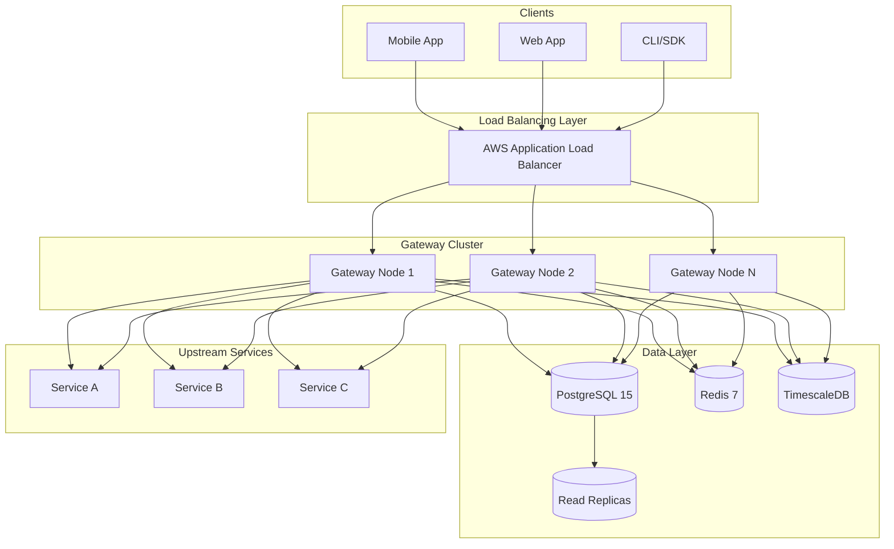
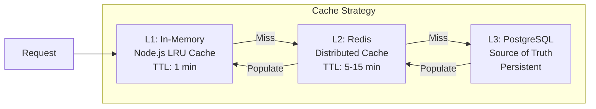
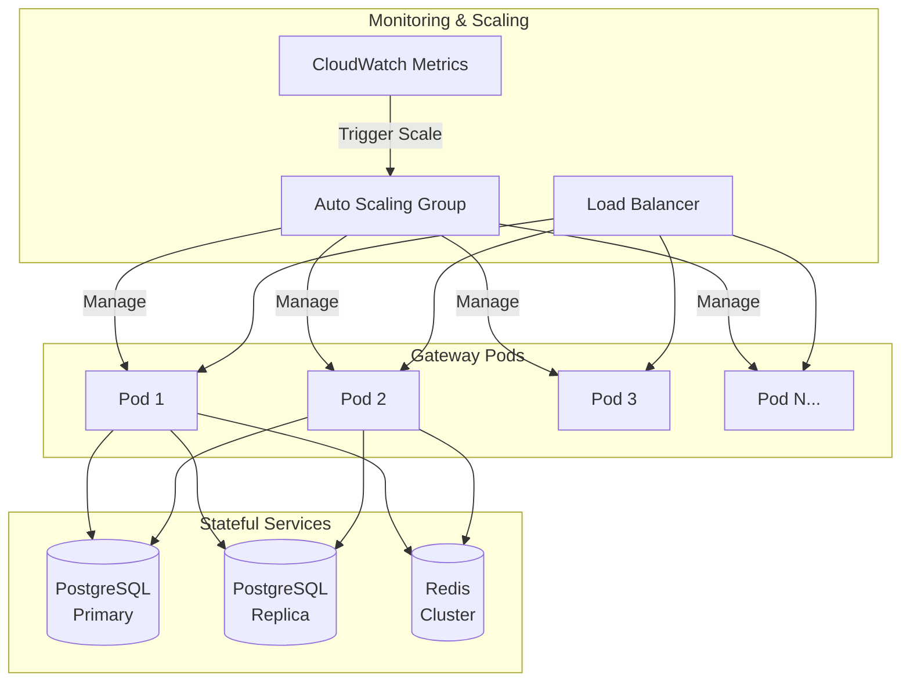

# DataHub API Gateway - System Architecture Overview

## Executive Summary

DataHub is a centralized API Gateway platform that enables organizations to manage, secure, and monitor their API traffic. This document provides a comprehensive overview of the system architecture, including component relationships and data flow patterns.

---

## High-Level Architecture

### ASCII System Diagram

```
                                    ┌─────────────────────────────────────────────────────────────┐
                                    │                     DataHub API Gateway                      │
                                    └─────────────────────────────────────────────────────────────┘
                                                              │
    ┌──────────────┐                                          │
    │   Clients    │                                          ▼
    │              │              ┌───────────────────────────────────────────────────────────────┐
    │ ┌──────────┐ │              │                        Load Balancer                          │
    │ │Mobile App│ │              │                      (AWS ALB / nginx)                        │
    │ └────┬─────┘ │              └───────────────────────────────────────────────────────────────┘
    │      │       │                                          │
    │ ┌────▼─────┐ │                    ┌─────────────────────┼─────────────────────┐
    │ │ Web App  │─┼────HTTPS──────────►│                     │                     │
    │ └────┬─────┘ │                    ▼                     ▼                     ▼
    │      │       │              ┌───────────┐         ┌───────────┐         ┌───────────┐
    │ ┌────▼─────┐ │              │  Node 1   │         │  Node 2   │         │  Node N   │
    │ │ CLI/SDK  │ │              │ (Gateway) │         │ (Gateway) │         │ (Gateway) │
    │ └──────────┘ │              └─────┬─────┘         └─────┬─────┘         └─────┬─────┘
    └──────────────┘                    │                     │                     │
                                        └─────────────────────┼─────────────────────┘
                                                              │
                    ┌─────────────────────────────────────────┼─────────────────────────────────┐
                    │                                         │                                 │
                    ▼                                         ▼                                 ▼
          ┌─────────────────┐                      ┌─────────────────┐               ┌─────────────────┐
          │   PostgreSQL    │                      │      Redis      │               │  TimescaleDB    │
          │   (Primary DB)  │                      │     (Cache)     │               │  (Analytics)    │
          │                 │                      │                 │               │                 │
          │ • Users         │                      │ • Session data  │               │ • Request logs  │
          │ • API Keys      │                      │ • Rate limits   │               │ • Metrics       │
          │ • APIs config   │                      │ • API key cache │               │ • Time-series   │
          └────────┬────────┘                      └─────────────────┘               └─────────────────┘
                   │
                   ▼
          ┌─────────────────┐
          │  Read Replicas  │
          │   (Scaling)     │
          └─────────────────┘
```

### Component Overview Table

| Component | Technology | Purpose | Scaling Strategy |
|-----------|------------|---------|------------------|
| Load Balancer | AWS ALB / nginx | Traffic distribution | Managed service |
| API Gateway | Node.js 20 + Express | Request processing | Horizontal (stateless) |
| Primary Database | PostgreSQL 15 | Persistent storage | Read replicas |
| Cache Layer | Redis 7 | Performance optimization | Redis Cluster |
| Analytics Store | TimescaleDB | Time-series analytics | Partitioning |

---

## Request Flow Architecture

### ASCII Request Flow

```
  ┌──────────┐     ┌──────────┐     ┌──────────┐     ┌──────────┐     ┌──────────┐
  │  Client  │────►│   ALB    │────►│ Gateway  │────►│ Upstream │────►│ Response │
  └──────────┘     └──────────┘     └──────────┘     └──────────┘     └──────────┘
       │                                  │
       │                                  ▼
       │                         ┌───────────────┐
       │                         │ Auth & Rate   │
       │                         │ Limit Check   │
       │                         └───────┬───────┘
       │                                 │
       │              ┌──────────────────┼──────────────────┐
       │              ▼                  ▼                  ▼
       │        ┌───────────┐      ┌───────────┐      ┌───────────┐
       │        │   Redis   │      │ PostgreSQL│      │TimescaleDB│
       │        │(Rate Lim) │      │  (Auth)   │      │  (Logs)   │
       │        └───────────┘      └───────────┘      └───────────┘
       │
       └───────────────────────────────────────────────────────────────►
                              Complete Request/Response Cycle
```

### Mermaid System Architecture



---

## Core System Components

### 1. API Gateway Layer

The gateway layer handles all incoming API requests and provides:

- **Authentication**: JWT validation, API key verification
- **Rate Limiting**: Sliding window algorithm with Redis
- **Request Routing**: Path-based routing to upstream services
- **Request/Response Transformation**: Header manipulation, body transformation
- **Logging**: Comprehensive request logging for analytics

### 2. Data Storage Layer

```
┌─────────────────────────────────────────────────────────────────────┐
│                         Data Storage Strategy                        │
├─────────────────────────────────────────────────────────────────────┤
│                                                                      │
│  ┌─────────────────┐    ┌─────────────────┐    ┌─────────────────┐ │
│  │   PostgreSQL    │    │      Redis      │    │   TimescaleDB   │ │
│  │                 │    │                 │    │                 │ │
│  │  Transactional  │    │   Low Latency   │    │   Time-Series   │ │
│  │     Data        │    │     Cache       │    │    Analytics    │ │
│  │                 │    │                 │    │                 │ │
│  │ • Users         │    │ • Sessions      │    │ • Request logs  │ │
│  │ • API Keys      │    │ • Rate counters │    │ • Latency data  │ │
│  │ • API configs   │    │ • API key cache │    │ • Error metrics │ │
│  │ • Permissions   │    │ • Token cache   │    │ • Usage stats   │ │
│  └─────────────────┘    └─────────────────┘    └─────────────────┘ │
│                                                                      │
└─────────────────────────────────────────────────────────────────────┘
```

### 3. Caching Strategy



---

## Scalability Architecture

### Horizontal Scaling Model

```
                    ┌─────────────────────────────────────────┐
                    │           Auto Scaling Group            │
                    │                                         │
                    │  Metrics: CPU > 70%, Memory > 80%       │
                    │  Min: 2, Max: 10, Desired: 3            │
                    └─────────────────────────────────────────┘
                                        │
            ┌───────────────────────────┼───────────────────────────┐
            │                           │                           │
            ▼                           ▼                           ▼
    ┌───────────────┐           ┌───────────────┐           ┌───────────────┐
    │   Gateway 1   │           │   Gateway 2   │           │   Gateway N   │
    │               │           │               │           │               │
    │ CPU: 45%      │           │ CPU: 52%      │           │ CPU: 48%      │
    │ Mem: 512MB    │           │ Mem: 489MB    │           │ Mem: 501MB    │
    │ Req/s: 3,400  │           │ Req/s: 3,200  │           │ Req/s: 3,100  │
    └───────────────┘           └───────────────┘           └───────────────┘
```

### Mermaid Scaling Diagram



---

## Network Architecture

### Security Zones

```
┌─────────────────────────────────────────────────────────────────────────────┐
│                              VPC (10.0.0.0/16)                               │
│                                                                              │
│  ┌────────────────────────────────────────────────────────────────────────┐ │
│  │                    Public Subnet (10.0.1.0/24)                          │ │
│  │                                                                         │ │
│  │    ┌─────────────┐    ┌─────────────┐    ┌─────────────┐               │ │
│  │    │     NAT     │    │     ALB     │    │   Bastion   │               │ │
│  │    │   Gateway   │    │             │    │    Host     │               │ │
│  │    └─────────────┘    └─────────────┘    └─────────────┘               │ │
│  └────────────────────────────────────────────────────────────────────────┘ │
│                                    │                                         │
│  ┌────────────────────────────────────────────────────────────────────────┐ │
│  │                   Private Subnet (10.0.2.0/24)                          │ │
│  │                                                                         │ │
│  │    ┌─────────────┐    ┌─────────────┐    ┌─────────────┐               │ │
│  │    │  Gateway 1  │    │  Gateway 2  │    │  Gateway N  │               │ │
│  │    │             │    │             │    │             │               │ │
│  │    └─────────────┘    └─────────────┘    └─────────────┘               │ │
│  └────────────────────────────────────────────────────────────────────────┘ │
│                                    │                                         │
│  ┌────────────────────────────────────────────────────────────────────────┐ │
│  │                   Database Subnet (10.0.3.0/24)                         │ │
│  │                                                                         │ │
│  │    ┌─────────────┐    ┌─────────────┐    ┌─────────────┐               │ │
│  │    │  PostgreSQL │    │    Redis    │    │ TimescaleDB │               │ │
│  │    │   Primary   │    │   Cluster   │    │             │               │ │
│  │    └─────────────┘    └─────────────┘    └─────────────┘               │ │
│  └────────────────────────────────────────────────────────────────────────┘ │
│                                                                              │
└─────────────────────────────────────────────────────────────────────────────┘
```

---

## Technology Stack Summary

| Layer | Technology | Version | Purpose |
|-------|------------|---------|---------|
| Runtime | Node.js | 20 LTS | Server runtime |
| Framework | Express.js | 4.x | HTTP framework |
| Language | TypeScript | 5.x | Type safety |
| Primary DB | PostgreSQL | 15 | Transactional data |
| Cache | Redis | 7 | Caching & rate limiting |
| Analytics DB | TimescaleDB | 2.x | Time-series data |
| Container | Docker | 24.x | Containerization |
| Orchestration | Kubernetes | 1.28+ | Container orchestration |
| CI/CD | GitHub Actions | - | Automation |
| Cloud | AWS | - | Infrastructure |

---

## Related Documentation

- [Backend Architecture](./backend.md) - Detailed backend layer design
- [Database Design](./database.md) - ERD and schema details
- [Security Architecture](./security.md) - Authentication and security flows
- [Cloud Architecture](./cloud.md) - AWS deployment details
- [All Diagrams](./diagrams.md) - Consolidated Mermaid diagrams
