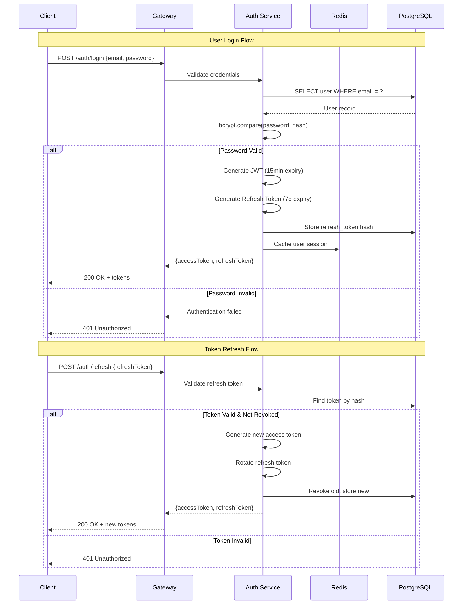
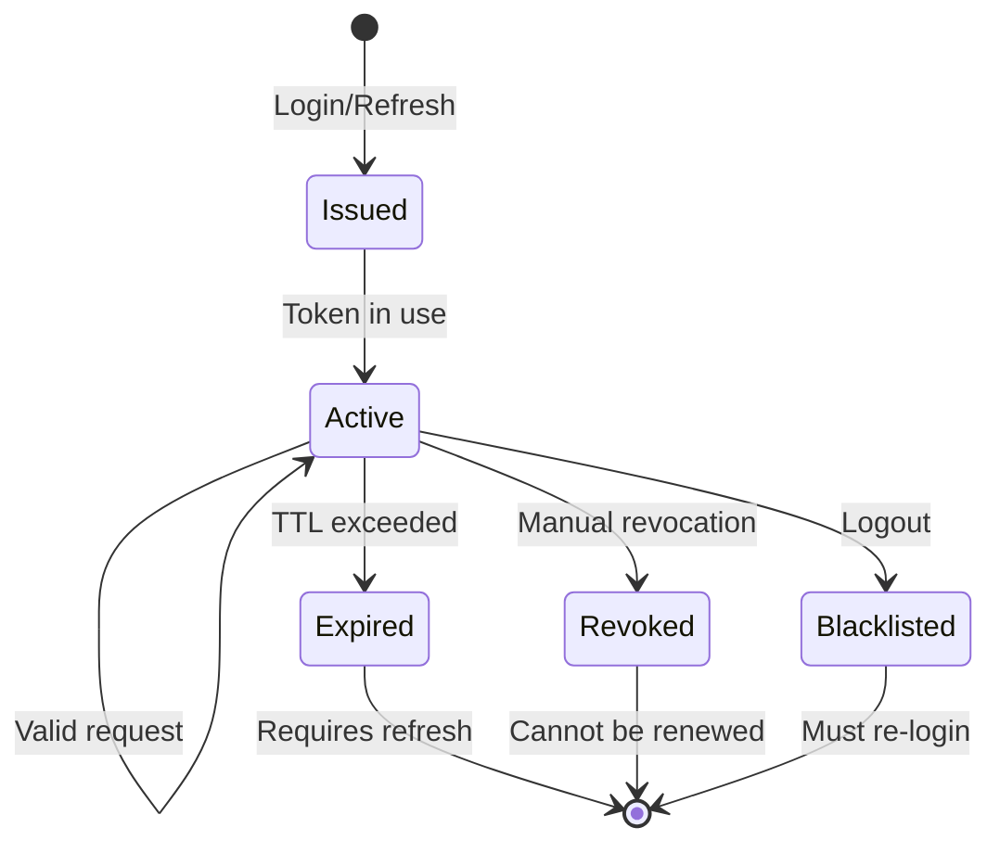
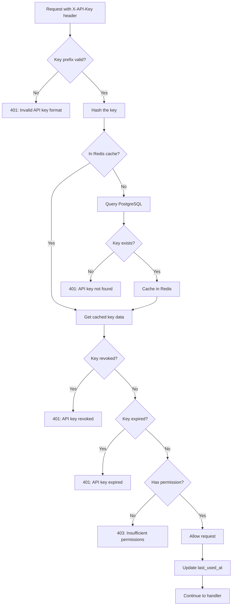
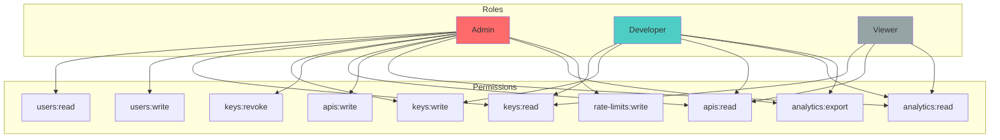
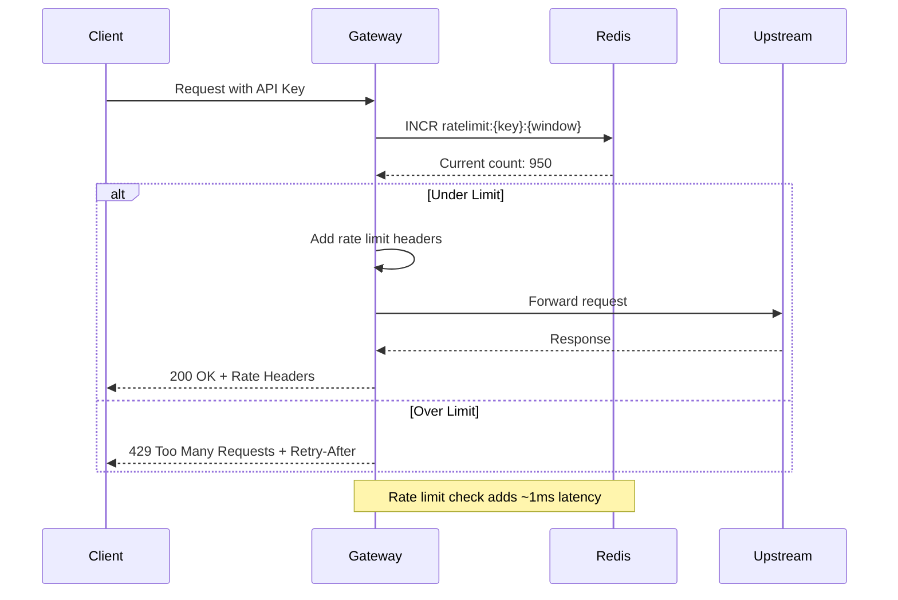
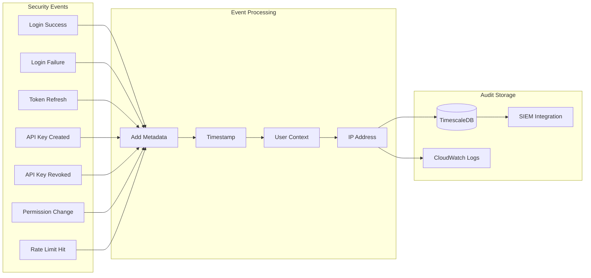

# DataHub API Gateway - Security Architecture

## Overview

This document details the security architecture of DataHub API Gateway, including authentication flows, authorization mechanisms, and security best practices implemented throughout the system.

---

## Authentication Architecture

### ASCII Authentication Flow

```
┌─────────────────────────────────────────────────────────────────────────────┐
│                       DataHub Authentication Flow                            │
└─────────────────────────────────────────────────────────────────────────────┘

┌──────────┐                                              ┌──────────────────┐
│  Client  │                                              │   DataHub API    │
└────┬─────┘                                              └────────┬─────────┘
     │                                                             │
     │  ══════════════════ USER AUTHENTICATION ══════════════════  │
     │                                                             │
     │  1. POST /api/v1/auth/login                                 │
     │     { email, password }                                     │
     │  ─────────────────────────────────────────────────────────► │
     │                                                             │
     │                              ┌─────────────────────────────┐│
     │                              │ Validate credentials        ││
     │                              │ bcrypt.compare(password)    ││
     │                              └─────────────────────────────┘│
     │                                                             │
     │  2. Return JWT tokens                                       │
     │     { accessToken, refreshToken }                           │
     │  ◄───────────────────────────────────────────────────────── │
     │                                                             │
     │  ══════════════════ API KEY AUTHENTICATION ═══════════════  │
     │                                                             │
     │  3. GET /api/v1/resource                                    │
     │     Header: X-API-Key: dh_live_xxx                          │
     │  ─────────────────────────────────────────────────────────► │
     │                                                             │
     │                              ┌─────────────────────────────┐│
     │                              │ Hash API key                ││
     │                              │ Lookup in Redis/PostgreSQL  ││
     │                              │ Verify not revoked/expired  ││
     │                              └─────────────────────────────┘│
     │                                                             │
     │  4. Return resource data                                    │
     │     { data: {...} }                                         │
     │  ◄───────────────────────────────────────────────────────── │
     │                                                             │
```

### Mermaid JWT Authentication Sequence



---

## JWT Token Structure

### Token Anatomy

```
┌─────────────────────────────────────────────────────────────────────────────┐
│                          JWT Token Structure                                 │
└─────────────────────────────────────────────────────────────────────────────┘

    Access Token (JWT)
    ═══════════════════════════════════════════════════════════════════════

    eyJhbGciOiJSUzI1NiIsInR5cCI6IkpXVCJ9.eyJzdWIiOiJ1c2VyXzEyMzQ1Ni...

    ┌─────────────────────────────────────────────────────────────────────┐
    │  HEADER (Base64)                                                     │
    │  {                                                                   │
    │    "alg": "RS256",        // RSA SHA-256 signature                  │
    │    "typ": "JWT",          // Token type                              │
    │    "kid": "key-2024-01"   // Key ID for rotation                    │
    │  }                                                                   │
    └─────────────────────────────────────────────────────────────────────┘
                                      │
                                      ▼
    ┌─────────────────────────────────────────────────────────────────────┐
    │  PAYLOAD (Base64)                                                    │
    │  {                                                                   │
    │    "sub": "user_123456",           // Subject (user ID)             │
    │    "email": "user@example.com",    // User email                    │
    │    "role": "developer",            // User role                     │
    │    "iat": 1706500000,              // Issued at                     │
    │    "exp": 1706500900,              // Expires (15 min)              │
    │    "iss": "datahub-api",           // Issuer                        │
    │    "aud": "datahub-clients"        // Audience                      │
    │  }                                                                   │
    └─────────────────────────────────────────────────────────────────────┘
                                      │
                                      ▼
    ┌─────────────────────────────────────────────────────────────────────┐
    │  SIGNATURE                                                           │
    │                                                                      │
    │  RSASHA256(                                                          │
    │    base64UrlEncode(header) + "." +                                  │
    │    base64UrlEncode(payload),                                        │
    │    privateKey                                                        │
    │  )                                                                   │
    └─────────────────────────────────────────────────────────────────────┘
```

### Token Lifecycle



---

## API Key Security

### API Key Generation Flow

```
┌─────────────────────────────────────────────────────────────┐
│                  API Key Generation                          │
└─────────────────────────────────────────────────────────────┘

    Step 1: Generate Cryptographically Secure Key
    ───────────────────────────────────────────────

    crypto.randomBytes(32).toString('base64url')
    │
    ▼
    ┌────────────────────────────────────────────────┐
    │  Raw Key: dh_live_Kj8mN2pL9qR4sT6vW8xY0zA3bC5 │
    │                                                │
    │  Format: {prefix}_{env}_{random_32_bytes}     │
    │  • prefix: "dh" (DataHub)                     │
    │  • env: "live" or "test"                      │
    │  • random: 32 bytes, base64url encoded        │
    └────────────────────────────────────────────────┘
    │
    ▼
    Step 2: Hash for Storage
    ────────────────────────────

    SHA-256(raw_key)
    │
    ▼
    ┌────────────────────────────────────────────────┐
    │  Stored Hash: a1b2c3d4e5f6...                  │
    │  (Never store raw key!)                        │
    └────────────────────────────────────────────────┘
    │
    ▼
    Step 3: Return to User Once
    ────────────────────────────

    ┌────────────────────────────────────────────────┐
    │  Response:                                      │
    │  {                                              │
    │    "id": "key_uuid",                           │
    │    "name": "Production Key",                   │
    │    "key": "dh_live_Kj8m...",  // SHOWN ONCE   │
    │    "created_at": "2024-01-29T..."             │
    │  }                                              │
    │                                                │
    │  WARNING: Store this key securely.            │
    │  It will not be shown again.                  │
    └────────────────────────────────────────────────┘
```

### Mermaid API Key Validation Flow



---

## Authorization Model

### Role-Based Access Control (RBAC)

```
┌─────────────────────────────────────────────────────────────────────────────┐
│                          RBAC Permission Matrix                              │
└─────────────────────────────────────────────────────────────────────────────┘

    ┌─────────────────────────────────────────────────────────────────────────┐
    │                              Roles                                       │
    │  ┌─────────────┐    ┌─────────────┐    ┌─────────────┐                 │
    │  │    Admin    │    │  Developer  │    │   Viewer    │                 │
    │  │             │    │             │    │             │                 │
    │  │  Full       │    │  API Keys   │    │  Read-only  │                 │
    │  │  Access     │    │  Analytics  │    │  Access     │                 │
    │  └─────────────┘    └─────────────┘    └─────────────┘                 │
    └─────────────────────────────────────────────────────────────────────────┘

    Permission Table:
    ┌────────────────────┬───────────┬───────────┬───────────┐
    │ Resource           │   Admin   │ Developer │  Viewer   │
    ├────────────────────┼───────────┼───────────┼───────────┤
    │ Users - Read       │     ✓     │     -     │     -     │
    │ Users - Write      │     ✓     │     -     │     -     │
    │ Users - Delete     │     ✓     │     -     │     -     │
    ├────────────────────┼───────────┼───────────┼───────────┤
    │ API Keys - Read    │     ✓     │  Own only │  Own only │
    │ API Keys - Create  │     ✓     │     ✓     │     -     │
    │ API Keys - Revoke  │     ✓     │  Own only │     -     │
    ├────────────────────┼───────────┼───────────┼───────────┤
    │ APIs - Read        │     ✓     │     ✓     │     ✓     │
    │ APIs - Write       │     ✓     │     -     │     -     │
    │ APIs - Delete      │     ✓     │     -     │     -     │
    ├────────────────────┼───────────┼───────────┼───────────┤
    │ Analytics - Read   │     ✓     │  Own only │  Own only │
    │ Analytics - Export │     ✓     │     ✓     │     -     │
    ├────────────────────┼───────────┼───────────┼───────────┤
    │ Rate Limits - Read │     ✓     │     ✓     │     ✓     │
    │ Rate Limits - Write│     ✓     │     -     │     -     │
    └────────────────────┴───────────┴───────────┴───────────┘
```

### Mermaid RBAC Diagram



---

## Security Headers

### HTTP Security Headers Configuration

```
┌─────────────────────────────────────────────────────────────┐
│              Security Headers Configuration                  │
└─────────────────────────────────────────────────────────────┘

Response Headers:
═════════════════

┌─────────────────────────────────────────────────────────────┐
│ Strict-Transport-Security: max-age=31536000; includeSubDomains │
│ ───────────────────────────────────────────────────────────  │
│ Enforces HTTPS for 1 year, including subdomains              │
└─────────────────────────────────────────────────────────────┘

┌─────────────────────────────────────────────────────────────┐
│ X-Content-Type-Options: nosniff                              │
│ ───────────────────────────────────────────────────────────  │
│ Prevents MIME type sniffing                                  │
└─────────────────────────────────────────────────────────────┘

┌─────────────────────────────────────────────────────────────┐
│ X-Frame-Options: DENY                                        │
│ ───────────────────────────────────────────────────────────  │
│ Prevents clickjacking by denying framing                     │
└─────────────────────────────────────────────────────────────┘

┌─────────────────────────────────────────────────────────────┐
│ Content-Security-Policy: default-src 'none'                  │
│ ───────────────────────────────────────────────────────────  │
│ API responses should not execute scripts                     │
└─────────────────────────────────────────────────────────────┘

┌─────────────────────────────────────────────────────────────┐
│ X-Request-ID: uuid-v4                                        │
│ ───────────────────────────────────────────────────────────  │
│ Request tracing for debugging and audit                      │
└─────────────────────────────────────────────────────────────┘
```

---

## Rate Limiting Security

### Rate Limit Headers

```
Rate Limit Response Headers:
═══════════════════════════

┌─────────────────────────────────────────────────────────────┐
│ X-RateLimit-Limit: 1000                                      │
│ ───────────────────────────────────────────────────────────  │
│ Maximum requests allowed in the window                       │
└─────────────────────────────────────────────────────────────┘

┌─────────────────────────────────────────────────────────────┐
│ X-RateLimit-Remaining: 950                                   │
│ ───────────────────────────────────────────────────────────  │
│ Requests remaining in current window                         │
└─────────────────────────────────────────────────────────────┘

┌─────────────────────────────────────────────────────────────┐
│ X-RateLimit-Reset: 1706500000                                │
│ ───────────────────────────────────────────────────────────  │
│ Unix timestamp when the window resets                        │
└─────────────────────────────────────────────────────────────┘

When Rate Limited (429):
┌─────────────────────────────────────────────────────────────┐
│ Retry-After: 30                                              │
│ ───────────────────────────────────────────────────────────  │
│ Seconds to wait before retrying                              │
└─────────────────────────────────────────────────────────────┘
```

### Mermaid Rate Limit Flow



---

## Data Encryption

### Encryption at Rest and in Transit

```
┌─────────────────────────────────────────────────────────────────────────────┐
│                         Encryption Architecture                              │
└─────────────────────────────────────────────────────────────────────────────┘

    In Transit (TLS 1.3)
    ════════════════════

    ┌──────────┐         TLS 1.3          ┌──────────┐
    │  Client  │ ◄═══════════════════════► │ Gateway  │
    └──────────┘                           └──────────┘
                    • ECDHE key exchange
                    • AES-256-GCM encryption
                    • SHA-384 integrity

    At Rest (AES-256)
    ═════════════════

    ┌─────────────────────────────────────────────────────────────┐
    │  PostgreSQL                                                  │
    │  ─────────────────────────────────────────────────────────  │
    │  • Transparent Data Encryption (TDE)                         │
    │  • AWS RDS encryption enabled                                │
    │  • KMS-managed encryption keys                               │
    └─────────────────────────────────────────────────────────────┘

    ┌─────────────────────────────────────────────────────────────┐
    │  Redis                                                       │
    │  ─────────────────────────────────────────────────────────  │
    │  • TLS for in-transit                                        │
    │  • Elasticache encryption at-rest                           │
    └─────────────────────────────────────────────────────────────┘

    Sensitive Data Handling
    ═══════════════════════

    ┌─────────────────────────────────────────────────────────────┐
    │  Passwords                                                   │
    │  ─────────────────────────────────────────────────────────  │
    │  • bcrypt with cost factor 12                               │
    │  • Never stored in plain text                               │
    │  • Compared using timing-safe comparison                    │
    └─────────────────────────────────────────────────────────────┘

    ┌─────────────────────────────────────────────────────────────┐
    │  API Keys                                                    │
    │  ─────────────────────────────────────────────────────────  │
    │  • SHA-256 hash stored                                      │
    │  • Raw key shown once, never stored                         │
    │  • Key prefix (dh_live_) not included in hash              │
    └─────────────────────────────────────────────────────────────┘
```

---

## Audit Logging

### Security Audit Events



### Audit Log Schema

```sql
-- Audit log entry structure
{
  "event_id": "uuid",
  "event_type": "AUTH_LOGIN_SUCCESS",
  "timestamp": "2024-01-29T12:00:00Z",
  "actor": {
    "user_id": "user_123",
    "email": "user@example.com",
    "role": "developer",
    "ip_address": "192.168.1.1"
  },
  "resource": {
    "type": "session",
    "id": "session_456"
  },
  "metadata": {
    "user_agent": "DataHub-SDK/1.0.0",
    "request_id": "req_789"
  }
}
```

---

## Security Checklist

| Category | Control | Status |
|----------|---------|--------|
| Authentication | JWT with RS256 signing | Implemented |
| Authentication | API key with SHA-256 hashing | Implemented |
| Authentication | Refresh token rotation | Implemented |
| Authorization | Role-based access control | Implemented |
| Authorization | Resource-level permissions | Implemented |
| Encryption | TLS 1.3 in transit | Implemented |
| Encryption | AES-256 at rest | Implemented |
| Rate Limiting | Per-key rate limits | Implemented |
| Rate Limiting | Sliding window algorithm | Implemented |
| Logging | Security audit trail | Implemented |
| Headers | HSTS, CSP, X-Frame-Options | Implemented |

---

## Related Documentation

- [Authentication Flow](../flows/authentication-flow.md) - Detailed auth flows
- [API Authentication](../api/authentication.md) - API auth documentation
- [Error Codes](../api/error-codes.md) - Security error codes
- [Environment Variables](../environments/environment-variables.md) - Security configuration
