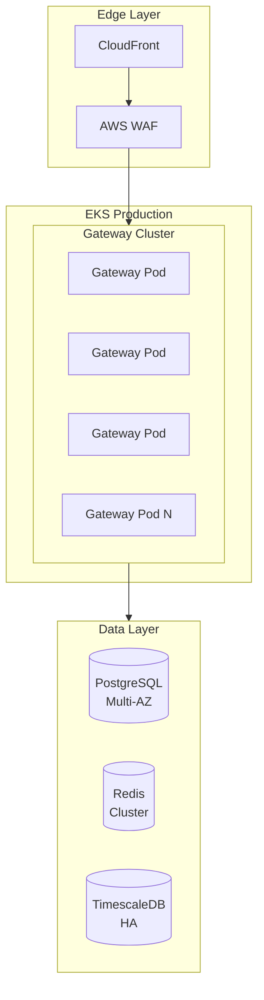

# DataHub Production Environment

## Overview

The production environment serves live API Gateway traffic for all customers.

---

## Architecture



---

## Environment Details

| Property | Value |
|----------|-------|
| Gateway URL | https://gateway.datahub.io |
| Admin URL | https://admin.datahub.io |
| Cluster | datahub-production |
| Regions | us-east-1 (primary), us-west-2 (DR) |

---

## Scaling Configuration

```yaml
# Auto-scaling configuration
apiVersion: autoscaling/v2
kind: HorizontalPodAutoscaler
metadata:
  name: datahub-gateway
spec:
  scaleTargetRef:
    apiVersion: apps/v1
    kind: Deployment
    name: datahub-gateway
  minReplicas: 6
  maxReplicas: 50
  metrics:
    - type: Resource
      resource:
        name: cpu
        target:
          type: Utilization
          averageUtilization: 70
    - type: Resource
      resource:
        name: memory
        target:
          type: Utilization
          averageUtilization: 80
```

---

## SLA Targets

| Metric | Target |
|--------|--------|
| Uptime | 99.99% |
| P95 Latency | < 100ms |
| P99 Latency | < 200ms |
| Error Rate | < 0.01% |

---

## Incident Response

### Severity Levels

| Level | Response | Example |
|-------|----------|---------|
| SEV1 | 15 min | Gateway down |
| SEV2 | 30 min | High error rate |
| SEV3 | 2 hours | Performance degraded |

### Contacts

- On-call: PagerDuty rotation
- Escalation: #datahub-incidents Slack

---

## Related Documents

- [Staging Environment](./staging.md)
- [Deployment Process](../workflows/deployment.md)
