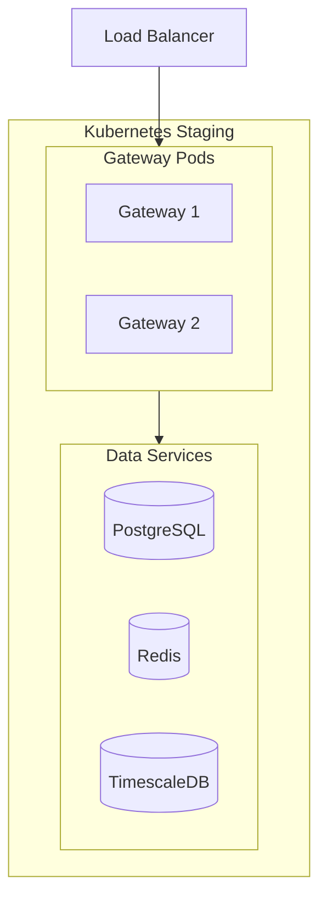

# DataHub Staging Environment

## Overview

The staging environment mirrors production for final testing of the API Gateway platform.

---

## Architecture



---

## Environment Details

| Property | Value |
|----------|-------|
| URL | https://staging-gateway.datahub.io |
| Admin URL | https://staging-admin.datahub.io |
| Cluster | datahub-staging |
| Region | us-east-1 |

---

## Specifications

| Component | Staging | Production |
|-----------|---------|------------|
| Gateway Replicas | 2 | 6+ |
| CPU per Pod | 500m | 2000m |
| Memory per Pod | 1Gi | 4Gi |
| Redis | Single node | Cluster |
| PostgreSQL | Single node | Multi-AZ |

---

## Access

```bash
# Configure kubectl
aws eks update-kubeconfig --name datahub-staging --region us-east-1

# View gateway pods
kubectl get pods -n datahub-staging -l app=gateway

# View logs
kubectl logs -f deployment/datahub-gateway -n datahub-staging

# Port forward for debugging
kubectl port-forward svc/datahub-gateway 3001:3001 -n datahub-staging
```

---

## Testing

```bash
# Health check
curl https://staging-gateway.datahub.io/health

# Test with staging API key
curl https://staging-gateway.datahub.io/api/proxy/test \
  -H "X-API-Key: staging_test_key_xxx"

# Load test
npm run test:load -- --env staging
```

---

## Related Documents

- [Production Environment](./production.md)
- [Deployment Process](../workflows/deployment.md)
