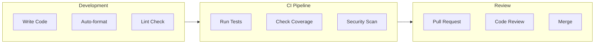

# DataHub Coding Standards

## Overview

Coding standards and best practices for the DataHub API Gateway codebase.

---

## Code Quality Flow



---

## TypeScript Standards

### Strict Mode Configuration

```json
// tsconfig.json
{
  "compilerOptions": {
    "strict": true,
    "noImplicitAny": true,
    "strictNullChecks": true,
    "noUnusedLocals": true,
    "noUnusedParameters": true,
    "noImplicitReturns": true,
    "esModuleInterop": true,
    "skipLibCheck": true,
    "forceConsistentCasingInFileNames": true
  }
}
```

### Type Definitions

```typescript
// Always define explicit types for function parameters and returns
function calculateRateLimit(
  requestCount: number,
  windowMs: number
): RateLimitResult {
  // ...
}

// Use interfaces for object shapes
interface ApiKey {
  id: string;
  name: string;
  prefix: string;
  hashedKey: string;
  status: 'active' | 'revoked';
  rateLimit: number;
  createdAt: Date;
}

// Use type aliases for unions and complex types
type HttpMethod = 'GET' | 'POST' | 'PUT' | 'PATCH' | 'DELETE';

type RequestHandler = (req: Request, res: Response) => Promise<void>;
```

### Naming Conventions

| Element | Convention | Example |
|---------|------------|---------|
| Variables | camelCase | `apiKeyCount` |
| Constants | SCREAMING_SNAKE | `MAX_RATE_LIMIT` |
| Functions | camelCase | `validateApiKey()` |
| Classes | PascalCase | `RateLimiter` |
| Interfaces | PascalCase | `ApiKeyConfig` |
| Types | PascalCase | `HttpMethod` |
| Files | kebab-case | `rate-limiter.ts` |
| Directories | kebab-case | `api-keys/` |

---

## ESLint Configuration

```javascript
// .eslintrc.js
module.exports = {
  parser: '@typescript-eslint/parser',
  extends: [
    'eslint:recommended',
    'plugin:@typescript-eslint/recommended',
    'plugin:prettier/recommended',
  ],
  plugins: ['@typescript-eslint'],
  rules: {
    // TypeScript
    '@typescript-eslint/explicit-function-return-type': 'error',
    '@typescript-eslint/no-explicit-any': 'error',
    '@typescript-eslint/no-unused-vars': ['error', { argsIgnorePattern: '^_' }],

    // General
    'no-console': ['error', { allow: ['warn', 'error'] }],
    'prefer-const': 'error',
    'no-var': 'error',
    'eqeqeq': ['error', 'always'],

    // Import
    'import/order': [
      'error',
      {
        groups: ['builtin', 'external', 'internal', 'parent', 'sibling'],
        'newlines-between': 'always',
        alphabetize: { order: 'asc' },
      },
    ],
  },
};
```

---

## Prettier Configuration

```json
// .prettierrc
{
  "semi": true,
  "singleQuote": true,
  "tabWidth": 2,
  "trailingComma": "es5",
  "printWidth": 100,
  "bracketSpacing": true,
  "arrowParens": "avoid"
}
```

---

## Code Organization

### File Structure

```typescript
// src/services/api-key.service.ts

// 1. Imports (grouped and sorted)
import { PrismaClient } from '@prisma/client';
import { hash, compare } from 'bcrypt';

import { ApiKeyRepository } from '../repositories/api-key.repository';
import { generateApiKey } from '../utils/key-generator';
import { ApiKeyError } from '../errors/api-key.error';

// 2. Types and Interfaces
interface CreateApiKeyInput {
  name: string;
  rateLimit: number;
  allowedIPs?: string[];
}

interface ApiKeyResult {
  id: string;
  key: string;
  name: string;
}

// 3. Constants
const HASH_ROUNDS = 10;
const KEY_PREFIX = 'dh_';

// 4. Class Definition
export class ApiKeyService {
  constructor(
    private readonly repository: ApiKeyRepository,
    private readonly prisma: PrismaClient
  ) {}

  // 5. Public Methods
  async create(input: CreateApiKeyInput): Promise<ApiKeyResult> {
    // Implementation
  }

  async validate(key: string): Promise<boolean> {
    // Implementation
  }

  // 6. Private Methods
  private generateKeyPrefix(environment: string): string {
    // Implementation
  }
}
```

### Module Exports

```typescript
// src/services/index.ts
export { ApiKeyService } from './api-key.service';
export { RateLimiterService } from './rate-limiter.service';
export { ProxyService } from './proxy.service';

// Use barrel exports for cleaner imports
import { ApiKeyService, RateLimiterService } from './services';
```

---

## Error Handling

### Custom Error Classes

```typescript
// src/errors/base.error.ts
export abstract class BaseError extends Error {
  abstract readonly code: string;
  abstract readonly statusCode: number;

  constructor(
    message: string,
    public readonly details?: Record<string, unknown>
  ) {
    super(message);
    this.name = this.constructor.name;
    Error.captureStackTrace(this, this.constructor);
  }

  toJSON(): object {
    return {
      error: {
        code: this.code,
        message: this.message,
        details: this.details,
      },
    };
  }
}

// src/errors/rate-limit.error.ts
export class RateLimitError extends BaseError {
  readonly code = 'RATE_LIMIT_EXCEEDED';
  readonly statusCode = 429;

  constructor(limit: number, resetAt: Date) {
    super('Rate limit exceeded', { limit, resetAt });
  }
}
```

### Error Handling Pattern

```typescript
// Controller layer
async function handleRequest(req: Request, res: Response): Promise<void> {
  try {
    const result = await service.process(req.body);
    res.json(result);
  } catch (error) {
    if (error instanceof BaseError) {
      res.status(error.statusCode).json(error.toJSON());
    } else {
      logger.error('Unexpected error', { error });
      res.status(500).json({
        error: {
          code: 'INTERNAL_ERROR',
          message: 'An unexpected error occurred',
        },
      });
    }
  }
}
```

---

## Async/Await Patterns

```typescript
// Always use async/await over callbacks
// Good
async function getApiKey(id: string): Promise<ApiKey | null> {
  return await repository.findById(id);
}

// Bad - using callbacks
function getApiKey(id: string, callback: (err: Error, key: ApiKey) => void) {
  repository.findById(id, callback);
}

// Handle multiple async operations
async function processRequest(keyId: string): Promise<void> {
  // Sequential when order matters
  const key = await validateKey(keyId);
  const result = await forwardRequest(key);
  await logAnalytics(result);

  // Parallel when independent
  const [user, settings, permissions] = await Promise.all([
    getUser(userId),
    getSettings(userId),
    getPermissions(userId),
  ]);
}
```

---

## Testing Standards

### Test File Naming

```
src/
  services/
    api-key.service.ts
    api-key.service.test.ts  # Unit test
tests/
  integration/
    api-key.integration.test.ts
  e2e/
    api-key.e2e.test.ts
```

### Test Structure

```typescript
describe('ApiKeyService', () => {
  let service: ApiKeyService;
  let mockRepository: jest.Mocked<ApiKeyRepository>;

  beforeEach(() => {
    mockRepository = createMockRepository();
    service = new ApiKeyService(mockRepository);
  });

  describe('create', () => {
    it('should create a new API key with valid input', async () => {
      // Arrange
      const input = { name: 'Test Key', rateLimit: 1000 };
      mockRepository.create.mockResolvedValue({ id: 'key_123', ...input });

      // Act
      const result = await service.create(input);

      // Assert
      expect(result.id).toBe('key_123');
      expect(mockRepository.create).toHaveBeenCalledWith(
        expect.objectContaining({ name: 'Test Key' })
      );
    });

    it('should throw validation error for negative rate limit', async () => {
      // Arrange
      const input = { name: 'Test Key', rateLimit: -100 };

      // Act & Assert
      await expect(service.create(input)).rejects.toThrow(ValidationError);
    });
  });
});
```

---

## Documentation Standards

### JSDoc Comments

```typescript
/**
 * Validates an API key and returns its configuration.
 *
 * @param key - The raw API key to validate
 * @returns The API key configuration if valid, null otherwise
 * @throws {ApiKeyError} If the key format is invalid
 *
 * @example
 * ```typescript
 * const config = await validateApiKey('dh_prod_sk_abc123');
 * if (config) {
 *   console.log(`Rate limit: ${config.rateLimit}`);
 * }
 * ```
 */
async function validateApiKey(key: string): Promise<ApiKeyConfig | null> {
  // Implementation
}
```

---

## Git Commit Standards

### Commit Message Format

```
type(scope): description

[optional body]

[optional footer]
```

### Types

| Type | Description |
|------|-------------|
| `feat` | New feature |
| `fix` | Bug fix |
| `docs` | Documentation |
| `style` | Code style (no logic change) |
| `refactor` | Code refactoring |
| `test` | Adding tests |
| `chore` | Maintenance tasks |

### Examples

```bash
feat(rate-limiter): add sliding window algorithm

fix(auth): handle expired JWT tokens correctly

docs(api): update rate limiting documentation

refactor(proxy): extract request builder to separate module
```

---

## Related Documents

- [Project Setup](./setup.md)
- [Testing Strategy](../testing/strategy.md)
- [Git Workflow](../workflows/git-workflow.md)
