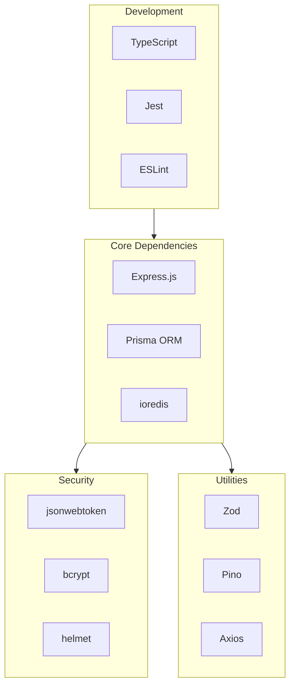
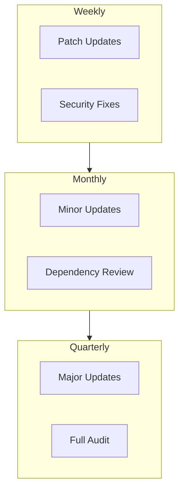

# DataHub Dependencies

## Overview

Complete reference of all dependencies used in the DataHub API Gateway platform.

---

## Dependency Architecture



---

## Production Dependencies

### Core Framework

| Package | Version | Purpose |
|---------|---------|---------|
| `express` | ^4.18.x | HTTP server framework |
| `cors` | ^2.8.x | CORS middleware |
| `compression` | ^1.7.x | Response compression |
| `helmet` | ^7.1.x | Security headers |

```json
{
  "express": "^4.18.2",
  "cors": "^2.8.5",
  "compression": "^1.7.4",
  "helmet": "^7.1.0"
}
```

### Database & Cache

| Package | Version | Purpose |
|---------|---------|---------|
| `@prisma/client` | ^5.x | PostgreSQL ORM client |
| `ioredis` | ^5.x | Redis client |
| `pg` | ^8.x | PostgreSQL driver |

```json
{
  "@prisma/client": "^5.9.1",
  "ioredis": "^5.3.2",
  "pg": "^8.11.3"
}
```

### Authentication & Security

| Package | Version | Purpose |
|---------|---------|---------|
| `jsonwebtoken` | ^9.x | JWT token handling |
| `bcrypt` | ^5.x | Password hashing |
| `crypto` | built-in | Cryptographic functions |

```json
{
  "jsonwebtoken": "^9.0.2",
  "bcrypt": "^5.1.1"
}
```

### Validation & Parsing

| Package | Version | Purpose |
|---------|---------|---------|
| `zod` | ^3.x | Schema validation |
| `uuid` | ^9.x | UUID generation |
| `date-fns` | ^3.x | Date manipulation |

```json
{
  "zod": "^3.22.4",
  "uuid": "^9.0.1",
  "date-fns": "^3.3.1"
}
```

### HTTP Client

| Package | Version | Purpose |
|---------|---------|---------|
| `axios` | ^1.6.x | HTTP client for upstream requests |
| `http-proxy-middleware` | ^2.x | Request proxying |

```json
{
  "axios": "^1.6.7",
  "http-proxy-middleware": "^2.0.6"
}
```

### Logging & Monitoring

| Package | Version | Purpose |
|---------|---------|---------|
| `pino` | ^8.x | Fast JSON logger |
| `pino-http` | ^9.x | HTTP request logging |
| `prom-client` | ^15.x | Prometheus metrics |

```json
{
  "pino": "^8.18.0",
  "pino-http": "^9.0.0",
  "prom-client": "^15.1.0"
}
```

---

## Development Dependencies

### TypeScript

| Package | Version | Purpose |
|---------|---------|---------|
| `typescript` | ^5.x | TypeScript compiler |
| `ts-node` | ^10.x | TypeScript execution |
| `tsx` | ^4.x | TypeScript execute |
| `@types/node` | ^20.x | Node.js type definitions |

```json
{
  "typescript": "^5.3.3",
  "ts-node": "^10.9.2",
  "tsx": "^4.7.1",
  "@types/node": "^20.11.16"
}
```

### Type Definitions

| Package | Version | Purpose |
|---------|---------|---------|
| `@types/express` | ^4.x | Express types |
| `@types/cors` | ^2.x | CORS types |
| `@types/bcrypt` | ^5.x | bcrypt types |
| `@types/jsonwebtoken` | ^9.x | JWT types |
| `@types/uuid` | ^9.x | UUID types |

```json
{
  "@types/express": "^4.17.21",
  "@types/cors": "^2.8.17",
  "@types/bcrypt": "^5.0.2",
  "@types/jsonwebtoken": "^9.0.5",
  "@types/uuid": "^9.0.8"
}
```

### Testing

| Package | Version | Purpose |
|---------|---------|---------|
| `jest` | ^29.x | Test runner |
| `ts-jest` | ^29.x | TypeScript Jest preset |
| `supertest` | ^6.x | HTTP testing |
| `@playwright/test` | ^1.x | E2E testing |

```json
{
  "jest": "^29.7.0",
  "ts-jest": "^29.1.2",
  "@types/jest": "^29.5.12",
  "supertest": "^6.3.4",
  "@types/supertest": "^6.0.2",
  "@playwright/test": "^1.41.2"
}
```

### Code Quality

| Package | Version | Purpose |
|---------|---------|---------|
| `eslint` | ^8.x | Code linting |
| `@typescript-eslint/parser` | ^6.x | TypeScript ESLint |
| `prettier` | ^3.x | Code formatting |
| `husky` | ^9.x | Git hooks |
| `lint-staged` | ^15.x | Staged file linting |

```json
{
  "eslint": "^8.56.0",
  "@typescript-eslint/eslint-plugin": "^6.20.0",
  "@typescript-eslint/parser": "^6.20.0",
  "prettier": "^3.2.5",
  "eslint-config-prettier": "^9.1.0",
  "husky": "^9.0.10",
  "lint-staged": "^15.2.2"
}
```

### Build Tools

| Package | Version | Purpose |
|---------|---------|---------|
| `esbuild` | ^0.20.x | Fast bundler |
| `nodemon` | ^3.x | Development server |
| `dotenv` | ^16.x | Environment variables |
| `prisma` | ^5.x | Prisma CLI |

```json
{
  "esbuild": "^0.20.0",
  "nodemon": "^3.0.3",
  "dotenv": "^16.4.1",
  "prisma": "^5.9.1"
}
```

---

## Infrastructure Dependencies

### Docker Images

| Image | Tag | Purpose |
|-------|-----|---------|
| `node` | 20-alpine | Application runtime |
| `postgres` | 15-alpine | Primary database |
| `redis` | 7-alpine | Cache & rate limiting |
| `timescale/timescaledb` | latest-pg15 | Analytics database |

### Kubernetes Resources

| Resource | Purpose |
|----------|---------|
| Deployment | Gateway pod management |
| Service | Internal load balancing |
| Ingress | External access |
| ConfigMap | Configuration storage |
| Secret | Sensitive data storage |
| HPA | Auto-scaling |

---

## Dependency Update Strategy



### Update Process

1. **Weekly**: Apply security patches automatically via Dependabot
2. **Monthly**: Review and apply minor updates
3. **Quarterly**: Evaluate major version upgrades

### Commands

```bash
# Check for outdated packages
npm outdated

# Update all to latest compatible
npm update

# Check for security vulnerabilities
npm audit

# Fix security issues
npm audit fix

# Interactive update (requires npm-check-updates)
npx npm-check-updates -i
```

---

## Security Considerations

### Known Vulnerable Packages

Always keep these packages updated due to frequent security issues:

| Package | Concern |
|---------|---------|
| `express` | Security patches |
| `jsonwebtoken` | Algorithm vulnerabilities |
| `axios` | SSRF protection |

### Audit Configuration

```json
// .npmrc
audit-level=moderate
```

```bash
# Run in CI
npm audit --audit-level=moderate
```

---

## License Compliance

| License | Packages | Allowed |
|---------|----------|---------|
| MIT | Most packages | Yes |
| Apache-2.0 | TypeScript, Prisma | Yes |
| ISC | Many utilities | Yes |
| BSD | Some packages | Yes |
| GPL | None | No |

```bash
# Check licenses
npx license-checker --summary
```

---

## Related Documents

- [Project Setup](./setup.md)
- [Coding Standards](./coding-standards.md)
- [Docker Configuration](../environments/docker.md)
