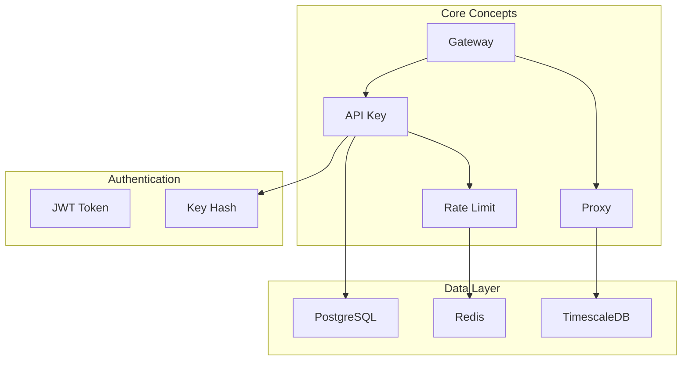
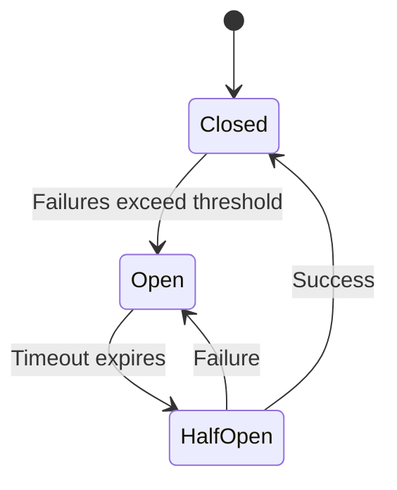
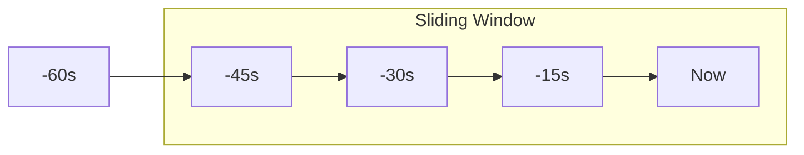

# DataHub Glossary

## Overview

Comprehensive glossary of terms, acronyms, and concepts used in the DataHub API Gateway platform.

---

## Term Relationships



---

## A

### API Gateway
A server that acts as an intermediary between clients and backend services, handling authentication, rate limiting, request routing, and analytics collection.

### API Key
A unique identifier used to authenticate API requests. In DataHub, keys follow the format `dh_{environment}_{type}_{random}`.

### Analytics
Time-series data collected about API requests including latency, status codes, request volume, and error rates.

---

## B

### Burst Limit
The maximum number of requests allowed in a short time period before rate limiting kicks in. Allows temporary spikes in traffic.

### Bearer Token
An authentication token included in the `Authorization` header, typically used for JWT-based authentication in the Admin API.

---

## C

### Circuit Breaker
A design pattern that prevents cascading failures by stopping requests to a failing upstream service until it recovers.



### CIDR
Classless Inter-Domain Routing. Used to specify IP address ranges for allowlisting (e.g., `203.0.113.0/24`).

### Correlation ID
See Request ID.

---

## D

### DataHub
The name of the API Gateway platform being documented.

### Dead Letter Queue (DLQ)
A queue that stores failed or unprocessable messages for later analysis and retry.

---

## E

### Edge Layer
The outermost layer of the infrastructure that handles incoming traffic, typically including CDN and WAF.

### EKS
Amazon Elastic Kubernetes Service. The managed Kubernetes platform used for production deployment.

---

## F

### Failover
The automatic switching to a backup system when the primary system fails.

### Fan-out
A messaging pattern where a single message is sent to multiple consumers.

---

## G

### Gateway Service
The main DataHub service that handles incoming API requests, performs authentication, applies rate limits, and proxies to upstream services.

### gRPC
A high-performance RPC framework. DataHub uses REST but can proxy gRPC requests.

---

## H

### Health Check
An endpoint (`/health`) that returns the operational status of the gateway and its dependencies.

### HPA
Horizontal Pod Autoscaler. Kubernetes component that automatically scales pods based on metrics.

### Hashed Key
The bcrypt-hashed version of an API key stored in the database for security.

---

## I

### Idempotency
The property where multiple identical requests produce the same result as a single request.

### Ingress
Kubernetes resource that manages external access to services in a cluster.

---

## J

### JWT (JSON Web Token)
A compact, URL-safe token format used for authentication in the Admin API. Contains claims about the user and permissions.

```json
{
  "sub": "user_123",
  "email": "admin@datahub.io",
  "role": "admin",
  "exp": 1705750800
}
```

---

## K

### Key Prefix
The first portion of an API key that identifies its environment and type (e.g., `dh_prod_sk_`).

### Kubernetes (K8s)
Container orchestration platform used for deploying and managing DataHub in production.

---

## L

### Latency
The time taken to process a request, typically measured in milliseconds. DataHub tracks P50, P95, and P99 latencies.

### Load Balancer
A component that distributes incoming traffic across multiple gateway instances.

---

## M

### Metrics
Quantitative measurements about system performance exposed via Prometheus format at `/metrics`.

### Middleware
Functions that process requests between receiving and responding, such as authentication and rate limiting.

### Multi-AZ
Multi-Availability Zone. Deployment across multiple data centers for high availability.

---

## N

### Namespace
A Kubernetes concept for isolating resources. DataHub uses separate namespaces for staging and production.

### Node
A worker machine in Kubernetes that runs containerized applications.

---

## O

### OAuth 2.0
Authorization framework that DataHub supports for upstream service authentication.

### Origin
The domain from which a request originates. Used in CORS and origin allowlisting.

---

## P

### P50/P95/P99
Percentile latency metrics. P95 = 95% of requests complete faster than this value.

### Pod
The smallest deployable unit in Kubernetes, containing one or more containers.

### Prisma
The ORM (Object-Relational Mapping) used for PostgreSQL database operations.

### Proxy
The process of forwarding client requests to upstream services and returning responses.

---

## Q

### Queue
A data structure for handling asynchronous tasks. DataHub uses Redis for job queues.

### Quota
The maximum allowed usage of a resource, such as API requests per month.

---

## R

### Rate Limit
The maximum number of requests allowed within a time window. Expressed as requests per minute (RPM).

### Redis
In-memory data store used for caching API key data and storing rate limit counters.

### Request ID
A unique identifier assigned to each request for tracing and debugging. Format: `req_{uuid}`.

### Retry
The automatic re-attempt of a failed request to an upstream service.

---

## S

### Secret Key (SK)
An API key type with full access permissions. Should be kept confidential.

### Service Mesh
Infrastructure layer for handling service-to-service communication.

### Sliding Window
A rate limiting algorithm that considers requests in a rolling time window rather than fixed intervals.



---

## T

### Throttling
The practice of limiting the rate of requests to prevent overload.

### TimescaleDB
PostgreSQL extension for time-series data, used for storing analytics.

### Token Bucket
A rate limiting algorithm that uses tokens to control request flow.

### TTL (Time To Live)
The duration for which cached data remains valid before expiring.

---

## U

### Upstream Service
A backend service that DataHub proxies requests to.

### UUID
Universally Unique Identifier. Used for generating unique IDs throughout the system.

---

## V

### Validation
The process of checking that request data meets required formats and constraints.

### VPC
Virtual Private Cloud. AWS network isolation for secure communication.

---

## W

### WAF
Web Application Firewall. Protects against common web exploits.

### Webhook
HTTP callback triggered by events in the system.

### Window
The time period used for rate limiting calculations (e.g., 60 seconds).

---

## X

### X-API-Key
The HTTP header used to pass the API key for authentication.

### X-Request-ID
The HTTP header containing the unique request identifier.

### X-Rate-Limit-*
HTTP headers that communicate rate limit status to clients.

---

## Y

### YAML
Data serialization format used for Kubernetes configurations and Docker Compose files.

---

## Z

### Zero Downtime Deployment
Deployment strategy that ensures no service interruption during updates.

---

## Acronyms Reference

| Acronym | Full Form |
|---------|-----------|
| API | Application Programming Interface |
| CDN | Content Delivery Network |
| CORS | Cross-Origin Resource Sharing |
| CPU | Central Processing Unit |
| DB | Database |
| DNS | Domain Name System |
| EKS | Elastic Kubernetes Service |
| gRPC | gRPC Remote Procedure Call |
| HA | High Availability |
| HPA | Horizontal Pod Autoscaler |
| HTTP | Hypertext Transfer Protocol |
| JWT | JSON Web Token |
| K8s | Kubernetes |
| ORM | Object-Relational Mapping |
| REST | Representational State Transfer |
| RPS | Requests Per Second |
| SDK | Software Development Kit |
| SLA | Service Level Agreement |
| SQL | Structured Query Language |
| SSL | Secure Sockets Layer |
| TLS | Transport Layer Security |
| TTL | Time To Live |
| UUID | Universally Unique Identifier |
| VPC | Virtual Private Cloud |
| WAF | Web Application Firewall |

---

## Related Documents

- [Architecture Overview](../architecture/overview.md)
- [API Reference](../api/reference.md)
