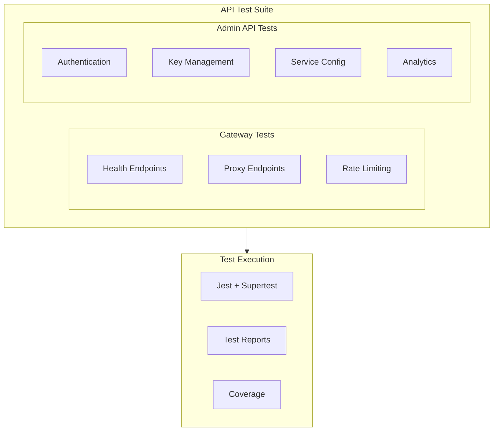
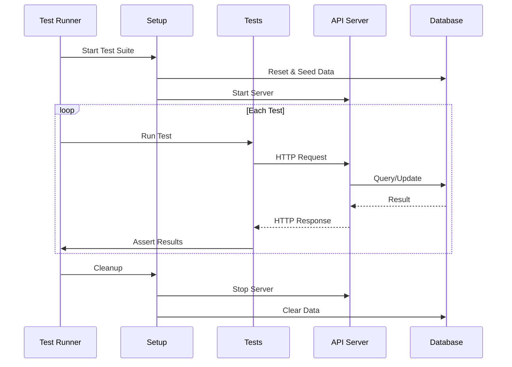

# DataHub API Test Suite

## Overview

Comprehensive API test suite for validating all DataHub API Gateway endpoints using automated testing.

---

## Test Suite Architecture



---

## Gateway API Tests

### Health Endpoint Tests

```typescript
// tests/api/gateway/health.test.ts
import request from 'supertest';
import { app } from '@/app';

describe('GET /health', () => {
  it('should return 200 with health status', async () => {
    const response = await request(app)
      .get('/health')
      .expect('Content-Type', /json/)
      .expect(200);

    expect(response.body).toMatchObject({
      status: 'healthy',
      version: expect.any(String),
      uptime: expect.any(Number),
      checks: {
        database: 'healthy',
        redis: 'healthy',
        timescale: 'healthy',
      },
    });
  });

  it('should return 503 when database is down', async () => {
    // Simulate database failure
    jest.spyOn(prisma, '$queryRaw').mockRejectedValue(new Error('Connection failed'));

    const response = await request(app)
      .get('/health')
      .expect(503);

    expect(response.body.status).toBe('unhealthy');
    expect(response.body.checks.database).toBe('unhealthy');
  });
});

describe('GET /health/ready', () => {
  it('should return 200 when ready to accept traffic', async () => {
    const response = await request(app)
      .get('/health/ready')
      .expect(200);

    expect(response.body.ready).toBe(true);
  });
});

describe('GET /health/live', () => {
  it('should return 200 for liveness probe', async () => {
    await request(app)
      .get('/health/live')
      .expect(200);
  });
});
```

### Proxy Endpoint Tests

```typescript
// tests/api/gateway/proxy.test.ts
import request from 'supertest';
import { app } from '@/app';
import { ApiKeyFactory } from '@/tests/factories/api-key.factory';

describe('Proxy Endpoints', () => {
  let validKey: string;

  beforeAll(async () => {
    const key = ApiKeyFactory.create();
    validKey = key.rawKey;
    await prisma.apiKey.create({ data: key });
  });

  describe('ANY /api/proxy/*', () => {
    it('should proxy GET request to upstream', async () => {
      const response = await request(app)
        .get('/api/proxy/users')
        .set('X-API-Key', validKey)
        .expect(200);

      expect(response.headers['x-request-id']).toBeDefined();
      expect(response.headers['x-response-time']).toBeDefined();
    });

    it('should proxy POST request with body', async () => {
      const payload = { name: 'Test User', email: 'test@example.com' };

      const response = await request(app)
        .post('/api/proxy/users')
        .set('X-API-Key', validKey)
        .send(payload)
        .expect(201);

      expect(response.body).toBeDefined();
    });

    it('should proxy PUT request', async () => {
      const response = await request(app)
        .put('/api/proxy/users/123')
        .set('X-API-Key', validKey)
        .send({ name: 'Updated Name' })
        .expect(200);

      expect(response.body).toBeDefined();
    });

    it('should proxy DELETE request', async () => {
      await request(app)
        .delete('/api/proxy/users/123')
        .set('X-API-Key', validKey)
        .expect(204);
    });

    it('should return 401 without API key', async () => {
      const response = await request(app)
        .get('/api/proxy/users')
        .expect(401);

      expect(response.body.error.code).toBe('INVALID_API_KEY');
    });

    it('should return 401 with invalid API key', async () => {
      const response = await request(app)
        .get('/api/proxy/users')
        .set('X-API-Key', 'invalid_key')
        .expect(401);

      expect(response.body.error.code).toBe('INVALID_API_KEY');
    });

    it('should include rate limit headers', async () => {
      const response = await request(app)
        .get('/api/proxy/users')
        .set('X-API-Key', validKey)
        .expect(200);

      expect(response.headers['x-rate-limit-limit']).toBeDefined();
      expect(response.headers['x-rate-limit-remaining']).toBeDefined();
      expect(response.headers['x-rate-limit-reset']).toBeDefined();
    });
  });
});
```

---

## Admin API Tests

### Authentication Tests

```typescript
// tests/api/admin/auth.test.ts
import request from 'supertest';
import { adminApp } from '@/admin-app';

describe('Authentication API', () => {
  describe('POST /auth/login', () => {
    it('should return tokens for valid credentials', async () => {
      const response = await request(adminApp)
        .post('/auth/login')
        .send({
          email: 'admin@datahub.io',
          password: 'test-password',
        })
        .expect(200);

      expect(response.body).toMatchObject({
        accessToken: expect.any(String),
        refreshToken: expect.any(String),
        expiresIn: expect.any(Number),
      });
    });

    it('should return 401 for invalid password', async () => {
      const response = await request(adminApp)
        .post('/auth/login')
        .send({
          email: 'admin@datahub.io',
          password: 'wrong-password',
        })
        .expect(401);

      expect(response.body.error.code).toBe('INVALID_CREDENTIALS');
    });

    it('should return 401 for non-existent user', async () => {
      const response = await request(adminApp)
        .post('/auth/login')
        .send({
          email: 'nonexistent@datahub.io',
          password: 'any-password',
        })
        .expect(401);

      expect(response.body.error.code).toBe('INVALID_CREDENTIALS');
    });

    it('should return 422 for missing email', async () => {
      const response = await request(adminApp)
        .post('/auth/login')
        .send({ password: 'test-password' })
        .expect(422);

      expect(response.body.error.code).toBe('VALIDATION_ERROR');
    });
  });

  describe('POST /auth/refresh', () => {
    let refreshToken: string;

    beforeAll(async () => {
      const loginResponse = await request(adminApp)
        .post('/auth/login')
        .send({
          email: 'admin@datahub.io',
          password: 'test-password',
        });
      refreshToken = loginResponse.body.refreshToken;
    });

    it('should return new access token', async () => {
      const response = await request(adminApp)
        .post('/auth/refresh')
        .send({ refreshToken })
        .expect(200);

      expect(response.body.accessToken).toBeDefined();
    });

    it('should return 401 for invalid refresh token', async () => {
      const response = await request(adminApp)
        .post('/auth/refresh')
        .send({ refreshToken: 'invalid_token' })
        .expect(401);

      expect(response.body.error.code).toBe('INVALID_REFRESH_TOKEN');
    });
  });
});
```

### API Key Management Tests

```typescript
// tests/api/admin/keys.test.ts
import request from 'supertest';
import { adminApp } from '@/admin-app';

describe('API Key Management', () => {
  let authToken: string;

  beforeAll(async () => {
    const loginResponse = await request(adminApp)
      .post('/auth/login')
      .send({ email: 'admin@datahub.io', password: 'test-password' });
    authToken = loginResponse.body.accessToken;
  });

  describe('GET /api/keys', () => {
    it('should list all API keys', async () => {
      const response = await request(adminApp)
        .get('/api/keys')
        .set('Authorization', `Bearer ${authToken}`)
        .expect(200);

      expect(response.body.data).toBeInstanceOf(Array);
      expect(response.body.pagination).toBeDefined();
    });

    it('should paginate results', async () => {
      const response = await request(adminApp)
        .get('/api/keys?page=1&limit=5')
        .set('Authorization', `Bearer ${authToken}`)
        .expect(200);

      expect(response.body.data.length).toBeLessThanOrEqual(5);
      expect(response.body.pagination.limit).toBe(5);
    });

    it('should filter by status', async () => {
      const response = await request(adminApp)
        .get('/api/keys?status=active')
        .set('Authorization', `Bearer ${authToken}`)
        .expect(200);

      response.body.data.forEach((key: any) => {
        expect(key.status).toBe('active');
      });
    });
  });

  describe('POST /api/keys', () => {
    it('should create new API key', async () => {
      const response = await request(adminApp)
        .post('/api/keys')
        .set('Authorization', `Bearer ${authToken}`)
        .send({
          name: 'Test API Key',
          rateLimit: 1000,
        })
        .expect(201);

      expect(response.body).toMatchObject({
        id: expect.any(String),
        name: 'Test API Key',
        key: expect.stringMatching(/^dh_/),
        rateLimit: 1000,
      });
    });

    it('should create key with restrictions', async () => {
      const response = await request(adminApp)
        .post('/api/keys')
        .set('Authorization', `Bearer ${authToken}`)
        .send({
          name: 'Restricted Key',
          rateLimit: 500,
          allowedIPs: ['203.0.113.0/24'],
          allowedOrigins: ['https://example.com'],
        })
        .expect(201);

      expect(response.body.allowedIPs).toContain('203.0.113.0/24');
    });

    it('should return 422 for invalid rate limit', async () => {
      const response = await request(adminApp)
        .post('/api/keys')
        .set('Authorization', `Bearer ${authToken}`)
        .send({
          name: 'Invalid Key',
          rateLimit: -100,
        })
        .expect(422);

      expect(response.body.error.code).toBe('VALIDATION_ERROR');
    });
  });

  describe('GET /api/keys/:id', () => {
    let keyId: string;

    beforeAll(async () => {
      const createResponse = await request(adminApp)
        .post('/api/keys')
        .set('Authorization', `Bearer ${authToken}`)
        .send({ name: 'Get Test Key', rateLimit: 1000 });
      keyId = createResponse.body.id;
    });

    it('should return key details', async () => {
      const response = await request(adminApp)
        .get(`/api/keys/${keyId}`)
        .set('Authorization', `Bearer ${authToken}`)
        .expect(200);

      expect(response.body.id).toBe(keyId);
      expect(response.body.name).toBe('Get Test Key');
    });

    it('should return 404 for non-existent key', async () => {
      const response = await request(adminApp)
        .get('/api/keys/nonexistent_id')
        .set('Authorization', `Bearer ${authToken}`)
        .expect(404);

      expect(response.body.error.code).toBe('NOT_FOUND');
    });
  });

  describe('PATCH /api/keys/:id', () => {
    let keyId: string;

    beforeEach(async () => {
      const createResponse = await request(adminApp)
        .post('/api/keys')
        .set('Authorization', `Bearer ${authToken}`)
        .send({ name: 'Update Test Key', rateLimit: 1000 });
      keyId = createResponse.body.id;
    });

    it('should update key properties', async () => {
      const response = await request(adminApp)
        .patch(`/api/keys/${keyId}`)
        .set('Authorization', `Bearer ${authToken}`)
        .send({ rateLimit: 2000 })
        .expect(200);

      expect(response.body.rateLimit).toBe(2000);
    });

    it('should revoke key', async () => {
      const response = await request(adminApp)
        .patch(`/api/keys/${keyId}`)
        .set('Authorization', `Bearer ${authToken}`)
        .send({ status: 'revoked' })
        .expect(200);

      expect(response.body.status).toBe('revoked');
    });
  });

  describe('DELETE /api/keys/:id', () => {
    it('should delete API key', async () => {
      const createResponse = await request(adminApp)
        .post('/api/keys')
        .set('Authorization', `Bearer ${authToken}`)
        .send({ name: 'Delete Test Key', rateLimit: 1000 });

      await request(adminApp)
        .delete(`/api/keys/${createResponse.body.id}`)
        .set('Authorization', `Bearer ${authToken}`)
        .expect(204);
    });
  });
});
```

---

## Test Execution Flow



---

## Running Tests

```bash
# Run all API tests
npm run test:api

# Run specific test file
npm run test:api -- keys.test.ts

# Run with coverage
npm run test:api -- --coverage

# Run in watch mode
npm run test:api -- --watch

# Run with verbose output
npm run test:api -- --verbose
```

---

## Related Documents

- [Testing Strategy](./strategy.md)
- [API Reference](../api/reference.md)
- [cURL Examples](../api/curl-examples.md)
