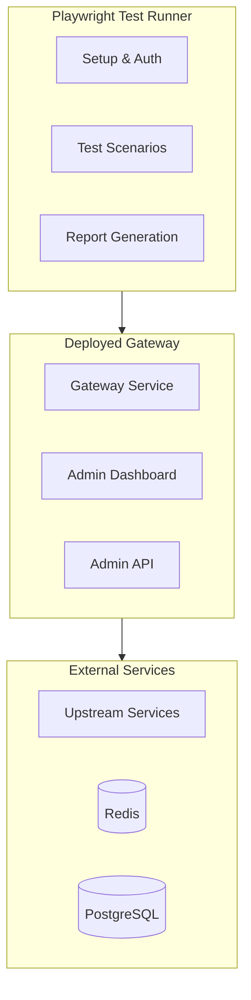
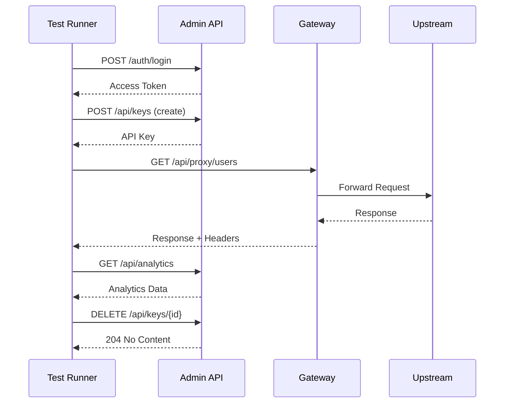

# DataHub E2E Tests

## Overview

End-to-end testing for the DataHub API Gateway, validating complete user journeys and system behavior.

---

## E2E Test Architecture



---

## Test Configuration

```typescript
// playwright.config.ts
import { PlaywrightTestConfig } from '@playwright/test';

const config: PlaywrightTestConfig = {
  testDir: './tests/e2e',
  timeout: 60000,
  retries: 2,
  workers: 4,

  use: {
    baseURL: process.env.E2E_BASE_URL || 'http://localhost:3001',
    extraHTTPHeaders: {
      'Accept': 'application/json',
    },
    trace: 'on-first-retry',
  },

  projects: [
    {
      name: 'API Tests',
      testMatch: /.*\.api\.spec\.ts/,
    },
    {
      name: 'Admin UI Tests',
      testMatch: /.*\.ui\.spec\.ts/,
      use: {
        baseURL: 'http://localhost:3002',
      },
    },
  ],

  reporter: [
    ['list'],
    ['html', { outputFolder: 'test-results/html' }],
    ['junit', { outputFile: 'test-results/junit.xml' }],
  ],
};

export default config;
```

---

## Complete Request Flow Tests

```typescript
// tests/e2e/flows/complete-request.api.spec.ts
import { test, expect } from '@playwright/test';

test.describe('Complete Request Flow', () => {
  let apiKey: string;
  let adminToken: string;

  test.beforeAll(async ({ request }) => {
    // Authenticate to admin API
    const loginResponse = await request.post('/auth/login', {
      data: {
        email: 'admin@datahub.io',
        password: 'test-password',
      },
    });
    const loginData = await loginResponse.json();
    adminToken = loginData.accessToken;

    // Create test API key
    const keyResponse = await request.post('/api/keys', {
      headers: { Authorization: `Bearer ${adminToken}` },
      data: {
        name: 'E2E Test Key',
        rateLimit: 100,
      },
    });
    const keyData = await keyResponse.json();
    apiKey = keyData.key;
  });

  test.afterAll(async ({ request }) => {
    // Cleanup: revoke test key
    await request.delete(`/api/keys/${apiKey}`, {
      headers: { Authorization: `Bearer ${adminToken}` },
    });
  });

  test('should complete full proxy request lifecycle', async ({ request }) => {
    // Step 1: Make proxy request
    const proxyResponse = await request.get('/api/proxy/users', {
      headers: { 'X-API-Key': apiKey },
    });

    expect(proxyResponse.status()).toBe(200);
    expect(proxyResponse.headers()['x-request-id']).toBeDefined();
    expect(proxyResponse.headers()['x-rate-limit-remaining']).toBeDefined();

    // Step 2: Verify analytics recorded
    await new Promise(r => setTimeout(r, 1000)); // Wait for async analytics

    const analyticsResponse = await request.get('/api/analytics/requests', {
      headers: { Authorization: `Bearer ${adminToken}` },
      params: { from: new Date().toISOString().split('T')[0] },
    });

    const analytics = await analyticsResponse.json();
    expect(analytics.summary.totalRequests).toBeGreaterThan(0);
  });

  test('should enforce rate limits correctly', async ({ request }) => {
    // Create key with low limit for testing
    const limitedKeyResponse = await request.post('/api/keys', {
      headers: { Authorization: `Bearer ${adminToken}` },
      data: { name: 'Rate Limit Test', rateLimit: 5 },
    });
    const limitedKey = (await limitedKeyResponse.json()).key;

    // Make requests until rate limited
    const results = [];
    for (let i = 0; i < 10; i++) {
      const response = await request.get('/api/proxy/health', {
        headers: { 'X-API-Key': limitedKey },
      });
      results.push(response.status());
    }

    // Should have some 200s followed by 429s
    expect(results.filter(s => s === 200).length).toBe(5);
    expect(results.filter(s => s === 429).length).toBe(5);
  });
});
```

---

## API Key Lifecycle Tests

```typescript
// tests/e2e/flows/api-key-lifecycle.api.spec.ts
import { test, expect } from '@playwright/test';

test.describe('API Key Lifecycle', () => {
  let adminToken: string;

  test.beforeAll(async ({ request }) => {
    const loginResponse = await request.post('/auth/login', {
      data: { email: 'admin@datahub.io', password: 'test-password' },
    });
    adminToken = (await loginResponse.json()).accessToken;
  });

  test('should manage complete key lifecycle', async ({ request }) => {
    // Create
    const createResponse = await request.post('/api/keys', {
      headers: { Authorization: `Bearer ${adminToken}` },
      data: {
        name: 'Lifecycle Test Key',
        rateLimit: 1000,
        allowedOrigins: ['https://example.com'],
      },
    });

    expect(createResponse.status()).toBe(201);
    const { id, key } = await createResponse.json();
    expect(key).toMatch(/^dh_/);

    // Use
    const useResponse = await request.get('/api/proxy/health', {
      headers: { 'X-API-Key': key },
    });
    expect(useResponse.status()).toBe(200);

    // Update
    const updateResponse = await request.patch(`/api/keys/${id}`, {
      headers: { Authorization: `Bearer ${adminToken}` },
      data: { rateLimit: 2000 },
    });
    expect(updateResponse.status()).toBe(200);

    // Verify update
    const getResponse = await request.get(`/api/keys/${id}`, {
      headers: { Authorization: `Bearer ${adminToken}` },
    });
    const updatedKey = await getResponse.json();
    expect(updatedKey.rateLimit).toBe(2000);

    // Revoke
    const revokeResponse = await request.patch(`/api/keys/${id}`, {
      headers: { Authorization: `Bearer ${adminToken}` },
      data: { status: 'revoked' },
    });
    expect(revokeResponse.status()).toBe(200);

    // Verify revoked
    const revokedUseResponse = await request.get('/api/proxy/health', {
      headers: { 'X-API-Key': key },
    });
    expect(revokedUseResponse.status()).toBe(401);
  });
});
```

---

## Authentication Flow Tests

```typescript
// tests/e2e/flows/authentication.api.spec.ts
import { test, expect } from '@playwright/test';

test.describe('Authentication Flows', () => {
  test('should complete login and token refresh flow', async ({ request }) => {
    // Login
    const loginResponse = await request.post('/auth/login', {
      data: {
        email: 'admin@datahub.io',
        password: 'test-password',
      },
    });

    expect(loginResponse.status()).toBe(200);
    const { accessToken, refreshToken } = await loginResponse.json();
    expect(accessToken).toBeDefined();
    expect(refreshToken).toBeDefined();

    // Use access token
    const protectedResponse = await request.get('/api/keys', {
      headers: { Authorization: `Bearer ${accessToken}` },
    });
    expect(protectedResponse.status()).toBe(200);

    // Refresh token
    const refreshResponse = await request.post('/auth/refresh', {
      data: { refreshToken },
    });

    expect(refreshResponse.status()).toBe(200);
    const { accessToken: newToken } = await refreshResponse.json();
    expect(newToken).toBeDefined();
    expect(newToken).not.toBe(accessToken);
  });

  test('should reject invalid credentials', async ({ request }) => {
    const response = await request.post('/auth/login', {
      data: {
        email: 'admin@datahub.io',
        password: 'wrong-password',
      },
    });

    expect(response.status()).toBe(401);
    const body = await response.json();
    expect(body.error.code).toBe('INVALID_CREDENTIALS');
  });

  test('should reject expired tokens', async ({ request }) => {
    // Using a known expired token
    const expiredToken = 'eyJhbGciOiJSUzI1NiIsInR5cCI6IkpXVCJ9.eyJleHAiOjE2MDAwMDAwMDB9.xxx';

    const response = await request.get('/api/keys', {
      headers: { Authorization: `Bearer ${expiredToken}` },
    });

    expect(response.status()).toBe(401);
    const body = await response.json();
    expect(body.error.code).toBe('TOKEN_EXPIRED');
  });
});
```

---

## Service Health E2E Tests

```typescript
// tests/e2e/flows/service-health.api.spec.ts
import { test, expect } from '@playwright/test';

test.describe('Service Health', () => {
  test('should report healthy when all services up', async ({ request }) => {
    const response = await request.get('/health');

    expect(response.status()).toBe(200);
    const health = await response.json();

    expect(health.status).toBe('healthy');
    expect(health.checks.database).toBe('healthy');
    expect(health.checks.redis).toBe('healthy');
    expect(health.checks.timescale).toBe('healthy');
  });

  test('should expose metrics endpoint', async ({ request }) => {
    const response = await request.get('/metrics');

    expect(response.status()).toBe(200);
    const text = await response.text();

    expect(text).toContain('datahub_requests_total');
    expect(text).toContain('datahub_request_duration_seconds');
    expect(text).toContain('datahub_rate_limit_exceeded_total');
  });
});
```

---

## E2E Test Flow Diagram



---

## Running E2E Tests

```bash
# Run all E2E tests
npm run test:e2e

# Run specific test file
npm run test:e2e -- complete-request.api.spec.ts

# Run with headed browser (for UI tests)
npm run test:e2e -- --headed

# Run with debug mode
npm run test:e2e -- --debug

# Generate HTML report
npm run test:e2e -- --reporter=html
```

---

## CI Integration

```yaml
# .github/workflows/e2e.yml
e2e-tests:
  runs-on: ubuntu-latest
  steps:
    - uses: actions/checkout@v4

    - name: Start services
      run: docker compose up -d

    - name: Wait for services
      run: npm run wait-for-services

    - name: Run E2E tests
      run: npm run test:e2e

    - name: Upload test results
      uses: actions/upload-artifact@v4
      if: always()
      with:
        name: e2e-results
        path: test-results/
```

---

## Related Documents

- [Testing Strategy](./strategy.md)
- [Unit Tests](./unit-tests.md)
- [Integration Tests](./integration-tests.md)
- [API Test Suite](./api-test-suite.md)
