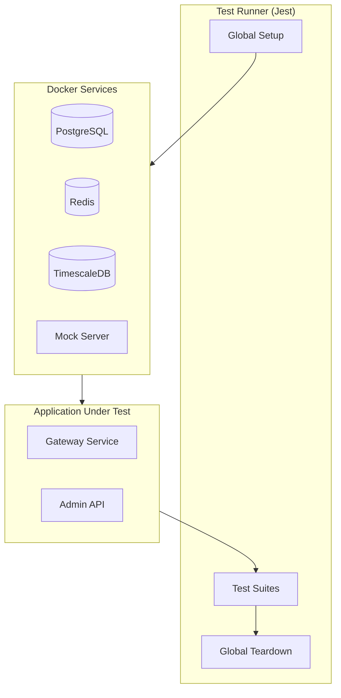

# DataHub Integration Tests

## Overview

Integration testing patterns for the DataHub API Gateway, covering database operations, Redis caching, and upstream service interactions.

---

## Integration Test Architecture



---

## Test Environment Setup

### Docker Compose for Testing

```yaml
# docker-compose.test.yml
version: '3.8'

services:
  postgres-test:
    image: postgres:15-alpine
    environment:
      POSTGRES_USER: test
      POSTGRES_PASSWORD: test
      POSTGRES_DB: datahub_test
    ports:
      - "5433:5432"
    tmpfs:
      - /var/lib/postgresql/data

  redis-test:
    image: redis:7-alpine
    ports:
      - "6380:6379"

  timescale-test:
    image: timescale/timescaledb:latest-pg15
    environment:
      POSTGRES_USER: test
      POSTGRES_PASSWORD: test
      POSTGRES_DB: analytics_test
    ports:
      - "5434:5432"
    tmpfs:
      - /var/lib/postgresql/data

  mock-upstream:
    image: mockserver/mockserver:latest
    ports:
      - "4001:1080"
```

### Global Setup

```typescript
// tests/integration/setup.ts
import { exec } from 'child_process';
import { PrismaClient } from '@prisma/client';

const prisma = new PrismaClient();

export default async function globalSetup() {
  // Start Docker services
  await execAsync('docker compose -f docker-compose.test.yml up -d');

  // Wait for services
  await waitForServices();

  // Run migrations
  await execAsync('npx prisma migrate deploy');

  // Seed test data
  await seedTestData(prisma);
}

async function waitForServices() {
  const maxRetries = 30;
  let retries = 0;

  while (retries < maxRetries) {
    try {
      await prisma.$connect();
      console.log('Database connected');
      return;
    } catch {
      retries++;
      await new Promise(r => setTimeout(r, 1000));
    }
  }

  throw new Error('Services failed to start');
}
```

---

## Database Integration Tests

### API Key Repository Tests

```typescript
// tests/integration/repositories/api-key.test.ts
import { PrismaClient } from '@prisma/client';
import { ApiKeyRepository } from '@/repositories/api-key';

describe('ApiKeyRepository Integration', () => {
  let prisma: PrismaClient;
  let repository: ApiKeyRepository;

  beforeAll(async () => {
    prisma = new PrismaClient();
    repository = new ApiKeyRepository(prisma);
  });

  afterAll(async () => {
    await prisma.$disconnect();
  });

  beforeEach(async () => {
    // Clean up before each test
    await prisma.apiKey.deleteMany();
  });

  describe('create', () => {
    it('should persist API key to database', async () => {
      const key = await repository.create({
        name: 'Integration Test Key',
        hashedKey: 'hashed_abc123',
        prefix: 'dh_test_sk_',
        rateLimit: 1000,
      });

      const found = await prisma.apiKey.findUnique({
        where: { id: key.id },
      });

      expect(found).not.toBeNull();
      expect(found?.name).toBe('Integration Test Key');
    });

    it('should set default status to active', async () => {
      const key = await repository.create({
        name: 'Test Key',
        hashedKey: 'hashed_xyz789',
        prefix: 'dh_test_sk_',
        rateLimit: 500,
      });

      expect(key.status).toBe('active');
    });
  });

  describe('findByPrefix', () => {
    it('should find key by prefix', async () => {
      await repository.create({
        name: 'Findable Key',
        hashedKey: 'hashed_findme',
        prefix: 'dh_test_sk_findme_',
        rateLimit: 1000,
      });

      const found = await repository.findByPrefix('dh_test_sk_findme_');

      expect(found).not.toBeNull();
      expect(found?.name).toBe('Findable Key');
    });

    it('should return null for non-existent prefix', async () => {
      const found = await repository.findByPrefix('dh_nonexistent_');

      expect(found).toBeNull();
    });
  });

  describe('updateUsage', () => {
    it('should update lastUsedAt timestamp', async () => {
      const key = await repository.create({
        name: 'Usage Test Key',
        hashedKey: 'hashed_usage',
        prefix: 'dh_test_sk_usage_',
        rateLimit: 1000,
      });

      await repository.updateUsage(key.id);

      const updated = await prisma.apiKey.findUnique({
        where: { id: key.id },
      });

      expect(updated?.lastUsedAt).not.toBeNull();
    });
  });
});
```

### Transaction Tests

```typescript
// tests/integration/repositories/transactions.test.ts
describe('Transaction Handling', () => {
  it('should rollback on error', async () => {
    const initialCount = await prisma.apiKey.count();

    try {
      await prisma.$transaction(async (tx) => {
        await tx.apiKey.create({
          data: {
            name: 'Transaction Key',
            hashedKey: 'hashed_tx',
            prefix: 'dh_tx_',
            rateLimit: 1000,
          },
        });

        // Force an error
        throw new Error('Simulated failure');
      });
    } catch {
      // Expected
    }

    const finalCount = await prisma.apiKey.count();
    expect(finalCount).toBe(initialCount);
  });
});
```

---

## Redis Integration Tests

```typescript
// tests/integration/cache/rate-limiter.test.ts
import Redis from 'ioredis';
import { RateLimiterRedis } from '@/cache/rate-limiter';

describe('RateLimiterRedis Integration', () => {
  let redis: Redis;
  let rateLimiter: RateLimiterRedis;

  beforeAll(() => {
    redis = new Redis({
      host: 'localhost',
      port: 6380, // Test Redis port
      db: 1, // Use separate DB for tests
    });
    rateLimiter = new RateLimiterRedis(redis);
  });

  afterAll(async () => {
    await redis.quit();
  });

  beforeEach(async () => {
    await redis.flushdb();
  });

  describe('checkLimit', () => {
    it('should allow requests under limit', async () => {
      const result = await rateLimiter.checkLimit('key_123', {
        limit: 100,
        windowMs: 60000,
      });

      expect(result.allowed).toBe(true);
      expect(result.remaining).toBe(99);
    });

    it('should deny requests over limit', async () => {
      // Exhaust the limit
      for (let i = 0; i < 100; i++) {
        await rateLimiter.checkLimit('key_exhaust', {
          limit: 100,
          windowMs: 60000,
        });
      }

      const result = await rateLimiter.checkLimit('key_exhaust', {
        limit: 100,
        windowMs: 60000,
      });

      expect(result.allowed).toBe(false);
      expect(result.remaining).toBe(0);
    });

    it('should reset after window expires', async () => {
      await rateLimiter.checkLimit('key_reset', {
        limit: 5,
        windowMs: 100, // 100ms window
      });

      // Wait for window to expire
      await new Promise(r => setTimeout(r, 150));

      const result = await rateLimiter.checkLimit('key_reset', {
        limit: 5,
        windowMs: 100,
      });

      expect(result.count).toBe(1);
    });
  });
});
```

### Cache Tests

```typescript
// tests/integration/cache/key-cache.test.ts
describe('KeyCache Integration', () => {
  let redis: Redis;
  let cache: KeyCache;

  beforeAll(() => {
    redis = new Redis({ host: 'localhost', port: 6380 });
    cache = new KeyCache(redis, { ttlSeconds: 300 });
  });

  describe('caching behavior', () => {
    it('should cache key data on first access', async () => {
      const keyData = { id: 'key_123', rateLimit: 1000 };

      await cache.set('prefix_abc', keyData);
      const cached = await cache.get('prefix_abc');

      expect(cached).toEqual(keyData);
    });

    it('should expire cache after TTL', async () => {
      const shortCache = new KeyCache(redis, { ttlSeconds: 1 });

      await shortCache.set('expire_test', { id: 'key_456' });
      await new Promise(r => setTimeout(r, 1100));

      const cached = await shortCache.get('expire_test');
      expect(cached).toBeNull();
    });
  });
});
```

---

## HTTP Integration Tests

```typescript
// tests/integration/api/gateway.test.ts
import request from 'supertest';
import { createApp } from '@/app';

describe('Gateway API Integration', () => {
  let app: Express;
  let testApiKey: string;

  beforeAll(async () => {
    app = await createApp();

    // Create test API key
    const keyResponse = await request(app)
      .post('/api/keys')
      .send({ name: 'Test Key', rateLimit: 100 });

    testApiKey = keyResponse.body.key;
  });

  describe('GET /health', () => {
    it('should return healthy status', async () => {
      const response = await request(app)
        .get('/health')
        .expect(200);

      expect(response.body.status).toBe('healthy');
      expect(response.body.checks).toHaveProperty('database');
      expect(response.body.checks).toHaveProperty('redis');
    });
  });

  describe('Proxy Requests', () => {
    it('should proxy request with valid API key', async () => {
      const response = await request(app)
        .get('/api/proxy/test')
        .set('X-API-Key', testApiKey)
        .expect(200);

      expect(response.headers['x-request-id']).toBeDefined();
    });

    it('should reject request without API key', async () => {
      const response = await request(app)
        .get('/api/proxy/test')
        .expect(401);

      expect(response.body.error.code).toBe('INVALID_API_KEY');
    });

    it('should include rate limit headers', async () => {
      const response = await request(app)
        .get('/api/proxy/test')
        .set('X-API-Key', testApiKey)
        .expect(200);

      expect(response.headers['x-rate-limit-limit']).toBe('100');
      expect(response.headers['x-rate-limit-remaining']).toBeDefined();
    });
  });
});
```

---

## Mock Server Configuration

```typescript
// tests/integration/mocks/upstream.ts
import { MockServer } from 'mockserver-node';

export async function setupMockUpstream() {
  const mockServer = new MockServer({
    host: 'localhost',
    port: 4001,
  });

  // Mock user endpoint
  await mockServer.mockAnyResponse({
    httpRequest: {
      method: 'GET',
      path: '/api/users.*',
    },
    httpResponse: {
      statusCode: 200,
      body: JSON.stringify({ users: [] }),
      headers: { 'Content-Type': 'application/json' },
    },
  });

  // Mock slow endpoint
  await mockServer.mockAnyResponse({
    httpRequest: {
      method: 'GET',
      path: '/api/slow',
    },
    httpResponse: {
      statusCode: 200,
      delay: { timeUnit: 'SECONDS', value: 5 },
    },
  });

  return mockServer;
}
```

---

## Running Integration Tests

```bash
# Start test services
docker compose -f docker-compose.test.yml up -d

# Run integration tests
npm run test:integration

# Run specific test file
npm run test:integration -- gateway.test.ts

# Stop test services
docker compose -f docker-compose.test.yml down
```

---

## Related Documents

- [Testing Strategy](./strategy.md)
- [Unit Tests](./unit-tests.md)
- [E2E Tests](./e2e-tests.md)
- [Test Data](./test-data.md)
