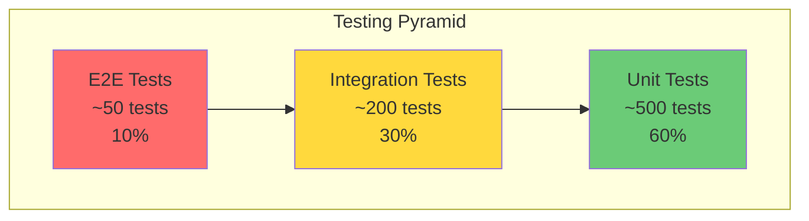
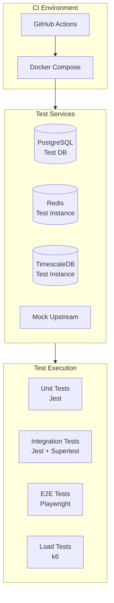
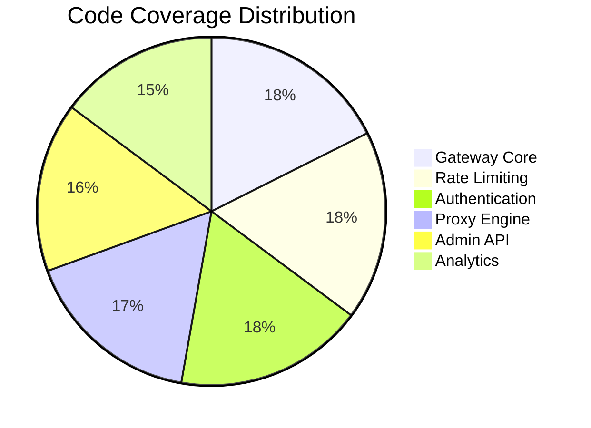
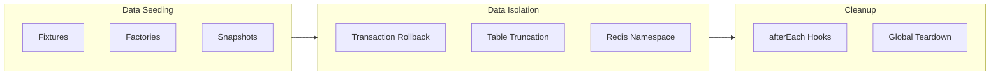
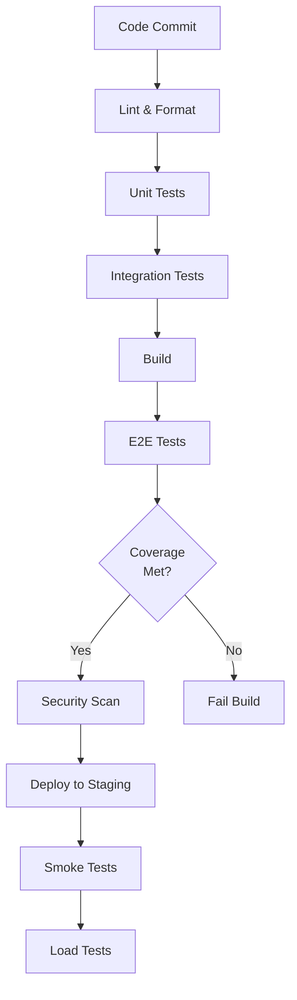

# DataHub Testing Strategy

## Overview

Comprehensive testing strategy for the DataHub API Gateway platform, ensuring reliability, performance, and security.

---

## Testing Pyramid



---

## Test Categories

### Unit Tests

| Area | Coverage Target | Description |
|------|-----------------|-------------|
| Rate Limiter | 95% | Token bucket, sliding window algorithms |
| Authentication | 95% | API key validation, JWT verification |
| Request Parser | 90% | Header parsing, body validation |
| Response Builder | 90% | Response formatting, error handling |
| Utilities | 85% | Helper functions, transformations |

### Integration Tests

| Area | Coverage Target | Description |
|------|-----------------|-------------|
| Database Operations | 90% | Prisma queries, transactions |
| Redis Operations | 90% | Caching, rate limit storage |
| Proxy Engine | 85% | Request forwarding, retries |
| Circuit Breaker | 85% | State transitions, recovery |

### End-to-End Tests

| Scenario | Priority | Description |
|----------|----------|-------------|
| Full Request Flow | Critical | Complete proxy request lifecycle |
| Authentication | Critical | API key and JWT flows |
| Rate Limiting | High | Limit enforcement, headers |
| Error Handling | High | Error responses, status codes |
| Analytics | Medium | Request logging, metrics |

---

## Test Infrastructure



---

## Test Environments

| Environment | Purpose | Data |
|-------------|---------|------|
| Local | Development testing | Seeded test data |
| CI | Automated testing | Fresh database per run |
| Staging | Pre-production validation | Sanitized production data |

---

## Coverage Requirements

### Minimum Coverage by Module



### Coverage Configuration

```javascript
// jest.config.js
module.exports = {
  collectCoverageFrom: [
    'src/**/*.ts',
    '!src/**/*.d.ts',
    '!src/**/index.ts',
  ],
  coverageThreshold: {
    global: {
      branches: 80,
      functions: 85,
      lines: 85,
      statements: 85,
    },
    './src/core/': {
      branches: 90,
      functions: 95,
      lines: 95,
      statements: 95,
    },
  },
};
```

---

## Test Data Management

### Test Data Strategy



---

## Performance Testing

### Load Test Scenarios

| Scenario | RPS | Duration | Success Criteria |
|----------|-----|----------|------------------|
| Baseline | 1,000 | 5 min | P95 < 100ms |
| Peak Load | 5,000 | 10 min | P95 < 200ms |
| Stress Test | 10,000 | 5 min | No crashes |
| Endurance | 2,000 | 1 hour | Stable memory |

### Performance Thresholds

```javascript
// k6 thresholds
export const options = {
  thresholds: {
    http_req_duration: ['p(95)<100', 'p(99)<200'],
    http_req_failed: ['rate<0.01'],
    http_reqs: ['rate>1000'],
  },
};
```

---

## Security Testing

### Security Test Categories

| Category | Tool | Frequency |
|----------|------|-----------|
| Dependency Scan | npm audit | Every build |
| SAST | SonarQube | Every PR |
| API Security | OWASP ZAP | Weekly |
| Penetration | Manual | Quarterly |

---

## Test Execution Flow



---

## Test Commands

```bash
# Run all tests
npm test

# Run unit tests only
npm run test:unit

# Run integration tests
npm run test:integration

# Run E2E tests
npm run test:e2e

# Run with coverage
npm run test:coverage

# Run load tests
npm run test:load

# Watch mode
npm run test:watch
```

---

## Related Documents

- [Unit Tests](./unit-tests.md)
- [Integration Tests](./integration-tests.md)
- [E2E Tests](./e2e-tests.md)
- [Test Data](./test-data.md)
- [API Test Suite](./api-test-suite.md)
