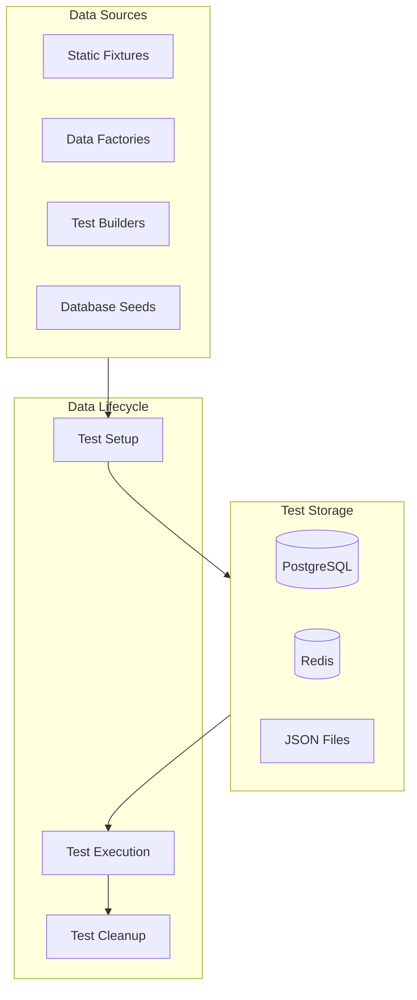
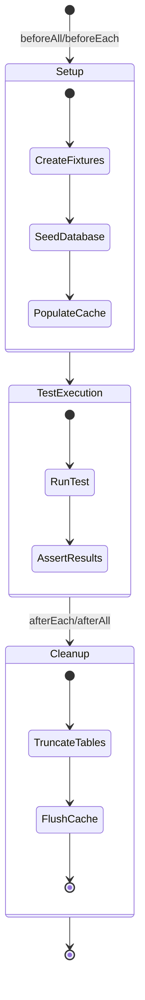

# DataHub Test Data

## Overview

Test data management strategies and fixtures for the DataHub API Gateway testing infrastructure.

---

## Test Data Architecture



---

## Static Fixtures

### API Key Fixtures

```typescript
// tests/fixtures/api-keys.ts
export const apiKeyFixtures = {
  activeKey: {
    id: 'key_test_active',
    name: 'Active Test Key',
    prefix: 'dh_test_sk_active_',
    hashedKey: '$2b$10$xxx',
    status: 'active',
    rateLimit: 1000,
    allowedIPs: [],
    allowedOrigins: [],
    metadata: {},
    createdAt: new Date('2024-01-01'),
    lastUsedAt: new Date('2024-01-15'),
  },

  revokedKey: {
    id: 'key_test_revoked',
    name: 'Revoked Test Key',
    prefix: 'dh_test_sk_revoked_',
    hashedKey: '$2b$10$yyy',
    status: 'revoked',
    rateLimit: 500,
    allowedIPs: [],
    allowedOrigins: [],
    metadata: {},
    createdAt: new Date('2024-01-01'),
    revokedAt: new Date('2024-01-10'),
  },

  restrictedKey: {
    id: 'key_test_restricted',
    name: 'IP Restricted Key',
    prefix: 'dh_test_sk_restricted_',
    hashedKey: '$2b$10$zzz',
    status: 'active',
    rateLimit: 100,
    allowedIPs: ['203.0.113.0/24'],
    allowedOrigins: ['https://example.com'],
    metadata: { team: 'security' },
    createdAt: new Date('2024-01-01'),
  },
};
```

### User Fixtures

```typescript
// tests/fixtures/users.ts
export const userFixtures = {
  adminUser: {
    id: 'user_admin',
    email: 'admin@datahub.io',
    name: 'Admin User',
    role: 'admin',
    passwordHash: '$2b$10$admin_hash',
    permissions: ['keys:read', 'keys:write', 'analytics:read', 'services:write'],
    createdAt: new Date('2024-01-01'),
  },

  readOnlyUser: {
    id: 'user_readonly',
    email: 'readonly@datahub.io',
    name: 'Read Only User',
    role: 'viewer',
    passwordHash: '$2b$10$readonly_hash',
    permissions: ['keys:read', 'analytics:read'],
    createdAt: new Date('2024-01-01'),
  },
};
```

### Service Fixtures

```typescript
// tests/fixtures/services.ts
export const serviceFixtures = {
  userService: {
    id: 'svc_users',
    name: 'User Service',
    upstreamUrl: 'https://users.internal.datahub.io',
    healthEndpoint: '/health',
    timeout: 30000,
    retries: 3,
    circuitBreaker: {
      enabled: true,
      threshold: 5,
      timeout: 30000,
    },
    status: 'healthy',
  },

  paymentService: {
    id: 'svc_payments',
    name: 'Payment Service',
    upstreamUrl: 'https://payments.internal.datahub.io',
    healthEndpoint: '/health',
    timeout: 60000,
    retries: 2,
    circuitBreaker: {
      enabled: true,
      threshold: 3,
      timeout: 60000,
    },
    status: 'healthy',
  },
};
```

---

## Data Factories

### API Key Factory

```typescript
// tests/factories/api-key.factory.ts
import { faker } from '@faker-js/faker';
import { hashSync } from 'bcrypt';

interface ApiKeyOptions {
  status?: 'active' | 'revoked';
  rateLimit?: number;
  allowedIPs?: string[];
  allowedOrigins?: string[];
}

export class ApiKeyFactory {
  static create(options: ApiKeyOptions = {}) {
    const rawKey = `dh_test_sk_${faker.string.alphanumeric(24)}`;
    const prefix = rawKey.slice(0, 14);

    return {
      id: `key_${faker.string.alphanumeric(12)}`,
      name: faker.company.name() + ' API Key',
      prefix,
      rawKey, // Only available during test creation
      hashedKey: hashSync(rawKey, 10),
      status: options.status || 'active',
      rateLimit: options.rateLimit || 1000,
      allowedIPs: options.allowedIPs || [],
      allowedOrigins: options.allowedOrigins || [],
      metadata: {},
      createdAt: faker.date.recent({ days: 30 }),
      lastUsedAt: null,
    };
  }

  static createBatch(count: number, options: ApiKeyOptions = {}) {
    return Array.from({ length: count }, () => this.create(options));
  }
}
```

### Request Factory

```typescript
// tests/factories/request.factory.ts
import { faker } from '@faker-js/faker';

export class RequestFactory {
  static createProxyRequest(overrides = {}) {
    return {
      method: 'GET',
      path: `/api/proxy/${faker.word.noun()}`,
      headers: {
        'X-API-Key': `dh_test_sk_${faker.string.alphanumeric(24)}`,
        'Content-Type': 'application/json',
        'X-Request-ID': faker.string.uuid(),
      },
      query: {},
      body: null,
      clientIp: faker.internet.ip(),
      ...overrides,
    };
  }

  static createAnalyticsRecord(overrides = {}) {
    return {
      id: faker.string.uuid(),
      keyId: `key_${faker.string.alphanumeric(12)}`,
      method: faker.helpers.arrayElement(['GET', 'POST', 'PUT', 'DELETE']),
      path: `/api/proxy/${faker.word.noun()}`,
      statusCode: faker.helpers.arrayElement([200, 201, 400, 404, 500]),
      responseTimeMs: faker.number.int({ min: 10, max: 500 }),
      requestSize: faker.number.int({ min: 100, max: 10000 }),
      responseSize: faker.number.int({ min: 100, max: 50000 }),
      timestamp: faker.date.recent({ days: 7 }),
      ...overrides,
    };
  }
}
```

---

## Test Builders

### API Key Builder

```typescript
// tests/builders/api-key.builder.ts
export class ApiKeyBuilder {
  private data: Partial<ApiKey> = {};

  withId(id: string): this {
    this.data.id = id;
    return this;
  }

  withName(name: string): this {
    this.data.name = name;
    return this;
  }

  withRateLimit(limit: number): this {
    this.data.rateLimit = limit;
    return this;
  }

  asActive(): this {
    this.data.status = 'active';
    return this;
  }

  asRevoked(): this {
    this.data.status = 'revoked';
    this.data.revokedAt = new Date();
    return this;
  }

  withIpRestriction(ips: string[]): this {
    this.data.allowedIPs = ips;
    return this;
  }

  withOriginRestriction(origins: string[]): this {
    this.data.allowedOrigins = origins;
    return this;
  }

  build(): ApiKey {
    return {
      id: this.data.id || `key_${randomId()}`,
      name: this.data.name || 'Test Key',
      prefix: `dh_test_sk_`,
      hashedKey: '$2b$10$test_hash',
      status: this.data.status || 'active',
      rateLimit: this.data.rateLimit || 1000,
      allowedIPs: this.data.allowedIPs || [],
      allowedOrigins: this.data.allowedOrigins || [],
      metadata: {},
      createdAt: new Date(),
      lastUsedAt: null,
      ...this.data,
    };
  }
}
```

---

## Database Seeding

### Seed Script

```typescript
// prisma/seed.ts
import { PrismaClient } from '@prisma/client';
import { apiKeyFixtures } from '../tests/fixtures/api-keys';
import { userFixtures } from '../tests/fixtures/users';
import { serviceFixtures } from '../tests/fixtures/services';

const prisma = new PrismaClient();

async function seed() {
  console.log('Seeding database...');

  // Clear existing data
  await prisma.analyticsEvent.deleteMany();
  await prisma.apiKey.deleteMany();
  await prisma.user.deleteMany();
  await prisma.service.deleteMany();

  // Seed users
  for (const user of Object.values(userFixtures)) {
    await prisma.user.create({ data: user });
  }
  console.log('Users seeded');

  // Seed API keys
  for (const key of Object.values(apiKeyFixtures)) {
    await prisma.apiKey.create({ data: key });
  }
  console.log('API keys seeded');

  // Seed services
  for (const service of Object.values(serviceFixtures)) {
    await prisma.service.create({ data: service });
  }
  console.log('Services seeded');

  console.log('Database seeding complete');
}

seed()
  .catch(console.error)
  .finally(() => prisma.$disconnect());
```

---

## Test Data Lifecycle



---

## Test Isolation

### Transaction Rollback Pattern

```typescript
// tests/helpers/transaction.ts
import { PrismaClient } from '@prisma/client';

export function withTransaction(
  prisma: PrismaClient,
  testFn: (tx: PrismaClient) => Promise<void>
) {
  return async () => {
    await prisma.$transaction(async (tx) => {
      await testFn(tx as unknown as PrismaClient);
      // Rollback by throwing
      throw new Error('ROLLBACK');
    }).catch((e) => {
      if (e.message !== 'ROLLBACK') throw e;
    });
  };
}
```

### Redis Namespace Isolation

```typescript
// tests/helpers/redis.ts
export function createTestRedis(testName: string) {
  const redis = new Redis({
    host: 'localhost',
    port: 6380,
    keyPrefix: `test:${testName}:`,
  });

  return {
    redis,
    cleanup: async () => {
      const keys = await redis.keys(`test:${testName}:*`);
      if (keys.length > 0) {
        await redis.del(...keys);
      }
    },
  };
}
```

---

## Test Data Commands

```bash
# Seed test database
npm run db:seed:test

# Reset test database
npm run db:reset:test

# Generate test fixtures
npm run fixtures:generate

# Verify test data integrity
npm run fixtures:verify
```

---

## Related Documents

- [Testing Strategy](./strategy.md)
- [Unit Tests](./unit-tests.md)
- [Integration Tests](./integration-tests.md)
