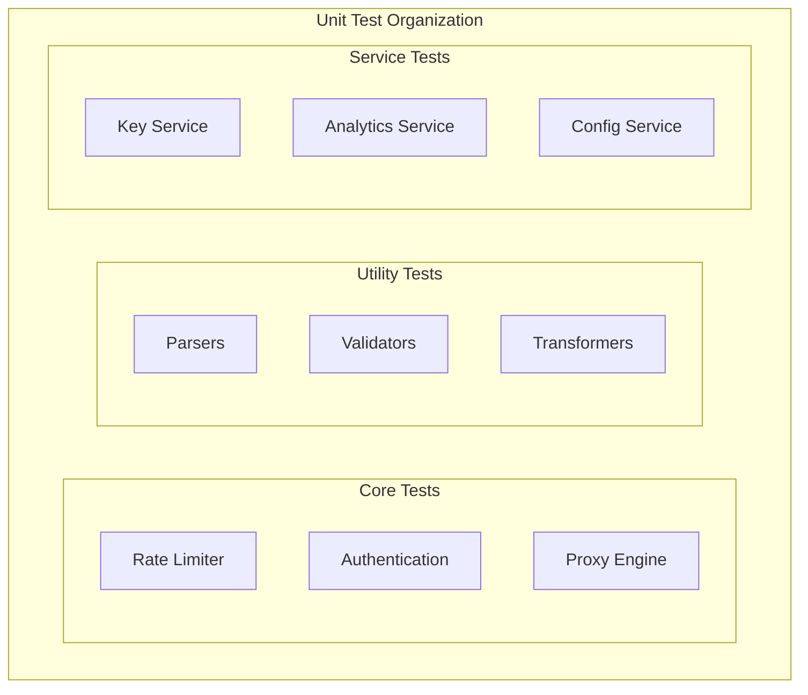

# DataHub Unit Tests

## Overview

Unit testing patterns and examples for the DataHub API Gateway core components.

---

## Test Structure



---

## Test Configuration

```typescript
// jest.config.js
module.exports = {
  preset: 'ts-jest',
  testEnvironment: 'node',
  roots: ['<rootDir>/src'],
  testMatch: ['**/*.test.ts'],
  moduleNameMapper: {
    '@/(.*)': '<rootDir>/src/$1',
  },
  setupFilesAfterEnv: ['<rootDir>/tests/setup.ts'],
  clearMocks: true,
  collectCoverageFrom: [
    'src/**/*.ts',
    '!src/**/*.d.ts',
    '!src/index.ts',
  ],
};
```

---

## Rate Limiter Tests

### Token Bucket Algorithm

```typescript
// src/core/rate-limiter/token-bucket.test.ts
import { TokenBucket } from './token-bucket';

describe('TokenBucket', () => {
  let bucket: TokenBucket;

  beforeEach(() => {
    bucket = new TokenBucket({
      capacity: 100,
      refillRate: 10, // tokens per second
    });
  });

  describe('consume', () => {
    it('should allow consumption when tokens available', () => {
      const result = bucket.consume(1);

      expect(result.allowed).toBe(true);
      expect(result.remaining).toBe(99);
    });

    it('should deny consumption when insufficient tokens', () => {
      // Drain the bucket
      bucket.consume(100);

      const result = bucket.consume(1);

      expect(result.allowed).toBe(false);
      expect(result.remaining).toBe(0);
    });

    it('should refill tokens over time', async () => {
      bucket.consume(100);

      // Wait 1 second for refill
      await new Promise(r => setTimeout(r, 1000));

      const result = bucket.consume(5);

      expect(result.allowed).toBe(true);
      expect(result.remaining).toBeGreaterThanOrEqual(5);
    });

    it('should not exceed capacity on refill', async () => {
      await new Promise(r => setTimeout(r, 2000));

      const result = bucket.consume(1);

      expect(result.remaining).toBeLessThanOrEqual(99);
    });
  });

  describe('burst handling', () => {
    it('should handle burst requests', () => {
      const results = [];

      for (let i = 0; i < 50; i++) {
        results.push(bucket.consume(1));
      }

      expect(results.every(r => r.allowed)).toBe(true);
    });
  });
});
```

### Sliding Window Algorithm

```typescript
// src/core/rate-limiter/sliding-window.test.ts
import { SlidingWindow } from './sliding-window';

describe('SlidingWindow', () => {
  let window: SlidingWindow;

  beforeEach(() => {
    window = new SlidingWindow({
      limit: 100,
      windowMs: 60000, // 1 minute
    });
  });

  describe('increment', () => {
    it('should track requests within window', () => {
      const result = window.increment('key_123');

      expect(result.count).toBe(1);
      expect(result.remaining).toBe(99);
    });

    it('should enforce limit', () => {
      for (let i = 0; i < 100; i++) {
        window.increment('key_123');
      }

      const result = window.increment('key_123');

      expect(result.allowed).toBe(false);
      expect(result.remaining).toBe(0);
    });

    it('should isolate keys', () => {
      window.increment('key_1');
      window.increment('key_1');

      const result = window.increment('key_2');

      expect(result.count).toBe(1);
    });
  });
});
```

---

## Authentication Tests

### API Key Validator

```typescript
// src/core/auth/api-key-validator.test.ts
import { ApiKeyValidator } from './api-key-validator';

describe('ApiKeyValidator', () => {
  let validator: ApiKeyValidator;

  beforeEach(() => {
    validator = new ApiKeyValidator();
  });

  describe('validateFormat', () => {
    it('should accept valid key format', () => {
      const result = validator.validateFormat('dh_prod_sk_live_abc123xyz789');

      expect(result.valid).toBe(true);
    });

    it('should reject invalid prefix', () => {
      const result = validator.validateFormat('invalid_key_format');

      expect(result.valid).toBe(false);
      expect(result.error).toBe('Invalid key prefix');
    });

    it('should reject empty key', () => {
      const result = validator.validateFormat('');

      expect(result.valid).toBe(false);
      expect(result.error).toBe('API key is required');
    });

    it.each([
      ['dh_prod_sk_live_abc123', true],
      ['dh_staging_sk_test_xyz789', true],
      ['dh_dev_pk_test_123abc', true],
      ['sk_live_abc123', false],
      ['dh_invalid_sk_live_abc', false],
    ])('should validate key "%s" as %s', (key, expected) => {
      const result = validator.validateFormat(key);
      expect(result.valid).toBe(expected);
    });
  });

  describe('extractPrefix', () => {
    it('should extract prefix from valid key', () => {
      const prefix = validator.extractPrefix('dh_prod_sk_live_abc123xyz789');

      expect(prefix).toBe('dh_prod_sk_live_');
    });
  });
});
```

### IP Allowlist Validator

```typescript
// src/core/auth/ip-validator.test.ts
import { IpValidator } from './ip-validator';

describe('IpValidator', () => {
  let validator: IpValidator;

  describe('isAllowed', () => {
    it('should allow IP in allowlist', () => {
      validator = new IpValidator(['203.0.113.10']);

      expect(validator.isAllowed('203.0.113.10')).toBe(true);
    });

    it('should deny IP not in allowlist', () => {
      validator = new IpValidator(['203.0.113.10']);

      expect(validator.isAllowed('198.51.100.50')).toBe(false);
    });

    it('should support CIDR ranges', () => {
      validator = new IpValidator(['203.0.113.0/24']);

      expect(validator.isAllowed('203.0.113.50')).toBe(true);
      expect(validator.isAllowed('203.0.114.1')).toBe(false);
    });

    it('should allow all when no allowlist configured', () => {
      validator = new IpValidator([]);

      expect(validator.isAllowed('any.ip.address.here')).toBe(true);
    });

    it('should support IPv6', () => {
      validator = new IpValidator(['2001:db8::/32']);

      expect(validator.isAllowed('2001:db8::1')).toBe(true);
      expect(validator.isAllowed('2001:db9::1')).toBe(false);
    });
  });
});
```

---

## Proxy Engine Tests

```typescript
// src/core/proxy/request-builder.test.ts
import { RequestBuilder } from './request-builder';

describe('RequestBuilder', () => {
  let builder: RequestBuilder;

  beforeEach(() => {
    builder = new RequestBuilder({
      baseUrl: 'https://upstream.example.com',
    });
  });

  describe('buildRequest', () => {
    it('should forward path correctly', () => {
      const request = builder.buildRequest({
        method: 'GET',
        path: '/api/users/123',
        headers: {},
      });

      expect(request.url).toBe('https://upstream.example.com/api/users/123');
    });

    it('should forward query parameters', () => {
      const request = builder.buildRequest({
        method: 'GET',
        path: '/api/users',
        query: { page: '1', limit: '10' },
        headers: {},
      });

      expect(request.url).toContain('page=1');
      expect(request.url).toContain('limit=10');
    });

    it('should strip hop-by-hop headers', () => {
      const request = builder.buildRequest({
        method: 'GET',
        path: '/api/users',
        headers: {
          'connection': 'keep-alive',
          'keep-alive': 'timeout=5',
          'content-type': 'application/json',
        },
      });

      expect(request.headers['connection']).toBeUndefined();
      expect(request.headers['keep-alive']).toBeUndefined();
      expect(request.headers['content-type']).toBe('application/json');
    });

    it('should add X-Forwarded headers', () => {
      const request = builder.buildRequest({
        method: 'GET',
        path: '/api/users',
        headers: {},
        clientIp: '203.0.113.10',
      });

      expect(request.headers['x-forwarded-for']).toBe('203.0.113.10');
      expect(request.headers['x-forwarded-proto']).toBe('https');
    });
  });
});
```

---

## Service Tests

### Key Service

```typescript
// src/services/key-service.test.ts
import { KeyService } from './key-service';
import { prismaMock } from '../tests/mocks/prisma';

describe('KeyService', () => {
  let service: KeyService;

  beforeEach(() => {
    service = new KeyService(prismaMock);
  });

  describe('create', () => {
    it('should create API key with hashed value', async () => {
      const input = {
        name: 'Test Key',
        rateLimit: 1000,
      };

      prismaMock.apiKey.create.mockResolvedValue({
        id: 'key_123',
        name: 'Test Key',
        prefix: 'dh_dev_sk_test_',
        hashedKey: 'hashed_value',
        rateLimit: 1000,
        status: 'active',
        createdAt: new Date(),
      });

      const result = await service.create(input);

      expect(result.id).toBe('key_123');
      expect(result.key).toMatch(/^dh_dev_sk_test_/);
      expect(prismaMock.apiKey.create).toHaveBeenCalled();
    });
  });

  describe('validate', () => {
    it('should return key data for valid key', async () => {
      prismaMock.apiKey.findFirst.mockResolvedValue({
        id: 'key_123',
        status: 'active',
        rateLimit: 1000,
      });

      const result = await service.validate('dh_dev_sk_test_abc123');

      expect(result).not.toBeNull();
      expect(result?.id).toBe('key_123');
    });

    it('should return null for revoked key', async () => {
      prismaMock.apiKey.findFirst.mockResolvedValue({
        id: 'key_123',
        status: 'revoked',
      });

      const result = await service.validate('dh_dev_sk_test_abc123');

      expect(result).toBeNull();
    });
  });
});
```

---

## Mock Setup

```typescript
// tests/mocks/prisma.ts
import { PrismaClient } from '@prisma/client';
import { mockDeep, DeepMockProxy } from 'jest-mock-extended';

export const prismaMock = mockDeep<PrismaClient>();

// tests/mocks/redis.ts
export const redisMock = {
  get: jest.fn(),
  set: jest.fn(),
  incr: jest.fn(),
  expire: jest.fn(),
  del: jest.fn(),
};
```

---

## Running Unit Tests

```bash
# Run all unit tests
npm run test:unit

# Run specific test file
npm run test:unit -- rate-limiter.test.ts

# Run with coverage
npm run test:unit -- --coverage

# Watch mode
npm run test:unit -- --watch
```

---

## Related Documents

- [Testing Strategy](./strategy.md)
- [Integration Tests](./integration-tests.md)
- [Test Data](./test-data.md)
