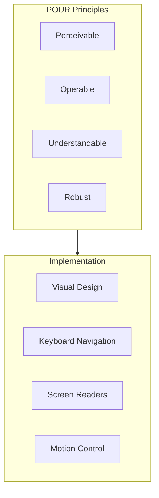
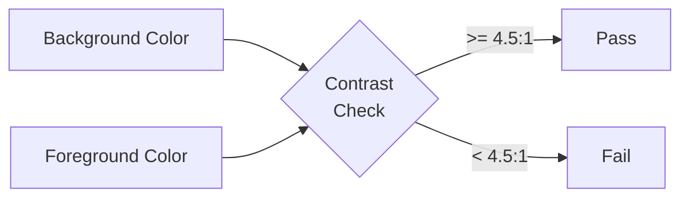
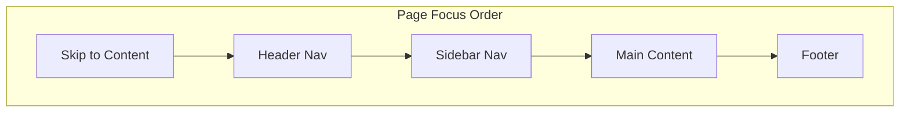
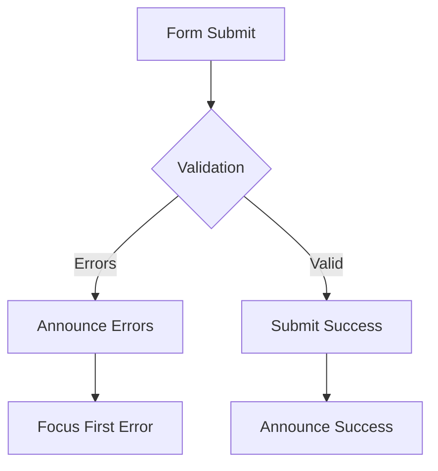

# DataHub Accessibility Guidelines

## Overview

Accessibility standards and implementation guidelines for the DataHub Admin Dashboard, ensuring WCAG 2.1 AA compliance.

---

## Accessibility Architecture



---

## Color Contrast

### Minimum Contrast Ratios

| Element Type | Ratio | WCAG Level |
|-------------|-------|------------|
| Normal Text | 4.5:1 | AA |
| Large Text (18px+) | 3:1 | AA |
| UI Components | 3:1 | AA |
| Focus Indicators | 3:1 | AA |

### Color Palette Accessibility

```css
/* Accessible color combinations */
:root {
  /* Text on white background */
  --text-on-light: var(--color-gray-900); /* 12.63:1 */
  --text-secondary-on-light: var(--color-gray-600); /* 5.74:1 */

  /* Text on dark background */
  --text-on-dark: var(--color-gray-50); /* 15.46:1 */
  --text-secondary-on-dark: var(--color-gray-300); /* 8.59:1 */

  /* Status colors with accessible text */
  --success-text: #047857; /* 4.52:1 on white */
  --error-text: #b91c1c; /* 5.02:1 on white */
  --warning-text: #92400e; /* 4.61:1 on white */
}
```

### Contrast Checker



---

## Keyboard Navigation

### Focus Management

```css
/* Visible focus indicators */
:focus-visible {
  outline: 2px solid var(--color-primary-500);
  outline-offset: 2px;
}

/* Remove default outline when using mouse */
:focus:not(:focus-visible) {
  outline: none;
}

/* Custom focus styles for specific components */
.button:focus-visible {
  box-shadow: 0 0 0 3px var(--color-primary-200);
}

.input:focus-visible {
  border-color: var(--color-primary-500);
  box-shadow: 0 0 0 3px var(--color-primary-100);
}
```

### Focus Order



### Keyboard Shortcuts

| Shortcut | Action |
|----------|--------|
| `Tab` | Move to next focusable element |
| `Shift + Tab` | Move to previous element |
| `Enter` | Activate buttons, links |
| `Space` | Toggle checkboxes, expand dropdowns |
| `Escape` | Close modals, cancel operations |
| `Arrow Keys` | Navigate within components |

### Skip Links

```tsx
const SkipLinks: React.FC = () => (
  <nav className="skip-links" aria-label="Skip links">
    <a href="#main-content" className="skip-link">
      Skip to main content
    </a>
    <a href="#navigation" className="skip-link">
      Skip to navigation
    </a>
  </nav>
);
```

---

## Screen Reader Support

### Semantic HTML

```tsx
// Use semantic elements
<header role="banner">
  <nav aria-label="Main navigation">...</nav>
</header>

<main id="main-content" role="main">
  <section aria-labelledby="keys-heading">
    <h1 id="keys-heading">API Keys</h1>
    ...
  </section>
</main>

<aside role="complementary">
  <nav aria-label="Secondary navigation">...</nav>
</aside>
```

### ARIA Labels

```tsx
// Buttons with icons only
<IconButton
  aria-label="Delete API key"
  icon={<TrashIcon aria-hidden="true" />}
/>

// Form inputs
<Input
  id="key-name"
  aria-label="API Key Name"
  aria-describedby="key-name-hint"
  aria-required="true"
/>
<span id="key-name-hint" className="sr-only">
  Enter a descriptive name for your API key
</span>

// Loading states
<div aria-live="polite" aria-busy={isLoading}>
  {isLoading ? 'Loading API keys...' : content}
</div>
```

### Live Regions

```tsx
// Announce dynamic content changes
<div
  role="status"
  aria-live="polite"
  aria-atomic="true"
  className="sr-only"
>
  {notification}
</div>

// Announce errors
<div
  role="alert"
  aria-live="assertive"
>
  {errorMessage}
</div>
```

---

## Form Accessibility

### Accessible Form Pattern

```tsx
<form aria-labelledby="form-title">
  <h2 id="form-title">Create API Key</h2>

  <div className="form-field">
    <label htmlFor="name">
      Name <span aria-hidden="true">*</span>
      <span className="sr-only">(required)</span>
    </label>
    <input
      id="name"
      type="text"
      aria-required="true"
      aria-invalid={errors.name ? 'true' : 'false'}
      aria-describedby={errors.name ? 'name-error' : undefined}
    />
    {errors.name && (
      <span id="name-error" role="alert" className="error">
        {errors.name}
      </span>
    )}
  </div>

  <button type="submit">Create API Key</button>
</form>
```

### Error Handling



---

## Table Accessibility

```tsx
<table aria-labelledby="keys-table-title">
  <caption id="keys-table-title" className="sr-only">
    List of API keys with name, status, rate limit, and actions
  </caption>
  <thead>
    <tr>
      <th scope="col">Name</th>
      <th scope="col">Status</th>
      <th scope="col">Rate Limit</th>
      <th scope="col">
        <span className="sr-only">Actions</span>
      </th>
    </tr>
  </thead>
  <tbody>
    <tr>
      <th scope="row">Production Key</th>
      <td>
        <Badge aria-label="Status: Active">Active</Badge>
      </td>
      <td>1000 requests per minute</td>
      <td>
        <button aria-label="Edit Production Key">Edit</button>
        <button aria-label="Delete Production Key">Delete</button>
      </td>
    </tr>
  </tbody>
</table>
```

---

## Modal Accessibility

```tsx
const Modal: React.FC<ModalProps> = ({ isOpen, onClose, title, children }) => {
  const modalRef = useRef<HTMLDivElement>(null);

  useEffect(() => {
    if (isOpen) {
      // Trap focus
      const focusableElements = modalRef.current?.querySelectorAll(
        'button, [href], input, select, textarea, [tabindex]:not([tabindex="-1"])'
      );
      const firstElement = focusableElements?.[0] as HTMLElement;
      firstElement?.focus();

      // Close on Escape
      const handleEscape = (e: KeyboardEvent) => {
        if (e.key === 'Escape') onClose();
      };
      document.addEventListener('keydown', handleEscape);
      return () => document.removeEventListener('keydown', handleEscape);
    }
  }, [isOpen, onClose]);

  return (
    <div
      role="dialog"
      aria-modal="true"
      aria-labelledby="modal-title"
      ref={modalRef}
    >
      <h2 id="modal-title">{title}</h2>
      {children}
    </div>
  );
};
```

---

## Motion and Animation

### Reduced Motion

```css
/* Respect user preference for reduced motion */
@media (prefers-reduced-motion: reduce) {
  *,
  *::before,
  *::after {
    animation-duration: 0.01ms !important;
    animation-iteration-count: 1 !important;
    transition-duration: 0.01ms !important;
  }
}

/* Provide alternative for motion-based feedback */
.loading-spinner {
  animation: spin 1s linear infinite;
}

@media (prefers-reduced-motion: reduce) {
  .loading-spinner {
    animation: none;
    /* Show static loading indicator instead */
    opacity: 0.7;
  }
}
```

---

## Testing Checklist

| Category | Test | Tool |
|----------|------|------|
| Color Contrast | All text meets 4.5:1 | axe DevTools |
| Keyboard | All interactive elements focusable | Manual |
| Screen Reader | All content announced correctly | NVDA/VoiceOver |
| Focus Order | Logical tab order | Manual |
| Forms | Labels and errors announced | axe DevTools |
| Images | Alt text present | axe DevTools |
| Headings | Proper hierarchy | WAVE |

---

## Related Documents

- [Design Tokens](./tokens.md)
- [Components](./components.md)
- [Screens](./screens.md)
