# DataHub UI Components

## Overview

Reusable UI components for the DataHub Admin Dashboard built with React and styled-components.

---

## Component Architecture


---

## Button Component

### Variants

```tsx
// Primary Button
<Button variant="primary">Create API Key</Button>

// Secondary Button
<Button variant="secondary">Cancel</Button>

// Danger Button
<Button variant="danger">Revoke Key</Button>

// Ghost Button
<Button variant="ghost">Learn More</Button>

// With Icon
<Button leftIcon={<PlusIcon />}>Add Service</Button>
```

### Button Specifications

| Variant | Background | Text | Border |
|---------|------------|------|--------|
| Primary | `--color-primary-500` | white | none |
| Secondary | transparent | `--color-primary-500` | `--color-primary-500` |
| Danger | `--color-error` | white | none |
| Ghost | transparent | `--color-gray-600` | none |

### Button Sizes

```tsx
<Button size="sm">Small</Button>   // height: 32px
<Button size="md">Medium</Button>  // height: 40px
<Button size="lg">Large</Button>   // height: 48px
```

---

## Input Components

### Text Input

```tsx
<Input
  label="API Key Name"
  placeholder="Enter a descriptive name"
  helperText="This name will be visible in the dashboard"
  required
/>

<Input
  label="Rate Limit"
  type="number"
  min={1}
  max={100000}
  suffix="req/min"
/>

<Input
  label="Search"
  leftIcon={<SearchIcon />}
  placeholder="Search API keys..."
/>
```

### Select Component

```tsx
<Select
  label="Status"
  options={[
    { value: 'active', label: 'Active' },
    { value: 'revoked', label: 'Revoked' },
    { value: 'all', label: 'All' },
  ]}
  value={status}
  onChange={setStatus}
/>
```

### Input States

```mermaid
stateDiagram-v2
    [*] --> Default
    Default --> Focused: Focus
    Focused --> Default: Blur
    Default --> Error: Invalid Input
    Error --> Default: Valid Input
    Default --> Disabled: Disable
```

---

## Card Component

### Basic Card

```tsx
<Card>
  <Card.Header>
    <Card.Title>API Key Details</Card.Title>
    <Card.Actions>
      <Button size="sm" variant="ghost">Edit</Button>
    </Card.Actions>
  </Card.Header>
  <Card.Body>
    <KeyDetails key={apiKey} />
  </Card.Body>
  <Card.Footer>
    <Text variant="caption">Created 3 days ago</Text>
  </Card.Footer>
</Card>
```

### Stat Card

```tsx
<StatCard
  title="Total Requests"
  value="1,234,567"
  trend="+12.5%"
  trendDirection="up"
  icon={<RequestIcon />}
/>
```

---

## Table Component

### Data Table

```tsx
<Table
  columns={[
    { key: 'name', header: 'Name', sortable: true },
    { key: 'status', header: 'Status', render: StatusBadge },
    { key: 'rateLimit', header: 'Rate Limit', align: 'right' },
    { key: 'lastUsed', header: 'Last Used', sortable: true },
    { key: 'actions', header: '', render: ActionsMenu },
  ]}
  data={apiKeys}
  pagination={{
    page: 1,
    limit: 20,
    total: 100,
    onPageChange: setPage,
  }}
  onSort={handleSort}
  emptyState={<EmptyState message="No API keys found" />}
/>
```

### Table Features


---

## Modal Component

### Confirmation Modal

```tsx
<Modal
  isOpen={isOpen}
  onClose={onClose}
  title="Revoke API Key"
  size="md"
>
  <Modal.Body>
    <Alert variant="warning">
      This action cannot be undone. All requests using this key will be rejected.
    </Alert>
    <Text>Are you sure you want to revoke "{keyName}"?</Text>
  </Modal.Body>
  <Modal.Footer>
    <Button variant="ghost" onClick={onClose}>Cancel</Button>
    <Button variant="danger" onClick={handleRevoke}>Revoke Key</Button>
  </Modal.Footer>
</Modal>
```

### Form Modal

```tsx
<Modal isOpen={isOpen} onClose={onClose} title="Create API Key" size="lg">
  <Modal.Body>
    <Form onSubmit={handleSubmit}>
      <Input label="Name" name="name" required />
      <Input label="Rate Limit" name="rateLimit" type="number" />
      <TagInput label="Allowed IPs" name="allowedIPs" />
    </Form>
  </Modal.Body>
  <Modal.Footer>
    <Button variant="ghost" onClick={onClose}>Cancel</Button>
    <Button variant="primary" type="submit">Create</Button>
  </Modal.Footer>
</Modal>
```

---

## Badge Component

```tsx
// Status Badge
<Badge variant="success">Active</Badge>
<Badge variant="error">Revoked</Badge>
<Badge variant="warning">Expiring</Badge>

// Metric Badge
<Badge variant="info" icon={<TrendUpIcon />}>+15%</Badge>
```

---

## Alert Component

```tsx
<Alert variant="success" title="Key Created">
  Your new API key has been created successfully.
</Alert>

<Alert variant="warning" title="Rate Limit Warning">
  You are approaching your rate limit threshold.
</Alert>

<Alert variant="error" title="Error" dismissible>
  Failed to create API key. Please try again.
</Alert>
```

---

## Toast Notifications

```tsx
// Success toast
toast.success('API key created successfully');

// Error toast
toast.error('Failed to revoke key');

// Info toast with action
toast.info('Key will expire in 7 days', {
  action: { label: 'Extend', onClick: handleExtend },
});
```

### Toast Positions

```mermaid
flowchart TB
    subgraph Screen["Screen Layout"]
        TL[Top Left]
        TC[Top Center]
        TR[Top Right]
        BL[Bottom Left]
        BC[Bottom Center]
        BR[Bottom Right ✓]
    end
```



---

## Code Block Component

```tsx
<CodeBlock
  language="bash"
  copyable
  title="cURL Example"
>
{`curl -X GET https://gateway.datahub.io/api/proxy/users \\
  -H "X-API-Key: dh_prod_sk_live_xxx"`}
</CodeBlock>
```

---

## Chart Components

### Line Chart

```tsx
<LineChart
  data={requestData}
  xKey="timestamp"
  yKey="requests"
  color="--color-primary-500"
  showGrid
  showTooltip
/>
```

### Bar Chart

```tsx
<BarChart
  data={errorData}
  xKey="errorCode"
  yKey="count"
  colors={['--color-error', '--color-warning']}
/>
```

---

## Component States


---

## Related Documents

- [Design Tokens](./tokens.md)
- [Layouts](./layouts.md)
- [Screens](./screens.md)
