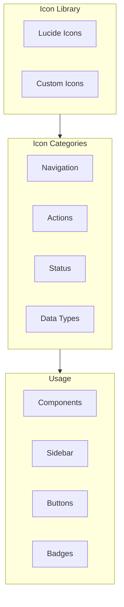
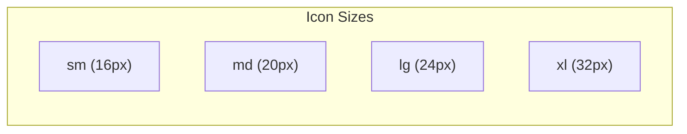

# DataHub Icons and Assets

## Overview

Icon library and asset guidelines for the DataHub Admin Dashboard.

---

## Icon System



---

## Icon Library

DataHub uses [Lucide Icons](https://lucide.dev/) as the primary icon library with custom additions.

### Navigation Icons

| Icon | Name | Usage |
|------|------|-------|
| `LayoutDashboard` | Dashboard | Dashboard navigation |
| `Key` | API Keys | Key management |
| `Server` | Services | Service configuration |
| `BarChart3` | Analytics | Analytics dashboard |
| `Settings` | Settings | Application settings |
| `FileText` | Logs | Log viewer |
| `Users` | Users | User management |

### Action Icons

| Icon | Name | Usage |
|------|------|-------|
| `Plus` | Add | Create new items |
| `Pencil` | Edit | Edit existing items |
| `Trash2` | Delete | Delete items |
| `Copy` | Copy | Copy to clipboard |
| `Download` | Download | Export data |
| `Upload` | Upload | Import data |
| `RefreshCw` | Refresh | Refresh/reload |
| `Search` | Search | Search functionality |
| `Filter` | Filter | Filter options |
| `MoreVertical` | More | Additional options |

### Status Icons

| Icon | Name | Color | Usage |
|------|------|-------|-------|
| `CheckCircle` | Success | `--color-success` | Success state |
| `XCircle` | Error | `--color-error` | Error state |
| `AlertTriangle` | Warning | `--color-warning` | Warning state |
| `Info` | Info | `--color-info` | Information |
| `Clock` | Pending | `--color-gray-500` | Pending state |
| `Ban` | Revoked | `--color-error` | Revoked/blocked |

### Data Type Icons

| Icon | Name | Usage |
|------|------|-------|
| `Activity` | Requests | API requests |
| `Zap` | Rate Limit | Rate limiting |
| `Shield` | Security | Security features |
| `Globe` | Origins | Allowed origins |
| `Network` | IP | IP addresses |
| `Tag` | Metadata | Key metadata |

---

## Icon Component

```tsx
// Icon component wrapper
import * as LucideIcons from 'lucide-react';

interface IconProps {
  name: keyof typeof LucideIcons;
  size?: 'sm' | 'md' | 'lg' | 'xl';
  color?: string;
  className?: string;
}

const sizeMap = {
  sm: 16,
  md: 20,
  lg: 24,
  xl: 32,
};

export const Icon: React.FC<IconProps> = ({
  name,
  size = 'md',
  color,
  className,
}) => {
  const LucideIcon = LucideIcons[name];

  return (
    <LucideIcon
      size={sizeMap[size]}
      color={color}
      className={className}
      aria-hidden="true"
    />
  );
};
```

### Usage Examples

```tsx
// Basic usage
<Icon name="Key" />

// With size
<Icon name="Plus" size="lg" />

// In button
<Button leftIcon={<Icon name="Plus" />}>
  Create API Key
</Button>

// Status indicator
<Badge
  leftIcon={<Icon name="CheckCircle" color="var(--color-success)" />}
  variant="success"
>
  Active
</Badge>
```

---

## Icon Sizing

| Size | Pixels | Usage |
|------|--------|-------|
| `sm` | 16px | Badges, small buttons |
| `md` | 20px | Default, inline icons |
| `lg` | 24px | Navigation, card icons |
| `xl` | 32px | Empty states, features |

### Size Reference



---

## Custom Icons

### DataHub Logo

```tsx
export const DataHubLogo: React.FC<{ size?: number }> = ({ size = 32 }) => (
  <svg
    width={size}
    height={size}
    viewBox="0 0 32 32"
    fill="none"
    xmlns="http://www.w3.org/2000/svg"
    aria-label="DataHub Logo"
  >
    <rect width="32" height="32" rx="8" fill="var(--color-primary-500)" />
    <path
      d="M8 16L16 8L24 16L16 24L8 16Z"
      fill="white"
      fillOpacity="0.9"
    />
    <circle cx="16" cy="16" r="4" fill="var(--color-primary-500)" />
  </svg>
);
```

### API Key Icon

```tsx
export const ApiKeyIcon: React.FC<{ size?: number }> = ({ size = 24 }) => (
  <svg
    width={size}
    height={size}
    viewBox="0 0 24 24"
    fill="none"
    stroke="currentColor"
    strokeWidth="2"
    strokeLinecap="round"
    strokeLinejoin="round"
  >
    <path d="M21 2l-2 2m-7.61 7.61a5.5 5.5 0 1 1-7.778 7.778 5.5 5.5 0 0 1 7.777-7.777zm0 0L15.5 7.5m0 0l3 3L22 7l-3-3m-3.5 3.5L19 4" />
  </svg>
);
```

---

## Asset Guidelines

### Image Formats

| Format | Usage |
|--------|-------|
| SVG | Icons, logos, illustrations |
| PNG | Screenshots, complex images |
| WebP | Optimized photos (with fallback) |

### Favicon Set

```html
<!-- Favicon configuration -->
<link rel="icon" type="image/svg+xml" href="/favicon.svg" />
<link rel="icon" type="image/png" sizes="32x32" href="/favicon-32x32.png" />
<link rel="icon" type="image/png" sizes="16x16" href="/favicon-16x16.png" />
<link rel="apple-touch-icon" sizes="180x180" href="/apple-touch-icon.png" />
<link rel="manifest" href="/site.webmanifest" />
```

---

## Empty State Illustrations

```tsx
// Empty state for API keys
const EmptyKeysIllustration: React.FC = () => (
  <div className="empty-state">
    <svg
      width="120"
      height="120"
      viewBox="0 0 120 120"
      fill="none"
      aria-hidden="true"
    >
      <circle cx="60" cy="60" r="50" fill="var(--color-gray-100)" />
      <path
        d="M60 30L80 50H70V70H50V50H40L60 30Z"
        fill="var(--color-gray-300)"
      />
      <rect x="45" y="75" width="30" height="8" rx="2" fill="var(--color-gray-300)" />
    </svg>
    <h3>No API Keys Yet</h3>
    <p>Create your first API key to get started</p>
    <Button leftIcon={<Icon name="Plus" />}>Create API Key</Button>
  </div>
);
```

---

## Loading States

### Spinner

```tsx
const Spinner: React.FC<{ size?: 'sm' | 'md' | 'lg' }> = ({ size = 'md' }) => {
  const sizeMap = { sm: 16, md: 24, lg: 32 };

  return (
    <svg
      width={sizeMap[size]}
      height={sizeMap[size]}
      viewBox="0 0 24 24"
      className="spinner"
      aria-label="Loading"
    >
      <circle
        cx="12"
        cy="12"
        r="10"
        stroke="var(--color-gray-200)"
        strokeWidth="3"
        fill="none"
      />
      <path
        d="M12 2a10 10 0 0 1 10 10"
        stroke="var(--color-primary-500)"
        strokeWidth="3"
        strokeLinecap="round"
        fill="none"
      />
    </svg>
  );
};
```

### Skeleton Loader

```tsx
const Skeleton: React.FC<{ width?: string; height?: string }> = ({
  width = '100%',
  height = '20px',
}) => (
  <div
    className="skeleton"
    style={{ width, height }}
    aria-hidden="true"
  />
);

// CSS
.skeleton {
  background: linear-gradient(
    90deg,
    var(--color-gray-200) 25%,
    var(--color-gray-100) 50%,
    var(--color-gray-200) 75%
  );
  background-size: 200% 100%;
  animation: shimmer 1.5s infinite;
  border-radius: var(--radius);
}

@keyframes shimmer {
  0% { background-position: 200% 0; }
  100% { background-position: -200% 0; }
}
```

---

## Asset Organization

```
assets/
  icons/
    lucide/           # Lucide icon exports
    custom/           # Custom SVG icons
  images/
    logo/             # Logo variations
    illustrations/    # Empty states, features
    screenshots/      # Documentation images
  favicons/           # Favicon set
```

---

## Related Documents

- [Design Tokens](./tokens.md)
- [Components](./components.md)
- [Accessibility](./accessibility.md)
