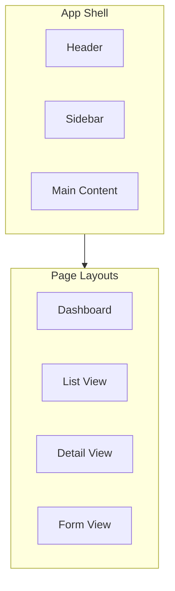
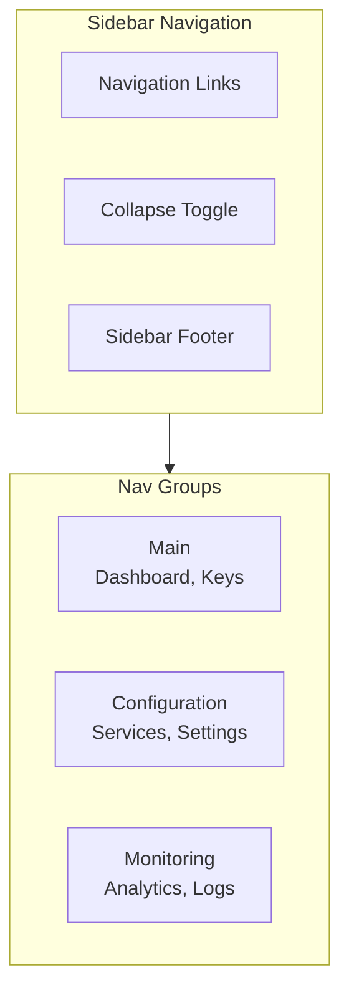
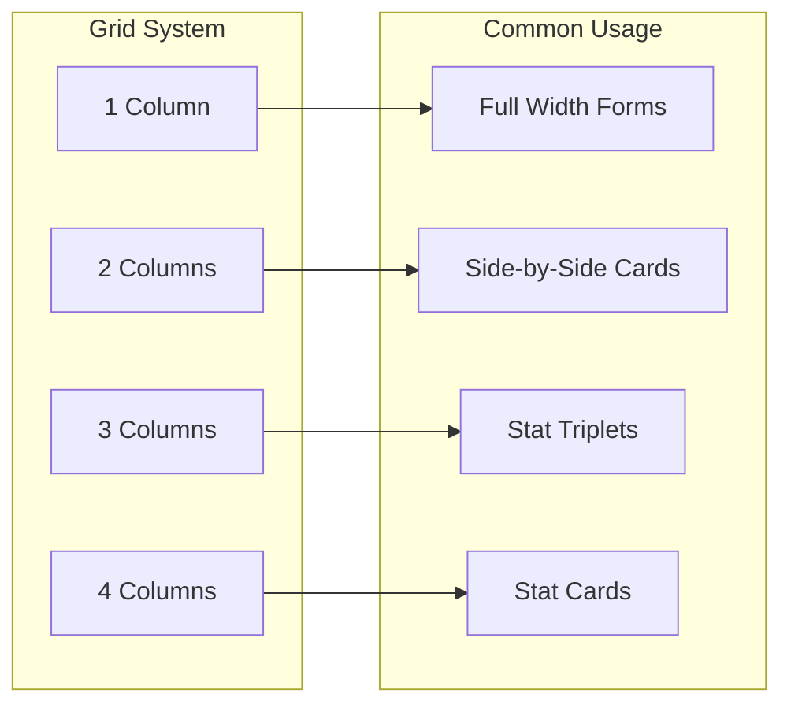

# DataHub UI Layouts

## Overview

Layout patterns and page structures for the DataHub Admin Dashboard.

---

## Layout Architecture



---

## App Shell Layout

```
+----------------------------------------------------------+
|  Header (64px)                                    Avatar  |
+----------------------------------------------------------+
|         |                                                 |
| Sidebar |  Main Content Area                              |
|  (240px)|                                                 |
|         |  +--------------------------------------------+ |
|  - Keys |  | Page Header                                | |
|  - Svc  |  +--------------------------------------------+ |
|  - Stats|  |                                            | |
|  - Set  |  | Content                                    | |
|         |  |                                            | |
|         |  |                                            | |
|         |  |                                            | |
+----------------------------------------------------------+
```

### Shell Component

```tsx
const AppShell: React.FC<{ children: React.ReactNode }> = ({ children }) => {
  return (
    <div className="app-shell">
      <Header />
      <div className="app-body">
        <Sidebar />
        <main className="main-content">
          {children}
        </main>
      </div>
    </div>
  );
};
```

### Shell Styles

```css
.app-shell {
  display: flex;
  flex-direction: column;
  min-height: 100vh;
}

.app-body {
  display: flex;
  flex: 1;
}

.sidebar {
  width: 240px;
  background: var(--bg-secondary);
  border-right: 1px solid var(--border-default);
}

.main-content {
  flex: 1;
  padding: var(--space-6);
  background: var(--bg-primary);
  overflow-y: auto;
}
```

---

## Header Layout

```
+----------------------------------------------------------+
| [Logo] DataHub Admin          Search...     [?] [Bell] [A]|
+----------------------------------------------------------+
```

```tsx
const Header: React.FC = () => {
  return (
    <header className="header">
      <div className="header-left">
        <Logo />
        <span className="header-title">DataHub Admin</span>
      </div>

      <div className="header-center">
        <SearchInput placeholder="Search keys, services..." />
      </div>

      <div className="header-right">
        <IconButton icon={<HelpIcon />} />
        <IconButton icon={<NotificationIcon />} badge={3} />
        <UserMenu />
      </div>
    </header>
  );
};
```

---

## Sidebar Layout



```tsx
const Sidebar: React.FC = () => {
  const [collapsed, setCollapsed] = useState(false);

  return (
    <aside className={`sidebar ${collapsed ? 'collapsed' : ''}`}>
      <nav className="sidebar-nav">
        <NavGroup label="Main">
          <NavItem icon={<DashboardIcon />} to="/dashboard">Dashboard</NavItem>
          <NavItem icon={<KeyIcon />} to="/keys">API Keys</NavItem>
        </NavGroup>

        <NavGroup label="Configuration">
          <NavItem icon={<ServerIcon />} to="/services">Services</NavItem>
          <NavItem icon={<SettingsIcon />} to="/settings">Settings</NavItem>
        </NavGroup>

        <NavGroup label="Monitoring">
          <NavItem icon={<ChartIcon />} to="/analytics">Analytics</NavItem>
          <NavItem icon={<LogIcon />} to="/logs">Logs</NavItem>
        </NavGroup>
      </nav>

      <div className="sidebar-footer">
        <CollapseButton onClick={() => setCollapsed(!collapsed)} />
      </div>
    </aside>
  );
};
```

---

## Dashboard Layout

```
+----------------------------------------------------------+
|  Dashboard                               Date Range [v]   |
+----------------------------------------------------------+
| +-------------+ +-------------+ +-------------+ +-------+ |
| | Total Req.  | | Error Rate  | | Avg Latency | | Keys  | |
| | 1.2M        | | 0.02%       | | 45ms        | | 23    | |
| +-------------+ +-------------+ +-------------+ +-------+ |
+----------------------------------------------------------+
| +---------------------------+ +-------------------------+ |
| | Request Volume            | | Error Distribution      | |
| | [Line Chart]              | | [Pie Chart]             | |
| +---------------------------+ +-------------------------+ |
+----------------------------------------------------------+
| +---------------------------+ +-------------------------+ |
| | Top API Keys              | | Recent Activity         | |
| | [Table]                   | | [List]                  | |
| +---------------------------+ +-------------------------+ |
+----------------------------------------------------------+
```

```tsx
const DashboardLayout: React.FC = () => {
  return (
    <PageLayout>
      <PageHeader title="Dashboard">
        <DateRangePicker />
      </PageHeader>

      <Grid columns={4} gap="4">
        <StatCard title="Total Requests" value="1.2M" />
        <StatCard title="Error Rate" value="0.02%" />
        <StatCard title="Avg Latency" value="45ms" />
        <StatCard title="Active Keys" value="23" />
      </Grid>

      <Grid columns={2} gap="6">
        <Card title="Request Volume">
          <RequestChart />
        </Card>
        <Card title="Error Distribution">
          <ErrorPieChart />
        </Card>
      </Grid>

      <Grid columns={2} gap="6">
        <Card title="Top API Keys">
          <TopKeysTable />
        </Card>
        <Card title="Recent Activity">
          <ActivityFeed />
        </Card>
      </Grid>
    </PageLayout>
  );
};
```

---

## List View Layout

```
+----------------------------------------------------------+
|  API Keys                           [+ Create API Key]    |
+----------------------------------------------------------+
| Search...                   Status [v]   Sort [v]         |
+----------------------------------------------------------+
| +--------------------------------------------------------+ |
| | Name          | Status   | Rate Limit | Last Used | .. | |
| |--------------------------------------------------------| |
| | Production    | Active   | 1000/min   | 2 min ago | .. | |
| | Development   | Active   | 100/min    | 1 hr ago  | .. | |
| | Testing       | Revoked  | 500/min    | 3 days    | .. | |
| +--------------------------------------------------------+ |
| Showing 1-20 of 45                      [<] [1] [2] [3] [>]|
+----------------------------------------------------------+
```

```tsx
const ListLayout: React.FC<ListLayoutProps> = ({
  title,
  actions,
  filters,
  children,
  pagination,
}) => {
  return (
    <PageLayout>
      <PageHeader title={title}>{actions}</PageHeader>

      <Card>
        <Card.Header>
          <FilterBar>{filters}</FilterBar>
        </Card.Header>
        <Card.Body padding={false}>
          {children}
        </Card.Body>
        <Card.Footer>
          <Pagination {...pagination} />
        </Card.Footer>
      </Card>
    </PageLayout>
  );
};
```

---

## Detail View Layout

```
+----------------------------------------------------------+
|  < Back to Keys    Production API Key      [Edit] [Delete]|
+----------------------------------------------------------+
| +------------------------+ +-----------------------------+ |
| | Key Information        | | Usage Statistics            | |
| |------------------------| |-----------------------------| |
| | Name: Production API   | | Today: 15,234 requests      | |
| | Status: Active         | | This Week: 89,432           | |
| | Rate Limit: 1000/min   | | This Month: 456,234         | |
| | Created: Jan 15, 2024  | | [Usage Chart]               | |
| +------------------------+ +-----------------------------+ |
+----------------------------------------------------------+
| +----------------------------------------------------------+ |
| | Configuration                                            | |
| |----------------------------------------------------------| |
| | Allowed IPs: 203.0.113.0/24                              | |
| | Allowed Origins: https://app.example.com                 | |
| | Metadata: team=backend, project=api                      | |
| +----------------------------------------------------------+ |
+----------------------------------------------------------+
```

---

## Form Layout

```
+----------------------------------------------------------+
|  Create API Key                                           |
+----------------------------------------------------------+
| +----------------------------------------------------------+ |
| | Basic Information                                        | |
| |----------------------------------------------------------| |
| | Name *                                                   | |
| | [____________________________________]                   | |
| |                                                          | |
| | Rate Limit *                                             | |
| | [____] requests per minute                               | |
| +----------------------------------------------------------+ |
|                                                            |
| +----------------------------------------------------------+ |
| | Access Restrictions (Optional)                           | |
| |----------------------------------------------------------| |
| | Allowed IP Addresses                                     | |
| | [+ Add IP Range]                                         | |
| |                                                          | |
| | Allowed Origins                                          | |
| | [+ Add Origin]                                           | |
| +----------------------------------------------------------+ |
|                                                            |
|                          [Cancel]  [Create API Key]        |
+----------------------------------------------------------+
```

---

## Responsive Breakpoints

```css
:root {
  --breakpoint-sm: 640px;
  --breakpoint-md: 768px;
  --breakpoint-lg: 1024px;
  --breakpoint-xl: 1280px;
  --breakpoint-2xl: 1536px;
}

/* Sidebar collapses on tablet */
@media (max-width: 1024px) {
  .sidebar {
    position: fixed;
    transform: translateX(-100%);
    z-index: var(--z-fixed);
  }

  .sidebar.open {
    transform: translateX(0);
  }

  .main-content {
    margin-left: 0;
  }
}

/* Stack cards on mobile */
@media (max-width: 768px) {
  .grid-2 {
    grid-template-columns: 1fr;
  }

  .stat-cards {
    grid-template-columns: repeat(2, 1fr);
  }
}
```

---

## Layout Grid System



---

## Related Documents

- [Design Tokens](./tokens.md)
- [Components](./components.md)
- [Screens](./screens.md)
