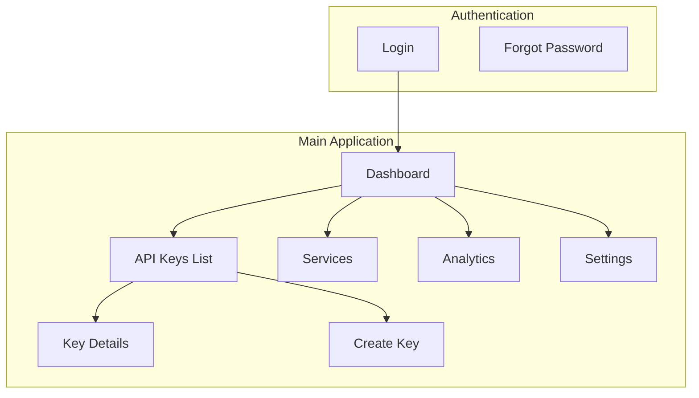
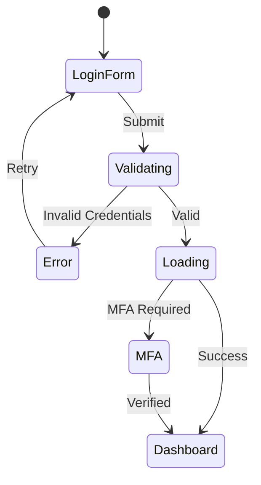
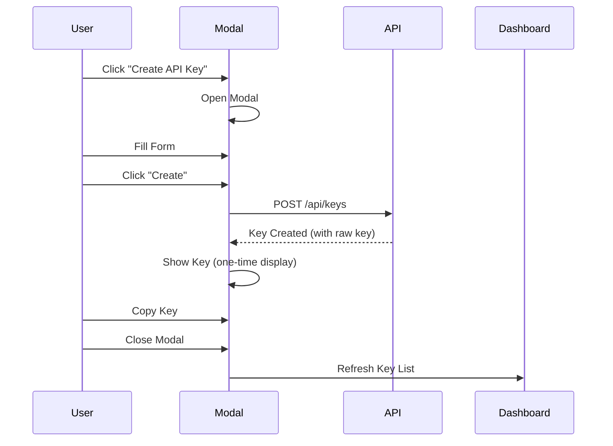
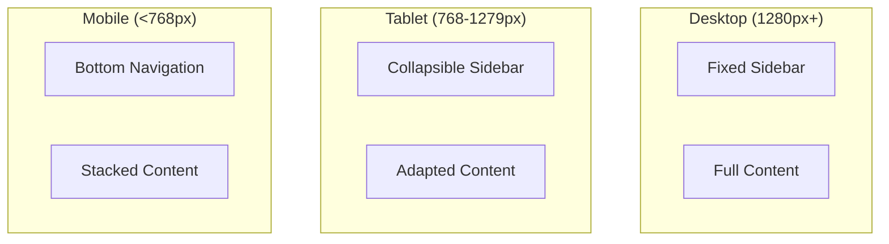

# DataHub Screen Designs

## Overview

Key screen designs and user flows for the DataHub Admin Dashboard.

---

## Screen Map



---

## Login Screen

```
+----------------------------------------------------------+
|                                                          |
|                    [DataHub Logo]                        |
|                                                          |
|                   DataHub Admin                          |
|                                                          |
|           +--------------------------------+             |
|           | Email                          |             |
|           | [_____________________________]|             |
|           |                                |             |
|           | Password                       |             |
|           | [_____________________________]|             |
|           |                                |             |
|           | [ ] Remember me    Forgot?     |             |
|           |                                |             |
|           | [        Sign In             ] |             |
|           +--------------------------------+             |
|                                                          |
|              Secured by DataHub Security                 |
|                                                          |
+----------------------------------------------------------+
```

### Login Flow



---

## Dashboard Screen

```
+----------------------------------------------------------+
| [Logo] DataHub Admin     Search...        [?] [Bell] [AV]|
+----------------------------------------------------------+
|         |                                                |
| MAIN    | Dashboard                     Last 7 days [v]  |
| --------|------------------------------------------------|
| Dashbd  | +----------+ +----------+ +----------+ +------+|
| Keys    | | Requests | |  Errors  | | Latency  | | Keys ||
| Services| |  1.23M   | |  0.02%   | |   45ms   | |  23  ||
|         | |  +12.5%  | |  -5.2%   | |  -8.3%   | |  +2  ||
| MONITOR | +----------+ +----------+ +----------+ +------+|
| --------|------------------------------------------------|
| Analytcs| +-------------------------+ +------------------+|
| Logs    | | Request Volume          | | Top API Keys     ||
|         | |                         | |                  ||
| CONFIG  | | [====Line Chart=====]   | | 1. Prod: 450K   ||
| --------|---------------------------|--------------------||
| Settings| | [===================]   | | 2. Dev: 230K    ||
|         | +-------------------------+ | 3. Test: 120K   ||
|         |                            +------------------+|
|         | +-------------------------+ +------------------+|
|         | | Error Distribution      | | Recent Activity  ||
|         | |      [Pie Chart]        | | Key created...   ||
|         | |                         | | Rate limit...    ||
|         | +-------------------------+ +------------------+|
+----------------------------------------------------------+
```

---

## API Keys List Screen

```
+----------------------------------------------------------+
| [Logo] DataHub Admin     Search...        [?] [Bell] [AV]|
+----------------------------------------------------------+
|         |                                                |
| MAIN    | API Keys                    [+ Create API Key] |
| --------|------------------------------------------------|
| Dashbd  | Search keys...        Status [All v]  Sort [v] |
|*Keys*   |------------------------------------------------|
| Services| +----------------------------------------------------+
|         | | Name           | Status  | Rate    | Last Used    | |
| MONITOR | |----------------------------------------------------|
| --------|-------------------------------------------------------|
| Analytcs| | Production API | Active  | 1000/m  | 2 minutes    |.|
| Logs    | | Development    | Active  | 100/m   | 1 hour       |.|
|         | | Staging Test   | Active  | 500/m   | 3 hours      |.|
| CONFIG  | | Legacy Key     | Revoked | 200/m   | 30 days      |.|
| --------|-------------------------------------------------------|
| Settings| | Mobile App     | Active  | 2000/m  | 5 minutes    |.|
|         | +----------------------------------------------------+
|         |                                                |
|         | Showing 1-5 of 23 keys       [<] 1 2 3 4 5 [>] |
+----------------------------------------------------------+
```

---

## API Key Detail Screen

```
+----------------------------------------------------------+
| [Logo] DataHub Admin     Search...        [?] [Bell] [AV]|
+----------------------------------------------------------+
|         |                                                |
| MAIN    | < Back to Keys                                 |
| --------|------------------------------------------------|
| Dashbd  | Production API Key            [Edit]  [Revoke] |
|*Keys*   |                                                |
| Services|------------------------------------------------|
|         | +---------------------------+ +----------------+|
| MONITOR | | Key Information           | | Usage Stats    ||
| --------|-----------------------------| |----------------||
| Analytcs| | Name: Production API      | | Today: 15,234  ||
| Logs    | | Status: [Active]          | | Week: 89,432   ||
|         | | Rate Limit: 1000 req/min  | | Month: 456,234 ||
| CONFIG  | | Created: Jan 15, 2024     | |                ||
| --------|-----------------------------| | [Usage Chart]  ||
| Settings| | Last Used: 2 minutes ago  | |                ||
|         | +---------------------------+ +----------------+|
|         |                                                |
|         | +----------------------------------------------+|
|         | | Access Restrictions                          ||
|         | |----------------------------------------------||
|         | | Allowed IPs: 203.0.113.0/24, 198.51.100.10  ||
|         | | Allowed Origins: https://app.example.com    ||
|         | +----------------------------------------------+|
|         |                                                |
|         | +----------------------------------------------+|
|         | | Metadata                                     ||
|         | |----------------------------------------------||
|         | | team: backend                                ||
|         | | project: user-service                        ||
|         | | environment: production                      ||
|         | +----------------------------------------------+|
+----------------------------------------------------------+
```

---

## Create API Key Modal

```
+----------------------------------------------------------+
|                                                          |
|   +--------------------------------------------------+   |
|   | Create API Key                              [X]  |   |
|   |--------------------------------------------------|   |
|   |                                                  |   |
|   | Basic Information                                |   |
|   | ------------------------------------------------ |   |
|   | Name *                                           |   |
|   | [Production API Key_______________________]      |   |
|   |                                                  |   |
|   | Rate Limit *                                     |   |
|   | [1000____] requests per minute                   |   |
|   |                                                  |   |
|   | Access Restrictions (Optional)                   |   |
|   | ------------------------------------------------ |   |
|   | Allowed IP Addresses                             |   |
|   | [203.0.113.0/24                         ] [X]    |   |
|   | [+ Add IP Range]                                 |   |
|   |                                                  |   |
|   | Allowed Origins                                  |   |
|   | [https://app.example.com                ] [X]    |   |
|   | [+ Add Origin]                                   |   |
|   |                                                  |   |
|   | Metadata (Optional)                              |   |
|   | ------------------------------------------------ |   |
|   | [team____] : [backend___]               [X]      |   |
|   | [+ Add Metadata]                                 |   |
|   |                                                  |   |
|   |--------------------------------------------------|   |
|   |                    [Cancel]  [Create API Key]    |   |
|   +--------------------------------------------------+   |
|                                                          |
+----------------------------------------------------------+
```

### Create Key Flow



---

## Analytics Screen

```
+----------------------------------------------------------+
| [Logo] DataHub Admin     Search...        [?] [Bell] [AV]|
+----------------------------------------------------------+
|         |                                                |
| MAIN    | Analytics                                      |
| --------|------------------------------------------------|
| Dashbd  | Date Range: [Jan 1] to [Jan 31]    [Apply]    |
| Keys    |                                                |
| Services| +----------------------------------------------+|
|         | | Request Volume                               ||
|*MONITOR*| |                                              ||
| --------|  [==========Line Chart==================]     ||
|*Analytcs*| |                                              ||
| Logs    | +----------------------------------------------+|
|         |                                                |
| CONFIG  | +----------------------+ +---------------------+|
| --------|------------------------| |---------------------||
| Settings| | By Status Code       | | By API Key          ||
|         | | 2xx: 98.5%           | | Production: 45%     ||
|         | | 4xx: 1.2%            | | Development: 30%    ||
|         | | 5xx: 0.3%            | | Staging: 15%        ||
|         | +----------------------+ | Other: 10%          ||
|         |                          +---------------------+|
|         | +----------------------------------------------+|
|         | | Latency Percentiles                          ||
|         | | P50: 45ms  P95: 120ms  P99: 250ms            ||
|         | | [========Histogram=================]         ||
|         | +----------------------------------------------+|
+----------------------------------------------------------+
```

---

## Settings Screen

```
+----------------------------------------------------------+
| [Logo] DataHub Admin     Search...        [?] [Bell] [AV]|
+----------------------------------------------------------+
|         |                                                |
| MAIN    | Settings                                       |
| --------|------------------------------------------------|
| Dashbd  |                                                |
| Keys    | General                                        |
| Services| +----------------------------------------------+|
|         | | Organization Name                            ||
| MONITOR | | [DataHub Inc.________________________]        ||
| --------|------------------------------------------------||
| Analytcs| | Timezone                                     ||
| Logs    | | [UTC (Coordinated Universal Time)    v]      ||
|         | +----------------------------------------------+|
| CONFIG  |                                                |
| --------|------------------------------------------------|
|*Settings*| Security                                       |
|         | +----------------------------------------------+|
|         | | Two-Factor Authentication                    ||
|         | | [Toggle ON]  Required for all admin users    ||
|         | |                                              ||
|         | | Session Timeout                              ||
|         | | [30 minutes                          v]      ||
|         | +----------------------------------------------+|
|         |                                                |
|         | API Defaults                                   |
|         | +----------------------------------------------+|
|         | | Default Rate Limit                           ||
|         | | [100_____] requests per minute               ||
|         | |                                              ||
|         | | Global Rate Limit                            ||
|         | | [1000000_] requests per minute               ||
|         | +----------------------------------------------+|
|         |                                                |
|         |                          [Save Changes]        |
+----------------------------------------------------------+
```

---

## Mobile Responsive Views



---

## Related Documents

- [Layouts](./layouts.md)
- [Components](./components.md)
- [Design Tokens](./tokens.md)
