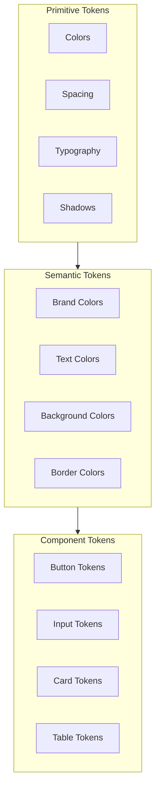
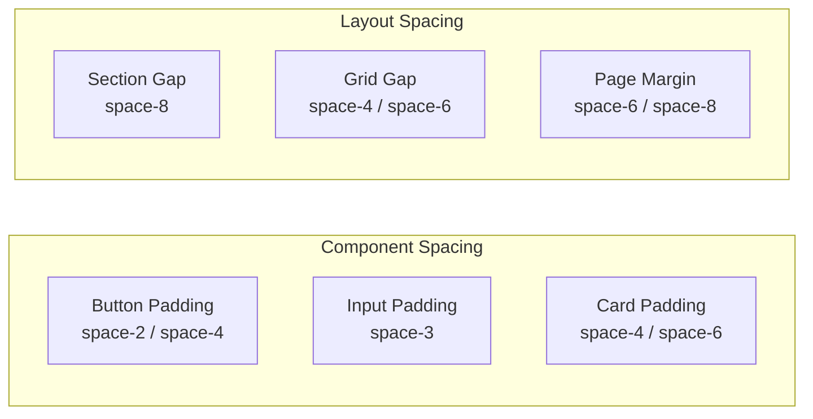

# DataHub Design Tokens

## Overview

Design tokens for the DataHub Admin Dashboard, ensuring consistent visual design across all UI components.

---

## Token Architecture



---

## Color Palette

### Brand Colors

```css
:root {
  /* Primary - DataHub Blue */
  --color-primary-50: #e6f0ff;
  --color-primary-100: #b3d4ff;
  --color-primary-200: #80b8ff;
  --color-primary-300: #4d9cff;
  --color-primary-400: #1a80ff;
  --color-primary-500: #0066e6;  /* Main brand color */
  --color-primary-600: #0052b3;
  --color-primary-700: #003d80;
  --color-primary-800: #00294d;
  --color-primary-900: #00141a;

  /* Secondary - Teal */
  --color-secondary-50: #e6fffa;
  --color-secondary-100: #b3fff0;
  --color-secondary-200: #80ffe6;
  --color-secondary-300: #4dffdc;
  --color-secondary-400: #1affd2;
  --color-secondary-500: #00e6b8;
  --color-secondary-600: #00b38f;
  --color-secondary-700: #008066;
  --color-secondary-800: #004d3d;
  --color-secondary-900: #001a14;
}
```

### Semantic Colors

```css
:root {
  /* Status Colors */
  --color-success-light: #d1fae5;
  --color-success: #10b981;
  --color-success-dark: #047857;

  --color-warning-light: #fef3c7;
  --color-warning: #f59e0b;
  --color-warning-dark: #b45309;

  --color-error-light: #fee2e2;
  --color-error: #ef4444;
  --color-error-dark: #b91c1c;

  --color-info-light: #dbeafe;
  --color-info: #3b82f6;
  --color-info-dark: #1d4ed8;
}
```

### Neutral Colors

```css
:root {
  --color-gray-50: #f9fafb;
  --color-gray-100: #f3f4f6;
  --color-gray-200: #e5e7eb;
  --color-gray-300: #d1d5db;
  --color-gray-400: #9ca3af;
  --color-gray-500: #6b7280;
  --color-gray-600: #4b5563;
  --color-gray-700: #374151;
  --color-gray-800: #1f2937;
  --color-gray-900: #111827;
}
```

---

## Typography

### Font Stack

```css
:root {
  --font-sans: 'Inter', -apple-system, BlinkMacSystemFont, 'Segoe UI', Roboto, sans-serif;
  --font-mono: 'JetBrains Mono', 'Fira Code', Consolas, monospace;
}
```

### Type Scale

```css
:root {
  /* Font Sizes */
  --text-xs: 0.75rem;     /* 12px */
  --text-sm: 0.875rem;    /* 14px */
  --text-base: 1rem;      /* 16px */
  --text-lg: 1.125rem;    /* 18px */
  --text-xl: 1.25rem;     /* 20px */
  --text-2xl: 1.5rem;     /* 24px */
  --text-3xl: 1.875rem;   /* 30px */
  --text-4xl: 2.25rem;    /* 36px */

  /* Line Heights */
  --leading-tight: 1.25;
  --leading-normal: 1.5;
  --leading-relaxed: 1.75;

  /* Font Weights */
  --font-normal: 400;
  --font-medium: 500;
  --font-semibold: 600;
  --font-bold: 700;
}
```

### Typography Presets

| Preset | Size | Weight | Line Height | Usage |
|--------|------|--------|-------------|-------|
| `heading-1` | 36px | 700 | 1.25 | Page titles |
| `heading-2` | 30px | 600 | 1.25 | Section headers |
| `heading-3` | 24px | 600 | 1.25 | Card titles |
| `heading-4` | 20px | 600 | 1.25 | Subsections |
| `body` | 16px | 400 | 1.5 | Body text |
| `body-sm` | 14px | 400 | 1.5 | Secondary text |
| `caption` | 12px | 400 | 1.5 | Labels, hints |
| `code` | 14px | 400 | 1.5 | Code blocks |

---

## Spacing

### Base Scale

```css
:root {
  --space-0: 0;
  --space-1: 0.25rem;   /* 4px */
  --space-2: 0.5rem;    /* 8px */
  --space-3: 0.75rem;   /* 12px */
  --space-4: 1rem;      /* 16px */
  --space-5: 1.25rem;   /* 20px */
  --space-6: 1.5rem;    /* 24px */
  --space-8: 2rem;      /* 32px */
  --space-10: 2.5rem;   /* 40px */
  --space-12: 3rem;     /* 48px */
  --space-16: 4rem;     /* 64px */
  --space-20: 5rem;     /* 80px */
}
```

### Spacing Usage



---

## Shadows

```css
:root {
  --shadow-sm: 0 1px 2px 0 rgb(0 0 0 / 0.05);
  --shadow: 0 1px 3px 0 rgb(0 0 0 / 0.1), 0 1px 2px -1px rgb(0 0 0 / 0.1);
  --shadow-md: 0 4px 6px -1px rgb(0 0 0 / 0.1), 0 2px 4px -2px rgb(0 0 0 / 0.1);
  --shadow-lg: 0 10px 15px -3px rgb(0 0 0 / 0.1), 0 4px 6px -4px rgb(0 0 0 / 0.1);
  --shadow-xl: 0 20px 25px -5px rgb(0 0 0 / 0.1), 0 8px 10px -6px rgb(0 0 0 / 0.1);
}
```

---

## Border Radius

```css
:root {
  --radius-none: 0;
  --radius-sm: 0.125rem;   /* 2px */
  --radius: 0.25rem;       /* 4px */
  --radius-md: 0.375rem;   /* 6px */
  --radius-lg: 0.5rem;     /* 8px */
  --radius-xl: 0.75rem;    /* 12px */
  --radius-2xl: 1rem;      /* 16px */
  --radius-full: 9999px;
}
```

---

## Animation

```css
:root {
  /* Durations */
  --duration-fast: 100ms;
  --duration-normal: 200ms;
  --duration-slow: 300ms;
  --duration-slower: 500ms;

  /* Easings */
  --ease-linear: linear;
  --ease-in: cubic-bezier(0.4, 0, 1, 1);
  --ease-out: cubic-bezier(0, 0, 0.2, 1);
  --ease-in-out: cubic-bezier(0.4, 0, 0.2, 1);
  --ease-bounce: cubic-bezier(0.68, -0.55, 0.265, 1.55);
}
```

---

## Z-Index Scale

```css
:root {
  --z-dropdown: 1000;
  --z-sticky: 1020;
  --z-fixed: 1030;
  --z-modal-backdrop: 1040;
  --z-modal: 1050;
  --z-popover: 1060;
  --z-tooltip: 1070;
  --z-toast: 1080;
}
```

---

## Dark Mode Tokens

```css
[data-theme="dark"] {
  /* Backgrounds */
  --bg-primary: var(--color-gray-900);
  --bg-secondary: var(--color-gray-800);
  --bg-tertiary: var(--color-gray-700);

  /* Text */
  --text-primary: var(--color-gray-50);
  --text-secondary: var(--color-gray-300);
  --text-muted: var(--color-gray-400);

  /* Borders */
  --border-default: var(--color-gray-700);
  --border-strong: var(--color-gray-600);

  /* Surfaces */
  --surface-card: var(--color-gray-800);
  --surface-hover: var(--color-gray-700);
}
```

---

## Token Usage Examples

```tsx
// Button component using tokens
const Button = styled.button`
  padding: var(--space-2) var(--space-4);
  font-size: var(--text-sm);
  font-weight: var(--font-medium);
  border-radius: var(--radius-md);
  background: var(--color-primary-500);
  color: white;
  transition: background var(--duration-fast) var(--ease-out);

  &:hover {
    background: var(--color-primary-600);
  }
`;
```

---

## Related Documents

- [Components](./components.md)
- [Layouts](./layouts.md)
- [Accessibility](./accessibility.md)
