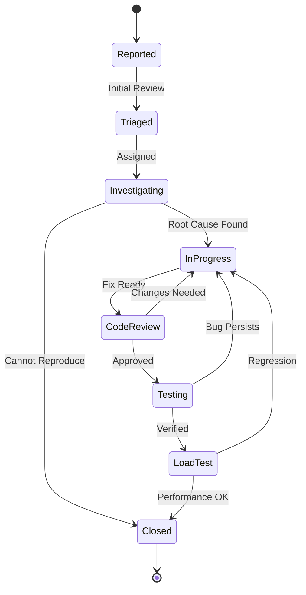
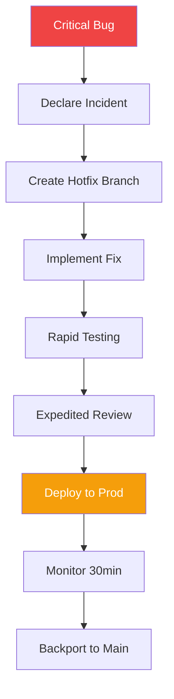

# DataHub Bug Fix Workflow

## Overview

This document outlines the process for identifying, triaging, fixing, and verifying bugs in the DataHub API Gateway platform.

---

## Bug Lifecycle



---

## Bug Severity for API Gateway

| Severity | Impact | Response Time | Example |
|----------|--------|---------------|---------|
| Critical | Gateway down | < 15 min | All requests failing |
| High | Major feature broken | < 1 hour | Auth not working |
| Medium | Feature degraded | < 4 hours | Rate limiting inaccurate |
| Low | Minor issue | < 24 hours | Metrics missing |

---

## Gateway-Specific Bug Categories

### Request Handling

```markdown
- Routing failures
- Header manipulation errors
- Body transformation bugs
- Timeout handling issues
- Connection pool leaks
```

### Authentication/Authorization

```markdown
- API key validation failures
- JWT verification bugs
- Permission check errors
- Token refresh issues
```

### Rate Limiting

```markdown
- Counter accuracy issues
- Window calculation bugs
- Distributed coordination failures
- Header reporting errors
```

### Caching

```markdown
- Cache invalidation bugs
- Stale data issues
- Memory leaks
- Redis connection problems
```

---

## Bug Investigation

### Debug Checklist

```bash
# 1. Check gateway logs
kubectl logs -f deployment/datahub-gateway -n production | grep ERROR

# 2. Check metrics
curl "http://prometheus:9090/api/v1/query?query=gateway_errors_total"

# 3. Check Redis state
redis-cli -h redis-cluster KEYS "ratelimit:*"

# 4. Check request tracing
jaeger-query --trace-id <trace-id>

# 5. Reproduce locally
curl -v http://localhost:3001/api/proxy/test \
  -H "X-API-Key: test_key" \
  -H "X-Debug: true"
```

### Root Cause Template

```markdown
## Root Cause Analysis: DH-789

### Summary
Rate limiter returning incorrect remaining count after Redis failover.

### Timeline
- 10:30: Redis primary failover triggered
- 10:31: Rate limit counters reset
- 10:32: Customers report 429 errors
- 10:45: Investigation started
- 11:15: Root cause identified

### Root Cause
Redis SCAN operation during failover caused counter keys to be missed.
Sliding window algorithm uses sorted sets that weren't replicated atomically.

### Fix
Implement Lua script for atomic counter operations.
Add graceful degradation during Redis failover.

### Prevention
- Add integration tests for Redis failover scenarios
- Implement circuit breaker for rate limiter
- Add monitoring for counter consistency
```

---

## Hotfix Process



### Hotfix Commands

```bash
# 1. Create hotfix branch
git checkout main
git pull origin main
git checkout -b hotfix/rate-limit-redis-failover

# 2. Implement minimal fix
# ... make changes ...

# 3. Run critical tests only
npm run test:unit -- --grep "rate-limit"
npm run test:integration -- --grep "redis"

# 4. Commit with hotfix prefix
git commit -m "hotfix(ratelimit): handle Redis failover gracefully

Add circuit breaker to rate limiter during Redis unavailability.
Implement atomic Lua script for counter operations.

Incident: INC-2024-0115"

# 5. Push and create expedited PR
git push -u origin hotfix/rate-limit-redis-failover
gh pr create --title "HOTFIX: Rate limit Redis failover" --label "hotfix,critical"

# 6. After approval, deploy directly
kubectl set image deployment/datahub-gateway \
  gateway=$ECR_REGISTRY/datahub-gateway:hotfix-abc123 \
  -n datahub-production
```

---

## Related Documents

- [Development Workflow](./development.md)
- [QA Review Process](./qa-review.md)
- [Deployment Process](./deployment.md)
