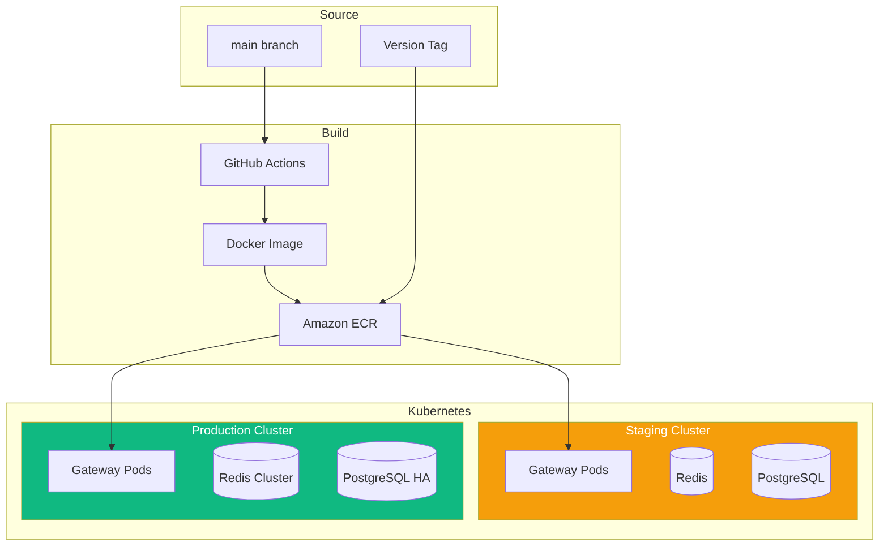
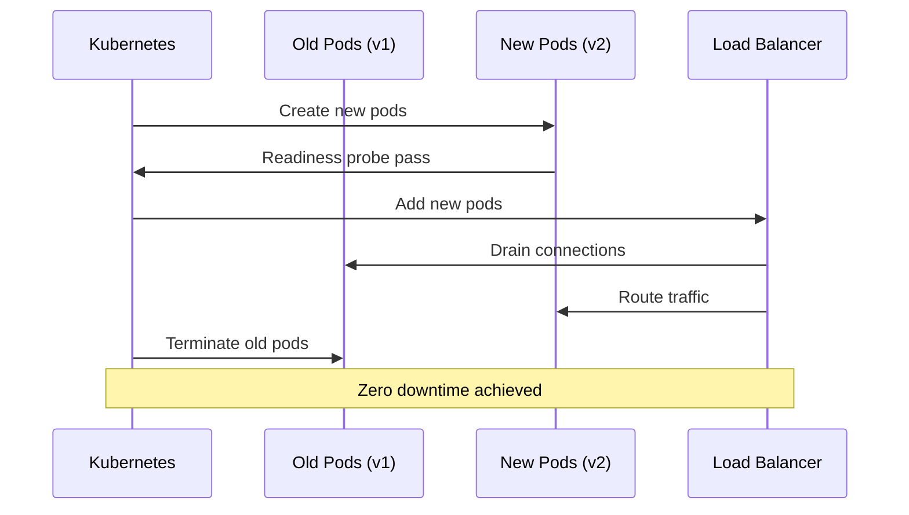
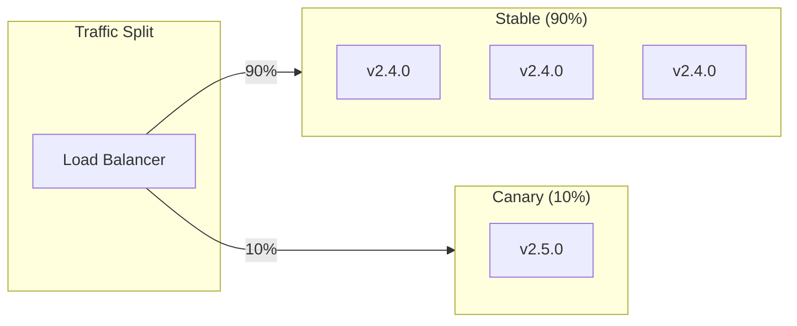
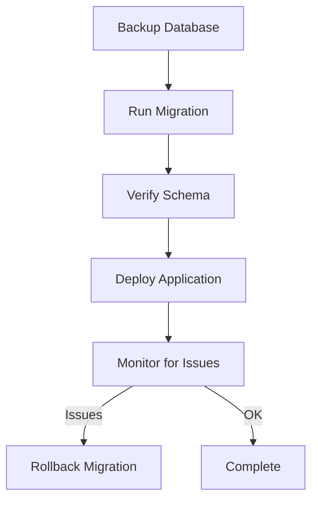

# DataHub Deployment Process

## Overview

This document covers the deployment process for the DataHub API Gateway, including Kubernetes deployments, rollback procedures, and zero-downtime strategies.

---

## Deployment Architecture



---

## Zero-Downtime Deployment

### Rolling Update Strategy

```yaml
# k8s/deployment.yaml
apiVersion: apps/v1
kind: Deployment
metadata:
  name: datahub-gateway
spec:
  replicas: 6
  strategy:
    type: RollingUpdate
    rollingUpdate:
      maxUnavailable: 1
      maxSurge: 2
  template:
    spec:
      containers:
        - name: gateway
          image: datahub-gateway:latest
          readinessProbe:
            httpGet:
              path: /health/ready
              port: 3001
            initialDelaySeconds: 10
            periodSeconds: 5
          livenessProbe:
            httpGet:
              path: /health/live
              port: 3001
            initialDelaySeconds: 30
            periodSeconds: 10
          resources:
            requests:
              cpu: "500m"
              memory: "512Mi"
            limits:
              cpu: "2000m"
              memory: "2Gi"
```

### Deployment Flow



---

## Deployment Commands

### Staging Deployment

```bash
# Automatic on merge to main
# Manual trigger if needed:

# 1. Build and push image
docker build -t datahub-gateway:staging .
docker tag datahub-gateway:staging $ECR_REGISTRY/datahub-gateway:staging
docker push $ECR_REGISTRY/datahub-gateway:staging

# 2. Deploy to staging
kubectl set image deployment/datahub-gateway \
  gateway=$ECR_REGISTRY/datahub-gateway:staging \
  -n datahub-staging

# 3. Monitor rollout
kubectl rollout status deployment/datahub-gateway -n datahub-staging

# 4. Verify
curl https://staging-gateway.datahub.io/health
```

### Production Deployment

```bash
# 1. Create release tag
git tag -a v2.5.0 -m "Release v2.5.0: API key rotation"
git push origin v2.5.0

# 2. CI/CD builds and pushes image with tag

# 3. Deploy to production (requires approval)
kubectl set image deployment/datahub-gateway \
  gateway=$ECR_REGISTRY/datahub-gateway:v2.5.0 \
  -n datahub-production

# 4. Monitor rollout
kubectl rollout status deployment/datahub-gateway -n datahub-production

# 5. Verify health
curl https://gateway.datahub.io/health

# 6. Check metrics
kubectl top pods -n datahub-production -l app=datahub-gateway
```

---

## Canary Deployments



### Canary Deployment Steps

```bash
# 1. Deploy canary
kubectl apply -f k8s/canary-deployment.yaml

# 2. Configure traffic split (using Istio)
kubectl apply -f - <<EOF
apiVersion: networking.istio.io/v1beta1
kind: VirtualService
metadata:
  name: datahub-gateway
spec:
  hosts:
    - gateway.datahub.io
  http:
    - route:
        - destination:
            host: datahub-gateway-stable
          weight: 90
        - destination:
            host: datahub-gateway-canary
          weight: 10
EOF

# 3. Monitor canary metrics
# Check error rate, latency, etc.

# 4. Gradually increase traffic
# 10% -> 25% -> 50% -> 100%

# 5. Promote canary to stable
kubectl set image deployment/datahub-gateway-stable \
  gateway=$ECR_REGISTRY/datahub-gateway:v2.5.0

# 6. Remove canary
kubectl delete deployment datahub-gateway-canary
```

---

## Rollback Procedures

### Automatic Rollback

```yaml
# Deployment with automatic rollback
spec:
  progressDeadlineSeconds: 300
  revisionHistoryLimit: 5
```

### Manual Rollback

```bash
# View rollout history
kubectl rollout history deployment/datahub-gateway -n datahub-production

# Rollback to previous version
kubectl rollout undo deployment/datahub-gateway -n datahub-production

# Rollback to specific revision
kubectl rollout undo deployment/datahub-gateway -n datahub-production --to-revision=3

# Verify rollback
kubectl rollout status deployment/datahub-gateway -n datahub-production
```

---

## Database Migrations

### Migration Strategy



### Migration Commands

```bash
# 1. Backup database
pg_dump -h $DB_HOST -U $DB_USER -d datahub > backup_$(date +%Y%m%d).sql

# 2. Run migration (via Kubernetes job)
kubectl apply -f k8s/migration-job.yaml

# 3. Verify migration
kubectl logs job/datahub-migration -n datahub-production

# 4. If issues, rollback
psql -h $DB_HOST -U $DB_USER -d datahub < backup_20240115.sql
```

---

## Monitoring During Deployment

### Key Metrics to Watch

```
┌─────────────────────────────────────────────────────────────────┐
│                DEPLOYMENT MONITORING DASHBOARD                   │
├─────────────────────────────────────────────────────────────────┤
│                                                                  │
│  Pod Status                        Error Rate                    │
│  ┌─────────────────────┐          ┌─────────────────────┐       │
│  │ Ready: 5/6          │          │ ████░░░░░░ 0.02%    │       │
│  │ Updating: 1         │          │ Threshold: 0.1%     │       │
│  └─────────────────────┘          └─────────────────────┘       │
│                                                                  │
│  Latency P95                       Requests/sec                  │
│  ┌─────────────────────┐          ┌─────────────────────┐       │
│  │ ██████░░░░ 45ms     │          │ ████████░░ 12,450   │       │
│  │ Threshold: 100ms    │          │ Normal: 12,000      │       │
│  └─────────────────────┘          └─────────────────────┘       │
│                                                                  │
│  Memory Usage                      CPU Usage                     │
│  ┌─────────────────────┐          ┌─────────────────────┐       │
│  │ ██████░░░░ 62%      │          │ ████░░░░░░ 45%      │       │
│  │ Limit: 2Gi          │          │ Limit: 2 cores      │       │
│  └─────────────────────┘          └─────────────────────┘       │
│                                                                  │
└─────────────────────────────────────────────────────────────────┘
```

---

## Deployment Checklist

```markdown
## Production Deployment Checklist

### Pre-Deployment
- [ ] Staging verified for 24+ hours
- [ ] Load tests passed
- [ ] Security scan clean
- [ ] Change request approved
- [ ] Rollback plan documented

### During Deployment
- [ ] Database backup completed
- [ ] Migrations run successfully
- [ ] Rolling update in progress
- [ ] Health checks passing
- [ ] Error rate normal

### Post-Deployment
- [ ] All pods healthy
- [ ] Metrics normal
- [ ] No error spikes
- [ ] Customer verification
- [ ] Documentation updated
```

---

## Related Documents

- [CI/CD Pipeline](./ci-cd-pipeline.md)
- [Production Environment](../environments/production.md)
- [Staging Environment](../environments/staging.md)
