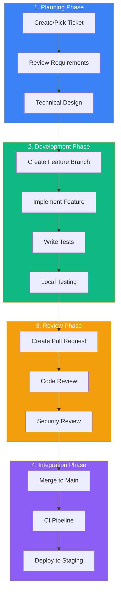
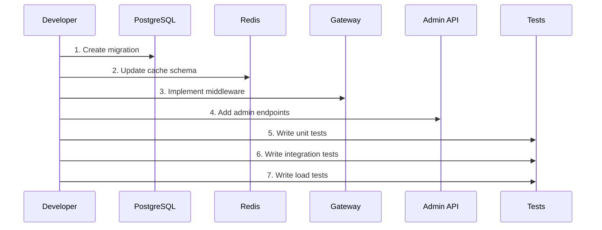
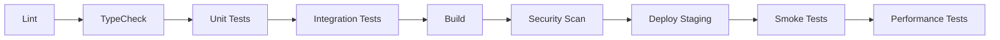

# DataHub API Gateway Development Workflow

## Overview

This document outlines the standard workflow for developing features for the DataHub API Gateway platform, from planning through implementation and review.

---

## Development Workflow Diagram



---

## Phase 1: Planning

### Feature Types

| Type | Description | Typical Size |
|------|-------------|--------------|
| Gateway Feature | New routing, transformation | 3-5 days |
| Security Feature | Auth, rate limiting | 2-4 days |
| Analytics Feature | Metrics, logging | 2-3 days |
| API Enhancement | New endpoints | 1-2 days |

### Technical Design Template

```markdown
## Technical Design: API Key Rotation

### Overview
Implement automatic API key rotation with configurable intervals.

### Components Affected
- Key Management Service
- Redis Cache
- Gateway Middleware
- Admin API

### Database Changes
- Add `rotation_interval` to `api_keys` table
- Add `key_history` table for audit

### API Changes
POST /api/keys/:id/rotate
GET /api/keys/:id/history

### Redis Changes
- Key format: `key:v2:{keyId}:{version}`
- TTL handling for old keys

### Security Considerations
- Grace period for old keys (5 minutes)
- Audit logging for rotation events
- Rate limit rotation requests
```

---

## Phase 2: Development

### Branch Naming

```bash
# Feature branches
feature/DH-123-api-key-rotation
feature/DH-456-rate-limit-headers

# Bug fixes
fix/DH-789-redis-connection-leak

# Performance improvements
perf/DH-101-cache-optimization
```

### Development Sequence



### Gateway Middleware Pattern

```typescript
// src/gateway/middleware/rateLimitMiddleware.ts
import { Request, Response, NextFunction } from 'express';
import { rateLimitService } from '../services/rateLimitService';
import { GatewayError } from '../utils/errors';

export async function rateLimitMiddleware(
  req: Request,
  res: Response,
  next: NextFunction
) {
  try {
    const apiKey = req.headers['x-api-key'] as string;
    const endpoint = req.path;

    const result = await rateLimitService.checkLimit(apiKey, endpoint);

    // Set rate limit headers
    res.set({
      'X-RateLimit-Limit': result.limit.toString(),
      'X-RateLimit-Remaining': result.remaining.toString(),
      'X-RateLimit-Reset': result.resetTime.toString(),
    });

    if (!result.allowed) {
      throw new GatewayError('Rate limit exceeded', 429, 'RATE_LIMIT_EXCEEDED');
    }

    next();
  } catch (error) {
    next(error);
  }
}
```

### Local Testing Commands

```bash
# Run unit tests
npm run test:unit

# Run integration tests (requires Docker)
npm run test:integration

# Run gateway locally
npm run dev

# Test with curl
curl -X POST http://localhost:3001/api/proxy/test \
  -H "X-API-Key: test_key_123" \
  -H "Content-Type: application/json" \
  -d '{"test": "data"}'

# Load test
npm run test:load -- --vus 100 --duration 30s
```

---

## Phase 3: Review

### Code Review Checklist

```markdown
## Gateway Feature Review Checklist

### Performance
- [ ] No blocking operations in request path
- [ ] Efficient cache usage
- [ ] Connection pooling utilized
- [ ] No memory leaks

### Security
- [ ] Input validation on all user data
- [ ] No sensitive data in logs
- [ ] Rate limiting applied
- [ ] Authentication checked

### Reliability
- [ ] Graceful error handling
- [ ] Circuit breaker pattern used
- [ ] Timeouts configured
- [ ] Retry logic appropriate

### Observability
- [ ] Metrics exported
- [ ] Structured logging
- [ ] Tracing spans added
- [ ] Alerts configured

### Testing
- [ ] Unit tests (> 80% coverage)
- [ ] Integration tests
- [ ] Load tests for critical paths
```

---

## Phase 4: Integration

### CI Pipeline Stages



### Post-Merge Checklist

```markdown
## Post-Merge Verification

- [ ] CI pipeline passed
- [ ] Deployed to staging
- [ ] Smoke tests passing
- [ ] No error spikes in monitoring
- [ ] Performance metrics stable
- [ ] Documentation updated
```

---

## Quick Reference

| Action | Command |
|--------|---------|
| Create branch | `git checkout -b feature/DH-xxx-desc` |
| Run tests | `npm test` |
| Run gateway | `npm run dev` |
| Check types | `npm run typecheck` |
| Lint code | `npm run lint` |
| Load test | `npm run test:load` |

---

## Related Documents

- [Git Workflow](./git-workflow.md)
- [CI/CD Pipeline](./ci-cd-pipeline.md)
- [Deployment Process](./deployment.md)
