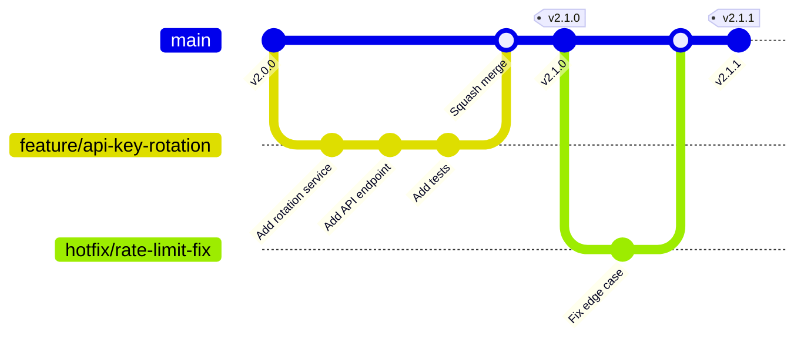

# DataHub Git Workflow

## Overview

DataHub follows a trunk-based development workflow with short-lived feature branches and strict merge requirements for the gateway platform.

---

## Branching Strategy



---

## Branch Types

| Type | Pattern | Purpose | Lifetime |
|------|---------|---------|----------|
| main | main | Production-ready code | Permanent |
| feature/ | feature/DH-xxx-desc | New features | 1-5 days |
| fix/ | fix/DH-xxx-desc | Bug fixes | 1-2 days |
| hotfix/ | hotfix/issue-desc | Production fixes | Hours |
| perf/ | perf/improvement-desc | Performance work | 1-3 days |
| security/ | security/DH-xxx-desc | Security fixes | 1-2 days |

---

## Commit Conventions

### Commit Types

| Type | Description | Example |
|------|-------------|---------|
| feat | New feature | feat(gateway): add request transformation |
| fix | Bug fix | fix(ratelimit): handle edge case for burst |
| perf | Performance | perf(cache): optimize key lookup |
| security | Security fix | security(auth): patch JWT validation |
| refactor | Code restructure | refactor(middleware): simplify chain |
| test | Test additions | test(proxy): add load test scenarios |
| docs | Documentation | docs(api): update rate limit docs |
| chore | Maintenance | chore(deps): update Redis client |

### Commit Message Format

```
<type>(<scope>): <subject>

[optional body]

[optional footer]

Scopes: gateway, auth, ratelimit, proxy, cache, analytics, admin, api
```

### Examples

```bash
# Feature commit
git commit -m "feat(ratelimit): add sliding window algorithm

Implement sliding window rate limiting with Redis sorted sets.
Provides more accurate rate limiting than fixed windows.

Closes DH-456"

# Performance commit
git commit -m "perf(cache): reduce Redis round trips

Batch multiple key lookups into single MGET command.
Reduces latency by ~15ms at P95."

# Security commit
git commit -m "security(auth): add API key hash verification

Hash API keys before storage and comparison.
Prevents timing attacks on key validation.

Security-Review: @security-team"
```

---

## Pull Request Process

### PR Requirements

```markdown
## Merge Requirements

- [ ] At least 2 approvals
- [ ] Security team approval (for security changes)
- [ ] All CI checks passing
- [ ] No merge conflicts
- [ ] Performance impact assessed
- [ ] Documentation updated
```

### PR Template

```markdown
## Description
[Describe the changes and why they're needed]

## Type of Change
- [ ] Feature
- [ ] Bug fix
- [ ] Performance improvement
- [ ] Security fix
- [ ] Documentation

## Performance Impact
- Latency: [No impact / +Xms / -Xms]
- Memory: [No impact / +XMB / -XMB]
- Throughput: [No impact / +X% / -X%]

## Security Considerations
- [ ] No security impact
- [ ] Security review requested
- [ ] Input validation added
- [ ] No sensitive data exposed

## Testing
- [ ] Unit tests added
- [ ] Integration tests added
- [ ] Load tests run
- [ ] Manual testing completed

## Checklist
- [ ] Code follows style guidelines
- [ ] Self-review completed
- [ ] Documentation updated
- [ ] Metrics/logging added
```

---

## Protected Branch Rules

```yaml
# main branch protection
main:
  required_reviews: 2
  dismiss_stale_reviews: true
  require_code_owner_review: true
  require_status_checks:
    - ci/lint
    - ci/typecheck
    - ci/unit-tests
    - ci/integration-tests
    - ci/security-scan
    - ci/build
  require_branch_up_to_date: true
  allow_force_push: false
  allow_deletion: false
```

---

## Related Documents

- [Development Workflow](./development.md)
- [CI/CD Pipeline](./ci-cd-pipeline.md)
- [Coding Standards](../project/coding-standards.md)
