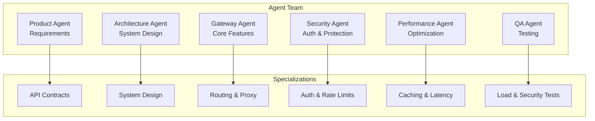
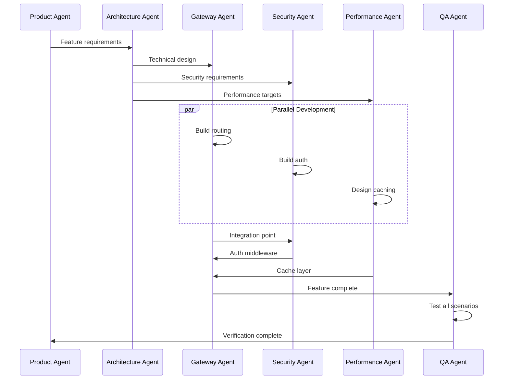
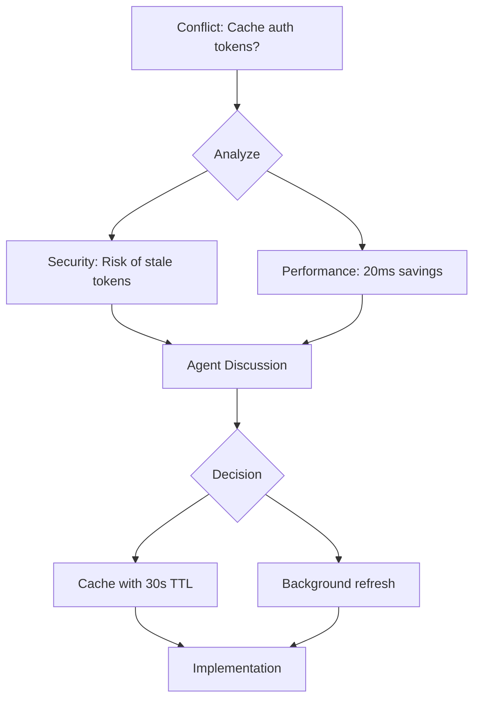

# DataHub Multi-Agent Coordination

## Overview

This document describes how multiple AI coding agents collaborate on DataHub API Gateway development, including specialized roles for gateway-specific concerns.

---

## Agent Roles



---

## Agent Responsibilities

### Gateway Agent

```markdown
## Gateway Agent Responsibilities

### Primary Tasks
- Implement request routing
- Build proxy middleware
- Handle request/response transformation
- Manage connection pooling

### Artifacts Produced
- Gateway middleware code
- Routing configuration
- Transformation rules
- Proxy handlers

### Handoff To
- Security Agent: Auth integration points
- Performance Agent: Bottleneck analysis
- QA Agent: Integration test requirements
```

### Security Agent

```markdown
## Security Agent Responsibilities

### Primary Tasks
- Implement authentication handlers
- Build rate limiting logic
- Develop API key management
- Create security middleware

### Artifacts Produced
- Auth middleware
- Rate limiter implementation
- API key service
- Security headers configuration

### Handoff To
- Gateway Agent: Integration with request pipeline
- QA Agent: Security test scenarios
```

### Performance Agent

```markdown
## Performance Agent Responsibilities

### Primary Tasks
- Optimize hot paths
- Implement caching strategies
- Tune connection pools
- Profile and benchmark

### Artifacts Produced
- Caching implementation
- Performance benchmarks
- Optimization recommendations
- Load test scenarios

### Handoff To
- Gateway Agent: Implementation guidance
- QA Agent: Performance baselines
```

---

## Coordination Workflow

### Feature Development Flow



---

## Handoff Protocol

### Gateway to Security Handoff

```yaml
handoff:
  from: gateway-agent
  to: security-agent
  feature: API Key Rotation

  context:
    current_flow: |
      1. Request arrives at gateway
      2. X-API-Key header extracted
      3. Key validated against database
      4. Request forwarded to upstream

  requirements:
    - Support rotating keys with grace period
    - Cache valid keys in Redis
    - Log rotation events
    - Handle key version conflicts

  integration_points:
    - Gateway middleware chain
    - Redis key storage
    - Audit log service

  constraints:
    - Max 5ms latency impact
    - No breaking changes to existing keys
```

---

## Conflict Resolution

### Performance vs Security Tradeoffs



---

## Sprint Coordination

### Daily Sync Format

```markdown
## Daily Agent Sync

### Gateway Agent
- Yesterday: Implemented request transformation
- Today: Adding response caching
- Blockers: Need Redis schema from Performance
- Handoffs: Transform logic ready for QA

### Security Agent
- Yesterday: Completed API key rotation
- Today: Adding audit logging
- Blockers: None
- Handoffs: Auth middleware ready for Gateway

### Performance Agent
- Yesterday: Profiled hot paths
- Today: Implementing connection pooling
- Blockers: Need prod traffic patterns
- Handoffs: Redis schema ready for Gateway

### QA Agent
- Yesterday: Load tested auth flow
- Today: Testing transformation rules
- Blockers: Waiting for caching feature
- Handoffs: Auth tests passed, report ready
```

---

## Quality Gates

### Agent Handoff Checklists

```yaml
# Gateway -> QA Handoff
gateway_to_qa:
  required:
    - [ ] Feature implemented per spec
    - [ ] Unit tests written
    - [ ] Integration points documented
    - [ ] Performance baseline measured
    - [ ] Error handling complete

# Security -> Gateway Handoff
security_to_gateway:
  required:
    - [ ] Auth middleware complete
    - [ ] Rate limit logic tested
    - [ ] Security headers configured
    - [ ] Audit logging implemented
    - [ ] Documentation updated

# Performance -> Gateway Handoff
performance_to_gateway:
  required:
    - [ ] Caching strategy documented
    - [ ] Redis schema defined
    - [ ] Benchmark results shared
    - [ ] Integration guide provided
```

---

## Communication Channels

### Structured Handoffs

```
┌─────────────────────────────────────────────────────────────────┐
│                 HANDOFF: API Key Rotation                        │
├─────────────────────────────────────────────────────────────────┤
│                                                                  │
│  From: Security Agent → To: Gateway Agent                       │
│  Status: Ready for Integration                                   │
│                                                                  │
│  ─────────────────────────────────────────────────────────────  │
│                                                                  │
│  Components Ready:                                               │
│  ✓ KeyRotationService (src/services/keyRotation.ts)            │
│  ✓ Auth middleware updated (src/middleware/auth.ts)            │
│  ✓ Redis schema for versioned keys                              │
│  ✓ Unit tests (45 tests, 92% coverage)                         │
│                                                                  │
│  Integration Guide:                                              │
│  1. Import rotationMiddleware from auth module                  │
│  2. Add to middleware chain after keyValidation                 │
│  3. Configure grace period in gateway config                    │
│                                                                  │
│  Open Questions:                                                 │
│  - Should rotation trigger webhook to customers?                │
│                                                                  │
└─────────────────────────────────────────────────────────────────┘
```

---

## Related Documents

- [Sprint Execution](./sprint-execution.md)
- [Development Workflow](./development.md)
- [QA Review Process](./qa-review.md)
