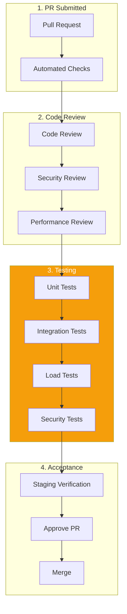

# DataHub QA Review Process

## Overview

This document outlines the quality assurance process for DataHub API Gateway, with special focus on performance, security, and reliability testing.

---

## QA Review Workflow



---

## Code Review Checklist

### Gateway-Specific Review

```markdown
## Gateway Code Review Checklist

### Request Handling
- [ ] No blocking operations in hot path
- [ ] Proper error propagation
- [ ] Request/response validation
- [ ] Timeout handling implemented
- [ ] Connection reuse optimized

### Middleware
- [ ] Middleware order correct
- [ ] Early exits for invalid requests
- [ ] No memory leaks
- [ ] Proper cleanup on error

### Caching
- [ ] Cache keys properly namespaced
- [ ] TTL appropriate for data
- [ ] Cache invalidation handled
- [ ] Fallback for cache miss

### Logging & Metrics
- [ ] Structured logging used
- [ ] No sensitive data logged
- [ ] Metrics exported
- [ ] Trace context propagated
```

### Security Review

```markdown
## Security Review Checklist

### Authentication
- [ ] API key validation complete
- [ ] JWT verification proper
- [ ] Token expiry handled
- [ ] No timing attacks possible

### Authorization
- [ ] Permission checks in place
- [ ] Resource ownership verified
- [ ] Rate limits enforced
- [ ] Scope validation complete

### Input Validation
- [ ] All inputs sanitized
- [ ] SQL injection prevented
- [ ] Header injection blocked
- [ ] Body size limits enforced

### Data Protection
- [ ] No PII in logs
- [ ] Secrets not exposed
- [ ] Encryption used properly
- [ ] Audit logging complete
```

---

## Testing Requirements

### Test Coverage Requirements

| Component | Minimum | Target |
|-----------|---------|--------|
| Gateway Core | 85% | 95% |
| Middleware | 80% | 90% |
| Auth Services | 90% | 95% |
| Rate Limiter | 85% | 95% |
| Utilities | 80% | 90% |

### Load Testing Requirements

```javascript
// k6 load test thresholds
export const options = {
  thresholds: {
    // Latency
    http_req_duration: [
      'p(50)<30',   // 50th percentile < 30ms
      'p(95)<100',  // 95th percentile < 100ms
      'p(99)<200',  // 99th percentile < 200ms
    ],
    // Error rate
    http_req_failed: ['rate<0.001'], // < 0.1%

    // Throughput
    http_reqs: ['rate>10000'], // > 10k req/sec

    // Custom metrics
    rate_limit_accuracy: ['value>0.99'],
    cache_hit_rate: ['value>0.90'],
  },
};
```

### Security Testing

```markdown
## Security Test Scenarios

### Authentication Tests
- Valid API key accepted
- Invalid API key rejected
- Expired key rejected
- Rotated key with grace period
- Missing key returns 401

### Rate Limiting Tests
- Under limit succeeds
- Over limit returns 429
- Headers accurate
- Distributed counting works
- Burst handling correct

### Injection Tests
- SQL injection blocked
- Header injection blocked
- Path traversal blocked
- XSS prevented
```

---

## Manual Testing Scenarios

### Gateway Feature Testing

```markdown
## Manual Test: Request Transformation

### Prerequisites
- Gateway running locally
- Test upstream service available
- API key configured

### Test Scenarios

#### TC-001: Header Transformation
Steps:
1. Send request with custom header
2. Verify header transformed
3. Check upstream received correct header

Expected:
- Original: X-Custom: value
- Transformed: X-Upstream-Custom: value

Result: [ ] Pass [ ] Fail

#### TC-002: Body Transformation
Steps:
1. Send JSON request body
2. Apply transformation rule
3. Verify transformed body

Expected:
- Field mapping correct
- New fields added
- Removed fields absent

Result: [ ] Pass [ ] Fail

#### TC-003: Error Response Transformation
Steps:
1. Trigger upstream error
2. Verify error transformed
3. Check response format

Expected:
- Standard error format
- Original error preserved
- Status code correct

Result: [ ] Pass [ ] Fail
```

---

## Acceptance Criteria Verification

### Feature AC Template

```markdown
## AC Verification: DH-456 API Key Rotation

### User Story
As an API consumer, I want to rotate my API keys without downtime.

### Acceptance Criteria

| # | Criterion | Status | Notes |
|---|-----------|--------|-------|
| 1 | New key generated on rotation | ✅ Pass | |
| 2 | Old key valid for 5 minutes | ✅ Pass | Grace period configurable |
| 3 | Rotation logged to audit | ✅ Pass | |
| 4 | Rate limits preserved | ✅ Pass | Counter migrated |
| 5 | Webhook notification sent | ✅ Pass | |

### Performance Impact

| Metric | Before | After | Delta |
|--------|--------|-------|-------|
| P95 Latency | 45ms | 47ms | +2ms |
| Memory | 512MB | 520MB | +8MB |
| Error Rate | 0.01% | 0.01% | No change |

### Load Test Results
- 10k req/sec sustained
- No errors during rotation
- Graceful degradation verified

### Overall Status: ✅ APPROVED
```

---

## Performance Benchmarking

### Benchmark Template

```markdown
## Performance Benchmark Report

### Test Configuration
- Tool: k6
- Duration: 10 minutes
- VUs: 100 -> 500 -> 1000
- Target: staging-gateway.datahub.io

### Results

| Metric | Target | Actual | Status |
|--------|--------|--------|--------|
| P50 Latency | < 30ms | 28ms | ✅ |
| P95 Latency | < 100ms | 85ms | ✅ |
| P99 Latency | < 200ms | 145ms | ✅ |
| Error Rate | < 0.1% | 0.02% | ✅ |
| Throughput | > 10k/s | 12.5k/s | ✅ |

### Resource Utilization
- CPU: 65% average, 85% peak
- Memory: 1.2GB average, 1.5GB peak
- Network: 450 Mbps average

### Recommendations
- Consider adding more replicas at 80% CPU
- Cache hit rate could be improved
```

---

## QA Sign-off

### Final Checklist

```markdown
## QA Sign-off: DH-456

### Automated Checks
- [x] CI pipeline passes
- [x] Unit tests pass (92% coverage)
- [x] Integration tests pass
- [x] Security scan clean
- [x] Load tests pass thresholds

### Code Review
- [x] Gateway review approved
- [x] Security review approved
- [x] Performance review approved
- [x] All feedback addressed

### Manual Testing
- [x] Feature scenarios pass
- [x] Edge cases tested
- [x] Error handling verified
- [x] Staging verification complete

### Documentation
- [x] API docs updated
- [x] Runbook updated
- [x] Changelog entry added

### Final Sign-off
Approved by: QA Agent
Date: 2024-01-15
Status: ✅ Ready for production
```

---

## Related Documents

- [Testing Strategy](../testing/strategy.md)
- [Development Workflow](./development.md)
- [Bug Fix Workflow](./bug-fix.md)
