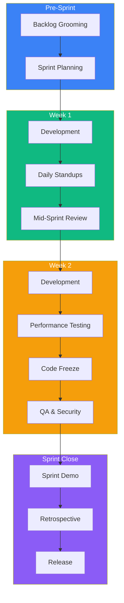
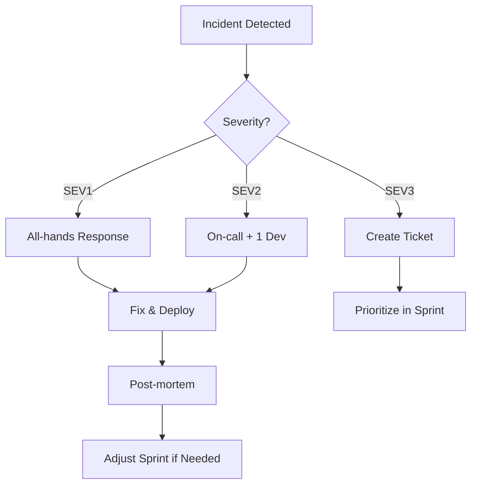

# DataHub Sprint Execution Guide

## Overview

DataHub uses 2-week sprints to deliver incremental improvements to the API Gateway platform. This guide covers the complete sprint lifecycle.

---

## Sprint Lifecycle



---

## Sprint Calendar

| Day | Activity | Duration | Participants |
|-----|----------|----------|--------------|
| Day -2 | Backlog Grooming | 1 hour | Team + PO |
| Day 1 | Sprint Planning | 2 hours | Full Team |
| Daily | Standup | 15 min | Dev Team |
| Day 5 | Mid-Sprint Review | 30 min | Dev Team |
| Day 8 | Performance Testing | 4 hours | Dev + Ops |
| Day 9 | Code Freeze | - | Dev Team |
| Day 10 | Security Review | 2 hours | Dev + Security |
| Day 10 | Sprint Demo | 1 hour | Team + Stakeholders |
| Day 10 | Retrospective | 1 hour | Dev Team |

---

## Sprint Types

### Feature Sprint

```
Focus: New gateway capabilities
Examples:
- API key rotation
- Custom rate limiting rules
- Request transformation
- New authentication methods
```

### Hardening Sprint

```
Focus: Reliability and performance
Examples:
- Performance optimization
- Bug fixes
- Technical debt reduction
- Security patches
```

### Platform Sprint

```
Focus: Infrastructure and tooling
Examples:
- Kubernetes upgrades
- Database migration
- Monitoring improvements
- CI/CD enhancements
```

---

## Story Point Reference

| Points | Description | Gateway Example |
|--------|-------------|-----------------|
| 1 | Trivial change | Config update |
| 2 | Small change | Add metric |
| 3 | Medium feature | New header transformation |
| 5 | Standard feature | Rate limit rule engine |
| 8 | Large feature | New auth provider |
| 13 | Epic-sized | Full plugin system |

---

## Sprint Metrics Dashboard

```
┌─────────────────────────────────────────────────────────────────┐
│                    SPRINT 8 DASHBOARD                            │
├─────────────────────────────────────────────────────────────────┤
│                                                                  │
│  Progress: ████████████████░░░░  80%   Day 8 of 10              │
│                                                                  │
│  Story Points:                                                   │
│  Committed: 34    Completed: 26    Remaining: 8                 │
│                                                                  │
│  Gateway Metrics:                                                │
│  ┌─────────────────────┐  ┌─────────────────────┐              │
│  │ Requests/sec: 12.4K │  │ P95 Latency: 45ms   │              │
│  │ Error Rate: 0.01%   │  │ Cache Hit: 94%      │              │
│  └─────────────────────┘  └─────────────────────┘              │
│                                                                  │
│  Features Status:                                                │
│  [✓] API Key Rotation - Done                                    │
│  [✓] Rate Limit Headers - Done                                  │
│  [⋯] Custom Transform Rules - In Progress                       │
│  [ ] Analytics Dashboard - Pending                               │
│                                                                  │
└─────────────────────────────────────────────────────────────────┘
```

---

## Quality Gates

### Feature Completion Criteria

```markdown
## Definition of Done

### Code
- [ ] Feature implemented per specification
- [ ] Unit tests written (>80% coverage)
- [ ] Integration tests passing
- [ ] Code reviewed and approved

### Performance
- [ ] Latency impact < 5ms at P95
- [ ] Memory impact < 10MB per instance
- [ ] No blocking operations
- [ ] Load tested at 2x expected traffic

### Security
- [ ] Input validation implemented
- [ ] No sensitive data exposure
- [ ] Security review passed
- [ ] Vulnerability scan clean

### Documentation
- [ ] API docs updated
- [ ] Runbook updated if needed
- [ ] Architecture diagrams current
```

---

## Handling Incidents During Sprint



---

## Related Documents

- [Development Workflow](./development.md)
- [Deployment Process](./deployment.md)
- [QA Review Process](./qa-review.md)
