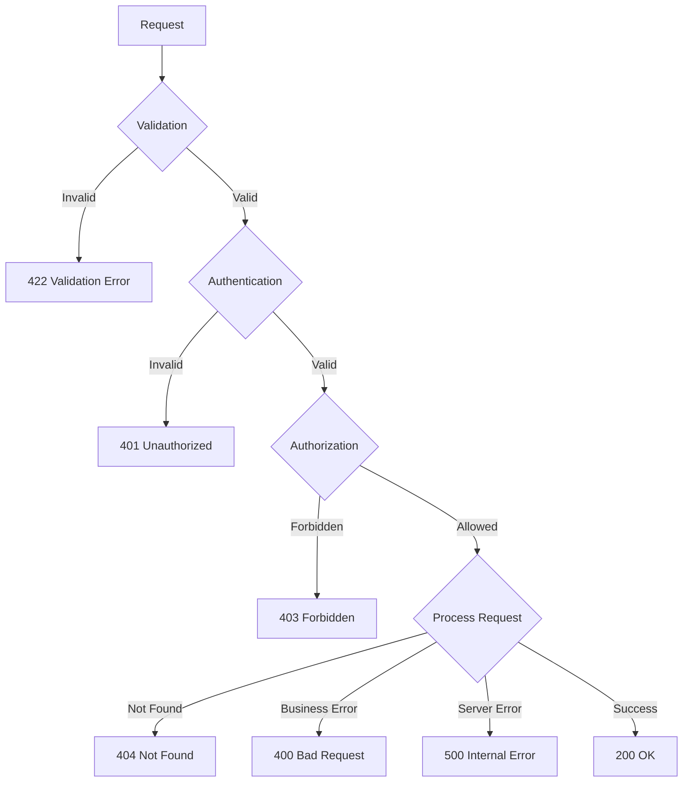

# ShopFlow Error Codes

## Overview

Comprehensive reference for all error codes returned by the ShopFlow API.

---

## Error Response Format

```json
{
  "error": {
    "code": "VALIDATION_ERROR",
    "message": "Request validation failed",
    "details": {
      "fields": [
        {
          "field": "email",
          "message": "Invalid email format"
        }
      ]
    },
    "requestId": "req_abc123xyz"
  }
}
```

---

## Error Flow



---

## Authentication Errors (401)

### INVALID_CREDENTIALS

```json
{
  "error": {
    "code": "INVALID_CREDENTIALS",
    "message": "Email or password is incorrect"
  }
}
```

### TOKEN_EXPIRED

```json
{
  "error": {
    "code": "TOKEN_EXPIRED",
    "message": "Access token has expired",
    "details": {
      "expiredAt": "2024-01-20T10:00:00Z"
    }
  }
}
```

### TOKEN_INVALID

```json
{
  "error": {
    "code": "TOKEN_INVALID",
    "message": "Invalid or malformed token"
  }
}
```

### ACCOUNT_LOCKED

```json
{
  "error": {
    "code": "ACCOUNT_LOCKED",
    "message": "Account temporarily locked",
    "details": {
      "reason": "Too many failed login attempts",
      "unlockAt": "2024-01-20T10:15:00Z"
    }
  }
}
```

---

## Authorization Errors (403)

### INSUFFICIENT_PERMISSIONS

```json
{
  "error": {
    "code": "INSUFFICIENT_PERMISSIONS",
    "message": "You don't have permission to perform this action",
    "details": {
      "required": "admin",
      "current": "customer"
    }
  }
}
```

### EMAIL_NOT_VERIFIED

```json
{
  "error": {
    "code": "EMAIL_NOT_VERIFIED",
    "message": "Please verify your email address to continue"
  }
}
```

---

## Validation Errors (422)

### VALIDATION_ERROR

```json
{
  "error": {
    "code": "VALIDATION_ERROR",
    "message": "Request validation failed",
    "details": {
      "fields": [
        {
          "field": "email",
          "message": "Invalid email format",
          "value": "invalid-email"
        },
        {
          "field": "password",
          "message": "Password must be at least 8 characters"
        }
      ]
    }
  }
}
```

---

## Resource Errors (404)

### PRODUCT_NOT_FOUND

```json
{
  "error": {
    "code": "PRODUCT_NOT_FOUND",
    "message": "Product not found",
    "details": {
      "productId": "prod_xyz789"
    }
  }
}
```

### ORDER_NOT_FOUND

```json
{
  "error": {
    "code": "ORDER_NOT_FOUND",
    "message": "Order not found",
    "details": {
      "orderId": "order_abc123"
    }
  }
}
```

### CART_NOT_FOUND

```json
{
  "error": {
    "code": "CART_NOT_FOUND",
    "message": "Shopping cart not found"
  }
}
```

---

## Business Logic Errors (400)

### OUT_OF_STOCK

```json
{
  "error": {
    "code": "OUT_OF_STOCK",
    "message": "Product is out of stock",
    "details": {
      "productId": "prod_abc123",
      "variantId": "var_xyz789",
      "requested": 5,
      "available": 0
    }
  }
}
```

### INSUFFICIENT_STOCK

```json
{
  "error": {
    "code": "INSUFFICIENT_STOCK",
    "message": "Not enough stock available",
    "details": {
      "productId": "prod_abc123",
      "requested": 10,
      "available": 3
    }
  }
}
```

### INVALID_COUPON

```json
{
  "error": {
    "code": "INVALID_COUPON",
    "message": "Coupon code is not valid",
    "details": {
      "code": "SAVE50",
      "reason": "expired"
    }
  }
}
```

### COUPON_MINIMUM_NOT_MET

```json
{
  "error": {
    "code": "COUPON_MINIMUM_NOT_MET",
    "message": "Order does not meet minimum amount for coupon",
    "details": {
      "minimum": 100.00,
      "current": 75.50
    }
  }
}
```

### CART_EMPTY

```json
{
  "error": {
    "code": "CART_EMPTY",
    "message": "Cannot checkout with an empty cart"
  }
}
```

### ORDER_ALREADY_CANCELLED

```json
{
  "error": {
    "code": "ORDER_ALREADY_CANCELLED",
    "message": "Order has already been cancelled",
    "details": {
      "orderId": "order_abc123",
      "cancelledAt": "2024-01-19T15:30:00Z"
    }
  }
}
```

### ORDER_CANNOT_BE_CANCELLED

```json
{
  "error": {
    "code": "ORDER_CANNOT_BE_CANCELLED",
    "message": "Order cannot be cancelled at this stage",
    "details": {
      "currentStatus": "shipped",
      "cancellableStatuses": ["pending", "processing"]
    }
  }
}
```

---

## Payment Errors (400/402)

### PAYMENT_FAILED

```json
{
  "error": {
    "code": "PAYMENT_FAILED",
    "message": "Payment could not be processed",
    "details": {
      "reason": "card_declined",
      "declineCode": "insufficient_funds"
    }
  }
}
```

### PAYMENT_METHOD_INVALID

```json
{
  "error": {
    "code": "PAYMENT_METHOD_INVALID",
    "message": "Invalid payment method",
    "details": {
      "paymentMethodId": "pm_invalid"
    }
  }
}
```

### PAYMENT_REQUIRES_ACTION

```json
{
  "error": {
    "code": "PAYMENT_REQUIRES_ACTION",
    "message": "Additional authentication required",
    "details": {
      "clientSecret": "pi_xxx_secret_yyy",
      "actionType": "3ds_authentication"
    }
  }
}
```

---

## Rate Limiting Errors (429)

### RATE_LIMIT_EXCEEDED

```json
{
  "error": {
    "code": "RATE_LIMIT_EXCEEDED",
    "message": "Too many requests",
    "details": {
      "limit": 100,
      "window": "1 minute",
      "retryAfter": 45
    }
  }
}
```

---

## Server Errors (500)

### INTERNAL_ERROR

```json
{
  "error": {
    "code": "INTERNAL_ERROR",
    "message": "An unexpected error occurred",
    "requestId": "req_abc123xyz"
  }
}
```

### SERVICE_UNAVAILABLE

```json
{
  "error": {
    "code": "SERVICE_UNAVAILABLE",
    "message": "Service temporarily unavailable",
    "details": {
      "retryAfter": 60
    }
  }
}
```

---

## Error Code Reference

| Code | HTTP Status | Retryable | Description |
|------|-------------|-----------|-------------|
| `INVALID_CREDENTIALS` | 401 | No | Wrong email/password |
| `TOKEN_EXPIRED` | 401 | Yes | Refresh token |
| `TOKEN_INVALID` | 401 | No | Re-authenticate |
| `ACCOUNT_LOCKED` | 401 | Yes | Wait and retry |
| `VALIDATION_ERROR` | 422 | No | Fix request |
| `OUT_OF_STOCK` | 400 | No | Remove item |
| `PAYMENT_FAILED` | 400 | Yes | Retry payment |
| `RATE_LIMIT_EXCEEDED` | 429 | Yes | Wait and retry |
| `INTERNAL_ERROR` | 500 | Yes | Report and retry |

---

## Related Documents

- [API Reference](./reference.md)
- [Authentication](./authentication.md)
- [Rate Limiting](./rate-limiting.md)
