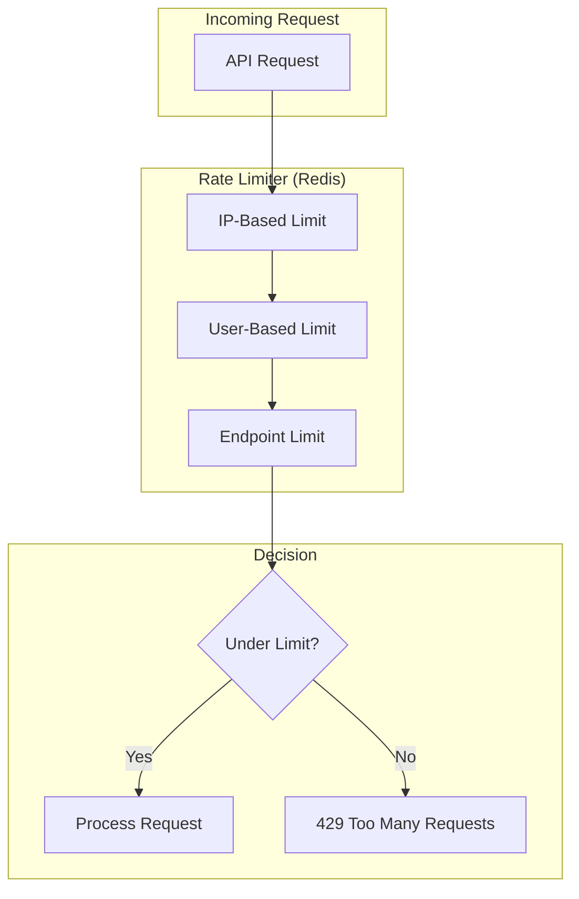
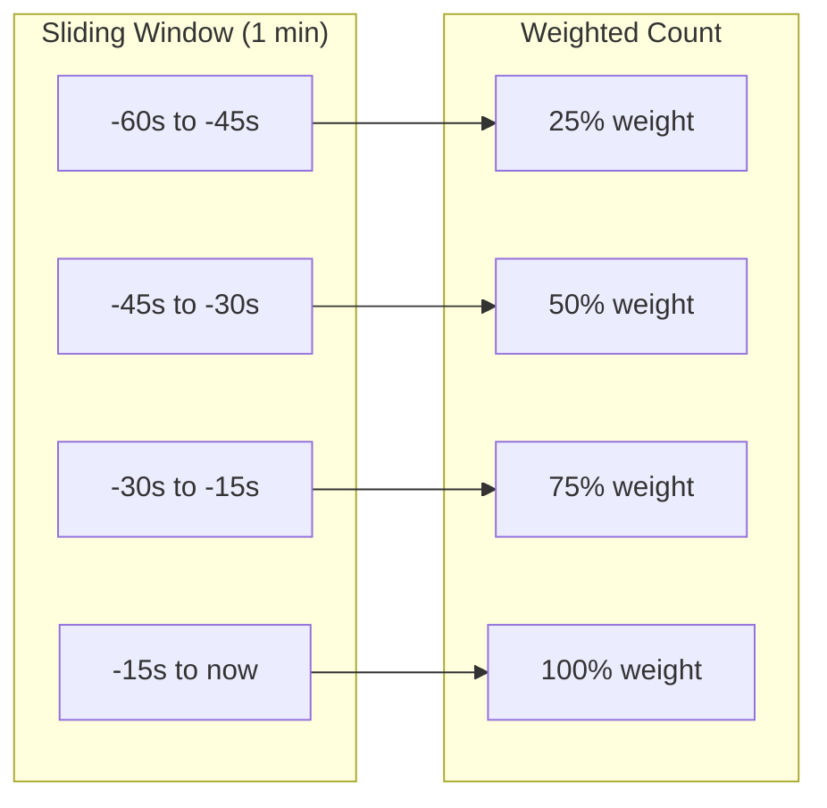
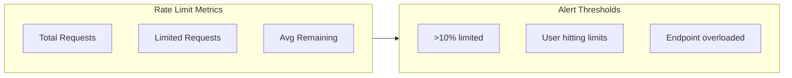

# ShopFlow Rate Limiting

## Overview

Rate limiting policies to protect the ShopFlow API and ensure fair usage.

---

## Rate Limiting Architecture



---

## Rate Limit Tiers

### By Authentication Level

| Level | Requests/Minute | Burst | Description |
|-------|-----------------|-------|-------------|
| Anonymous | 30 | 10 | Unauthenticated requests |
| Authenticated | 100 | 30 | Logged-in users |
| Premium | 300 | 50 | Premium customers |
| Partner | 1000 | 100 | API partners |

### By Endpoint Category

| Category | Limit | Window | Endpoints |
|----------|-------|--------|-----------|
| Authentication | 5 | 1 minute | /auth/login, /auth/register |
| Password Reset | 3 | 1 hour | /auth/forgot-password |
| Products | 100 | 1 minute | /api/products/* |
| Cart | 60 | 1 minute | /api/cart/* |
| Checkout | 10 | 1 minute | /api/orders |
| Search | 30 | 1 minute | /api/products/search |

---

## Rate Limit Algorithm

ShopFlow uses a sliding window algorithm with token bucket for burst handling.



---

## Response Headers

Every API response includes rate limit headers:

```http
HTTP/1.1 200 OK
X-RateLimit-Limit: 100
X-RateLimit-Remaining: 87
X-RateLimit-Reset: 1705750860
```

| Header | Description |
|--------|-------------|
| `X-RateLimit-Limit` | Maximum requests allowed |
| `X-RateLimit-Remaining` | Requests remaining |
| `X-RateLimit-Reset` | Unix timestamp when limit resets |

---

## Rate Limit Exceeded Response

```http
HTTP/1.1 429 Too Many Requests
Retry-After: 45
X-RateLimit-Limit: 100
X-RateLimit-Remaining: 0
X-RateLimit-Reset: 1705750860

{
  "error": {
    "code": "RATE_LIMIT_EXCEEDED",
    "message": "Too many requests. Please try again later.",
    "details": {
      "limit": 100,
      "window": "1 minute",
      "retryAfter": 45
    }
  }
}
```

---

## Endpoint-Specific Limits

### Authentication Endpoints

```mermaid
flowchart TD
    LOGIN[/auth/login] --> L1[5 per minute per IP]
    REGISTER[/auth/register] --> L2[3 per minute per IP]
    FORGOT[/auth/forgot-password] --> L3[3 per hour per email]
    RESET[/auth/reset-password] --> L4[5 per hour per token]
```

### Shopping Endpoints

| Endpoint | Limit | Rationale |
|----------|-------|-----------|
| `GET /api/products` | 100/min | High traffic |
| `GET /api/products/{id}` | 200/min | Frequently accessed |
| `GET /api/products/search` | 30/min | Resource intensive |
| `POST /api/cart/items` | 60/min | User action |
| `POST /api/orders` | 10/min | Checkout protection |

---

## Handling Rate Limits

### Client Implementation

```typescript
async function fetchWithRateLimit(url: string, options: RequestInit) {
  const response = await fetch(url, options);

  if (response.status === 429) {
    const retryAfter = parseInt(
      response.headers.get('Retry-After') || '60',
      10
    );

    console.log(`Rate limited. Retrying in ${retryAfter} seconds`);

    await sleep(retryAfter * 1000);
    return fetchWithRateLimit(url, options);
  }

  // Track remaining requests
  const remaining = response.headers.get('X-RateLimit-Remaining');
  if (remaining && parseInt(remaining) < 10) {
    console.warn(`Low rate limit: ${remaining} requests remaining`);
  }

  return response;
}
```

### Exponential Backoff

```typescript
async function fetchWithBackoff(url: string, maxRetries = 3) {
  for (let attempt = 0; attempt < maxRetries; attempt++) {
    try {
      const response = await fetch(url);

      if (response.status === 429) {
        const delay = Math.pow(2, attempt) * 1000 + Math.random() * 1000;
        await sleep(delay);
        continue;
      }

      return response;
    } catch (error) {
      if (attempt === maxRetries - 1) throw error;
    }
  }
}
```

---

## Rate Limit Monitoring

### Metrics Tracked



### Prometheus Metrics

```promql
# Rate of limited requests
rate(shopflow_rate_limit_exceeded_total[5m])

# Percentage of requests limited
sum(rate(shopflow_rate_limit_exceeded_total[5m])) /
sum(rate(shopflow_requests_total[5m])) * 100

# Top limited users
topk(10, sum by (user_id) (rate(shopflow_rate_limit_exceeded_total[1h])))
```

---

## Exemptions

### Excluded Endpoints

| Endpoint | Reason |
|----------|--------|
| `GET /health` | Health checks |
| `GET /api/status` | Status page |
| `OPTIONS *` | CORS preflight |

### Whitelisted IPs

Internal services and monitoring tools are exempt:
- Load balancer health checks
- Internal microservices
- Monitoring systems

---

## Best Practices

### For API Consumers

1. **Monitor headers** - Track remaining requests
2. **Implement backoff** - Use exponential backoff
3. **Cache responses** - Reduce API calls
4. **Batch requests** - Combine when possible
5. **Use webhooks** - Instead of polling

### Request Optimization

```typescript
// Bad: Multiple requests
const product1 = await getProduct('prod_1');
const product2 = await getProduct('prod_2');
const product3 = await getProduct('prod_3');

// Good: Single batch request
const products = await getProducts(['prod_1', 'prod_2', 'prod_3']);
```

---

## Related Documents

- [API Reference](./reference.md)
- [Error Codes](./error-codes.md)
- [cURL Examples](./curl-examples.md)
