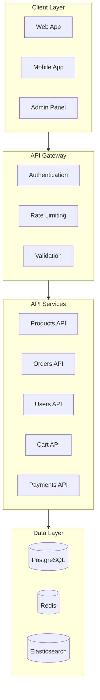
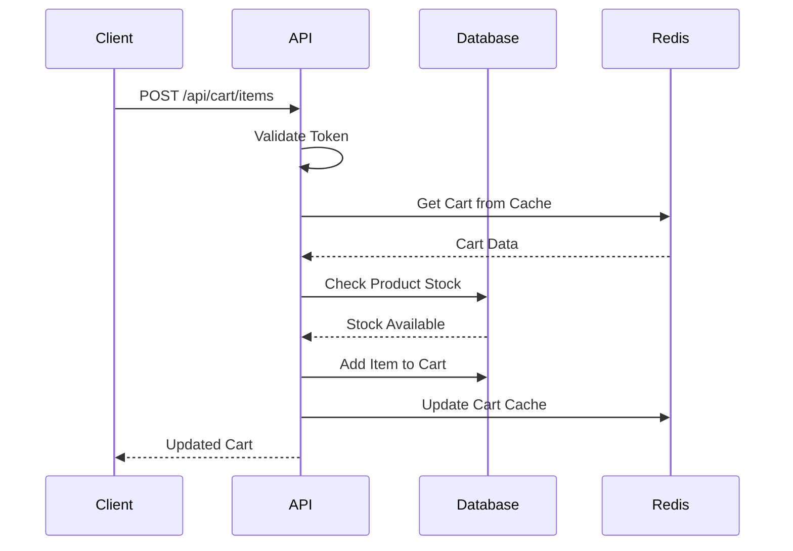

# ShopFlow API Reference

## Overview

Complete REST API reference for the ShopFlow e-commerce platform.

---

## Base URLs

| Environment | Base URL |
|-------------|----------|
| Production | `https://api.shopflow.io` |
| Staging | `https://staging-api.shopflow.io` |
| Development | `http://localhost:4000` |

---

## API Architecture



---

## Authentication

All API requests require authentication via Bearer token:

```bash
Authorization: Bearer <access_token>
```

See [Authentication](./authentication.md) for details.

---

## Products API

### List Products

```
GET /api/products
```

**Query Parameters:**

| Parameter | Type | Default | Description |
|-----------|------|---------|-------------|
| `page` | integer | 1 | Page number |
| `limit` | integer | 20 | Items per page (max 100) |
| `category` | string | - | Filter by category |
| `search` | string | - | Search query |
| `sort` | string | -createdAt | Sort field |
| `minPrice` | number | - | Minimum price |
| `maxPrice` | number | - | Maximum price |

**Response:**

```json
{
  "data": [
    {
      "id": "prod_abc123",
      "name": "Classic T-Shirt",
      "slug": "classic-t-shirt",
      "description": "Comfortable cotton t-shirt",
      "price": 29.99,
      "compareAtPrice": 39.99,
      "images": [
        {
          "url": "https://cdn.shopflow.io/products/classic-tshirt.jpg",
          "alt": "Classic T-Shirt Front"
        }
      ],
      "variants": [
        {
          "id": "var_xyz789",
          "sku": "TSHIRT-BLK-M",
          "size": "M",
          "color": "Black",
          "stock": 50,
          "price": 29.99
        }
      ],
      "category": {
        "id": "cat_clothing",
        "name": "Clothing"
      },
      "rating": 4.5,
      "reviewCount": 128
    }
  ],
  "pagination": {
    "page": 1,
    "limit": 20,
    "total": 150,
    "pages": 8
  }
}
```

### Get Product

```
GET /api/products/{id}
```

### Search Products

```
GET /api/products/search?q={query}
```

---

## Cart API

### Get Cart

```
GET /api/cart
```

**Response:**

```json
{
  "id": "cart_abc123",
  "items": [
    {
      "id": "item_xyz789",
      "product": {
        "id": "prod_abc123",
        "name": "Classic T-Shirt",
        "image": "https://cdn.shopflow.io/products/tshirt.jpg"
      },
      "variant": {
        "id": "var_xyz789",
        "sku": "TSHIRT-BLK-M",
        "size": "M",
        "color": "Black"
      },
      "quantity": 2,
      "price": 29.99,
      "subtotal": 59.98
    }
  ],
  "subtotal": 59.98,
  "shipping": 5.99,
  "tax": 5.40,
  "discount": 0,
  "total": 71.37,
  "itemCount": 2
}
```

### Add to Cart

```
POST /api/cart/items
```

**Request:**

```json
{
  "productId": "prod_abc123",
  "variantId": "var_xyz789",
  "quantity": 1
}
```

### Update Cart Item

```
PATCH /api/cart/items/{itemId}
```

**Request:**

```json
{
  "quantity": 3
}
```

### Remove Cart Item

```
DELETE /api/cart/items/{itemId}
```

### Apply Coupon

```
POST /api/cart/coupon
```

**Request:**

```json
{
  "code": "SAVE10"
}
```

---

## Orders API

### Create Order

```
POST /api/orders
```

**Request:**

```json
{
  "shippingAddress": {
    "firstName": "John",
    "lastName": "Doe",
    "address1": "123 Main St",
    "address2": "Apt 4",
    "city": "New York",
    "state": "NY",
    "postalCode": "10001",
    "country": "US",
    "phone": "+1234567890"
  },
  "billingAddress": {
    "sameAsShipping": true
  },
  "paymentMethod": "pm_card_visa"
}
```

**Response:**

```json
{
  "id": "order_abc123",
  "orderNumber": "SF-2024-00001",
  "status": "pending",
  "items": [...],
  "subtotal": 59.98,
  "shipping": 5.99,
  "tax": 5.40,
  "total": 71.37,
  "shippingAddress": {...},
  "paymentStatus": "pending",
  "createdAt": "2024-01-20T10:30:00Z"
}
```

### Get Order

```
GET /api/orders/{id}
```

### List Orders

```
GET /api/orders
```

### Cancel Order

```
POST /api/orders/{id}/cancel
```

---

## Users API

### Get Current User

```
GET /api/users/me
```

### Update Profile

```
PATCH /api/users/me
```

### Get Addresses

```
GET /api/users/me/addresses
```

### Add Address

```
POST /api/users/me/addresses
```

---

## Request/Response Flow



---

## Common Response Codes

| Code | Description |
|------|-------------|
| 200 | Success |
| 201 | Created |
| 204 | No Content |
| 400 | Bad Request |
| 401 | Unauthorized |
| 403 | Forbidden |
| 404 | Not Found |
| 422 | Validation Error |
| 429 | Rate Limited |
| 500 | Server Error |

---

## Related Documents

- [Authentication](./authentication.md)
- [Error Codes](./error-codes.md)
- [Rate Limiting](./rate-limiting.md)
- [cURL Examples](./curl-examples.md)
