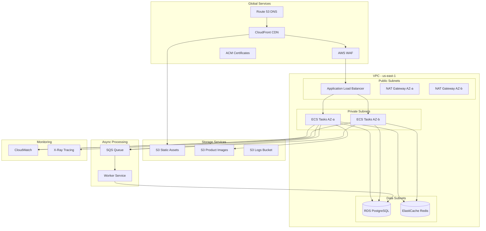
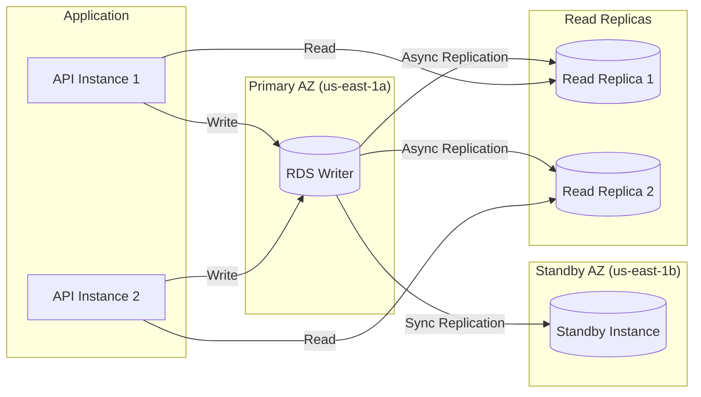
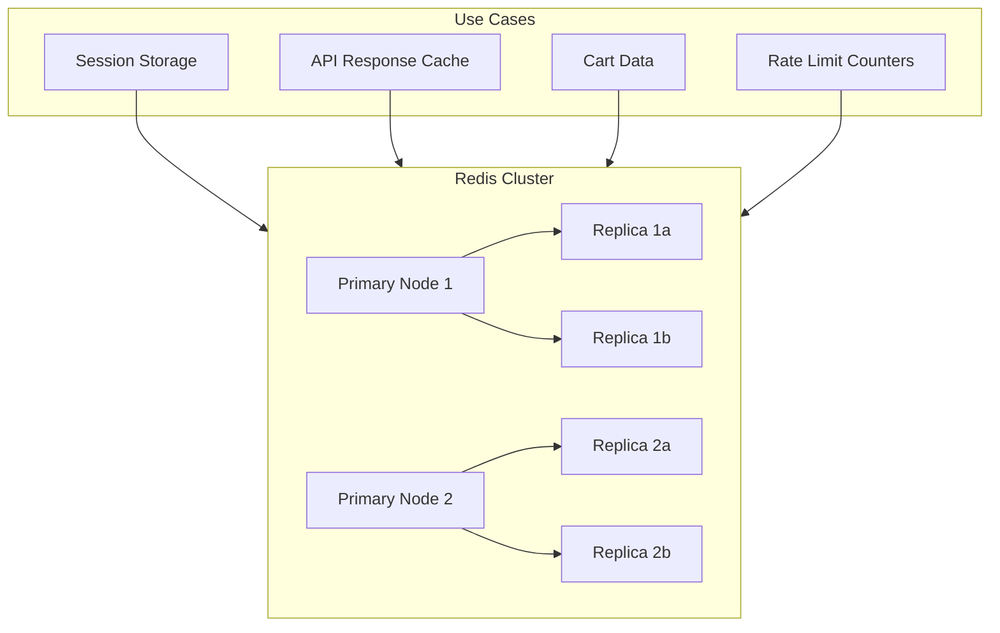
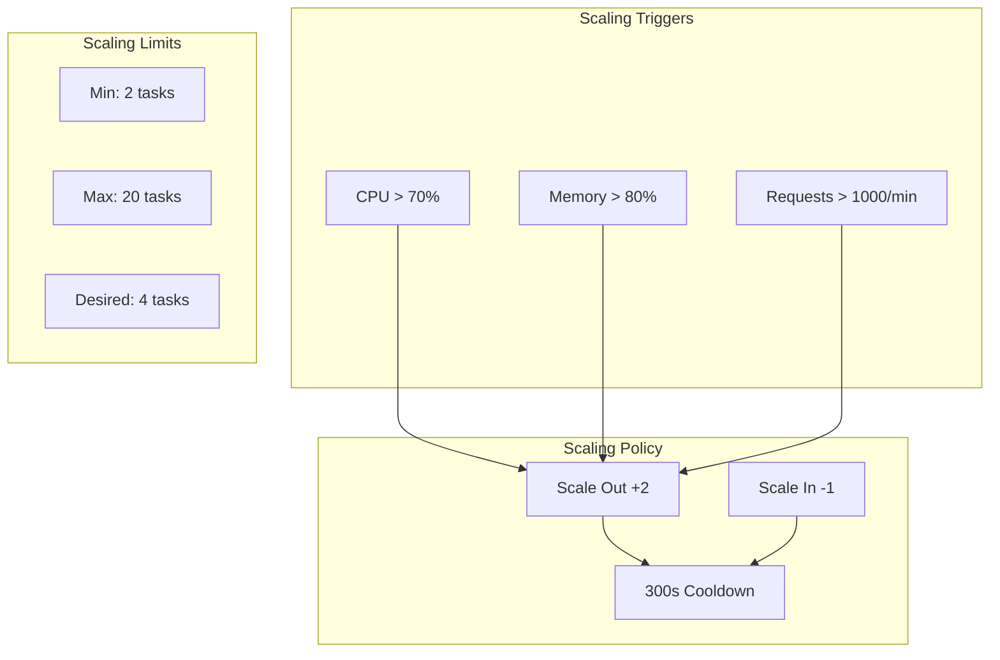
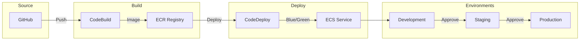

# ShopFlow Cloud Architecture (AWS)

## Infrastructure Overview

ShopFlow is deployed on AWS using a containerized, highly available architecture.

### ASCII Cloud Architecture

```
┌─────────────────────────────────────────────────────────────────────────────┐
│                           AWS CLOUD ARCHITECTURE                             │
└─────────────────────────────────────────────────────────────────────────────┘

                              ┌─────────────┐
                              │   Route 53  │
                              │     DNS     │
                              └──────┬──────┘
                                     │
                              ┌──────▼──────┐
                              │ CloudFront  │
                              │    CDN      │
                              └──────┬──────┘
                                     │
                    ┌────────────────┼────────────────┐
                    │                │                │
                    ▼                ▼                ▼
             ┌───────────┐    ┌───────────┐    ┌───────────┐
             │    S3     │    │    ALB    │    │   WAF     │
             │ (Static)  │    │           │    │           │
             └───────────┘    └─────┬─────┘    └───────────┘
                                    │
┌───────────────────────────────────┼───────────────────────────────────────┐
│                                   │                           VPC          │
│  ┌────────────────────────────────┼────────────────────────────────────┐  │
│  │                         Public Subnets                               │  │
│  │   ┌─────────────┐    ┌─────────▼─────────┐    ┌─────────────┐       │  │
│  │   │ NAT Gateway │    │       ALB         │    │ NAT Gateway │       │  │
│  │   │   (AZ-a)    │    │  (Multi-AZ)       │    │   (AZ-b)    │       │  │
│  │   └──────┬──────┘    └─────────┬─────────┘    └──────┬──────┘       │  │
│  └──────────┼─────────────────────┼─────────────────────┼──────────────┘  │
│             │                     │                     │                  │
│  ┌──────────┼─────────────────────┼─────────────────────┼──────────────┐  │
│  │          │              Private Subnets               │              │  │
│  │          ▼                     ▼                     ▼              │  │
│  │  ┌─────────────┐    ┌─────────────────────┐    ┌─────────────┐      │  │
│  │  │  ECS Task   │    │     ECS Task        │    │  ECS Task   │      │  │
│  │  │   (AZ-a)    │    │    (AZ-a/b)         │    │   (AZ-b)    │      │  │
│  │  └─────────────┘    └─────────────────────┘    └─────────────┘      │  │
│  │                              │                                       │  │
│  │          ┌───────────────────┼───────────────────┐                  │  │
│  │          ▼                   ▼                   ▼                  │  │
│  │  ┌─────────────┐    ┌─────────────┐    ┌─────────────┐              │  │
│  │  │ PostgreSQL  │    │ ElastiCache │    │    SQS      │              │  │
│  │  │    RDS      │    │   Redis     │    │   Queue     │              │  │
│  │  │ (Multi-AZ)  │    │  Cluster    │    │             │              │  │
│  │  └─────────────┘    └─────────────┘    └─────────────┘              │  │
│  └─────────────────────────────────────────────────────────────────────┘  │
└───────────────────────────────────────────────────────────────────────────┘
```

### Mermaid Cloud Architecture



## Service Configuration

### ECS Fargate

```yaml
# ECS Task Definition
{
  "family": "shopflow-api",
  "networkMode": "awsvpc",
  "requiresCompatibilities": ["FARGATE"],
  "cpu": "512",
  "memory": "1024",
  "containerDefinitions": [
    {
      "name": "api",
      "image": "shopflow/api:latest",
      "portMappings": [
        {
          "containerPort": 3000,
          "protocol": "tcp"
        }
      ],
      "environment": [
        {"name": "NODE_ENV", "value": "production"}
      ],
      "secrets": [
        {"name": "DATABASE_URL", "valueFrom": "arn:aws:secretsmanager:..."}
      ],
      "logConfiguration": {
        "logDriver": "awslogs",
        "options": {
          "awslogs-group": "/ecs/shopflow-api",
          "awslogs-region": "us-east-1",
          "awslogs-stream-prefix": "api"
        }
      }
    }
  ]
}
```

### RDS PostgreSQL

```
┌─────────────────────────────────────────────────────────────┐
│                    RDS Configuration                         │
├─────────────────────────────────────────────────────────────┤
│  Instance Class:     db.r6g.xlarge                          │
│  Storage:            500 GB gp3                              │
│  Multi-AZ:           Enabled                                 │
│  Read Replicas:      2 (us-east-1a, us-east-1b)             │
│  Backup Retention:   7 days                                  │
│  Encryption:         AES-256                                 │
│  Parameter Group:    Custom (optimized for e-commerce)       │
└─────────────────────────────────────────────────────────────┘
```

### Mermaid RDS Architecture



### ElastiCache Redis



## Auto Scaling

### ASCII Scaling Diagram

```
┌─────────────────────────────────────────────────────────────────┐
│                     AUTO SCALING POLICY                          │
└─────────────────────────────────────────────────────────────────┘

   Load      1──────2──────3──────4──────5──────6──────7──────8
              │      │      │      │      │      │      │      │
              │      │      │      │      │      │      │      │
 Instances    2      2      3      4      6      8      10     10
              │      │      │      │      │      │      │      │
              │      │      │      │      │      │      │      │
 CPU Usage   20%    40%    50%    60%    70%    75%    80%    85%
              │      │      │      │      │      │      │      │
              ├──────┼──────┼──────┼──────┼──────┼──────┼──────┤
                     ▲      ▲             ▲      ▲
                  Scale  Scale         Scale  Scale
                   Out    Out           Out    Out
```

### Mermaid Auto Scaling



## Cost Breakdown (Monthly)

| Service | Configuration | Estimated Cost |
|---------|--------------|----------------|
| ECS Fargate | 4 tasks avg | $150 |
| RDS PostgreSQL | db.r6g.xlarge + 2 replicas | $800 |
| ElastiCache | r6g.large cluster | $300 |
| CloudFront | 100GB transfer | $50 |
| S3 | 500GB storage | $15 |
| ALB | Standard | $25 |
| NAT Gateway | 2 x Multi-AZ | $100 |
| Route 53 | 1 hosted zone | $1 |
| **Total** | | **~$1,441/mo** |

## Deployment Pipeline



## Disaster Recovery

| Metric | Target | Strategy |
|--------|--------|----------|
| RTO | 4 hours | Multi-AZ failover |
| RPO | 1 hour | Point-in-time recovery |
| Backup Frequency | Daily | Automated snapshots |
| Cross-Region | Passive | S3 replication |
