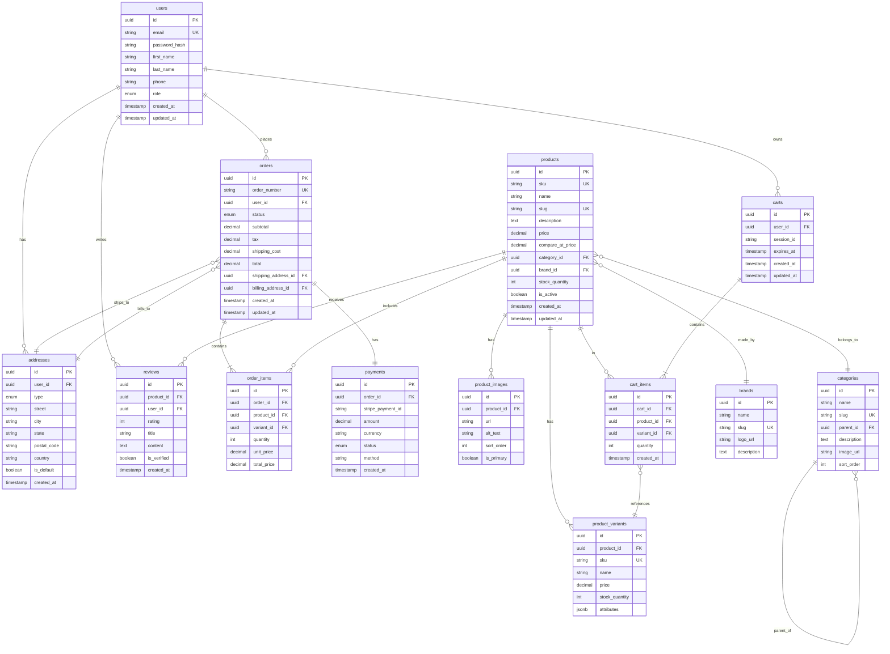

# ShopFlow Database Architecture

## Technology Stack

- **Database**: PostgreSQL 15
- **ORM**: Prisma 5.x
- **Migrations**: Prisma Migrate
- **Connection Pooling**: PgBouncer

## Entity Relationship Diagram

### ASCII ERD

```
┌─────────────────────────────────────────────────────────────────────────────┐
│                        SHOPFLOW DATABASE SCHEMA                              │
└─────────────────────────────────────────────────────────────────────────────┘

┌──────────────────────┐         ┌──────────────────────┐
│        users         │         │       addresses      │
├──────────────────────┤         ├──────────────────────┤
│ id (PK)              │────┐    │ id (PK)              │
│ email                │    │    │ user_id (FK)         │◀───┐
│ password_hash        │    │    │ type (billing/ship)  │    │
│ first_name           │    │    │ street               │    │
│ last_name            │    │    │ city                 │    │
│ phone                │    │    │ state                │    │
│ role                 │    │    │ postal_code          │    │
│ created_at           │    │    │ country              │    │
│ updated_at           │    │    │ is_default           │    │
└──────────────────────┘    │    │ created_at           │    │
         │                  │    └──────────────────────┘    │
         │                  │                                │
         │                  └────────────────────────────────┘
         │
         │    ┌──────────────────────┐         ┌──────────────────────┐
         │    │       orders         │         │     order_items      │
         │    ├──────────────────────┤         ├──────────────────────┤
         └───▶│ id (PK)              │────┐    │ id (PK)              │
              │ user_id (FK)         │    │    │ order_id (FK)        │◀───┐
              │ status               │    │    │ product_id (FK)      │    │
              │ subtotal             │    │    │ quantity             │    │
              │ tax                  │    │    │ unit_price           │    │
              │ shipping_cost        │    │    │ total_price          │    │
              │ total                │    │    └──────────────────────┘    │
              │ shipping_address_id  │    │                                │
              │ billing_address_id   │    └────────────────────────────────┘
              │ created_at           │
              │ updated_at           │
              └──────────────────────┘
                       │
                       ▼
         ┌──────────────────────┐         ┌──────────────────────┐
         │      payments        │         │      products        │
         ├──────────────────────┤         ├──────────────────────┤
         │ id (PK)              │         │ id (PK)              │
         │ order_id (FK)        │         │ sku                  │
         │ stripe_payment_id    │         │ name                 │
         │ amount               │         │ slug                 │
         │ currency             │         │ description          │
         │ status               │         │ price                │
         │ method               │         │ compare_at_price     │
         │ created_at           │         │ category_id (FK)     │
         └──────────────────────┘         │ brand_id (FK)        │
                                          │ stock_quantity       │
                                          │ is_active            │
                                          │ created_at           │
                                          │ updated_at           │
                                          └──────────────────────┘
                                                    │
         ┌──────────────────────┐                   │
         │     categories       │                   │
         ├──────────────────────┤                   │
         │ id (PK)              │◀──────────────────┘
         │ name                 │
         │ slug                 │
         │ parent_id (FK)       │───┐ (self-referential)
         │ description          │   │
         │ image_url            │◀──┘
         │ sort_order           │
         └──────────────────────┘

         ┌──────────────────────┐         ┌──────────────────────┐
         │    product_images    │         │    product_variants  │
         ├──────────────────────┤         ├──────────────────────┤
         │ id (PK)              │         │ id (PK)              │
         │ product_id (FK)      │         │ product_id (FK)      │
         │ url                  │         │ sku                  │
         │ alt_text             │         │ name                 │
         │ sort_order           │         │ price                │
         │ is_primary           │         │ stock_quantity       │
         └──────────────────────┘         │ attributes (JSONB)   │
                                          └──────────────────────┘

         ┌──────────────────────┐         ┌──────────────────────┐
         │       reviews        │         │       carts          │
         ├──────────────────────┤         ├──────────────────────┤
         │ id (PK)              │         │ id (PK)              │
         │ product_id (FK)      │         │ user_id (FK)         │
         │ user_id (FK)         │         │ session_id           │
         │ rating               │         │ expires_at           │
         │ title                │         │ created_at           │
         │ content              │         │ updated_at           │
         │ is_verified          │         └──────────────────────┘
         │ created_at           │                   │
         └──────────────────────┘                   ▼
                                          ┌──────────────────────┐
                                          │     cart_items       │
                                          ├──────────────────────┤
                                          │ id (PK)              │
                                          │ cart_id (FK)         │
                                          │ product_id (FK)      │
                                          │ variant_id (FK)      │
                                          │ quantity             │
                                          │ created_at           │
                                          └──────────────────────┘
```

### Mermaid ERD



## Prisma Schema

```prisma
// schema.prisma
generator client {
  provider = "prisma-client-js"
}

datasource db {
  provider = "postgresql"
  url      = env("DATABASE_URL")
}

model User {
  id           String    @id @default(uuid())
  email        String    @unique
  passwordHash String    @map("password_hash")
  firstName    String    @map("first_name")
  lastName     String    @map("last_name")
  phone        String?
  role         UserRole  @default(CUSTOMER)
  createdAt    DateTime  @default(now()) @map("created_at")
  updatedAt    DateTime  @updatedAt @map("updated_at")

  addresses    Address[]
  orders       Order[]
  reviews      Review[]
  carts        Cart[]

  @@map("users")
}

enum UserRole {
  CUSTOMER
  ADMIN
  STAFF
}

model Product {
  id              String   @id @default(uuid())
  sku             String   @unique
  name            String
  slug            String   @unique
  description     String?
  price           Decimal  @db.Decimal(10, 2)
  compareAtPrice  Decimal? @map("compare_at_price") @db.Decimal(10, 2)
  categoryId      String   @map("category_id")
  brandId         String?  @map("brand_id")
  stockQuantity   Int      @default(0) @map("stock_quantity")
  isActive        Boolean  @default(true) @map("is_active")
  createdAt       DateTime @default(now()) @map("created_at")
  updatedAt       DateTime @updatedAt @map("updated_at")

  category        Category        @relation(fields: [categoryId], references: [id])
  brand           Brand?          @relation(fields: [brandId], references: [id])
  images          ProductImage[]
  variants        ProductVariant[]
  orderItems      OrderItem[]
  reviews         Review[]
  cartItems       CartItem[]

  @@index([categoryId])
  @@index([brandId])
  @@index([isActive, createdAt])
  @@map("products")
}

model Order {
  id                String      @id @default(uuid())
  orderNumber       String      @unique @map("order_number")
  userId            String      @map("user_id")
  status            OrderStatus @default(PENDING)
  subtotal          Decimal     @db.Decimal(10, 2)
  tax               Decimal     @db.Decimal(10, 2)
  shippingCost      Decimal     @map("shipping_cost") @db.Decimal(10, 2)
  total             Decimal     @db.Decimal(10, 2)
  shippingAddressId String      @map("shipping_address_id")
  billingAddressId  String      @map("billing_address_id")
  createdAt         DateTime    @default(now()) @map("created_at")
  updatedAt         DateTime    @updatedAt @map("updated_at")

  user              User        @relation(fields: [userId], references: [id])
  shippingAddress   Address     @relation("ShippingAddress", fields: [shippingAddressId], references: [id])
  billingAddress    Address     @relation("BillingAddress", fields: [billingAddressId], references: [id])
  items             OrderItem[]
  payment           Payment?

  @@index([userId])
  @@index([status])
  @@index([createdAt])
  @@map("orders")
}

enum OrderStatus {
  PENDING
  PAID
  PROCESSING
  SHIPPED
  DELIVERED
  CANCELLED
  REFUNDED
}

model Cart {
  id        String     @id @default(uuid())
  userId    String?    @map("user_id")
  sessionId String?    @map("session_id")
  expiresAt DateTime   @map("expires_at")
  createdAt DateTime   @default(now()) @map("created_at")
  updatedAt DateTime   @updatedAt @map("updated_at")

  user      User?      @relation(fields: [userId], references: [id])
  items     CartItem[]

  @@index([userId])
  @@index([sessionId])
  @@index([expiresAt])
  @@map("carts")
}
```

## Indexes Strategy

```sql
-- Performance indexes
CREATE INDEX idx_products_category_active ON products(category_id, is_active);
CREATE INDEX idx_products_price ON products(price) WHERE is_active = true;
CREATE INDEX idx_products_search ON products USING gin(to_tsvector('english', name || ' ' || description));

CREATE INDEX idx_orders_user_status ON orders(user_id, status);
CREATE INDEX idx_orders_created ON orders(created_at DESC);

CREATE INDEX idx_order_items_order ON order_items(order_id);
CREATE INDEX idx_order_items_product ON order_items(product_id);

CREATE INDEX idx_cart_items_cart ON cart_items(cart_id);
CREATE INDEX idx_reviews_product ON reviews(product_id, created_at DESC);
```

## Query Examples

### Product Search with Filters

```sql
SELECT p.*,
       AVG(r.rating) as avg_rating,
       COUNT(r.id) as review_count
FROM products p
LEFT JOIN reviews r ON r.product_id = p.id
WHERE p.is_active = true
  AND p.category_id = $1
  AND p.price BETWEEN $2 AND $3
  AND to_tsvector('english', p.name || ' ' || p.description) @@ plainto_tsquery($4)
GROUP BY p.id
ORDER BY p.created_at DESC
LIMIT 20 OFFSET 0;
```

### Order with Items

```sql
SELECT o.*,
       json_agg(json_build_object(
         'id', oi.id,
         'product_name', p.name,
         'quantity', oi.quantity,
         'unit_price', oi.unit_price
       )) as items
FROM orders o
JOIN order_items oi ON oi.order_id = o.id
JOIN products p ON p.id = oi.product_id
WHERE o.id = $1
GROUP BY o.id;
```

## Database Statistics

| Table | Estimated Rows | Index Size | Table Size |
|-------|---------------|------------|------------|
| products | 50,000 | 12 MB | 45 MB |
| orders | 500,000 | 85 MB | 320 MB |
| order_items | 2,000,000 | 180 MB | 450 MB |
| users | 100,000 | 15 MB | 35 MB |
| reviews | 200,000 | 25 MB | 120 MB |
