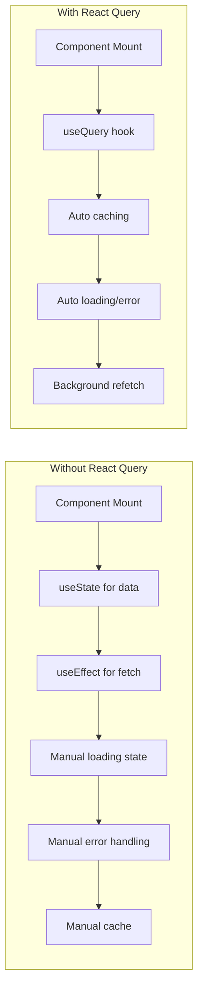
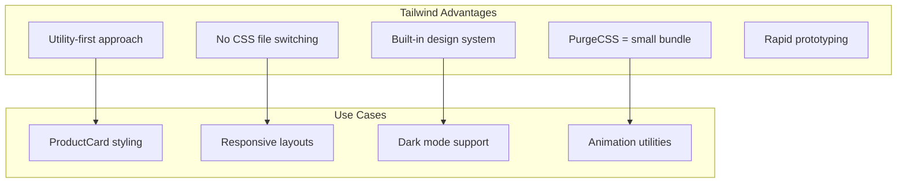
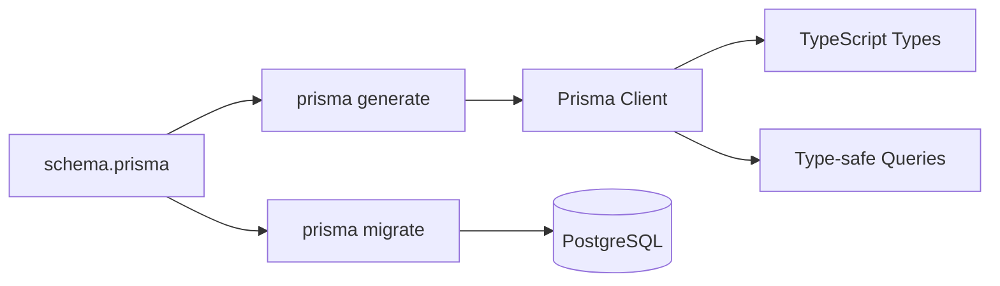
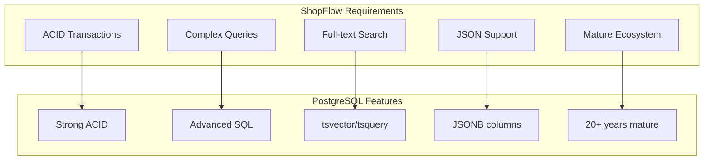
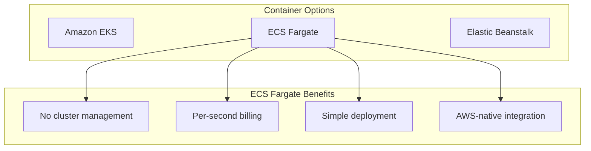
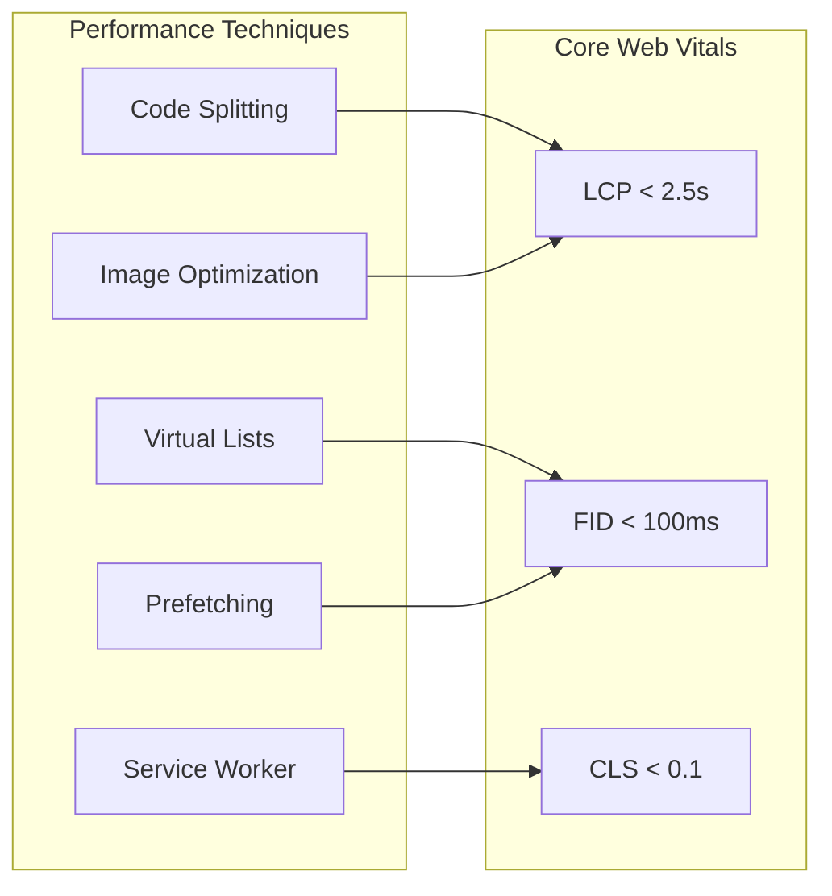

# ShopFlow Technical Deep Dive

## Technology Decision Records

This document explains the technical decisions made for ShopFlow and their rationale.

## Frontend Decisions

### Why React Query for Server State

```
┌─────────────────────────────────────────────────────────────────┐
│                    REACT QUERY BENEFITS                          │
└─────────────────────────────────────────────────────────────────┘

  Traditional Approach              React Query Approach
  ┌───────────────────┐            ┌───────────────────┐
  │ useEffect         │            │ useQuery          │
  │ useState          │            │                   │
  │ Loading states    │   ──▶      │ Built-in caching  │
  │ Error handling    │            │ Background refetch│
  │ Manual caching    │            │ Optimistic updates│
  │ Refetch logic     │            │ DevTools          │
  └───────────────────┘            └───────────────────┘
```

**Decision**: Use React Query for all server state management.

**Rationale**:
- Automatic caching and background refetching
- Built-in loading and error states
- Optimistic updates for cart operations
- Excellent DevTools for debugging
- Reduces boilerplate by 60%

**Trade-offs Considered**:
- Learning curve for team
- Bundle size (+12KB gzipped)
- Accepted because benefits outweigh costs



### Why Zustand over Redux

```
┌─────────────────────────────────────────────────────────────────┐
│                    STATE MANAGEMENT COMPARISON                   │
└─────────────────────────────────────────────────────────────────┘

  Redux                              Zustand
  ┌───────────────────┐            ┌───────────────────┐
  │ Actions           │            │ Simple functions  │
  │ Reducers          │   vs       │ Direct mutations  │
  │ Middleware        │            │ Minimal boilerplate│
  │ Connect/Selectors │            │ Hook-based        │
  │ ~25KB gzipped     │            │ ~2KB gzipped      │
  └───────────────────┘            └───────────────────┘
```

**Decision**: Use Zustand for client-side state (cart, UI state, auth).

**Rationale**:
- 90% less boilerplate than Redux
- Native TypeScript support
- Simpler mental model
- Perfect for cart state with persistence
- Excellent DevTools support

```typescript
// Zustand store example - concise and type-safe
const useCartStore = create<CartStore>()(
  persist(
    (set) => ({
      items: [],
      addItem: (product) => set((state) => ({
        items: [...state.items, product]
      })),
    }),
    { name: 'cart-storage' }
  )
);
```

### Why Tailwind CSS

**Decision**: Use Tailwind CSS with Headless UI for styling.



**Example**: ProductCard component
```tsx
<div className="group relative bg-white rounded-lg shadow-sm hover:shadow-lg transition-shadow duration-200">
  <div className="aspect-h-1 aspect-w-1 overflow-hidden rounded-t-lg">
    
  </div>
  <div className="p-4 space-y-2">
    <h3 className="text-sm font-medium text-gray-900 truncate">{name}</h3>
    <p className="text-lg font-semibold text-indigo-600">{price}</p>
  </div>
</div>
```

## Backend Decisions

### Why Prisma ORM

```
┌─────────────────────────────────────────────────────────────────┐
│                    ORM COMPARISON                                │
└─────────────────────────────────────────────────────────────────┘

  TypeORM                            Prisma
  ┌───────────────────┐            ┌───────────────────┐
  │ Decorators-based  │            │ Schema-first      │
  │ Complex relations │   vs       │ Type-safe client  │
  │ QueryBuilder      │            │ Migrations        │
  │ Manual types      │            │ Studio GUI        │
  └───────────────────┘            └───────────────────┘
```

**Decision**: Use Prisma as the ORM layer.

**Rationale**:
- Schema-first approach aligns with domain modeling
- Auto-generated TypeScript types
- Excellent migration system
- Prisma Studio for data exploration
- Great documentation



**Example**: Type-safe queries
```typescript
// Prisma ensures type safety at compile time
const orderWithItems = await prisma.order.findUnique({
  where: { id: orderId },
  include: {
    items: {
      include: {
        product: true,
      },
    },
    user: {
      select: {
        email: true,
        firstName: true,
      },
    },
  },
});
// orderWithItems is fully typed including nested relations
```

### Why Express.js (Not Fastify or NestJS)

**Decision**: Use Express.js with custom layered architecture.

| Framework | Pros | Cons | Decision |
|-----------|------|------|----------|
| Express | Mature, huge ecosystem, simple | No built-in structure | **Selected** |
| Fastify | Fast, modern, schema validation | Smaller ecosystem | Considered |
| NestJS | Full structure, DI, decorators | Learning curve, opinionated | Rejected |

**Rationale**:
- Team familiarity reduces onboarding time
- Maximum flexibility in architecture
- Abundant middleware options
- Easy to add structure through layers

### Why Zod for Validation

```
┌─────────────────────────────────────────────────────────────────┐
│                    VALIDATION APPROACH                           │
└─────────────────────────────────────────────────────────────────┘

  Joi                                Zod
  ┌───────────────────┐            ┌───────────────────┐
  │ Runtime only      │            │ TypeScript-first  │
  │ Separate types    │   vs       │ Infer types       │
  │ Chained methods   │            │ Parse, don't valid│
  │ No TS inference   │            │ Full TS support   │
  └───────────────────┘            └───────────────────┘
```

**Decision**: Use Zod for all input validation.

**Example**: Schema with inferred types
```typescript
// Define schema once
const createProductSchema = z.object({
  name: z.string().min(1).max(200),
  price: z.number().positive(),
  categoryId: z.string().uuid(),
  description: z.string().optional(),
});

// Infer TypeScript type automatically
type CreateProductInput = z.infer<typeof createProductSchema>;
// { name: string; price: number; categoryId: string; description?: string }
```

## Database Decisions

### Why PostgreSQL



**Decision**: PostgreSQL as primary database.

**Rationale**:
- ACID compliance critical for order processing
- Full-text search eliminates need for Elasticsearch
- JSONB for flexible product attributes
- Excellent AWS RDS support
- Strong community and documentation

### Why Redis for Caching

**Decision**: Use Redis ElastiCache for caching and sessions.

**Use Cases**:
1. **Session Storage**: User sessions with TTL
2. **API Response Cache**: Product listings (5 min TTL)
3. **Cart Data**: Real-time cart with persistence
4. **Rate Limiting**: Token bucket implementation
5. **Distributed Locks**: Inventory reservation

```
┌─────────────────────────────────────────────────────────────────┐
│                    REDIS USE CASES                               │
└─────────────────────────────────────────────────────────────────┘

  Key Pattern                      TTL        Purpose
  ─────────────────────────────────────────────────────────────────
  session:{userId}                 24h        User sessions
  product:{id}                     5m         Product cache
  products:list:{category}:{page}  5m         Product list cache
  cart:{userId}                    7d         Shopping cart
  rate:{ip}:{endpoint}             1m         Rate limiting
  lock:inventory:{productId}       30s        Inventory lock
```

## Infrastructure Decisions

### Why ECS Fargate

**Decision**: Use ECS Fargate for container orchestration.



**Rationale**:
- Serverless containers = no EC2 management
- Pay only for running tasks
- Simpler than Kubernetes for our scale
- Native integration with ALB, CloudWatch
- Blue/Green deployments built-in

### Why CloudFront CDN

**Decision**: Use CloudFront for static assets and API caching.

**Benefits**:
- 400+ global edge locations
- Native S3 integration
- SSL/TLS termination
- DDoS protection via Shield
- Price class selection for cost control

## Performance Optimizations

### Database Query Optimization

```
┌─────────────────────────────────────────────────────────────────┐
│                    OPTIMIZATION STRATEGIES                       │
└─────────────────────────────────────────────────────────────────┘

  Problem                          Solution
  ─────────────────────────────────────────────────────────────────
  N+1 queries                      Prisma include/select
  Slow product search              Full-text search index
  Large result sets                Cursor-based pagination
  Repeated queries                 Redis caching layer
  Complex aggregations             Materialized views
```

### Frontend Performance



## Trade-offs Summary

| Decision | Benefit | Trade-off |
|----------|---------|-----------|
| React Query | Caching, DX | Bundle size (+12KB) |
| Zustand | Simplicity | Less structure |
| Tailwind | Speed, DX | HTML verbosity |
| Prisma | Type safety | Learning curve |
| PostgreSQL | Features | Scaling limits |
| ECS Fargate | Simplicity | Cost at scale |
