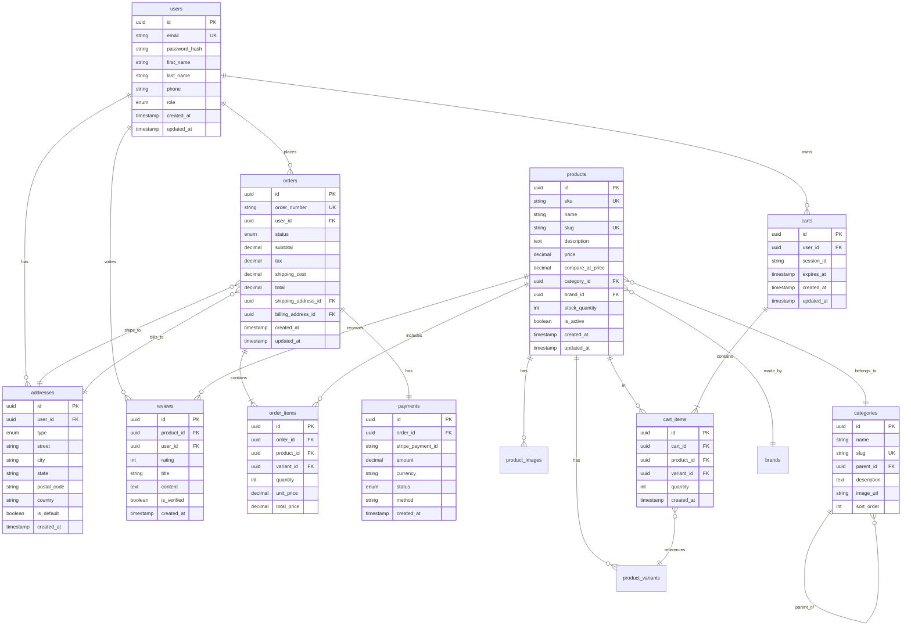

# ShopFlow Diagrams Collection

This file contains all Mermaid diagrams for the ShopFlow E-commerce platform, optimized for the AutoSpec viewer.

## System Architecture

### High-Level Architecture

## Database Diagrams

### Entity Relationship Diagram

## User Flow Diagrams

### Shopping Journey

### Checkout Flow

### Order State Machine

## Sequence Diagrams

### Authentication Flow

### Add to Cart Flow

### Payment Processing

## Component Diagrams

### Frontend Component Hierarchy

### Backend Service Architecture

## Infrastructure Diagrams

### AWS Architecture

### CI/CD Pipeline

## Security Diagrams

### Security Architecture

## Data Flow Diagrams

### Product Data Flow

### Order Data Flow

