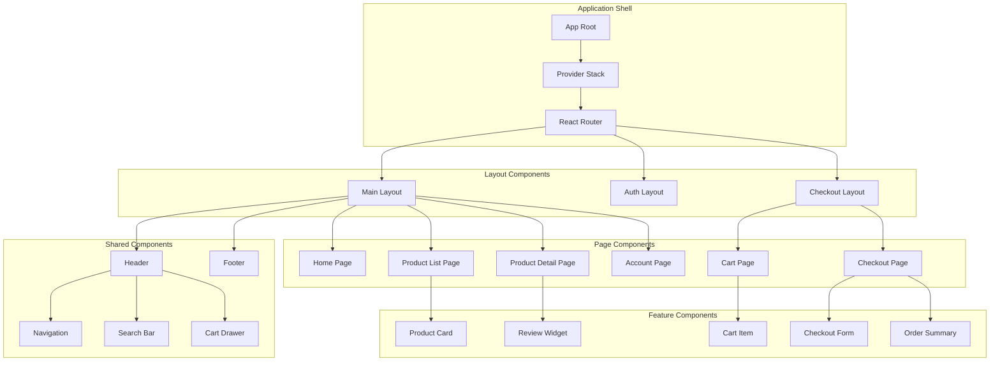
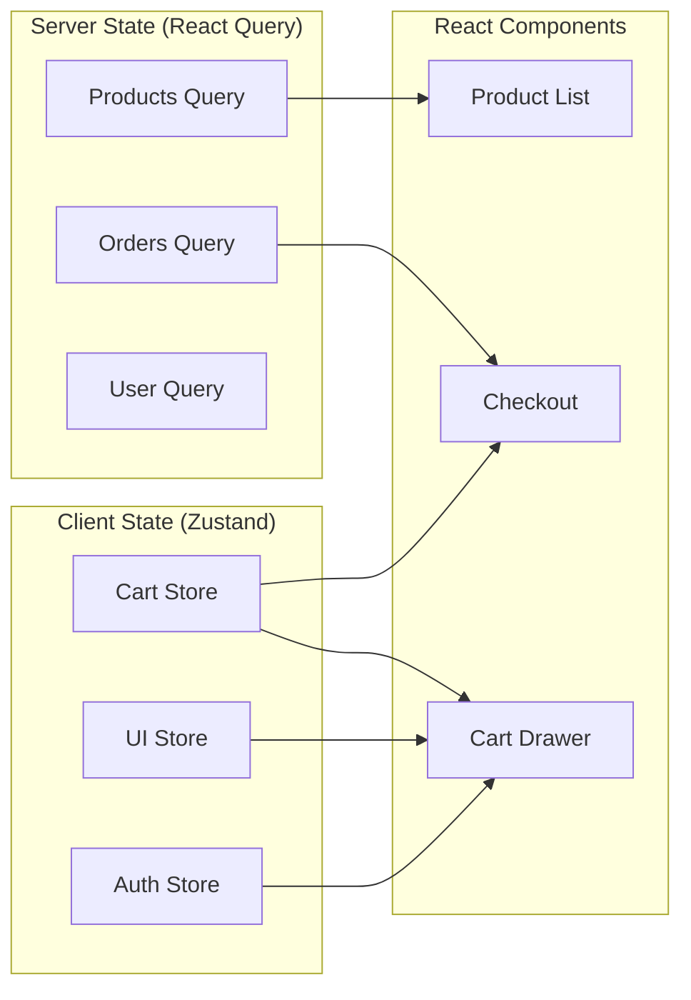
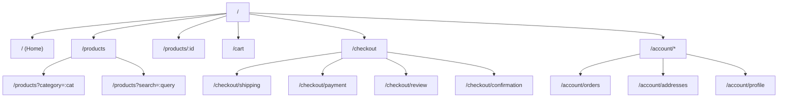

# ShopFlow Frontend Architecture

## Technology Stack

- **Framework**: React 18
- **Language**: TypeScript 5.x
- **State Management**: React Query + Zustand
- **Styling**: Tailwind CSS + Headless UI
- **Build Tool**: Vite
- **Testing**: Vitest + React Testing Library

## Component Architecture

### ASCII Component Tree

```
┌─────────────────────────────────────────────────────────────────┐
│                              App                                 │
└─────────────────────────────────────────────────────────────────┘
         │
         ├──────────────────────────────────────────────┐
         │                                              │
         ▼                                              ▼
┌─────────────────┐                          ┌─────────────────┐
│   AuthProvider  │                          │  QueryProvider  │
└────────┬────────┘                          └────────┬────────┘
         │                                            │
         └────────────────────┬───────────────────────┘
                              │
                              ▼
                    ┌─────────────────┐
                    │     Router      │
                    └────────┬────────┘
                             │
    ┌────────────────────────┼────────────────────────┐
    │                        │                        │
    ▼                        ▼                        ▼
┌─────────┐           ┌─────────────┐          ┌─────────────┐
│  Home   │           │   Products  │          │   Account   │
│  Page   │           │    Page     │          │    Page     │
└────┬────┘           └──────┬──────┘          └──────┬──────┘
     │                       │                        │
     ▼                       ▼                        ▼
┌─────────────┐      ┌─────────────┐          ┌─────────────┐
│ HeroSection │      │ ProductGrid │          │ OrderHistory│
│ Categories  │      │ Filters     │          │ Profile     │
│ Featured    │      │ Pagination  │          │ Addresses   │
└─────────────┘      └─────────────┘          └─────────────┘
```

### Mermaid Component Hierarchy



## Directory Structure

```
src/
├── app/
│   ├── App.tsx
│   ├── routes.tsx
│   └── providers.tsx
├── pages/
│   ├── Home/
│   │   ├── HomePage.tsx
│   │   ├── components/
│   │   │   ├── HeroSection.tsx
│   │   │   ├── CategoryGrid.tsx
│   │   │   └── FeaturedProducts.tsx
│   │   └── index.ts
│   ├── Products/
│   │   ├── ProductListPage.tsx
│   │   ├── ProductDetailPage.tsx
│   │   └── components/
│   │       ├── ProductGrid.tsx
│   │       ├── ProductFilters.tsx
│   │       ├── ProductGallery.tsx
│   │       └── AddToCartButton.tsx
│   ├── Cart/
│   │   ├── CartPage.tsx
│   │   └── components/
│   │       ├── CartItemList.tsx
│   │       ├── CartSummary.tsx
│   │       └── CartEmpty.tsx
│   ├── Checkout/
│   │   ├── CheckoutPage.tsx
│   │   └── components/
│   │       ├── CheckoutStepper.tsx
│   │       ├── ShippingForm.tsx
│   │       ├── PaymentForm.tsx
│   │       └── OrderReview.tsx
│   └── Account/
│       ├── AccountPage.tsx
│       └── components/
│           ├── OrderHistory.tsx
│           ├── AddressBook.tsx
│           └── ProfileSettings.tsx
├── components/
│   ├── ui/
│   │   ├── Button.tsx
│   │   ├── Input.tsx
│   │   ├── Select.tsx
│   │   ├── Modal.tsx
│   │   ├── Toast.tsx
│   │   └── Spinner.tsx
│   ├── layout/
│   │   ├── Header.tsx
│   │   ├── Footer.tsx
│   │   ├── Sidebar.tsx
│   │   └── Navigation.tsx
│   └── shared/
│       ├── ProductCard.tsx
│       ├── CartItem.tsx
│       ├── PriceDisplay.tsx
│       ├── RatingStars.tsx
│       └── ImageGallery.tsx
├── hooks/
│   ├── useProducts.ts
│   ├── useCart.ts
│   ├── useAuth.ts
│   ├── useCheckout.ts
│   └── useOrders.ts
├── store/
│   ├── cartStore.ts
│   ├── authStore.ts
│   └── uiStore.ts
├── api/
│   ├── client.ts
│   ├── products.api.ts
│   ├── cart.api.ts
│   ├── orders.api.ts
│   └── auth.api.ts
├── types/
│   ├── product.types.ts
│   ├── cart.types.ts
│   ├── order.types.ts
│   └── user.types.ts
└── utils/
    ├── formatters.ts
    ├── validators.ts
    └── helpers.ts
```

## State Management

### ASCII State Flow

```
┌─────────────────────────────────────────────────────────────────┐
│                        STATE MANAGEMENT                          │
└─────────────────────────────────────────────────────────────────┘

    Server State (React Query)          Client State (Zustand)
    ┌─────────────────────┐              ┌─────────────────────┐
    │  • Products         │              │  • Cart Items       │
    │  • Orders           │              │  • UI State         │
    │  • User Profile     │              │  • Auth Token       │
    │  • Reviews          │              │  • Filters          │
    └─────────────────────┘              └─────────────────────┘
             │                                     │
             └──────────────┬──────────────────────┘
                            │
                            ▼
                   ┌─────────────────┐
                   │   Components    │
                   └─────────────────┘
```

### Mermaid State Architecture



## Data Fetching Patterns

### React Query Hooks

```typescript
// hooks/useProducts.ts
export function useProducts(filters: ProductFilters) {
  return useQuery({
    queryKey: ['products', filters],
    queryFn: () => productsApi.getProducts(filters),
    staleTime: 5 * 60 * 1000, // 5 minutes
  });
}

export function useProduct(id: string) {
  return useQuery({
    queryKey: ['product', id],
    queryFn: () => productsApi.getProduct(id),
    enabled: !!id,
  });
}

// hooks/useCart.ts
export function useAddToCart() {
  const queryClient = useQueryClient();

  return useMutation({
    mutationFn: cartApi.addItem,
    onSuccess: () => {
      queryClient.invalidateQueries({ queryKey: ['cart'] });
    },
  });
}
```

## Cart Store (Zustand)

```typescript
// store/cartStore.ts
interface CartState {
  items: CartItem[];
  isOpen: boolean;
  addItem: (product: Product, quantity: number) => void;
  removeItem: (productId: string) => void;
  updateQuantity: (productId: string, quantity: number) => void;
  clearCart: () => void;
  toggleCart: () => void;
}

export const useCartStore = create<CartState>()(
  persist(
    (set, get) => ({
      items: [],
      isOpen: false,

      addItem: (product, quantity) => {
        set((state) => {
          const existing = state.items.find(
            (item) => item.productId === product.id
          );

          if (existing) {
            return {
              items: state.items.map((item) =>
                item.productId === product.id
                  ? { ...item, quantity: item.quantity + quantity }
                  : item
              ),
            };
          }

          return {
            items: [...state.items, { product, quantity, productId: product.id }],
          };
        });
      },

      // ... other actions
    }),
    { name: 'cart-storage' }
  )
);
```

## Routing Structure



## Performance Optimizations

| Technique | Implementation | Benefit |
|-----------|---------------|---------|
| Code Splitting | React.lazy + Suspense | Smaller initial bundle |
| Image Optimization | next/image or custom | Faster load times |
| Virtual Lists | react-window | Handle large lists |
| Memoization | React.memo, useMemo | Reduce re-renders |
| Prefetching | React Query prefetch | Faster navigation |
